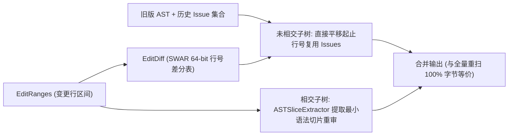

# 01. 行级增量子树复用与 AST 切片提取

> **所属层级**：L3 增量计算与向量化 Diff (`docs/03-incremental-and-diff/`)  
> **对应代码真源**：`src/core/diff/incremental.ts`、`src/core/diff/edit-diff.ts`、`src/core/router/sliceExtractor.ts`、`src/core/intelligence/callChainImpactTracer.ts`

---

## 1. 行级增量子树复用 (`reuseSubtree`)

在 IDE 实时编辑与智能体连续多轮微调场景中，单次修改往往只涉及数千行文件中的 5 ~ 30 行。`src/core/diff/incremental.ts` 通过将编辑区间（`EditRange`）与上一轮缓存的语法树结合，实现了**未触碰语法子树零重算（Subtree Reuse）**：

### 1.1 双向坐标平移映射 (`EditRanges`)

位于 `src/core/diff/edit-diff.ts` 的差分计算器维护新旧文本的行偏移差分表：

1. **不相交判定**：对于旧文件中位于 `[startLine, endLine]` 的函数或类节点，若该区间与所有 `EditRange` 均无交集，则其内部局部规则（如圈复杂度、局部变量命名、函数内魔法数）的结果必然不变。
2. **坐标平移复用**：直接将该子树关联的历史 `Issue` 行号按 `LineMap.oldToNew(line)` 平移 $\Delta L$ 行，跳过对该子树的二次遍历。
3. **全文件耦合规则重算补偿**：对于依赖全文件聚合统计的规则（如 `large-file` 总行数、文件级重复字面量计数 `duplicate-literal`），增量合并器会自动汇总复用子树与新切片的统计计数后统一判定，确保增量输出与全量冷扫 **100% 逐字节一致**（由 `npm run validate-diff` 严格验证）。

---

## 2. 最小语法包围盒切片提取 (`ASTSliceExtractor`)

位于 `src/core/router/sliceExtractor.ts` 的切片提取器负责将一组离散的变更行号 `changedLines: number[]` 扩展为**语义自洽的最小 AST 语法单元（`ASTSlice`）**：

1. **向上闭包寻址**：从每个变更行向上回溯至外围最近的函数声明（`FunctionDeclaration`）、类方法（`MethodDefinition`）、接口定义或顶层语句块。
2. **签名突变指纹比对**：对比新旧切片中外围符号的名称、导出修饰符（`export`）、参数个数与类型注解，自动判定 `hasSignatureMutation` 与 `isBreakingChange`。
3. **容错词法回退**：若 Agent 输入的新代码正处于未写完的半闭合状态，提取器自动切换至括号平衡深度扫描，确保在任何残缺代码下均能稳定切出局部上下文。

---

## 3. 逆向调用链爆炸半径追踪 (`CallChainImpactTracer`)

当 `ASTSliceExtractor` 标记某个导出符号发生签名突变时，`src/core/intelligence/callChainImpactTracer.ts` 立即在 `CallGraph` 上执行广度优先逆向闭包搜索：

- **直接冲击层（Depth = 1）**：直接调用或导入该符号的上游文件与函数集合。
- **传递冲击闭包（Depth $\ge 2$）**：沿着调用链向上游传递受波及的业务入口。
- **自动门禁升级**：一旦确认破坏性签名修改影响了至少一个外部调用方，立即生成 `GOV-SLC-001` 违规并将 `PraxisSliceAuditVerdict.requiresFullRepoScan` 置为 `true`。

---

## 4. 关联文档导航

- [02. 高性能差分算法栈与流式 Diff 规格](./02-diff-interface-spec.md)
- [03. Praxis 增量 Diff 管道与环形缓冲接入指南](./03-praxis-integration-guide.md)
