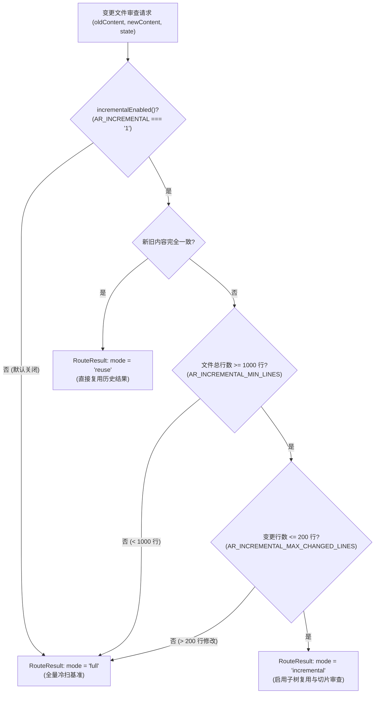

# 01. 行级增量子树复用与 AST 切片提取

> **所属层级**：L3 增量计算与向量化 Diff (`docs/03-incremental-and-diff/`)  
> **代码真源**：  
> - 增量路由与门控：[`src/core/diff/incremental.ts`](file:///c:/CODE_game-development/vscode-extensions/auto-refactor/src/core/diff/incremental.ts)  
> - 归一化子树复用契约：[`src/core/ast/multilang.ts`](file:///c:/CODE_game-development/vscode-extensions/auto-refactor/src/core/ast/multilang.ts)  
> - AST 切片提取器：[`src/core/router/sliceExtractor.ts`](file:///c:/CODE_game-development/vscode-extensions/auto-refactor/src/core/router/sliceExtractor.ts)  
> - 调用链冲击追踪器：[`src/core/intelligence/callChainImpactTracer.ts`](file:///c:/CODE_game-development/vscode-extensions/auto-refactor/src/core/intelligence/callChainImpactTracer.ts)

---

## 1. 行级增量路由与门控机制 (`route`)

在 IDE 实时响应与 Agent 连续交互场景中，文件往往仅发生局部修改。然而，盲目对小文件或巨量变更进行增量分析反而会增加维护状态的额外开销。`auto-refactor` 在 [`src/core/diff/incremental.ts`](file:///c:/CODE_game-development/vscode-extensions/auto-refactor/src/core/diff/incremental.ts) 中建立了严格的门控调度机制。



### 1.1 门控开关与阈值常量

- **开关保护**：`incrementalEnabled()` 严格检查环境变量 `process.env.AR_INCREMENTAL === '1'`，默认处于**关闭状态（Off）**，确保全量扫描始终作为最可信的安全基线；
- **文件体量基线**：`incrementalMinLines()` 默认为 **1000 行**（`DEFAULT_INCREMENTAL_MIN_LINES = 1000`，可通过 `AR_INCREMENTAL_MIN_LINES` 覆盖）。小于 1000 行的文件直接全量重扫；
- **变更上限约束**：`incrementalMaxChangedLines()` 默认为 **200 行**（`DEFAULT_INCREMENTAL_MAX_CHANGED_LINES = 200`，可通过 `AR_INCREMENTAL_MAX_CHANGED_LINES` 覆盖）。当增加与删除的行数总和超过 200 行时，自动退化为全量重扫；
- **路由决策结构 (`RouteResult`)**：
  ```ts
  export type IncrementalRoute = 'reuse' | 'incremental' | 'full';

  export interface RouteResult {
    mode: IncrementalRoute;  // 决策模式
    edits: EditRange[];      // 仅在 mode === 'incremental' 时填充具体编辑区间
  }
  ```

---

## 2. AST 子树复用 (`ProjectionSeed`)

在增量路径下，未受编辑影响的代码块无需重新遍历其 AST 子树。在 [`src/core/ast/multilang.ts`](file:///c:/CODE_game-development/vscode-extensions/auto-refactor/src/core/ast/multilang.ts) 中，通过 `ProjectionSeed` 注入各语言适配器的 `parse` 方法：

```ts
export interface ReusedSpan {
  startLine: number;
  startColumn: number;
  startByte: number;
  endByte: number;
  sourceText: string;
}

export interface ProjectionSeed {
  /** 根据精确坐标跨度与源码文本命中历史 NormalizedNode 子节点列表 */
  reuseSubtree(span: ReusedSpan): NormalizedNode[] | null;
  /** 将当前解析构造的函数子节点缓存，供下一次增量使用 */
  cacheSubtree(span: ReusedSpan, children: NormalizedNode[]): void;
  /** 标记节点已被复用，辅助分析器快速跳过计算 */
  markReused?(node: NormalizedNode, span: ReusedSpan): void;
}
```

- **解析器集成**：`LanguageAdapter.parse(content, filePath, seed?: ProjectionSeed)` 在遍历函数或方法声明时，检测其文本与位置是否发生改动。若完全一致，直接取回缓存的 `NormalizedNode[]` 并跳过其内部语法结构的重复实例化。

---

## 3. 语法包围盒与切片特征提取 (`ASTSliceExtractor`)

位于 [`src/core/router/sliceExtractor.ts`](file:///c:/CODE_game-development/vscode-extensions/auto-refactor/src/core/router/sliceExtractor.ts) 的切片提取器将行级修改局部化为包含它们的最小语法包围盒：

### 3.1 声明包围盒识别与 `braceDepth` 统计

- **声明首行正则识别 (`DECLARATION_START_RE`)**：匹配 `function`、`class`、`interface`、`type`、`const x = () =>`、`def`、`fn` 等声明入口；
- **花括号深度跟踪 (`computeBraceDelta`)**：
  ```ts
  function computeBraceDelta(line: string): number {
    let delta = 0;
    for (let i = 0; i < line.length; i++) {
      const ch = line.charCodeAt(i);
      if (ch === 123) delta++;      // '{'
      else if (ch === 125) delta--; // '}'
    }
    return delta;
  }
  ```
- **闭合判定 (`isBoundaryClosed`)**：当累计 `braceDepth <= 0` 且包含结束大括号（或类型别名声明结束）时，锁定该语法实体的完整闭包范围 `[startLine, endLine]`。

### 3.2 语义突变特征向量 (`SliceFeatureVector`)

提取器对切片内的改动行进行扫描，提炼多维特征指标：

```ts
export interface SliceFeatureVector {
  hasSignatureMutation: boolean;   // 声明签名/入参/返回类型是否改变
  hasControlFlowMutation: boolean; // 是否包含 if/else/for/while/switch 等分支变更
  hasLiteralMutation: boolean;     // 是否包含字面量与魔法值改动
  hasAsyncMutation: boolean;       // 是否包含 async/await/Promise 变更
  hasIoMutation: boolean;          // 是否包含 fs/fetch/http/process 等 I/O 调用变更
  hasTypeMutation: boolean;        // 是否包含纯类型注解变更
  isDocOnly: boolean;              // 是否仅为注释与文档变更
}
```

- **主突变类别分配 (`resolvePrimaryKind`)**：按优先级分配为 `'signature'` $\to$ `'io'` $\to$ `'async'` $\to$ `'control-flow'` $\to$ `'type-annotation'` $\to$ `'doc-comment'` $\to$ `'literal'` $\to$ `'general'`。

---

## 4. 逆向调用链冲击追踪 (`CallChainImpactTracer`)

当切片特征向量表明存在签名突变（`hasSignatureMutation: true`）时，[`src/core/intelligence/callChainImpactTracer.ts`](file:///c:/CODE_game-development/vscode-extensions/auto-refactor/src/core/intelligence/callChainImpactTracer.ts) 在 `CallGraph` 上执行广度优先搜索（BFS）逆向闭包分析：

### 4.1 深度受限逆向搜索 (默认 `maxDepth = 3`)

```ts
public traceSymbolImpact(
  targetSymbol: string,
  targetFile: string,
  hasBreakingMutation: boolean,
  callGraph?: CallGraph,
  maxDepth = 3,
): CallChainImpactResult
```
- 以被修改的符号为根节点，向上逆向检索直接调用方（Depth = 1）及多跳间接调用方（Depth $\le 3$），并自动防范调用环路。

### 4.2 风险分级与 `GOV-SLC-001` 门禁触发

系统基于调用者分布与签名突变状态计算风险等级：

```ts
function evaluateRiskLevel(
  hasBreakingMutation: boolean,
  crossFileCallersCount: number,
  totalCallers: number,
): 'LOW' | 'MEDIUM' | 'HIGH' | 'CRITICAL' {
  if (hasBreakingMutation && crossFileCallersCount > 0) {
    return 'CRITICAL'; // 破坏性签名变更波及跨文件调用者
  }
  if (hasBreakingMutation && totalCallers > 0) {
    return 'HIGH';     // 破坏性签名变更影响本地调用者
  }
  if (crossFileCallersCount > 5) {
    return 'MEDIUM';
  }
  return 'LOW';
}
```

> [!CAUTION]
> **治理拦截**：一旦检测到破坏性签名变更引发跨文件调用方波及（`crossFileCallersCount > 0`），风险等级立即升级为 **`CRITICAL`**，系统发射治理规则告警 **`GOV-SLC-001`**（`RULE_GOV_SLICE_SIDE_EFFECT`），指示当前补丁存在非封包的接口突变风险，阻止增量合并。

---

## 5. 关联文档导航

- [02. 高性能差分算法栈与流式 Diff 规格](./02-diff-interface-spec.md)
- [03. Praxis 增量 Diff 管道与环形缓冲接入指南](./03-praxis-integration-guide.md)
- [03. 控制流图 (CFG)、数据流分析与符号调用切片](../02-parsers-and-ast/03-lazy-projection.md)
