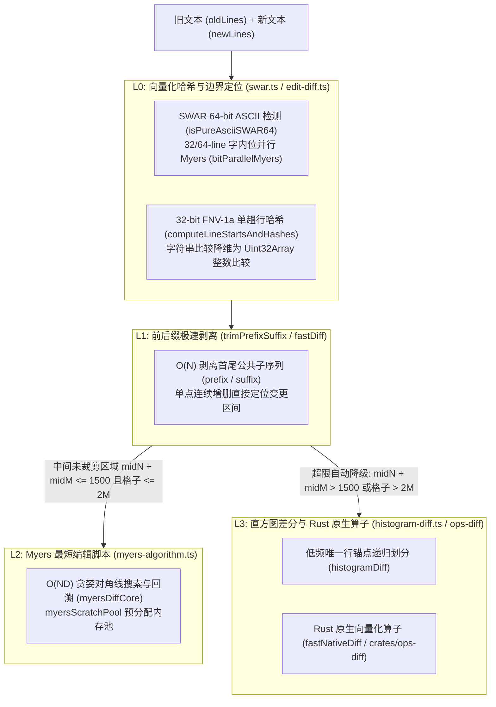

# 02. 高性能差分算法栈与流式 Diff 规格

> **所属层级**：L3 增量计算与向量化 Diff (`docs/03-incremental-and-diff/`)  
> **代码真源**：  
> - SWAR 与位并行算子：[`src/core/ast/swar.ts`](file:///c:/CODE_game-development/vscode-extensions/auto-refactor/src/core/ast/swar.ts)  
> - 差分计算与行哈希：[`src/core/diff/edit-diff.ts`](file:///c:/CODE_game-development/vscode-extensions/auto-refactor/src/core/diff/edit-diff.ts)  
> - Myers 最短编辑脚本：[`src/core/diff/myers-algorithm.ts`](file:///c:/CODE_game-development/vscode-extensions/auto-refactor/src/core/diff/myers-algorithm.ts)  
> - 直方图差分算法：[`src/core/diff/histogram-diff.ts`](file:///c:/CODE_game-development/vscode-extensions/auto-refactor/src/core/diff/histogram-diff.ts)  
> - Rust 原生差分算子：[`crates/ops-diff/`](file:///c:/CODE_game-development/vscode-extensions/auto-refactor/crates/ops-diff/)  
> - 响应式流式管线：[`src/core/stream.ts`](file:///c:/CODE_game-development/vscode-extensions/auto-refactor/src/core/stream.ts)  
> - 差分契约类型：[`src/core/diff/diff-types.ts`](file:///c:/CODE_game-development/vscode-extensions/auto-refactor/src/core/diff/diff-types.ts)

---

## 1. 四级向量化差分算法栈布局

为了在微秒级局部编辑判定与万行级巨型文件差分之间保持最佳性能与稳定性，`auto-refactor` 设计了四级自适应差分算法栈：



### 1.1 L0 级：SWAR 64 位探测、字内位并行与 32 位 FNV-1a 行哈希

- **SWAR 64 位 ASCII 探测 (`isPureAsciiSWAR64`)**：在 [`src/core/ast/swar.ts`](file:///c:/CODE_game-development/vscode-extensions/auto-refactor/src/core/ast/swar.ts) 中，单步处理 8 字节（`WORD64_BYTES = 8`），通过双 32 位 DataView 读取与高位掩码（`HIGH_BITS_32 = 0x80808080`），零 BigInt 内存开销完成全 ASCII 验证；
- **字内 Myers 位并行距离**：针对 $\le 32$ 行的局部微模式采用快速 32 位 Smi 算子（`bitParallelMyers32Distance`），针对 33 ~ 64 行采用 64 位算子（`bitParallelMyers64Distance`）；
- **32 位 FNV-1a 整数哈希**：在 [`src/core/diff/edit-diff.ts`](file:///c:/CODE_game-development/vscode-extensions/auto-refactor/src/core/diff/edit-diff.ts) 中，`computeLineStartsAndHashes` 在单趟源码遍历中同时计算行起始偏移与每行的 32 位 FNV-1a 哈希（`FNV1A_32_OFFSET_BASIS = 0x811c9dc5`, `FNV1A_32_PRIME = 0x01000193`），将昂贵的多行字符串比对降维为 CPU 寄存器友好的 `Uint32Array` 整数比对。

### 1.2 L1 级：前后缀剥离极速差分 (`trimPrefixSuffix` / `fastDiff`)

在比较两组文本前，`trimPrefixSuffix` 以 $O(N)$ 速度自首尾分别向中心双向扫描，剥离完全一致的公共前缀行（`prefix`）与公共后缀行（`suffix`）。如果整个变更仅为单点插入或删除，中间剩余区间长度为 0，即可在微秒级内直接构造出编辑操作。

### 1.3 L2 级：Myers 最短编辑脚本与退化守卫 (`myersDiffCore`)

对于中间发生变更的区间，L2 执行标准的 Myers $O(ND)$ 贪婪对角线搜索与回溯追踪（`backtrackMyersTrace`），并使用预分配缓冲区 `myersScratchPool` 消除临时堆分配。

> [!WARNING]
> **退化守卫（Degradation Guard）**：  
> Myers 算法在极端非对称或无序差异下，其对角线搜索矩阵的内存消耗将按 $(max + 1) \cdot (2 \cdot max + 1)$ 发生二次方激增。  
> 当中间修改区域总行数超过 **1500 行**（`max = midN + midM > 1500`，`MYERS_MAX_MID_LINES = 1500`），或者搜索网格单元格超过 **2,000,000** 时（`(max + 1) * (2 * max + 1) > 2_000_000`），引擎**自动熔断降级**，跳过 Myers 并直接调用 L3 级的 `histogramDiff`，从根源上杜绝内存溢出（OOM）与 GC 假死。

### 1.4 L3 级：低频锚点直方图差分 (`histogramDiff`) 与 Rust 原生算子

- **直方图差分 (`histogramDiff`)**：位于 [`src/core/diff/histogram-diff.ts`](file:///c:/CODE_game-development/vscode-extensions/auto-refactor/src/core/diff/histogram-diff.ts)，统计中间区域行出现频次，优先挑选出现频度最低的唯一代码行（如唯一方法签名、专有声明语句）作为对齐锚点（Anchor），以此为基准递归划分左右子序列，消除大括号 `{}` 或空行错位引起的面条式 Diff；
- **Rust 原生算子 (`crates/ops-diff`)**：通过 Node-API 桥接的 `fastNativeDiff`（`nativeCore.computeHistogramDiff`），利用 Rust 底层原生算子提供数倍于 V8 的直方图差分吞吐。

---

## 2. 统一 Diff 输入契约 (`DiffInput`)

在 [`src/core/diff/diff-types.ts`](file:///c:/CODE_game-development/vscode-extensions/auto-refactor/src/core/diff/diff-types.ts) 中，差分管线定义了结构化增量输入类型 `DiffInput`：

```ts
export type DiffInput =
  | {
      kind: 'full';
      filePath: string;           // 仓库相对 POSIX 路径
      oldContent: string;         // 修改前文本
      newContent: string;         // 修改后文本
      oldContentHash?: string;    // 可选旧内容哈希
      newContentHash?: string;    // 可选新内容哈希
    }
  | {
      kind: 'ranges';
      filePath: string;
      newContent: string;
      editRanges: EditRange[];    // 已知的编辑行与字节区间 (跳过差分计算)
      oldContent?: string;
      oldContentHash?: string;
      newContentHash?: string;
    };
```

此外，对于外部工具传入的标准 Unified Diff 补丁，系统通过 [`src/core/diff/hunk-builder.ts`](file:///c:/CODE_game-development/vscode-extensions/auto-refactor/src/core/diff/hunk-builder.ts) 的 `formatUnifiedDiff` 与 `renderHunksToUnifiedPatch` 提供互转与解析支持。

---

## 3. 响应式异步生成器事件协议 (`scanDiffStream`)

在 [`src/core/stream.ts`](file:///c:/CODE_game-development/vscode-extensions/auto-refactor/src/core/stream.ts) 中，`scanDiffStream` 被实现为一个异步生成器（`AsyncGenerator<DiffStreamEvent>`）：

```ts
export type DiffStreamEvent =
  | { type: 'file_start'; filePath: string; oldHash?: string; newHash?: string }
  | { type: 'hunk_ready'; filePath: string; hunk: ReviewDiffHunk }
  | { type: 'issue_found'; filePath: string; issue: Issue; fix?: RefactoringPatch }
  | { type: 'file_done'; filePath: string; stats: { durationMs: number; issuesCount: number } }
  | { type: 'stream_end'; totalSummary: ScanSummary };
```

### 3.1 背压感知 (Backpressure) 与流式消费

消费方通过 `for await (const event of scanDiffStream(diffs, options))` 实时拉取事件：
1. **秒级可见性**：单个文件或单个 Hunk 审查完成即刻触发 `hunk_ready`，UI 层无需等待整个工作区全量扫描结束即可向开发者呈现首屏审查卡片；
2. **事件循环防饥饿**：当消费者处理延迟升高时，异步生成器的拉取暂停使内部差分计算主动让出事件循环，避免大量中间结果在内存中无界堆积；
3. **环形缓冲集成**：在产生 `hunk_ready` 事件时，Hunk 被同步推入人类审查环形缓冲区 `CircularDiffBuffer`，并在流结束（`stream_end`）前统一触发刷盘操作。

---

## 4. 关联文档导航

- [01. 行级增量子树复用与 AST 切片提取](./01-line-level-incremental.md)
- [03. Praxis 增量 Diff 管道与环形缓冲接入指南](./03-praxis-integration-guide.md)
- [02. Rust `oxc-parser` 极速通道与双模补偿](../02-parsers-and-ast/02-oxc-fastpath.md)
