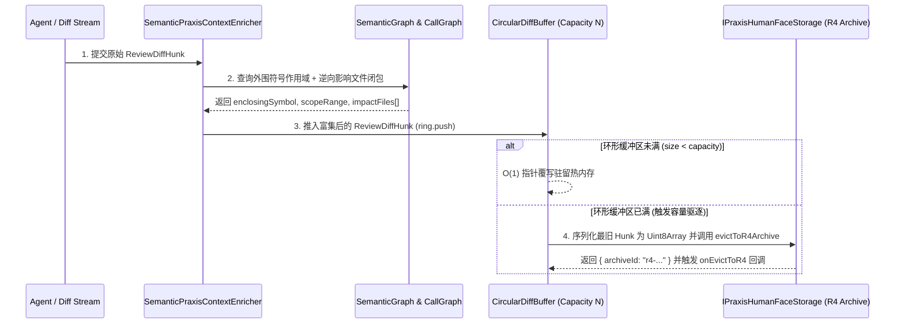

# 03. Praxis 增量 Diff 管道与环形缓冲接入指南

> **所属层级**：L3 增量计算与向量化 Diff (`docs/03-incremental-and-diff/`)  
> **对应代码真源**：`src/core/ring-buffer.ts`、`src/core/praxis/semanticEnricher.ts`、`src/core/praxis/diffGovernance.ts`

---

## 1. 增量 Diff 管道与环形缓冲协同架构

在多智能体高频提交补丁的流式场景中，既要为人类审核员提供秒级响应的最近变更视图，又要将超出内存窗口的历史 Hunk 无损转储以备后续审计或回滚。`auto-refactor` 通过 `CircularDiffBuffer`（`src/core/ring-buffer.ts`）与 `SemanticPraxisContextEnricher`（`src/core/praxis/semanticEnricher.ts`）提供开箱即用的底座：

---

## 2. `CircularDiffBuffer` 核心配置与操作契约

### 2.1 构造参数 (`CircularDiffBufferOptions`)

| 参数名 | 类型 | 默认值 | 说明 |
| :--- | :--- | :---: | :--- |
| `capacity` | `number` | `128` | 内存中最多驻留的活跃 `ReviewDiffHunk` 数量 |
| `flushIntervalMs` | `number` | `0` | 定期触发 `storageAdapter.flushPeriodicSnapshot()` 的毫秒间隔（`0` 表示仅按需刷盘） |
| `storageAdapter` | `IPraxisHumanFaceStorage` | `DefaultPraxisHumanFaceStorage` | 对接底层持久化或 R4 对象存储的适配器实例 |
| `onEvictToR4` | `(payload: Uint8Array, archiveId: string) => void` | `undefined` | 每次旧 Hunk 被压缩转储至 R4 时的同步通知钩子 |

### 2.2 关键方法

- **`push(hunk: ReviewDiffHunk)`**：$O(1)$ 时间复杂度入队；若当前元素数达到 `capacity`，自动将队首最老的 Hunk 编码为紧凑 UTF-8 `Uint8Array` 并移交 `evictToR4Archive`。
- **`toArray(): ReviewDiffHunk[]`**：按时间先后顺序导出当前活跃窗口内的全部 Hunk 快照。
- **`dispose(): void`**：清理内部定时器并执行最后一次快照同步，防止句柄泄漏。

---

## 3. `SemanticPraxisContextEnricher` 语义富集机制

当 `PraxisDiffGovernanceService.enrichHunks(filePath, hunks, graph)` 被调用时，富集器对每个 Hunk 执行三步增强：

1. **外围符号锚定**：根据 `hunk.newSpan.startLine` 在 `SemanticGraph` 中检索包含该行号的最小符号节点，填充 `astContext.enclosingSymbol` 与 `astContext.symbolKind`（如 `'function'`、`'method'`、`'class'`）。
2. **作用域边界提取**：填充该符号的完整物理行跨度 `astContext.scopeRange: { startLine, endLine }`，方便前端 UI 一键展开整个函数上下文。
3. **跨文件逆向影响闭包计算**：调用 `graph.getBackwardImpact(filePath, enclosingSymbol)`，将所有直接或间接依赖该符号的下游文件路径注入 `astContext.impactFiles`。

---

## 4. 关联文档导航

- [01. Praxis 对接架构全景与五大 SPI 契约手册](../06-praxis-delivery/01-praxis-architecture-and-spi-contracts.md)
- [02. Praxis 六大核心治理服务门面 API 手册](../06-praxis-delivery/02-praxis-six-governance-services-api.md)
