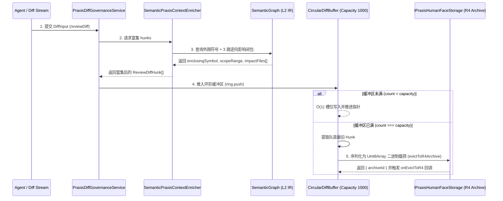

# 03. Praxis 增量 Diff 管道与环形缓冲接入指南

> **所属层级**：L3 增量计算与向量化 Diff (`docs/03-incremental-and-diff/`)  
> **代码真源**：  
> - 环形缓冲与淘汰持久化：[`src/core/ring-buffer.ts`](file:///c:/CODE_game-development/vscode-extensions/auto-refactor/src/core/ring-buffer.ts)  
> - 语义富集器：[`src/core/praxis/semanticEnricher.ts`](file:///c:/CODE_game-development/vscode-extensions/auto-refactor/src/core/praxis/semanticEnricher.ts)  
> - 差分治理门面：[`src/core/praxis/diffGovernance.ts`](file:///c:/CODE_game-development/vscode-extensions/auto-refactor/src/core/praxis/diffGovernance.ts)  
> - SPI 契约定义：[`src/core/praxis/contracts.ts`](file:///c:/CODE_game-development/vscode-extensions/auto-refactor/src/core/praxis/contracts.ts)

---

## 1. 增量 Diff 管道与环形缓冲协同架构

在面向人机协同审查（Human-in-the-Loop）与多 Agent 连续提交补丁场景中，系统既需要为前端 UI 提供毫秒级响应的最近活跃变更视图，又需要将超出内存窗口的历史冷变更无损转储至冷存储。

`auto-refactor` 通过环形缓冲队列 `CircularDiffBuffer` 与语义上下文富集器 `SemanticPraxisContextEnricher` 构筑双向协同管道：



---

## 2. `CircularDiffBuffer` 核心配置与淘汰生命周期

在 [`src/core/ring-buffer.ts`](file:///c:/CODE_game-development/vscode-extensions/auto-refactor/src/core/ring-buffer.ts) 中，环形缓冲区维护固定容量的 FIFO 循环队列。

### 2.1 真实常数与构造参数

```ts
const DEFAULT_RING_CAPACITY = 1000;       // 默认最多驻留 1000 个活跃 Hunk
const DEFAULT_FLUSH_INTERVAL_MS = 3000;   // 默认快照刷盘间隔 3000ms

export interface RingBufferOptions {
  capacity?: number;
  flushIntervalMs?: number;
  storageAdapter?: IPraxisHumanFaceStorage;
  onEvictToR4?: (payload: Uint8Array, archiveId: string) => void;
}
```

> [!IMPORTANT]
> **定时器退化行为说明**：  
> 构造函数中逻辑为：`const interval = options.flushIntervalMs || DEFAULT_FLUSH_INTERVAL_MS;`。  
> 这意味着若显式传入 `0`，因 JavaScript 假值机制，会**退化为默认的 3000ms**！只有当传入**负数**（如 `-1`）时，系统才会完全关闭后台定时刷盘定时器。

### 2.2 淘汰生命周期与 R4 归档 (`evictHunk`)

当缓冲区填满（`count === capacity`）并继续推入新 Hunk 时，队首最旧的元素被弹出并触发归档：

```ts
private evictHunk(hunk: ReviewDiffHunk): void {
  try {
    const jsonStr = JSON.stringify(hunk);
    const encoder = new TextEncoder();
    const binaryPayload = encoder.encode(jsonStr); // 转为 Uint8Array 二进制载荷

    if (this.storageAdapter?.evictToR4Archive) {
      const res = this.storageAdapter.evictToR4Archive(binaryPayload);
      if (res instanceof Promise) {
        res.then((r) => {
          if (this.onEvictToR4) this.onEvictToR4(binaryPayload, r.archiveId);
        }).catch(() => {});
      } else if (res && this.onEvictToR4) {
        this.onEvictToR4(binaryPayload, res.archiveId);
      }
    }
  } catch {
    // 采用非阻塞 Fail-Safe 机制，吞没异常确保主扫描流程绝不中断
  }
}
```

---

## 3. `SemanticPraxisContextEnricher` 语义富集机制

位于 [`src/core/praxis/semanticEnricher.ts`](file:///c:/CODE_game-development/vscode-extensions/auto-refactor/src/core/praxis/semanticEnricher.ts) 的富集器实现了 `IPraxisContextEnricher` 契约，对每个待审查的 `ReviewDiffHunk` 实施三步增强：

### 3.1 步骤一：外围符号锚定

通过 `hunk.newSpan.startLine` 与行跨度，在 `SemanticGraph` 中调用 `findEnclosingNode` 匹配物理行范围包围的最小语义节点，提取：
- `enclosingSymbol`：符号名称（如 `computeMetrics`）；
- `symbolKind`：符号种类（`'function'`、`'type'`、`'module'` 等）。

### 3.2 步骤二：作用域边界提取

提取对应符号节点的精确起止物理行号：
- `scopeRange: { startLine: node.location.start.line, endLine: node.location.end.line }`，使审查界面能够一键展开完整的函数或类上下文。

### 3.3 步骤三：3 跳逆向影响闭包

调用 `graph.getSlice(matchedNode.id, 3, 'backward')`，顺着依赖边逆向展开 3 跳深度（3-Hop Closure），提取所有直接与间接依赖该符号的外部文件路径注入 `impactFiles`。

### 3.4 50 行重构阈值判定 (`HUNK_REWORK_LINE_THRESHOLD`)

富集器根据变更体积自动向审核员建议处置动作：
```ts
const HUNK_REWORK_LINE_THRESHOLD = 50;

const action = hunk.lines.length > HUNK_REWORK_LINE_THRESHOLD ? 'rework' : 'auto_fix';
```
- 若单 Hunk 变更行数 $> 50$ 行，建议动作为 `'rework'`（人工重新设计/拆分）；
- 若单 Hunk 变更行数 $\le 50$ 行，建议动作为 `'auto_fix'`（适合 Agent 自动修补）。

---

## 4. `PraxisDiffGovernanceService.reviewDiff` 统一治理门面

位于 [`src/core/praxis/diffGovernance.ts`](file:///c:/CODE_game-development/vscode-extensions/auto-refactor/src/core/praxis/diffGovernance.ts) 的 `PraxisDiffGovernanceService` 统一收口端到端的补丁审查工作流：

```ts
export class PraxisDiffGovernanceService implements IPraxisDiffGovernanceService {
  public async reviewDiff(
    input: DiffInput,
    options: PraxisGovernanceOptions = {},
  ): Promise<PraxisDiffGovernanceResult> {
    // 1. 动态将变更源码提取至 SemanticGraph
    // 2. 依次运行五大专项审查：
    //    - Layer 1 金字塔静态规则
    //    - PerformanceAudit 性能审查
    //    - DataArchAudit 数据架构审查
    //    - TestModernityAudit 测试现代化审查
    //    - ArchitectureAudit 架构契约审查
    // 3. 运行 PatchQualityAudit 识别规避门禁的行为 (Gaming Violations)
    // 4. 构建初始 Hunks 并交由 SemanticPraxisContextEnricher 执行语义富集
    // 5. 结合 thresholdPolicy 判定阻断决议 (Verdict)
  }
}
```

通过这一门面，上层 CI 流程、VS Code 插件扩展及自治重构 Agent 能够以标准且一致的接口获得包含 AST 拓扑、性能、架构与风险评估的全量治理诊断。

---

## 5. 关联文档导航

- [01. 行级增量子树复用与 AST 切片提取](./01-line-level-incremental.md)
- [02. 高性能差分算法栈与流式 Diff 规格](./02-diff-interface-spec.md)
- [01. 统一语法树 `NormalizedNode` 与跨语言语义 IR (`SemanticGraph`)](../02-parsers-and-ast/01-multilang-abstraction.md)
