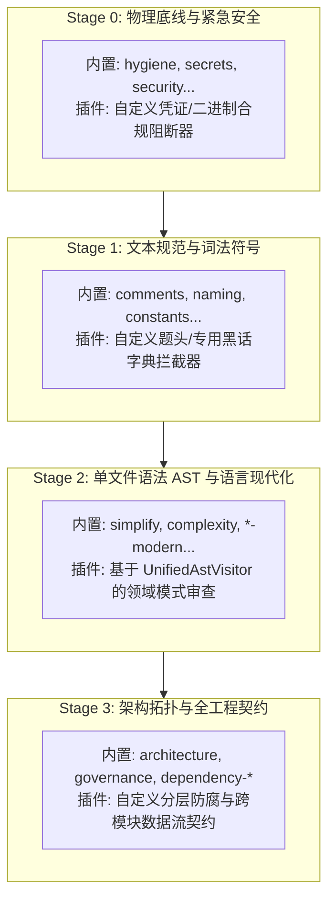
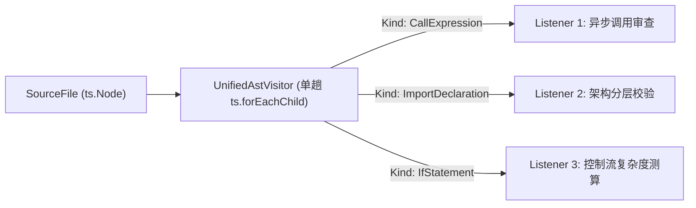

# 02. 自定义分析器插件与语义模式扩展规范

> **所属层级**：L4 规则引擎与内置分析器 (`docs/04-analyzers-and-rules/`)  
> **对应代码真源**：`src/core/analyzer-registry.ts`、`src/core/load-analyzer.ts`、`src/core/ast/unified-ast-visitor.ts`、`src/core/types.ts`、`src/core/rules/types.ts`、`src/core/scoring/dimensionRuleTable.ts`

---

## 1. 插件体系架构定位与四阶段流水线挂载

为了让特定业务团队或领域框架能够在不侵入内核源码的前提下定制合规审查逻辑，`auto-refactor` 提供了高度解耦的自定义分析器插件机制。自定义分析器并非孤立执行的外部脚本，而是完整融入引擎的**四阶段分析器流水线拓扑**：



自定义分析器可根据其业务定位声明执行时机与依赖关系：
- **挂载至 Stage 0/1**：执行纯文本正则或轻量分词审查，适合私有版权题头、内部密级标记或禁用全局宏扫描；
- **挂载至 Stage 2**：接入单文件 AST 与 `ControlFlowGraph`，使用 `UnifiedAstVisitor` 实现单趟多模式匹配；
- **挂载至 Stage 3**：读取 `SemanticGraph` 与 `DependencyGraph`，执行跨文件架构分层与依赖方向校验。

---

## 2. 标准 `Analyzer` 契约与 `AnalyzerFactory` 接口规范

### 2.1 核心类型契约 (`src/core/types.ts`)

```ts
export interface AnalyzerContext {
  readonly filePath: string;
  readonly content: string;
  readonly maskedContent: string;
  readonly language: SupportedLanguage;
  readonly ast?: NormalizedNode;
  readonly config: ScanConfig;
  readonly semanticGraph?: SemanticGraph;
}

export interface Analyzer {
  readonly name: string;
  analyze(context: AnalyzerContext): Promise<Issue[]> | Issue[];
}

export type AnalyzerFactory = () => Analyzer;
```

### 2.2 模块动态加载与工厂适配 (`src/core/load-analyzer.ts`)

在主进程初始化与多线程 Worker 派发时，引擎通过 `instantiateAnalyzer(mod, name)` 解析插件模块导出，支持以下三类工业级导出形态：

1. **构造函数 / 类导出**：
   ```ts
   export default class CustomRuleAnalyzer implements Analyzer {
     public readonly name = 'custom-rule-analyzer';
     public analyze(ctx: AnalyzerContext): Issue[] { /* ... */ }
   }
   ```
2. **已实例化的单例对象**：
   ```ts
   export const analyzer: Analyzer = {
     name: 'custom-singleton-analyzer',
     analyze(ctx: AnalyzerContext): Issue[] { /* ... */ },
   };
   ```
3. **具名工厂或成员导出**：
   模块导出对象包含 `default`、`Analyzer`、以分析器名同名的键名（`[name]`），或首个可执行函数成员。

> [!IMPORTANT]
> **多线程 Worker 隔离要求**：在并发扫描模式下，Worker 线程通过模块物理绝对路径独立 `require()` 重新实例化，禁止依赖主进程全局静态变量或闭包外部引用。

---

## 3. 规则元数据注册契约 (`RuleDefinition`)

自定义规则必须具备严格的元数据描述，遵循统一分类学规范：

```ts
import type { RuleDefinition } from 'auto-refactor';

export const CUSTOM_RULES: RuleDefinition[] = [
  {
    id: 'CUS-LAY-001',
    family: 'CUS',
    analyzer: 'custom-boundary',
    canonical: true,
    languages: ['typescript', 'javascript'],
    defaultSeverity: 'error',
    summary: 'UI 表现层模块直接穿透导入持久化数据访问层。',
    remediation: '通过 Application Service 或只读 Snapshot DTO 转发数据访问，禁止逆向依赖。',
    docsAnchor: 'docs/rules/custom-boundary.md#cus-lay-001',
  },
];
```

- **ID 拓扑合规**：建议遵循 `FAMILY-TOPIC-NNN` 3-3-3 拓扑命名（如 `CUS-LAY-001`、`BIZ-FSM-001`）；
- **双轨文案标准**：`summary` 与 `remediation` 保持技术客观、求真陈述，严禁占位符（`TODO`/`TBD`）逃逸；
- **严重度分级**：正确标注 `error`（阻断合规）、`warning`（需重构技术债）或 `info`（现代化建议）。

---

## 4. `UnifiedAstVisitor` 单趟遍历集成机制

为了杜绝在单个文件上反复进行多次高开销 AST 深度遍历，引擎提供了 `UnifiedAstVisitor`（`src/core/ast/unified-ast-visitor.ts`）。它基于 `ts.SyntaxKind` 倒排索引构建事件分发，实现**全规则共享的单趟 DFS 遍历**。

### 4.1 倒排索引分发架构



### 4.2 编写高性能 `AstNodeListener`

```ts
import * as ts from 'typescript';
import type { AstNodeListener } from 'auto-refactor';

export class DomainBoundaryListener implements AstNodeListener {
  public readonly name = 'domain-boundary-listener';
  // 声明仅对 ImportDeclaration 语法节点感兴趣，触发 O(1) 过滤
  public readonly kinds = [ts.SyntaxKind.ImportDeclaration];

  private readonly issues: Issue[] = [];

  constructor(private readonly filePath: string) {}

  public enter(node: ts.Node): void {
    const importDecl = node as ts.ImportDeclaration;
    const moduleSpecifier = importDecl.moduleSpecifier;
    if (ts.isStringLiteral(moduleSpecifier)) {
      const targetPath = moduleSpecifier.text;
      if (this.filePath.includes('/ui/') && targetPath.includes('/database/')) {
        this.issues.push({
          id: `custom-boundary:CUS-LAY-001:${this.filePath}:${node.getStart()}`,
          rule: 'CUS-LAY-001',
          analyzer: 'custom-boundary',
          severity: 'error',
          message: 'UI presentation layer must not directly import database layer.',
          location: {
            file: this.filePath,
            startLine: 1, // 结合 ts.getLineAndCharacterOfPosition 精确物化
            endLine: 1,
          },
          suggestion: 'Introduce an application service facade to decouple database access.',
        });
      }
    }
  }

  public getCollectedIssues(): Issue[] {
    return this.issues;
  }
}
```

---

## 5. 质量刚性公理：不可变单例与防堆分配防刷分约束

为了确保插件在高并发与大型代码仓（数十万 LOC）中平稳运行，自定义分析器必须遵守三项刚性工程公理：

### 5.1 零堆分配原则（Zero-Heap Allocation Invariant）
- **禁止内层高频分配**：在 `AstNodeListener.enter()` 或单文件热循环内，严禁频繁执行 `new Set()`、`new Map()`、闭包创建（如 `.filter(() => ...)`）或大数组复制拼接；
- **复用栈与缓冲区**：状态追踪统一复用预分配数组或整型位掩码（Bitmask），并在离开节点（`leave`）时显式退栈清空。

### 5.2 不可变无状态单例（Immutable Stateless Singleton）
- 分析器实例对象本身严禁缓存文件间的共享状态或 mutable 字段；
- 所有分析结果与诊断状态必须封装于方法局部上下文或单文件生命周期的 `Listener` 中，防止并发扫描时的交叉数据污染。

### 5.3 防刷分与质量门禁约束（Scoring Tamper-Proofing）
- **维度权重绑定**：插件产出的 `Issue` 必须在 `src/core/scoring/dimensionRuleTable.ts` 中映射至明确的质量维度（如 `architecture`、`security`、`maintainability` 等）；
- **门禁防刷分守卫**：未在维度表声明的规则将回退至 `techDebtRisk` 扣分，严禁利用自定义空壳规则恶意稀释技术债扣分比率，全仓由 `npm run validate-scoring-coverage` 门禁实施确定性闭环看守。

---

## 6. 关联文档导航

- [01. 四层规则金字塔、30 个内置分析器与 325 条全量规则字典](./01-builtin-rules.md)
- [04. 跨语言泛化审查与项目中立性规范](../05-specs-and-benchmarks/04-cross-language-generalization.md)
- [07. 三平面质量量化模型与代码自治度 (CAI) 规范](../05-specs-and-benchmarks/07-quantified-quality-standard.md)
