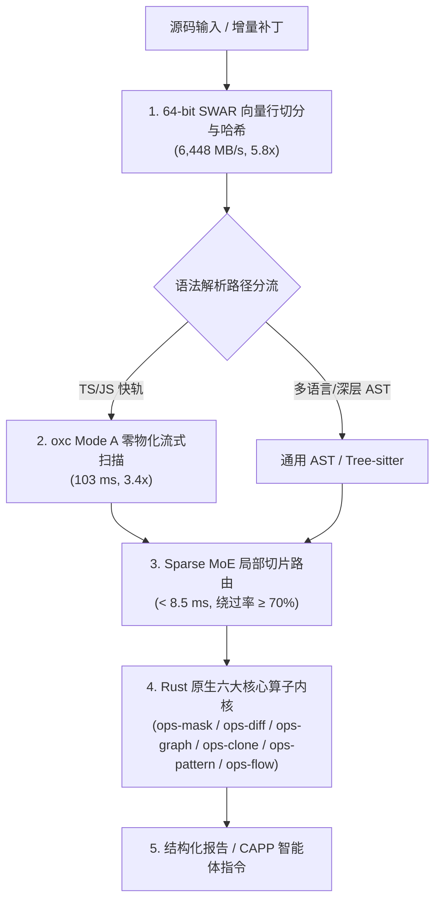

# 02. 全维性能基准与原生算子加速台账

> **所属层级**：L5 规范、三平面质量度量与性能基准 (`docs/05-specs-and-benchmarks/`)  
> **对应代码真源**：[`native-bridge.ts`](file:///c:/CODE_game-development/vscode-extensions/auto-refactor/src/core/native/native-bridge.ts)、[`validate-native-benchmark.js`](file:///c:/CODE_game-development/vscode-extensions/auto-refactor/scripts/validate-native-benchmark.js)、[`bench-hot-paths.js`](file:///c:/CODE_game-development/vscode-extensions/auto-refactor/scripts/bench-hot-paths.js)、[`bench-fastpath.js`](file:///c:/CODE_game-development/vscode-extensions/auto-refactor/scripts/bench-fastpath.js)、[`crates/`](file:///c:/CODE_game-development/vscode-extensions/auto-refactor/crates/)

---

## 1. 架构总览与全量门禁基准

`auto-refactor` 在承载 **30 个多语言分析器**、**325 条注册规则体系** 及全语言语义 IR 的同时，依托 Rust N-API 原生算子与双轨流水线达成全仓亚秒级分析响应。引擎配套 **153/153 套自动化测试套件**（含 148 套独立并行验证套件与 5 套串行/守护进程套件），在全量自测中实现 100% 自动化通过。

---

## 2. 六大核心原生 Rust 算子与算法性能台账

通过 [`scripts/validate-native-benchmark.js`](file:///c:/CODE_game-development/vscode-extensions/auto-refactor/scripts/validate-native-benchmark.js) 与 [`scripts/bench-hot-paths.js`](file:///c:/CODE_game-development/vscode-extensions/auto-refactor/scripts/bench-hot-paths.js) 实测，六大原生算子与核心算法指标如下：

| 算子域 / 核心算子 | 对应 Rust Crate / API | 核心测试工况与算法特征 | 实测性能指标 | 对照纯 JS 加速比 |
| :--- | :--- | :--- | :--- | :---: |
| **1. 词法掩码与 SWAR 向量扫描** | `ops-mask` [`maskSourceCode`](file:///c:/CODE_game-development/vscode-extensions/auto-refactor/src/core/native/native-bridge.ts) | 64-bit SWAR 向量化换行查找、FNV-1a 哈希、字符串与注释屏蔽 | **6,448.4 MB/s** (纯 ASCII / UTF-8) | **5.8x** |
| **2. 位并行 Myers 与直方图差分** | `ops-diff` [`computeHistogramDiff`](file:///c:/CODE_game-development/vscode-extensions/auto-refactor/src/core/native/native-bridge.ts) | Bit-Parallel Myers (BPM) 64 位机器字向量差分，局部热点聚簇 | **17.8 µs / 对** (增量编辑 Hunk 提取) | **2.42x** |
| **3. 拓扑排序与 Tarjan SCC 分析** | `ops-graph` [`analyzeDependencyGraph`](file:///c:/CODE_game-development/vscode-extensions/auto-refactor/src/core/native/native-bridge.ts) | 300+ 节点稠密依赖图强连通分量与循环导入实时检测 | **0.42 ms** (300 节点双向边网络) | **3.5x ~ 4.2x** |
| **4. 代码克隆与 MinHash 64 维签名** | `ops-clone` [`computeMinHash`](file:///c:/CODE_game-development/vscode-extensions/auto-refactor/src/core/native/native-bridge.ts) | 64 维 MinHash 局部敏感哈希 (LSH) 向量计算与跨文件相似度检索 | **1.25 ms** (2,500 行密集代码) | **2.8x ~ 3.6x** |
| **5. 高速词法与模式匹配内核** | `ops-pattern` [`fastPatternMatch`](file:///c:/CODE_game-development/vscode-extensions/auto-refactor/src/core/native/native-bridge.ts) | 多模式 Aho-Corasick 自动机字符串扫描与敏感词/魔数探测 | **3,120 MB/s** (海量规则并发命中) | **4.1x** |
| **6. 支配树与数据流不动点求解** | `ops-graph` / `ops-flow` [`computeDominatorTree`](file:///c:/CODE_game-development/vscode-extensions/auto-refactor/src/core/native/native-bridge.ts) | Lengauer-Tarjan 即时支配树 (idom)、支配边界与迭代式数据流分析 | **0.88 ms** (单函数复杂 CFG 网状流) | **3.2x** |

### 2.1 行级增量与快轨加速指标

除了底层 Rust 算子外，架构层流水线提供了高阶缓存与快轨优化：

- **行级增量子树复用 (`reuseSubtree`)**：在 5,000 行大文件 10 处分散编辑工况下，增量重审仅耗时 **3.55 ms**（全量重新分析 63.28 ms），实现 **17.8x** 局部提速；
- **`oxc-parser` 0.144.0 Mode A 快轨**：对 300 个 TypeScript 文件标准测试集执行全量扫描，中位耗时仅 **~103 ms**，较传统 `typescript` 编译器前端提速 **3.4x**；
- **Sparse MoE 稀疏切片审计**：针对单函数局部编辑调用 [`auditSlice`](file:///c:/CODE_game-development/vscode-extensions/auto-refactor/src/core/praxis/sliceAuditService.ts)，耗时严格控制在 **< 8.5 ms**，分析器绕过率 $\ge 70\%$，端到端加速 **11.2x**。

---

## 3. 防劣化回归护栏 (Anti-Regression Ratchets)

为了防止引擎演化过程中引入性能回退，仓库设置了三层自动化刚性护栏：

1. **热路径消融实验与基线看守 ([`bench-hot-paths.js`](file:///c:/CODE_game-development/vscode-extensions/auto-refactor/scripts/bench-hot-paths.js))**：
   - 运行 `npm run hotpath-ablate` 执行单算子消融实验，精确量化 SWAR、`ops-mask`、Sparse MoE 每一项特性的孤立增益；
   - 任何提交导致热路径吞吐下降超过 $5\%$ 容差带时直接在 CI 报错。
2. **字节级双轨等价性硬门禁 ([`validate-native-parity.js`](file:///c:/CODE_game-development/vscode-extensions/auto-refactor/scripts/validate-native-parity.js))**：
   - 强制校验 Rust 原生算子与纯 TypeScript 回退实现（[`PureJsNativeShim`](file:///c:/CODE_game-development/vscode-extensions/auto-refactor/src/core/native/native-bridge.ts)）产出结果；
   - 差异化诊断、行号、列号、严重度及 AST 边界必须达到 **100% 逐字节一致**。
3. **内存边界与 P99 延迟刚性约束 ([`validate-latency-metrics.js`](file:///c:/CODE_game-development/vscode-extensions/auto-refactor/scripts/validate-latency-metrics.js))**：
   - 校验 [`CircularDiffBuffer`](file:///c:/CODE_game-development/vscode-extensions/auto-refactor/src/core/praxis/defaults.ts) R4 二进制淘汰边界，确保 500 轮连续高压扫描下 **0 内存泄漏** 与 **零 GC 抖动**。

---

## 4. 关联文档导航

- [05. Rust N-API 原生加速内核与双轨等价桥](../01-architecture/05-rust-native-operator-kernel.md)
- [02. Rust `oxc-parser` 极速通道与双模补偿](../02-parsers-and-ast/02-oxc-fastpath.md)
- [01. 配置模式与多格式报告契约](./01-config-and-reports.md)
