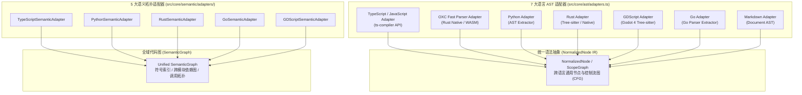

# 04. 跨语言泛化审查与项目中立性规范

> **所属层级**：L5 规范、三平面质量度量与性能基准 (`docs/05-specs-and-benchmarks/`)  
> **对应代码真源**：`src/core/ast/adapters.ts`、`src/core/semantic/adapters/`、`src/core/profiler/projectProfiler.ts`、`src/core/intelligence/file-role-inference.ts`、`scripts/validate-project-neutrality.js`

---

## 1. 项目中立性不变量 (Project-Agnostic Invariant)

作为服务于多语言与跨技术栈（Node CLI、VS Code 插件、Godot 4 游戏引擎、Python AI 服务、Rust 系统级组件、Go 微服务）的通用静态审查重构引擎，`auto-refactor` 核心代码严格恪守**项目中立性公理**：

1. **零业务仓库硬编码**：`src/` 下任何核心模块与通用分析器严禁硬编码特定消费方项目的私有绝对路径、业务实体命名或私有代号；
2. **自动化中立性守卫 (`npm run validate-project-neutrality`)**：`scripts/validate-project-neutrality.js` 在预提交与 CI 门禁中静态扫描 `src/**`，一旦发现未经配置抽象注入的特定项目专有字符串，立即阻断构建；
3. **工程原型自动探测 (`detectProjectArchetype`)**：针对游戏引擎（`gdscript-game`）或编辑器扩展（`vscode-extension`）等专用规则，统一通过工程原型探测器（`projectProfiler.ts`）自动匹配特征标志（如 `project.godot`、声明 `engines.vscode` 的 `package.json`），按需动态装配专精分析器。

---

## 2. 双轨跨语言适配体系（Dual-Track Polyglot Abstraction）

引擎构建了底层语法树解析与上层全域语义拓扑解耦的双轨适配架构，消除各语言编译器抽象的差异性：

### 2.1 7 大语言 AST 适配器矩阵 (`src/core/ast/`)

通过 `src/core/ast/adapters.ts` 的 `LanguageAdapter` 接口，引擎支持按扩展名懒加载物化 AST：
1. **TypeScript / JavaScript 适配器 (`typescript-adapter.ts`)**：封装 TypeScript 官方编译器 API，支持 TSX/JSX 语法与完整类型推断上下文；
2. **OXC 极速解析器适配器 (`oxc-adapter.ts`)**：针对大规模扫描场景，通过 Rust 原生/WASM 绑定提供毫秒级 TS/JS AST 解析；
3. **Python 适配器 (`python-adapter.ts`)**：支持 Python 3.8~3.12 语法规范，精确提取装饰器、上下文管理器与类型注解；
4. **Rust 适配器 (`rust-adapter.ts`)**：支持 Rust 2021/2024 edition 语法，具备原始字符串（Raw String）安全脱敏与宏展开捕获能力；
5. **GDScript 适配器 (`gdscript-adapter.ts`)**：面向 Godot 4.x 现代语法，提取 `@export`、`@onready` 注解与信号 `Callable` 绑定；
6. **Go 适配器 (`go-adapter.ts`, `go-adapter-parser.ts`)**：覆盖 Go 1.20+ 语法，识别 Goroutine 调度、接口隐式实现与错误包装链；
7. **Markdown 适配器 (`markdown-adapter.ts`)**：解析文档目录树、未闭合围栏与相对死链，提供统一的文档卫士能力。

### 2.2 5 大语义拓扑适配器矩阵 (`src/core/semantic/adapters/`)

由 `SemanticAdapterRegistry` 统一管理与分发，直接将各语言源码的导出、依赖、继承与调用关系注入全局 `SemanticGraph`：
1. **`TypeScriptSemanticAdapter`**：解析 ES 模块与 CommonJS 导入导出、接口实现与依赖倒置；
2. **`PythonSemanticAdapter`**：解析模块级 `import` / `from ... import`、类继承体系与领域单例；
3. **`RustSemanticAdapter`**：提取 `mod`、`use` 路径引用、`trait` 实现与模块可见性；
4. **`GoSemanticAdapter`**：解析包路径导入、跨包函数引用与结构体组合；
5. **`GDScriptSemanticAdapter`**：分析场景树节点引用、`preload` / `load` 跨脚本耦合与全局 `Autoload` 单例。

---

## 3. 通用架构规则与语言专属规则的刚性边界

跨语言审查能够高保真运行的关键，在于严格区分**通用架构规则**与**语言专属规则**的权责边界：

| 规则类别 | 守护层级 | 目标语义载体 | 规则示例 | 跨语言泛化特征 |
| :--- | :--- | :--- | :--- | :--- |
| **通用架构与拓扑规则** | Layer 1 / Layer 3 | `SemanticGraph`、`DependencyGraph`、`ControlFlowGraph` | `ARCH-LAY-001` (分层防腐)、`DEP-CYC-002` (依赖成环)、`ARCH-DIR-001` (核心逆流)、`GOV-AGN-001` (多 Agent 协作防冲突) | **100% 跨语言中立**：无论工程由 TS、Python 还是 Rust 编写，领域层禁止反向依赖基础设施层的架构契约完全同构。 |
| **语言专属现代化规则** | Layer 2 | 语言特定的 AST 语法节点 (`NormalizedNode`) | `TSM-NULLISH-001` (`??` 替代)、`PYM-PATH-001` (`pathlib` 现代化)、`RSM-LOCK-001` (跨 await 锁死锁防御)、`GOM-CTX-001` (Goroutine Context 管控) | **深度绑定语言惯用法**：仅在对应语言文件激活，针对该语言的新版本语法特性与安全陷阱进行深度重构。 |

> [!NOTE]
> 存量历史文档中曾出现的 `ARC-LAY-001` 虚构规则前缀已全面清理，统一纠正为单源受控规范标识符 **`ARCH-LAY-001`**（属于 `architecture` 分析器与 `ARCH` 规则族）。

---

## 4. 文件语义角色自动推导 (`src/core/intelligence/file-role-inference.ts`)

为了防止无差别阈值引发的规则误报，`file-role-inference.ts` 根据文件路径模式、符号特征与 AST 节点分布自动推导语义角色，实施弹性预算控制：

| 语义角色 (`FileSemanticRole`) | 识别特征 | 差异化审查与弹性预算策略 |
| :--- | :--- | :--- |
| **`algorithmic-kernel`** | 高算术/位运算密度、支配树/差分/图遍历核心 | 允许更高的单函数圈复杂度预算（配合文档化说明），严查热循环内存分配 (`PRF-TRAN-001`) |
| **`declarative-table` / `constants-catalog`** | 纯对象/数组导出占比 $> 80\%$，零控制流分支 | 自动豁免表项级重复结构告警，重点检查常量命名规范 (`NAM-CST-001`) 与单一真源 |
| **`entrypoint-cli` / `script-harness`** | 含 shebang、参数解析或位于 `scripts/`、`src/cli/` | 允许顶层同步文件 I/O 与控制台输出 (`SIM-PRNT-001` 豁免)，放宽库代码级阻塞禁令 |
| **`test-suite` / `fixture`** | 位于 `test/`、`tests/` 或匹配 `*.test.*`、`validate-*` | 激活 `test-modernity` 分析器（拦截恒真断言 `TST-TAU-001`），豁免夹具字面量提取 |
| **`domain-service` / `ui-view`** | 标准业务与视图模块 | 执行最严格的分层依赖 (`ARCH-LAY-001`)、魔法数提取与异常上下文链检查 |

---

## 5. 关联文档导航

- [01. 四层规则金字塔、30 个内置分析器与 325 条全量规则字典](../04-analyzers-and-rules/01-builtin-rules.md)
- [02. 自定义分析器插件与语义模式扩展规范](../04-analyzers-and-rules/02-custom-analyzer-plugin.md)
- [06. 多语言现代化规则包与常量单源治理](./06-modernization-program.md)
- [07. 三平面质量量化模型与代码自治度 (CAI) 规范](./07-quantified-quality-standard.md)
