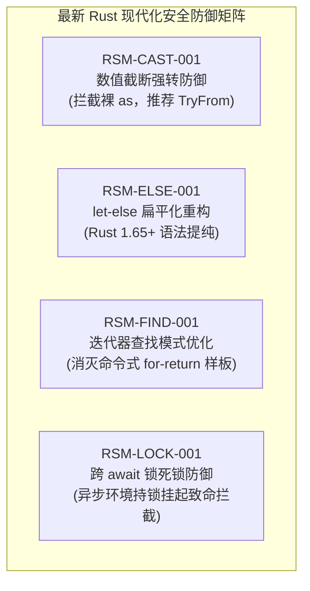

# 06. 多语言现代化规则包与常量单源治理

> **所属层级**：L5 规范、三平面质量度量与性能基准 (`docs/05-specs-and-benchmarks/`)  
> **对应代码真源**：`src/analyzers/ts-modern.ts`、`src/analyzers/python-modern.ts`、`src/analyzers/rust-modern.ts`、`src/analyzers/go-modern.ts`、`src/analyzers/gdscript-modern.ts`、`src/analyzers/frontend.ts`、`src/analyzers/stdlib.ts`、`src/analyzers/simplify.ts`、`src/analyzers/complexity.ts`、`src/core/constants/`

---

## 1. 现代化规则体系架构概览（共 9 个分析器、102 条现代化规则）

为了消除存量工程中陈旧语法范式引发的性能瓶颈、内存泄漏与安全隐患，`auto-refactor` 将现代化演进机制深度整合于**流水线 Stage 2（单文件语法 AST 与语言现代化）**中。整个体系由 **9 个现代化分析器**组成，涵盖 **102 条受控现代化规则**：

| 分析器名称 | 规则族前缀 | 规则数量 | 核心重构与现代化演进目标 |
| :--- | :--- | :---: | :--- |
| **`ts-modern`** | `TSM-*` | 11 条 | 淘汰 `var` 声明，禁止裸 `any` 断言，推荐 Optional Chaining (`?.`) 与 Nullish Coalescing (`??`)，规范 Promise 与正则构造 |
| **`python-modern`** | `PYM-*` | 13 条 | 推荐 `pathlib.Path` 替代 `os.path` 字符串拼接 (`PYM-PATH-001`)，PEP 604 联合类型 (`X \| None`)，f-string 与 `@dataclass(slots=True)` |
| **`rust-modern`** | `RSM-*` | 11 条 | 拦截跨 await 持锁死锁、裸 `as` 数值截断、推荐 `let-else` 语法、迭代器惯用法优化与 `?` 错误传播 |
| **`gdscript-modern`** | `GDM-*` | 21 条 | Godot 4.x 强类型注解契约、信号 `Callable` 强类型连接、`@onready` / `@export` / `@rpc` 注解规范化与对象池契约 |
| **`go-modern`** | `GOM-*` | 5 条 | 拦截未纳管 Goroutine 泄漏（强制 `context.Context`），循环变量捕获闭包陷阱修复，错误包装链 (`%w`) 与 `time.Duration` 安全 |
| **`frontend`** | `UI-*` | 4 条 | 表现层工程现代化：淘汰废弃框架生命周期钩子，消除跨层业务单例侵入，规范组件响应式订阅与解绑 |
| **`stdlib`** | `STDLIB-*` | 6 条 | 现代标准库手写轮子替换：原生 `Array.prototype.flat/flatMap`、`Object.entries`、`Promise.allSettled` 代替第三方低效垫片 |
| **`simplify`** | `SIM-*` | 11 条 | 控制流简化：前置卫语句拍平金字塔嵌套 (`SIM-GUARD-001`, `SIM-FLAT-002`)，单行三元折叠 (`SIM-TRN-001`)，参数聚合对象提炼 |
| **`complexity`** | `CPX-*` | 12 条 | 分支收敛与认知复杂度度量：函数认知复杂度上限控制，嵌套循环/深层 switch 查表化，多返回值收口与异常统一传播 |

---

## 2. Rust 现代化分析器与关键安全规则深度解析

在系统级编程中，语法层面的微小疏漏可能直接引发未定义行为（UB）、高位截断或全服务级线程死锁。`rust-modern` 分析器集成了最新的 Rust 现代化规范与脱敏安全保障：

### 2.1 4 项新增核心 Rust 现代化规则

1. **`RSM-CAST-001`：数值截断强转防御 (Numeric Truncation Cast Defense)**
   - **风险特征**：使用裸 `as` 将较宽整数类型强转为较窄类型（如 `val as u32`、`size as u16`、`big_int as i32`）；
   - **危害**：当运行时数值超出目标类型位宽上限时，发生静默高位截断，产生严重逻辑越界缺陷；
   - **重构引导**：改用标准库 `TryFrom` / `try_into()` 显式处理溢出错误，对于无损拓宽转换推荐 `From::from()`。

2. **`RSM-ELSE-001`：`let-else` 扁平化重构 (Flattening via let-else)**
   - **风险特征**：使用 `if let Some(x) = expr { ... } else { return/break/continue; }` 结构处理前置守卫；
   - **危害**：导致整个后续主体业务逻辑被迫缩进一级，引发严重的右向代码飘移（Right-drift）；
   - **重构引导**：升级至 Rust 1.65+ 的 `let Some(x) = expr else { return; };` 语法，使主体代码保持在最外层缩进。

3. **`RSM-FIND-001`：迭代器查找模式优化 (Iterator Find/Any Optimization)**
   - **风险特征**：手写 `for item in iter { if pred(&item) { return Some(item); } }` 样板逻辑；
   - **危害**：冗余的控制流样板阻碍编译器 SIMD 向量化与循环展开优化；
   - **重构引导**：替换为标准库迭代器惯用法 `iter.find(|x| pred(x))`、`.any()` 或 `.position()`。

4. **`RSM-LOCK-001`：跨 await 锁死锁防御 (Cross-Await Mutex Lock Defense)**
   - **风险特征**：在 `async fn` 作用域内持有 `std::sync::MutexGuard` 同步互斥锁守卫跨越 `.await` 挂起点；
   - **危害**：异步任务在挂起出让线程池执行权时未释放系统级互斥锁，导致池内其他工作线程被阻塞等待该锁，造成 Tokio 运行时全域线程耗尽与致命死锁；
   - **重构引导**：缩小同步锁生命周期代码块使其在 `.await` 之前自动 drop，或改用 `tokio::sync::Mutex` 异步互斥锁。

### 2.2 跨行格式化宏匹配机制

为了应对多行格式化调用（例如参数换行的 `format!`、`println!`、`panic!`），`rust-modern` 重构了格式化宏捕获引擎：
- **跨行状态捕获**：解析器能够跨越换行符精确提取格式字符串字面量与后续入参列表；
- **内联命名捕获支持**：识别 Rust 2021+ 引入的 `{variable}` 内联捕获语法，防止将具名占位符误报为位置参数缺失。

### 2.3 原始字符串 (Raw String) 双轨安全脱敏机制

针对包含复杂正则、SQL 或内联代码块的 Rust 原始字符串（如 `r#"..."#`、`r##"..."##`）：
- **状态机精确追踪**：在 Rust 原生算子 `ops-mask` 与 TypeScript 双轨脱敏层中，统一追踪任意深度井号（`#`）的原始字符串起止边界；
- **空格等价掩码 (Space-Masking)**：将原始字符串正文替换为等长空格，保持源文件字符偏移与行号完全不变；
- **语法脱敏盲区消除**：确保原始字符串内部嵌套的伪代码、宏调用或括号不会被 AST 分析器误判为有效代码，消除误报并维护零高危技术债基线。

---

## 3. 常量单一真源拓扑治理 (`src/core/constants/`)

魔法数与散落的重复字面量是代码可维护性的首要杀手。`auto-refactor` 建立了**三位一体的常量治理架构**：

1. **语义字面量智能提纯 (`classifyLiterals: true`, `semanticLiterals.ts`)**：
   - 自动识别并放行良性常量（如 `'utf-8'` 编码名、`'\n'` 换行符、标准 HTTP 状态码 200/404、常用端口号字典），避免形式主义过度提取。
2. **严禁局部遮蔽与嵌套重复定义 (`nested-constant`, `CST-NST-001`)**：
   - 严禁在函数体内部重复声明与模块级常量同值或同名的局部 `UPPER_SNAKE_CASE` 常量，由 `validate-nested-constant-cleanliness.js` 门禁持续看守。
3. **领域分片单一真源拓扑**：
   - 全局协议常量归入 `src/core/constants/` 领域子模块；私有阈值保留于模块顶部；依赖流向始终严格单向朝内。

---

## 4. 结构债 ABC 分类治理准则

针对存量高复杂度（`high-complexity`）与大文件（`large-file`）技术债，严禁采用「简单将大文件切碎为多个小文件」的形式主义，必须按以下标准对症重构：

- **A 类（扁平状态/规则派发表）**：
  数十个同构 `if / else if / switch` 分支返回同类结构 $\rightarrow$ **改用声明式查表驱动 (`Map` / `Record`)**。
- **B 类（本质密集算法内核）**：
  如 Myers 差分、Histogram 求解、Tarjan 强连通分量 $\rightarrow$ **保持算法内聚并在 JSDoc 题头明确标注数学不变量与时间复杂度**，严禁强行拆碎。
- **C 类（深层嵌套业务缠绕）**：
  缺少卫语句导致多层缩进金字塔 $\rightarrow$ **使用 Guard Clauses 提前返回拍平控制流，并按正交职责提取纯函数**。

---

## 5. 关联文档导航

- [01. 四层规则金字塔、30 个内置分析器与 325 条全量规则字典](../04-analyzers-and-rules/01-builtin-rules.md)
- [02. 自定义分析器插件与语义模式扩展规范](../04-analyzers-and-rules/02-custom-analyzer-plugin.md)
- [04. 跨语言泛化审查与项目中立性规范](./04-cross-language-generalization.md)
- [07. 三平面质量量化模型与代码自治度 (CAI) 规范](./07-quantified-quality-standard.md)
