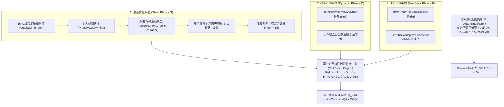

# 07. 三平面质量量化模型与代码自治度 (CAI) 规范

> **所属层级**：L5 规范、三平面质量度量与性能基准 (`docs/05-specs-and-benchmarks/`)  
> **对应代码真源**：[`scoringTypes.ts`](file:///c:/CODE_game-development/vscode-extensions/auto-refactor/src/core/scoring/scoringTypes.ts)、[`eightPillarModel.ts`](file:///c:/CODE_game-development/vscode-extensions/auto-refactor/src/core/scoring/eightPillarModel.ts)、[`scorer-formulas.ts`](file:///c:/CODE_game-development/vscode-extensions/auto-refactor/src/core/scoring/scorer-formulas.ts)、[`riskWeightModel.ts`](file:///c:/CODE_game-development/vscode-extensions/auto-refactor/src/core/scoring/riskWeightModel.ts)、[`risk-fusion-engine.ts`](file:///c:/CODE_game-development/vscode-extensions/auto-refactor/src/core/scoring/risk-fusion-engine.ts)、[`autonomy-scorer.ts`](file:///c:/CODE_game-development/vscode-extensions/auto-refactor/src/core/scoring/autonomy-scorer.ts)

---

## 1. 三平面质量度量体系全景 (Tri-Plane Quality Architecture)

传统静态代码分析极易被注水代码稀释、脱离线上真实运行时表现、且缺乏历史演进视角。`auto-refactor` 构建了 **静态质量平面 ($S$) + 动态运行平面 ($D$) + 演化反馈平面 ($F$)** 的三平面融合质量模型：

---

## 2. 静态质量平面：十大维度与八大战略支柱映射

静态分析在底层通过 **10 个细粒度维度 (`QualityDimension`)** 进行精确违规扣分，并在高阶统一汇聚为面向工程决策的 **8 大战略支柱 (`PrimaryQualityPillar`)**：

### 2.1 维度与支柱映射矩阵 (`DIMENSION_TO_PILLAR_MAP`)

根据 [`eightPillarModel.ts`](file:///c:/CODE_game-development/vscode-extensions/auto-refactor/src/core/scoring/eightPillarModel.ts) 单一真源，10 大细粒度维度与 8 大战略支柱映射如下：

| 八大战略支柱 (`PrimaryQualityPillar`) | 默认权重 | 汇聚归属的细粒度维度 (`QualityDimension`) | 核心评估关注点 |
| :--- | :---: | :--- | :--- |
| **`architecture`** | `0.15` | `architectureConsistency` | 模块单向依赖解耦、循环导入拦截、架构边界纯度 |
| **`maintainability`** | `0.15` | `maintainability` | 单函数圈复杂度、单文件物理/有效代码行、深度嵌套 |
| **`performance`** | `0.15` | `performanceEfficiency` | 循环内瞬态分配、低效算法复杂度、大对象无界膨胀 |
| **`data`** | `0.10` | `duplication`, `semanticPurity` | 重复字面量治理、常量单源拓扑、数据流纯度与无逃逸 |
| **`testing`** | `0.15` | `modernity` (或测试契约覆盖) | 测试框架现代性、同义反复断言拦截、跳过测试项治理 |
| **`reliability`** | `0.10` | `semanticPurity`, `techDebtRisk` | 异常安全、空值防护、全局技术债风险收敛 |
| **`security`** | `0.10` | `codeSecurity` | 敏感密钥硬编码拦截、未转义注入防御、客户端暴露面 |
| **`extensibility`** | `0.10` | `standardization`, `commentQuality`, `duplication` | 代码规范性、六字段模块头、ECD-C 有效注释密度 |

---

## 3. 静态评分数学内核：衰减、天花板与几何平均

### 3.1 双曲饱和衰减模型 (Hyperbolic Saturation Decay)

为了消除传统线性扣分「超量扣分直接跌穿 0 分导致失真」以及负指数衰减在极端负债下缺乏区分度的弊端，[`scorer-formulas.ts`](file:///c:/CODE_game-development/vscode-extensions/auto-refactor/src/core/scoring/scorer-formulas.ts) 采用**倒数型双曲饱和衰减公式**：

$$\text{density} = \frac{\text{rawPoints}}{\text{effectiveScale}}, \qquad \text{Score} = \frac{\text{DIMENSION\_MAX\_SCORE} \times \text{SATURATION\_HALFPOINT}}{\text{SATURATION\_HALFPOINT} + \text{density}}$$

- **核心常数**：$\text{DIMENSION\_MAX\_SCORE} = 100$，半饱和密度常数 $\text{SATURATION\_HALFPOINT} = 30$；
- **数学性质**：
  - 当无任何扣分时（$\text{density} = 0$），$\text{Score} = 100$；
  - 当违规密度恰好达到半饱和点（$\text{density} = 30$）时，$\text{Score} = 50.0$；
  - 当负债密度趋向于无穷大时，得分单调渐近趋于 $0$，严格维持单调序，绝不提前死锁在 0 分。

### 3.2 安全暴露面动态天花板与致命支柱硬顶 (Ceilings)

1. **安全暴露面动态天花板 (`computeSecurityCeiling`)**：
   干净代码的安全上限绝非盲目给满 100 分，而是根据 API 攻击暴露面动态测定：
   $$\text{expTerm} = 0.6 \cdot \min\left(1.0, \frac{\text{expSymbols}}{30}\right), \quad \text{locTerm} = 0.4 \cdot \min\left(1.0, \frac{\text{lines}}{500}\right)$$
   $$\text{discount} = 0.5 \cdot (\text{expTerm} + \text{locTerm}), \quad \text{securityCeiling} = 100.0 - \text{discount} \in [99.50, 100.00]$$
   安全得分在天花板基础上直接扣减违规：$\text{Score}_{\text{security}} = \max(0, \text{securityCeiling} - \text{rawPoints})$。

2. **致命支柱硬顶约束 (`PillarCeilingConstraint`)**：
   当出现不可宽恕的架构硬伤时，强制对所在支柱施加最高分上限，彻底杜绝被海量水代码稀释：
   - **架构致命违规**（如跨层逆向穿透）：$\text{MaxScore}_{\text{architecture}} \le 40$；
   - **性能致命违规**（如超高复杂度死循环）：$\text{MaxScore}_{\text{performance}} \le 45$；
   - **安全致命违规**（如高危明文密钥泄露）：$\text{MaxScore}_{\text{security}} \le 30$。

### 3.3 加权几何平均短板惩罚律 (Weighted Geometric Mean)

为贯彻「一处崩塌即全盘警惕」的短板惩罚哲学，静态综合得分采用加权几何平均，设定刚性下限 $\text{COMPOSITE\_INDEX\_FLOOR} = 15$：

$$\text{CompositeScore} = \exp\left( \frac{\sum_{i \in \text{Evaluated}} w_i \ln\left(\max(15, \text{index}_i)\right)}{\sum_{i \in \text{Evaluated}} w_i} \right)$$

- **短板放大效应**：若 9 个维度满分 100，但 1 个核心维度因致命缺陷跌入 15 分下限，算术平均仍高达 91.5（掩盖危机），而加权几何平均将直接暴跌至 75 分以下，强制倒逼解决根本缺陷。

---

## 4. 三平面风险融合引擎与非线性共振模型

[`risk-fusion-engine.ts`](file:///c:/CODE_game-development/vscode-extensions/auto-refactor/src/core/scoring/risk-fusion-engine.ts) 实现了静态分析、运行时遥测与历史演化的跨平面共振：

$$Risk_i = S_i^{\alpha} \cdot D_i^{\beta} \cdot H_i^{\gamma}$$

- **默认指数敏感度系数**：
  $$\alpha = 1.0 \quad (\text{静态推理基准}), \qquad \beta = 1.2 \quad (\text{动态事实优先倾斜}), \qquad \gamma = 0.8 \quad (\text{历史缺陷敏感度})$$

### 4.1 跨平面三相仲裁逻辑
1. **双向印证共振放大 (Dual Confirmation)**：
   若静态风险 $S_i \ge 3.0$ 且动态热点 $D_i \ge 3.0$，判定为线上真实热路径高危缺陷，风险乘以 **$1.3\times$**，融合分 $\ge 12.0$ 即连带升级为 **`critical`**。
2. **单向冷路径噪声抑制 (Single-Sided Dampening)**：
   若静态显示高复杂度（$S_i \ge 2.0$），但动态遥测证实为极低频冷路径（$D_i \le 0.5$），风险施加 **$0.35\times$** 抑制折扣，自动降级为 `low` 或 `informational`。
3. **隐蔽运行时瓶颈捕获 (Hidden Bottleneck)**：
   若静态评分由于表面简单未扣分（$S_i \le 1.0$），但运行时出现严重锁竞争或延迟尖刺（$D_i \ge 5.0$），强制上调风险，捕获隐蔽瓶颈。

### 4.2 统一多维综合质量评分 ($Q_{total}$)

$$Q_{\text{total}} = W_s \cdot Q_s + W_d \cdot Q_d + W_f \cdot Q_f$$

自适应权重向量 $W = (W_s, W_d, W_f)$ 根据项目领域动态微调：
- 核心框架库：$W_s = 0.55, W_d = 0.30, W_f = 0.15$；
- 密集算法库：$W_s = 0.35, W_d = 0.50, W_f = 0.15$；
- 遥测缺失环境自动退化：$W_s = 0.85, W_d = 0.00, W_f = 0.15$。

---

## 5. 客观代码自研率指数 (Code Autonomy Index — CAI 2.0)

废黜任何主观虚构的定性指标，[`autonomy-scorer.ts`](file:///c:/CODE_game-development/vscode-extensions/auto-refactor/src/core/scoring/autonomy-scorer.ts) 建立了**基于代码真源与依赖拓扑的纯客观六大正交自研率模型**：

### 5.1 六大正交自研率维度 (`AutonomyDimensions`)

| 维度标识符 | 数学代号 | 归一化权重 | 计算公式与测量物理量纲 |
| :--- | :---: | :---: | :--- |
| **`effectiveLocAutonomy`** | $R_{\text{loc}}$ | `0.30` | $\frac{\text{ELOC}_{\text{proprietary}}}{\text{ELOC}_{\text{proprietary}} + \text{ELOC}_{\text{vendor}} + \text{ELOC}_{\text{generated}}} \times 100$ |
| **`symbolCallAutonomy`** | $R_{\text{call}}$ | `0.20` | $\frac{\text{Calls}_{\text{internal}}}{\text{Calls}_{\text{internal}} + \text{Calls}_{\text{external\_sdk}}} \times 100$ |
| **`domainKernelDensity`** | $R_{\text{domain}}$ | `0.15` | $\frac{\text{ELOC}_{\text{core\_domain}}}{\text{ELOC}_{\text{proprietary}}} \times 100$（算法与核心业务逻辑占比） |
| **`codeOriginality`** | $R_{\text{pure}}$ | `0.15` | $\max(0, 100 - \min(30, N_{\text{clones}} \times 1.5))$（扣除大块无序复制代码） |
| **`supplyChainResilience`** | $R_{\text{supply}}$ | `0.10` | 抵抗外部传递依赖爆炸：$100 - (d \cdot 0.5 + \sqrt{t} \cdot 0.8 + \max(0, \text{depth}-1) \cdot 2.0)$ |
| **`criticalPathAutonomy`** | $R_{\text{critical}}$ | `0.10` | 安全/鉴权/加密/主分发核心路径中自研符号调用比例 |

$$\text{CAI} = \sum_{k=1}^6 w_k R_k \in [0.0, 100.0]$$

### 5.2 五级自治度等级划分 (`AutonomyGrade`)

根据综合自研率得分判定严格定性等级：

| 自治等级 | 得分阈值 | 行业定性与架构特征 |
| :--- | :---: | :--- |
| **`L5_INDEPENDENT`** | $\ge 95.0$ | **完全自主研发**：核心算法与领域模型 100% 自研，极度轻量且精准的外部依赖 |
| **`L4_HIGH_AUTONOMY`** | $\ge 85.0$ | **高自主度**：核心业务内核自主实现，规范集成标准开源生态 |
| **`L3_BALANCED`** | $\ge 70.0$ | **均衡依赖**：核心业务自研，与主流框架和云平台中度深度绑定 |
| **`L2_FRAMEWORK_DEPENDENT`** | $\ge 50.0$ | **框架依赖型**：实质性业务逻辑作为第三方 SDK 胶水代码存在 |
| **`L1_SHALLOW_WRAPPER`** | $< 50.0$ | **浅层封装型**：以接口转发与第三方实现套壳为主，自研价值极低 |

### 5.3 严格贝叶斯置信区间 (Jeffreys Beta Conjugate Prior)

为了防止「仅有单个文件的小项目因无第三方依赖直接虚标为 L5 独立项目」，引擎引入无信息无偏的 **Jeffreys 先验 $\text{Beta}(0.5, 0.5)$** 计算 $95\%$ 置信区间：

1. **样本充分度比率 ($S$)**：
   $$S = \left(1 - e^{-\frac{\text{effectiveLoc}}{4000}}\right) \cdot \left(1 - e^{-\frac{\text{totalFiles}}{8}}\right) \in [0.0, 1.0]$$
   当 $S < 0.45$ 时，显式打标 `isLowConfidence = true`。

2. **共轭后验分布更新**：
   - 有效样本量：$N_{\text{eff}} = \max\left(2, \operatorname{round}\left(\frac{\text{effectiveLoc}}{100} + \text{Calls}_{\text{total}}\right)\right)$；
   - 观测胜率：$p = \frac{\text{CAI}}{100}$，观测正样本 $k = p \cdot N_{\text{eff}}$；
   - 后验参数：$\alpha = k + 0.5, \quad \beta = N_{\text{eff}} - k + 0.5$；
   - 后验均值与可信平滑分：$\text{CredibleScore} = \frac{\alpha}{\alpha + \beta} \times 100$。

3. **95% 置信上下界导出**：
   $$\text{Var} = \frac{\alpha \beta}{(\alpha + \beta)^2 (\alpha + \beta + 1)}, \qquad \text{Margin} = 1.95996 \cdot \sqrt{\text{Var}} \times 100$$
   $$\text{LowerBound} = \max(0.0, \text{CredibleScore} - \text{Margin}), \quad \text{UpperBound} = \min(100.0, \text{CredibleScore} + \text{Margin})$$

---

## 6. 关联文档导航

- [01. 配置模式与多格式报告契约](./01-config-and-reports.md)
- [02. 全维性能基准与原生算子加速台账](./02-performance-benchmarks.md)
- [03. 规范文件头与有效注释密度 (ECD-C) 规范](./03-comment-and-header-standard.md)
