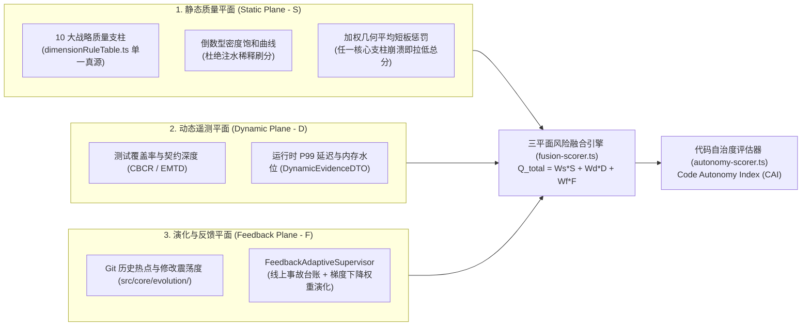

# 07. 三平面质量量化模型与代码自治度 (CAI) 规范

> **所属层级**：L5 规范、三平面质量度量与性能基准 (`docs/05-specs-and-benchmarks/`)  
> **对应代码真源**：`src/core/scoring/qualityScorer.ts`、`src/core/scoring/dimensionRuleTable.ts`、`src/core/scoring/fusion-scorer.ts`、`src/core/scoring/autonomy-scorer.ts`、`src/core/dynamic/`、`src/core/evolution/`

---

## 1. 三平面质量度量体系全景 (Tri-Plane Quality Architecture)

为了彻底克服传统静态评分「可被空代码稀释刷分、脱离线上运行真实表现、缺乏历史演进视角」的三大缺陷，`auto-refactor` 构建了 **静态平面 ($S$) + 动态运行平面 ($D$) + 演化与反馈平面 ($F$)** 的三平面融合质量模型：

---

## 2. 静态质量平面：十大战略支柱与数学公式

### 2.1 十大战略质量支柱 (`scoringTypes.ts`)

静态评分覆盖以下 10 个正交质量维度，其规则扣分映射关系 100% 集中定义于单一数据表 `src/core/scoring/dimensionRuleTable.ts`（由 `npm run validate-scoring-coverage` 门禁锁死）：

| 维度 ID | 中文名称 | 默认权重 | 关联核心证据分析器 (`DIMENSION_ANALYZERS`) |
| :--- | :--- | :---: | :--- |
| `architecture` | 架构拓扑与解耦度 | `0.15` | `architecture`, `dependency-graph`, `dependency-layout`, `data-architecture` |
| `security` | 安全性与凭证防御 | `0.15` | `security`, `secrets` |
| `reliability` | 可靠性与错误处理 | `0.12` | `governance`, `hygiene`, `shell-lint` |
| `performance` | 算法与内存性能 | `0.10` | `performance`, `gdscript-game` |
| `maintainability` | 可维护性与内聚度 | `0.12` | `complexity`, `large-file`, `structured-clarity`, `simplify` |
| `testQuality` | 测试现代性与契约覆盖 | `0.10` | `test-modernity` |
| `codeHygiene` | 代码卫生与命名规范 | `0.08` | `hygiene`, `constants`, `naming` |
| `modernity` | 语言惯用法现代性 | `0.06` | `ts-modern`, `python-modern`, `rust-modern`, `go-modern`, `gdscript-modern`, `stdlib` |
| `documentation` | 文档与有效注释密度 | `0.06` | `comments`, `docs` |
| `techDebtRisk` | 综合技术债风险 | `0.06` | 全分析器严重度回退汇聚 |

### 2.2 倒数型密度饱和曲线（防稀释刷分机制）

设某维度 $k$ 的有效违规扣分总和为 $P_k$，有效代码规模归一化因子为 $V_{\text{eff}}$（基于认知成本加权的 Effective KLOC，防止通过塞入大量无分支 getter/setter 稀释分母）。维度得分 $S_k \in (0, 100]$ 采用**无硬截断倒数饱和公式**：

$$D_k = \frac{P_k}{V_{\text{eff}}}, \qquad S_k = \frac{100}{1 + \alpha_k \cdot D_k^{\beta_k}}$$

- **核心数学性质**：当违规密度 $D_k = 0$ 时，$S_k = 100$；随着违规密度上升，$S_k$ 严格单调递减且渐近趋于 $0$，绝不会像线性截断公式那样在扣满 100 分后对后续新增违规失去分辨力。

### 2.3 加权算术-几何混合聚合（短板惩罚律）

为防止「其余 9 个维度满分，但安全维度发生严重密钥泄露（$S_{\text{security}} = 15$）却依然拿到 90+ 高分」的失真现象，静态总分 $S_{\text{static}}$ 結合加权算术平均 $M_{\text{arith}}$ 与加权几何平均 $M_{\text{geom}}$：

$$M_{\text{arith}} = \sum_{k=1}^{10} w_k S_k, \qquad M_{\text{geom}} = \prod_{k=1}^{10} \left(\max(S_k, \epsilon)\right)^{w_k}$$

$$S_{\text{static}} = (1 - \lambda) \cdot M_{\text{arith}} + \lambda \cdot M_{\text{geom}}$$

当任一关键支柱得分跌破红线时，几何平均项迅速拉低整体得分，强制优先偿还核心短板。

### 2.4 历史演化轨迹速度与 Churn 阻尼模型 (Trajectory Quality Velocity)

在评估重构历史与 Bad-to-Good 轨迹时，若仅计算简单的得分差值 $\Delta S = S_{\text{after}} - S_{\text{before}}$，容易使破坏性的大范围代码重写（高 Code Churn）掩盖稳定性风险。为此系统引入**反向 Churn 阻尼速度公式**：

$$\Delta Q_{\text{velocity}} = (S_{\text{after}} - S_{\text{before}}) \cdot \frac{1}{1 + \gamma \cdot \text{churnRatio}}$$

- 其中 $\text{churnRatio} = \frac{\Delta \text{LOC}_{\text{modified}} + \Delta \text{LOC}_{\text{deleted}}}{\text{LOC}_{\text{total}}}$，$\gamma = 0.5$（默认阻尼系数）。
- **性质**：净收益相同时，改动局部、低侵入性的重构获得最高演进速度得分；大范围高扰动改动将受到阻尼衰减惩罚。

### 2.5 重构配方泛化指数 (Recipe Generalization Index)

对于提取出的重构配方 $R$，其跨项目复用价值与可信度由**支持度比率、熵分散度与平均质量增益**联合决定：

$$G(R) = \left(\frac{N_{\text{support}}}{N_{\text{trials}}}\right) \cdot (1 - H_{\text{norm}}) \cdot \max(0, \overline{\Delta S})$$

- $H_{\text{norm}} \in [0, 1]$ 为结果分布的归一化信息熵，低熵代表跨文件应用时效果稳定可复现。

### 2.6 参数团簇二次方惩罚与间接开销效用模型 (Parameter Clump & Indirection Utility)

1. **参数团簇二次方惩罚（$P_{\text{clump}}$）**：
   $$P_{\text{clump}} = \max(0, N_{\text{params}} - \theta)^2 \cdot \sqrt{\text{CC}}$$
   *当参数量超过阈值 $\theta = 4$ 时，惩罚以二次方递增并受控制流圈复杂度 $\text{CC}$ 加权，倒逼向 DTO 演进。*

2. **架构内聚与间接开销效用比（$U_{\text{arch}}$）**：
   $$U_{\text{arch}} = \frac{\text{Cohesion}(\mathcal{F})}{1 + \alpha \cdot \text{Depth}_{\text{indirection}} + \beta \cdot \text{Alloc}_{\text{overhead}}}$$
   *防止为了拆分而过度抽象造成贫血对象与深层间接委托栈，保持参数化与函数性能的动态平衡。*

### 2.7 循环热路径堆分配与对象池守恒律 (Allocation Pressure & Pool Conservation)

1. **热循环瞬态堆分配指数（$P_{\text{alloc}}$）**：
   $$P_{\text{alloc}} = N_{\text{alloc}} \cdot (\text{nestingDepth} + 1)^2$$
   *循环内每次 `.new()` 或瞬态堆分配，随循环嵌套深度以二次方激增惩罚。*

2. **对象池生命周期守恒度（$\Phi_{\text{pool}}$）**：
   $$\Phi_{\text{pool}} = \frac{N_{\text{acquire}} - N_{\text{escapes}}}{N_{\text{acquire}}} \cdot \mathbb{I}(\text{hasResetState})$$
   *必须具备完整 `reset_state()` 状态重置方可获得池化有效性积分，杜绝复用脏数据与外部悬挂引用。*

### 2.8 Hook 解耦、并发 CAS、数据纯度与缓存自愈公式

| 指标名称 | 数学公式 | 业务与架构内化含义 |
| :--- | :--- | :--- |
| **Hook 配置解耦率** ($R_{\text{hook}}$) | $R_{\text{hook}} = \frac{N_{\text{hook}}}{N_{\text{hook}} + N_{\text{hardcode}}}$ | 衡量核心链路流转由配置 Hook 驱动的比例，杜绝下游分支硬编码。 |
| **并发重入安全指数** ($S_{\text{cas}}$) | $S_{\text{cas}} = \frac{N_{\text{guarded}}}{N_{\text{total\_async}}}$ | 异步状态机与退出流程中受原子 CAS/短路标志保护的覆盖比率。 |
| **数据流纯度分数** ($H_{\text{purity}}$) | $H_{\text{purity}} = \max(0, 1 - \frac{N_{\text{escaped}}}{N_{\text{edges}}})$ | 全链路 DTO 与上下文在跨域流转中无意外变异与引用逃逸的纯度。 |
| **缓存保鲜与防御度** ($C_{\text{cache}}$) | $C_{\text{cache}} = \frac{N_{\text{versioned}}}{N_{\text{total}}} \cdot (1 - \text{LeakRatio})$ | 静态单例缓存支持版本校验与自愈失效钩子且无直接字典外露的健康度。 |
| **DTO 向后兼容指数** ($B_{\text{compat}}$) | $B_{\text{compat}} = \frac{N_{\text{bridged}}}{N_{\text{refactored}}}$ | 参数封装为 DTO 时具备 1-to-N 参数静态工厂与重载桥接的平滑度。 |
| **模式接地一致性率** ($G_{\text{ground}}$) | $G_{\text{ground}} = \frac{N_{\text{grounded}}}{N_{\text{total\_domain}}}$ | 路由字面量、配置键与 Hook 标识符在 Schema 中严格登记的接地率。 |

### 2.9 Bad-to-Good 典型架构演化配方全集

| 配方标识 | 配方名称 | 典型 Bad 模式 | 规范 Good 模式 | 对应转换算子 |
| :--- | :--- | :--- | :--- | :--- |
| `REC-SPLIT` | 长函数子任务拆分 | 40+ 行包含折扣、税率、运费等的多分支单体函数 | 拆分为独立高内聚纯函数子例程与简洁编排器 | `split-function` |
| `REC-PARAM` | 选项参数对象封装 | 5+ 个散落的位置标量参数签名 | 聚合为结构化 Options / Config 接口 | `introduce-parameter-object` |
| `REC-STRAT` | 条件分支转策略分发 | 膨胀的 `switch/case` 或 `elif` 分支串 | 声明式策略映射字典 (`Record<string, Handler>`) | `extract-strategy` |
| `REC-GUARD` | 防御性边界守卫注入 | 缺少入参非空与异常保护的裸调用 | 顶层提前退出 Guard 与安全异常捕获边界 | `inject-null-guard` |
| `REC-POOL` | 静态对象池与状态重置 | 循环高频触发 `.new()` / `.duplicate(true)` 造成 GC 抖动 | 静态有界对象池 + `acquire/release` + `reset_state` | `introduce-object-pool` `inject-reset-state` |
| `REC-CAS` | 状态机 CAS 防重入守卫 | 异步与事件触发中缺少并发互斥标志导致状态撕裂 | 引入原子 `_is_executing` 布尔锁与入口短路防御 | `inject-cas-guard` |
| `REC-HOTCFG` | 配置缓存自愈与版本重载 | 高频调用 `GameConfig.get_*` 直查配置字典 | 静态版本化缓存 + `invalidate_cache()` 失效钩子 | `inject-cache-invalidation` |
| `REC-DTO` | 强类型 Context DTO 聚合 | 业务服务接口层 6+ 个标量入参形成 Data Clump | 聚合为强类型 Context DTO 并提供向后兼容桥接重载 | `introduce-dto-context` |
| `REC-HOOK` | 流程生命周期 Hook 解耦 | 流程引擎中以 `if step == 1/2/3` 硬编码下游流转 | 统一向 `HookRegistry` 分发上下文，由配置 Hook 驱动 | `inject-hook-dispatch` |

---

## 3. 动态平面、演化平面与代码自治度 (CAI)

1. **动态遥测注入 (`DynamicEvidenceDTO` & `src/core/dynamic/`)**：
   - 通过 `--telemetry <path>` 或编程式 `telemetryData` 注入单元/集成测试覆盖率、运行时热路径延迟分布与异常崩溃计数；
   - `RiskFusionEngine` (`src/core/scoring/fusion-scorer.ts`) 将静态复杂度热点与动态低覆盖/高延迟热点做交叉乘积放大，精准定位高危代码区。
2. **代码自治度指数 (`AutonomyScorer` — Code Autonomy Index, CAI)**：
   - 位于 `src/core/scoring/autonomy-scorer.ts`，综合度量一个代码库对「AI 智能体自主安全演进」的友好程度；
   - 评估五大自治支柱：**契约明确度（Type & Header Clarity）**、**模块隔离度（Blast Radius Containment）**、**自检守卫完备度（Self-Verification Guards）**、**诊断可操作性（Agent Actionability）** 与 **回滚原子性（Rollback Safety）**，输出 `L1`（人工重度辅助）至 `L5`（全闭环无人值守演进）的自治等级评定。

---

## 4. 关联文档导航

- [01. 四层规则金字塔、26 个内置分析器与 243 条全量规则字典](../04-analyzers-and-rules/01-builtin-rules.md)
- [02. Praxis 六大核心治理服务门面 API 手册](../06-praxis-delivery/02-praxis-six-governance-services-api.md)

