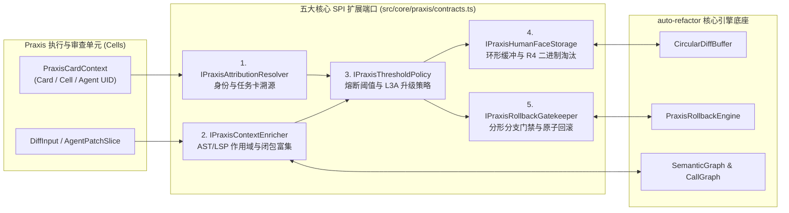

# 01. Praxis 对接架构全景与五大 SPI 契约手册

> **所属层级**：L6 Praxis 团队交付专层 (`docs/06-praxis-delivery/`)  
> **对应代码真源**：`src/core/praxis/contracts.ts`、`src/core/praxis/defaults.ts`、`src/core/praxis/semanticEnricher.ts`、`src/core/praxis/index.ts`

---

## 1. 设计目标与架构定位

`auto-refactor` 为 Praxis 多智能体（Multi-Agent）/ 多工作单元（Multi-Cell）研发体系提供了一套**零编译器阻塞、强类型约束、支持毫秒级流式治理与卡级原子回滚**的扩展子系统。

核心设计遵循三条工程不变量：

1. **契约与实现彻底解耦**：`src/core/praxis/contracts.ts` 仅声明编译期 TypeScript 接口与类型别名，零运行时开销，确保 Praxis 各业务 Cell 可按需注入自定义适配器或直接使用内置默认实现。
2. **双向语义对齐**：将底层行级差分（`AttributedDiffLine` / `ReviewDiffHunk`）与顶层跨语言语义图（`SemanticGraph` / `CallGraph` / `ModuleDependencyGraph`）自动缝合，使每个 Diff Hunk 均携带外围符号作用域与跨文件逆向影响闭包。
3. **两级门禁与三级回滚联动**：支持小规模低风险变更自动放行或原位修复（`minor_fix_needed`），对越界或破坏性变更自动触发 `L3A` 架构仲裁升级（`shouldEscalateToL3A: true`），并支持按 Hunk、按 TaskCard 乃至按依赖链的一键原子回滚。



---

## 2. 核心领域数据模型

### 2.1 动态任务卡上下文 (`PraxisCardContext<TMeta>`)

用于在多智能体并发流水线中标识任意代码变更的归属单元与级联依赖关系：

| 字段名 | 类型 | 必填 | 语义说明 |
| :--- | :--- | :---: | :--- |
| `cardId` | `string` | 是 | 任务卡全局唯一标识（例如 `card-auth-refactor-042`） |
| `cardType` | `string` | 否 | 动态卡片类型（如 `'build'` \| `'review'` \| `'test'` \| `'refactor'`） |
| `cellId` | `string` | 是 | 所属 Praxis 工作单元（Cell）标识 |
| `agentUid` | `string` | 是 | 执行本次修改的智能体唯一标识（如 `'agent-coder-alpha'`） |
| `checkpointId` | `string` | 否 | 关联的会话检查点快照 ID，用于级联回滚锚定 |
| `parentCardIds` | `string[]` | 否 | 上游父任务卡 ID 列表，回滚本卡时可据此推导下游级联撤回范围 |
| `customData` | `TMeta` | 否 | 业务方自定义泛型载荷，引擎在流转与回放过程中无损透传 |

### 2.2 溯源差分行 (`AttributedDiffLine<TMeta>`) 与审查块 (`ReviewDiffHunk<TMeta>`)

`computeDetailedHunks` 与 `PraxisDiffGovernanceService` 将原始文本对比转化为具备符号上下文与风险度量的结构化 Hunk：

```ts
export interface AttributedDiffLine<TMeta = Record<string, unknown>> {
    type: 'context' | 'insert' | 'delete';
    lineNoOld?: number;
    lineNoNew?: number;
    content: string;
    attribution?: PraxisCardContext<TMeta>;
    metrics?: {
        riskScore?: number;
        confidence?: number;
        associatedRules?: string[];
    };
}

export interface ReviewDiffHunk<TMeta = Record<string, unknown>> {
    hunkId: string;
    header: string;
    oldSpan: { startLine: number; lineCount: number };
    newSpan: { startLine: number; lineCount: number };
    astContext?: {
        enclosingSymbol?: string;
        symbolKind?: string;
        scopeRange?: { startLine: number; endLine: number };
        impactFiles?: string[];
    };
    lines: AttributedDiffLine<TMeta>[];
    reviewVerdict?: PraxisVerdict;
}
```

### 2.3 审查裁决载荷 (`PraxisVerdict`)

| 字段名 | 类型 | 说明 |
| :--- | :--- | :--- |
| `status` | `'passed' \| 'minor_fix_needed' \| 'major_rework_needed'` | 门禁三级状态：通过 / 局部微调 / 重大返工 |
| `isMajorChange` | `boolean` | 变更规模或影响面是否跨越主干安全阈值 |
| `shouldEscalateToL3A` | `boolean` | 是否必须上报至 Praxis `L3A` 首席架构仲裁节点 |
| `targetCallbackChannel` | `string` | 异步审查回调路由通道名 |
| `suggestedPatch` | `string` | 自动生成的修复补丁或重构建议片段 |
| `violations` | `string[]` | 命中的规范化规则 ID 与违规摘要列表 |

---

## 3. 五大 SPI 扩展插槽详解

### 3.1 插槽一：动态身份与任务卡溯源 (`IPraxisAttributionResolver`)

- **职责**：根据文件路径与行号区间 `{ startLine, endLine }`，实时反查当前修改归属的 `PraxisCardContext`。
- **接口签名**：
  ```ts
  export interface IPraxisAttributionResolver<TMeta = Record<string, unknown>> {
      resolveAttribution(
          filePath: string,
          lineSpan: { startLine: number; endLine: number },
      ): Promise<PraxisCardContext<TMeta> | null> | PraxisCardContext<TMeta> | null;
  }
  ```
- **内置实现**：`DefaultPraxisAttributionResolver`（维护内存态区间映射表，支持 `registerAttribution` 动态注入任务卡归属）。

### 3.2 插槽二：AST 与跨文件语义富集器 (`IPraxisContextEnricher`)

- **职责**：为单个 `ReviewDiffHunk` 注入所在函数/类符号名（`enclosingSymbol`）、符号类别（`symbolKind`）、外围语法作用域范围（`scopeRange`）以及跨文件逆向依赖闭包（`impactFiles`）。
- **接口签名**：
  ```ts
  export interface IPraxisContextEnricher {
      enrichHunk(
          filePath: string,
          hunk: ReviewDiffHunk,
      ): Promise<PraxisEnrichedContext> | PraxisEnrichedContext;
  }
  ```
- **内置双实现**：
  - `DefaultPraxisContextEnricher`：基于正则与轻量启发式词法扫描，零语法树构建开销，适合极速流式预览。
  - `SemanticPraxisContextEnricher`（位于 `src/core/praxis/semanticEnricher.ts`）：深度绑定 `SemanticGraph`，精准提取跨语言符号边界并调用 `graph.getBackwardImpact(filePath, symbolName)` 计算真实下游受影响文件集合。

### 3.3 插槽三：熔断阈值与 L3A 升级策略 (`IPraxisThresholdPolicy`)

- **职责**：综合评估 Hunk 的增删行数、作用域敏感度与逆向冲击半径，判定是否触发 `L3A` 架构审查升级。
- **接口签名**：
  ```ts
  export interface IPraxisThresholdPolicy {
      evaluateChange(
          filePath: string,
          hunk: ReviewDiffHunk,
          context: PraxisEnrichedContext,
      ): Promise<PraxisVerdict> | PraxisVerdict;
  }
  ```
- **内置实现**：`DefaultPraxisThresholdPolicy`（当单 Hunk 变更行数超限或受影响下游文件数超阈值时，自动置 `isMajorChange = true` 且 `shouldEscalateToL3A = true`）。

### 3.4 插槽四：人机界面环形缓冲与 R4 冷存淘汰 (`IPraxisHumanFaceStorage`)

- **职责**：配合 `CircularDiffBuffer` 管理人读审查界面的高吞吐 Diff 块驻留，并在容量溢出时将最旧 Hunk 序列化为紧凑 `Uint8Array` 转储至 Praxis R4 二进制归档层。
- **接口签名**：
  ```ts
  export interface IPraxisHumanFaceStorage {
      appendDiffChunk(chunk: ReviewDiffHunk): Promise<void> | void;
      flushPeriodicSnapshot(): Promise<void> | void;
      evictToR4Archive(
          evictedPayload: Uint8Array,
      ): Promise<{ archiveId: string }> | { archiveId: string };
  }
  ```
- **内置实现**：`DefaultPraxisHumanFaceStorage`（提供内存队列缓存与确定性 `r4-archive-*` 归档回执生成）。

### 3.5 插槽五：卡级联动回滚与分形分支门禁 (`IPraxisRollbackGatekeeper`)

- **职责**：提供单 Hunk 逆向补丁撤回、整张 TaskCard 多文件逆序级联回滚，以及分形 Git 分支合入前门禁终审（`checkMergeGate`）。
- **接口签名**：
  ```ts
  export interface IPraxisRollbackGatekeeper {
      revertDiffHunk(
          filePath: string,
          hunkId: string,
      ): Promise<{ success: boolean; patch: string }> | { success: boolean; patch: string };

      revertTaskCard(
          cardId: string,
      ):
          | Promise<{ affectedFiles: string[]; rolledBackCheckpoints: string[] }>
          | { affectedFiles: string[]; rolledBackCheckpoints: string[] };

      checkMergeGate(
          sourceBranch: string,
          targetBranch: string,
          diffPayload: ReviewDiffHunk[],
      ):
          | Promise<{ approved: boolean; reason?: string; violations?: string[] }>
          | { approved: boolean; reason?: string; violations?: string[] };
  }
  ```
- **内置实现**：`DefaultPraxisRollbackGatekeeper` 与底层 `PraxisRollbackEngine`（`src/core/rollback.ts`）。

---

## 4. 插件钩子组合装配 (`createDefaultPraxisHooks`)

Praxis 消费方可通过 `createDefaultPraxisHooks(overrides)` 一键获取五大 SPI 的标准组合，并仅覆盖需要定制的端口：

```ts
import {
    createDefaultPraxisHooks,
    SemanticPraxisContextEnricher,
    SemanticGraph,
} from 'auto-refactor';

const graph = new SemanticGraph();
const hooks = createDefaultPraxisHooks({
    contextEnricher: new SemanticPraxisContextEnricher(graph),
});
```

---

## 5. 关联文档导航

- [02. Praxis 六大核心治理服务门面 API 手册](./02-praxis-six-governance-services-api.md)
- [03. Praxis 团队联调操作手册与交付验收矩阵](./03-praxis-integration-runbook-and-acceptance.md)
- [Praxis 分形 Git 工作树与多级门禁回滚规范](../01-architecture/04-praxis-git-fractal-and-gating-spec.md)
