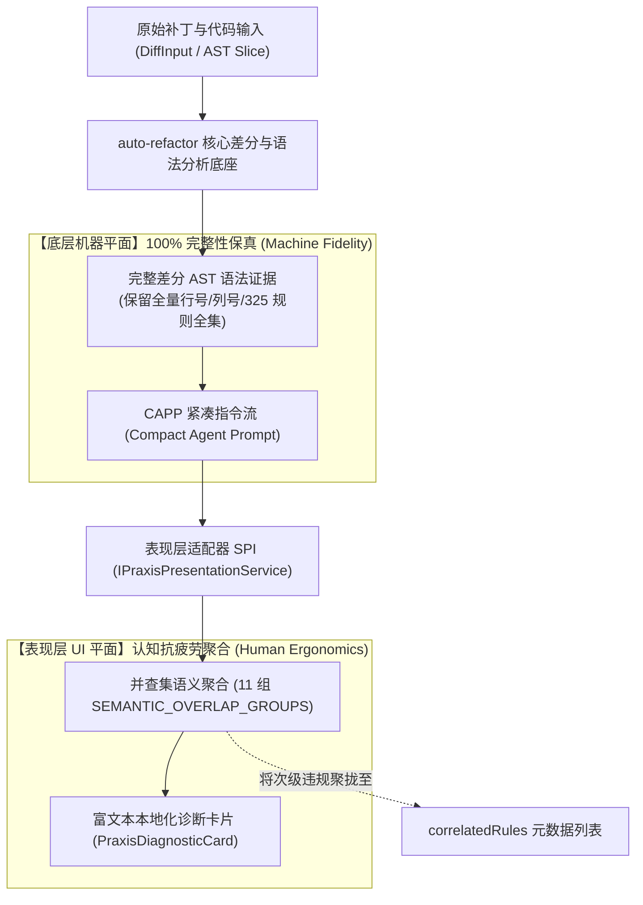
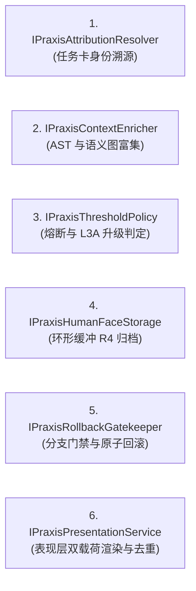

# 01. Praxis 对接架构全景与六大 SPI 契约手册

> **所属层级**：L6 Praxis 团队交付专层 (`docs/06-praxis-delivery/`)  
> **对应代码真源**：[`contracts.ts`](file:///c:/CODE_game-development/vscode-extensions/auto-refactor/src/core/praxis/contracts.ts)、[`defaults.ts`](file:///c:/CODE_game-development/vscode-extensions/auto-refactor/src/core/praxis/defaults.ts)、[`presentation-types.ts`](file:///c:/CODE_game-development/vscode-extensions/auto-refactor/src/core/praxis/presentation/presentation-types.ts)、[`presentation-adapter.ts`](file:///c:/CODE_game-development/vscode-extensions/auto-refactor/src/core/praxis/presentation/presentation-adapter.ts)、[`semanticEnricher.ts`](file:///c:/CODE_game-development/vscode-extensions/auto-refactor/src/core/praxis/semanticEnricher.ts)

---

## 1. 设计目标与底层完备-表现去重双层解耦公理

`auto-refactor` 为 Praxis 多智能体（Multi-Agent）与分形工作单元（Multi-Cell）研发体系提供了一套**高内聚、接口驱动、双面呈现（Dual-Faced）的治理子系统**。

核心设计严格贯彻 **底层差分 AST 完备性与表现层去重双层解耦公理 (Dual-Faceted Decoupling Axiom)**：



1. **机器平面（底层保真）**：底层静态分析引擎维持 100% 规则检出完备性与 AST 细节，严禁在扫描阶段做粗暴丢弃，确保 Agent 执行自动化重构时具备完整无损的结构上下文。
2. **表现平面（人读降噪）**：人类审查者极易在同位置并发的多条重叠诊断前产生认知疲劳。表现层 SPI 经由并查集对同坐标关联规则执行聚合成单张主卡，将次级规则沉淀至 `correlatedRules` 元数据中，实现「既不丢失底层诊断，又让人眼审查清爽高效」。

---

## 2. 核心领域数据模型

### 2.1 任务卡上下文 (`PraxisCardContext<TMeta>`)

在多智能体流水线中精准标定每一次修改的单元归属与追溯链路：

| 字段名 | 类型 | 必填 | 语义说明 |
| :--- | :--- | :---: | :--- |
| `cardId` | `string` | 是 | 任务卡全局唯一标识（例如 `card-auth-refactor-042`） |
| `cardType` | `string` | 否 | 动态卡片类别（`'build'` \| `'review'` \| `'test'` \| `'refactor'`） |
| `cellId` | `string` | 是 | 所属 Praxis 工作单元（Cell）编号 |
| `agentUid` | `string` | 是 | 执行本次代码修改的智能体唯一 ID（如 `'agent-coder-alpha'`） |
| `checkpointId` | `string` | 否 | 关联的会话快照标识，用于锚定多文件原子回滚点 |
| `parentCardIds` | `string[]` | 否 | 上游父卡 ID 列表，回滚本卡时级联推导下游受影响任务 |
| `customData` | `TMeta` | 否 | 业务端自定义扩展元数据，引擎在全流程中透明无损传递 |

### 2.2 溯源差分行 (`AttributedDiffLine`) 与审查块 (`ReviewDiffHunk`)

```ts
export interface AttributedDiffLine<TMeta = Record<string, unknown>> {
    type: 'context' | 'insert' | 'delete';
    lineNoOld?: number;
    lineNoNew?: number;
    content: string;
    attribution?: PraxisCardContext<TMeta>;
    metrics?: {
        riskScore?: number;
        confidence?: number;
        associatedRules?: string[];
    };
}

export interface ReviewDiffHunk<TMeta = Record<string, unknown>> {
    hunkId: string;
    header: string;
    oldSpan: { startLine: number; lineCount: number };
    newSpan: { startLine: number; lineCount: number };
    astContext?: {
        enclosingSymbol?: string;
        symbolKind?: string;
        scopeRange?: { startLine: number; endLine: number };
        impactFiles?: string[];
    };
    lines: AttributedDiffLine<TMeta>[];
    reviewVerdict?: PraxisVerdict;
}
```

---

## 3. 六大 SPI 扩展插槽契约规范

Praxis 各业务 Cell 可按需实现以下六大核心 SPI 扩展端口，未显式注入时引擎自动启用内置默认实现：



### 3.1 SPI-1：动态身份与任务卡溯源 (`IPraxisAttributionResolver`)
- **核心职责**：根据文件路径与行区间 `{ startLine, endLine }` 实时反查修改归属的 `PraxisCardContext`。
- **内置实现**：[`DefaultPraxisAttributionResolver`](file:///c:/CODE_game-development/vscode-extensions/auto-refactor/src/core/praxis/defaults.ts)，维护内存区间索引并支持 `registerAttribution` 动态注入。

### 3.2 SPI-2：AST 与跨文件语义富集器 (`IPraxisContextEnricher`)
- **核心职责**：为 Hunk 注入所处符号名、语法节点类型与跨文件逆向受影响集合（`impactFiles`）。
- **内置实现**：[`SemanticPraxisContextEnricher`](file:///c:/CODE_game-development/vscode-extensions/auto-refactor/src/core/praxis/semanticEnricher.ts)，深度绑定 [`SemanticGraph`](file:///c:/CODE_game-development/vscode-extensions/auto-refactor/src/core/semantic/semanticGraph.ts)。

### 3.3 SPI-3：熔断阈值与 L3A 升级策略 (`IPraxisThresholdPolicy`)
- **核心职责**：依据代码增删行数、作用域敏感度与爆炸半径，判定是否上报 Praxis 首席架构师仲裁（`shouldEscalateToL3A: true`）。
- **内置实现**：[`DefaultPraxisThresholdPolicy`](file:///c:/CODE_game-development/vscode-extensions/auto-refactor/src/core/praxis/defaults.ts)。

### 3.4 SPI-4：环形缓冲与 R4 二进制归档 (`IPraxisHumanFaceStorage`)
- **核心职责**：维护高频流式 Diff 环形队列，将淘汰记录转储为压缩二进制，杜绝长生命周期进程内存泄漏。
- **内置实现**：[`CircularDiffBuffer`](file:///c:/CODE_game-development/vscode-extensions/auto-refactor/src/core/praxis/defaults.ts)。

### 3.5 SPI-5：分形分支门禁与原子回滚 (`IPraxisRollbackGatekeeper`)
- **核心职责**：合入前校验分支不变式，支持单 Hunk 或整卡多文件的原子逆序无损回滚。
- **内置实现**：[`DefaultPraxisRollbackGatekeeper`](file:///c:/CODE_game-development/vscode-extensions/auto-refactor/src/core/praxis/defaults.ts)。

### 3.6 SPI-6：表现层双面载荷适配器 (`IPraxisPresentationService`)
- **核心职责**：将机器端纯净 CAPP 指令转化为人读 UI 诊断卡片，并执行 11 组语义并查集去重。
- **接口签名**：
  ```ts
  export interface IPraxisPresentationService {
      toPresentation(
          agentPrompt: CompactAgentPrompt,
          options?: PraxisPresentationOptions,
      ): PraxisPresentationPayload;
      
      fromSliceVerdict(
          verdict: PraxisSliceAuditVerdict,
          target: string,
          options?: PraxisPresentationOptions,
      ): PraxisPresentationPayload;
      
      fromScanReport(
          report: ScanReport,
          options?: PraxisPresentationOptions,
      ): PraxisPresentationPayload;
      
      auditAndPresent(
          input: PraxisSliceAuditInput,
          options?: PraxisPresentationOptions,
          callGraph?: CallGraph,
      ): Promise<PraxisPresentationPayload>;
  }
  ```
- **内置实现**：[`PraxisPresentationAdapter`](file:///c:/CODE_game-development/vscode-extensions/auto-refactor/src/core/praxis/presentation/presentation-adapter.ts)。

---

## 4. 关联文档导航

- [02. Praxis 六大核心治理服务门面 API 手册](./02-praxis-six-governance-services-api.md)
- [03. Praxis 团队联调操作手册与交付验收矩阵](./03-praxis-integration-runbook-and-acceptance.md)
- [PRAXIS_HANDOFF_REPORT.md](../PRAXIS_HANDOFF_REPORT.md)
