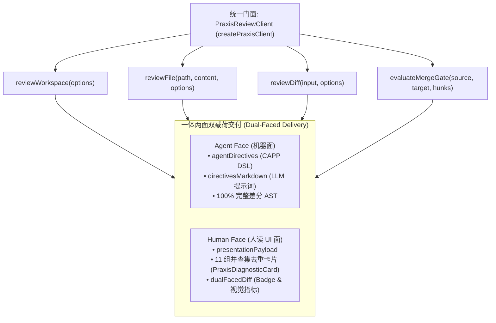

# 02. Praxis 七大核心治理服务与开发者 SDK 门面手册

> **所属层级**：L6 Praxis 团队交付专层 (`docs/06-praxis-delivery/`)  
> **对应代码真源**：[`praxis-review-client.ts`](file:///c:/CODE_game-development/vscode-extensions/auto-refactor/src/core/praxis/praxis-review-client.ts)、[`client/types.ts`](file:///c:/CODE_game-development/vscode-extensions/auto-refactor/src/core/praxis/client/types.ts)、[`diffGovernance.ts`](file:///c:/CODE_game-development/vscode-extensions/auto-refactor/src/core/praxis/diffGovernance.ts)、[`sliceAuditService.ts`](file:///c:/CODE_game-development/vscode-extensions/auto-refactor/src/core/praxis/sliceAuditService.ts)、[`multiAgentGovernance.ts`](file:///c:/CODE_game-development/vscode-extensions/auto-refactor/src/core/praxis/multiAgentGovernance.ts)、[`trajectoryLearningService.ts`](file:///c:/CODE_game-development/vscode-extensions/auto-refactor/src/core/praxis/trajectoryLearningService.ts)、[`feedback-adaptive-supervisor.ts`](file:///c:/CODE_game-development/vscode-extensions/auto-refactor/src/core/praxis/feedback-adaptive-supervisor.ts)、[`rollback.ts`](file:///c:/CODE_game-development/vscode-extensions/auto-refactor/src/core/rollback.ts)

---

## 1. 服务门面矩阵总览

为了满足 Praxis 平台在单文件审查、增量 Diff 治理、毫秒级切片自检、并发冲突仲裁、轨迹学习、反馈调权与原子回滚的完整研发生命周期，`auto-refactor` 在顶层 API ([`src/api.ts`](file:///c:/CODE_game-development/vscode-extensions/auto-refactor/src/api.ts)) 导出了六大细粒度治理服务与**第七大核心开发者统一门面 SDK (`PraxisReviewClient`)**：

| 门面编号 | 服务门面接口 / 类 | 核心源码路径 | 职责定位与核心特性 |
| :---: | :--- | :--- | :--- |
| **S-01** | `IPraxisDiffGovernanceService` | [`diffGovernance.ts`](file:///c:/CODE_game-development/vscode-extensions/auto-refactor/src/core/praxis/diffGovernance.ts) | 语义感知的 Diff 全维审查、逆向依赖闭包计算、八支柱补丁质量评估与合入门禁 |
| **S-02** | `IPraxisSliceAuditService` | [`sliceAuditService.ts`](file:///c:/CODE_game-development/vscode-extensions/auto-refactor/src/core/praxis/sliceAuditService.ts) | **< 10ms** 局部 AST 切片提取、Sparse MoE 稀疏路由（$\ge 70\%$ 绕过率）、CAPP 指令合成 |
| **S-03** | `IPraxisMultiAgentGovernanceService` | [`multiAgentGovernance.ts`](file:///c:/CODE_game-development/vscode-extensions/auto-refactor/src/core/praxis/multiAgentGovernance.ts) | 多 Agent 并发补丁冲突检测、跨 Agent 循环依赖拦截 (`GOV-AGN-001`)、重复劳动仲裁 |
| **S-04** | `IPraxisTrajectoryLearningService` | [`trajectoryLearningService.ts`](file:///c:/CODE_game-development/vscode-extensions/auto-refactor/src/core/praxis/trajectoryLearningService.ts) | 从 Bad$\rightarrow$Good 演进中提取 `RefactoringRecipe`，拦截循环震荡 (`GOV-TRJ-001`) |
| **S-05** | `FeedbackAdaptiveSupervisor` | [`feedback-adaptive-supervisor.ts`](file:///c:/CODE_game-development/vscode-extensions/auto-refactor/src/core/praxis/feedback-adaptive-supervisor.ts) | 生产事故与回滚台账维护、三平面权重 $(W_s, W_d, W_f)$ 凸投影演化与规则可靠性阻尼 |
| **S-06** | `PraxisRollbackEngine` & `scanDiffStream` | [`rollback.ts`](file:///c:/CODE_game-development/vscode-extensions/auto-refactor/src/core/rollback.ts)<br/>[`stream.ts`](file:///c:/CODE_game-development/vscode-extensions/auto-refactor/src/core/stream.ts) | 异步生成器响应式 Diff 流式推送与 TaskCard 级逆序无损原子回滚 |
| **S-07** | **`PraxisReviewClient`<br/>(`createPraxisClient`)** | [`praxis-review-client.ts`](file:///c:/CODE_game-development/vscode-extensions/auto-refactor/src/core/praxis/praxis-review-client.ts) | **【统一开发者总门面】** 整合全仓/单文件/Diff/合入门禁，输出一体两面双载荷 (Agent/UI) |

---

## 2. S-07：统一开发者门面 SDK (`PraxisReviewClient`)

[`PraxisReviewClient`](file:///c:/CODE_game-development/vscode-extensions/auto-refactor/src/core/praxis/praxis-review-client.ts) 是 Praxis 业务团队接入的首选入口，封装了内部底层复杂度，提供高度内聚的面向对象方法与强类型双载荷：



### 2.1 核心服务接口定义 (`IPraxisReviewClient`)

```ts
export interface IPraxisReviewClient {
    readonly defaultCardContext?: PraxisCardContext;
    readonly semanticGraph: SemanticGraph;
    
    // 1. 全工作区静态扫描与治理
    reviewWorkspace(options?: PraxisWorkspaceReviewOptions): Promise<PraxisWorkspaceReviewVerdict>;
    
    // 2. 单文件高频深度审查与 MoE 切片审计
    reviewFile(
        filePath: string,
        content?: string,
        options?: PraxisFileReviewOptions,
    ): Promise<PraxisFileReviewVerdict>;
    
    // 3. 语义感知增量 Diff 审查
    reviewDiff(
        input: DiffInput,
        options?: PraxisGovernanceOptions,
    ): Promise<PraxisDiffGovernanceResult>;
    
    // 4. 分支合入门禁审查与双面 Diff 评估
    evaluateMergeGate(
        sourceBranch: string,
        targetBranch: string,
        hunks: ReviewDiffHunk[],
    ): Promise<PraxisMergeGateVerdict>;
}
```

### 2.2 双载荷输出结构详解
- **`PraxisWorkspaceReviewVerdict` / `PraxisFileReviewVerdict`**：
  - `status`: `'passed' | 'warning' | 'blocked'`；
  - `issues`: 包含全量未失真诊断的原始静态分析违规集合；
  - `agentDirectives`: 符合 CAPP 协议的机器可操作指令包，供 AI 智能体直接消费；
  - `directivesMarkdown`: 渲染完备的 Markdown 提示词片段，可直接拼接注入 LLM 上下文；
  - `presentationPayload`: 包含已完成并查集去重的本地化 UI 诊断卡片数组（[`PraxisPresentationPayload`](file:///c:/CODE_game-development/vscode-extensions/auto-refactor/src/core/praxis/presentation/presentation-types.ts)）；
- **`DualFacedDiffResult`**：
  - `agentFace`: 聚合受影响符号作用域、跨文件逆向闭包列表与平均风险分；
  - `humanFace`: 状态徽标颜色（`red` / `yellow` / `blue` / `green`）、增删行数、违规清单与本地化卡片。

---

## 3. S-01：语义差分治理门面 (`IPraxisDiffGovernanceService`)

- **职责**：将增量文本 Diff 与跨语言 [`SemanticGraph`](file:///c:/CODE_game-development/vscode-extensions/auto-refactor/src/core/semantic/semanticGraph.ts) 拓扑结合，调用五层审查器（Layer 1 安全、算法性能、数据架构、测试现代性、元架构）完成八支柱补丁质量评估 (`PatchQualityResult`)。
- **关键方法**：
  - `reviewDiff(input, options)`: 返回带有精确起止行、符号归属、逆向影响闭包的 `PraxisDiffGovernanceResult`；
  - `enrichHunks(filePath, hunks, graph)`: 为裸 Diff Hunk 注入外围函数/类边界与受影响下游文件列表。

---

## 4. S-02：毫秒级 AST 切片审计门面 (`IPraxisSliceAuditService`)

- **核心 SLA**：**< 10ms** 单切片审计耗时，专为 Agent 增量编码循环（Inner Loop）设计。
- **Sparse MoE 稀疏路由**：通过分析修改行周边语法特征，激活相关分析器并绕过 $\ge 70\%$ 的无关分析器；
- **破坏性变更拦截 (`GOV-SLC-001`)**：当导出函数参数或返回类型发生不兼容修改且调用图显示存在下游调用方时，即刻发射 `GOV-SLC-001` 阻断级告警；
- **CAPP 提示词合成**：`auditAgentSlice` 输出紧凑单行 DSL 格式（`< 150 token`），极度节省模型上下文。

---

## 5. S-03：多智能体并发治理门面 (`IPraxisMultiAgentGovernanceService`)

- **跨 Agent 依赖死锁拦截 (`GOV-AGN-001`)**：当 Agent A 引入 `A -> B` 且 Agent B 并发引入 `B -> A` 时，依赖图分析器瞬时识别拓扑环路并发出 `GOV-AGN-001`；
- **重复劳动识别**：重叠编辑率超过阈值（`duplicateWorkThreshold = 0.5`）时提示冲突；
- **候选补丁优胜仲裁**：并发提交竞态补丁时，依据质量增量净收益自动裁决胜出方案。

---

## 6. S-04：重构轨迹学习门面 (`IPraxisTrajectoryLearningService`)

- **配方沉淀 (`learnFromTrajectory`)**：对比重构前后代码，净收益良好时提炼为结构化重构模板 (`RefactoringRecipe`)；
- **循环震荡检测 (`GOV-TRJ-001`)**：检测文件修改历史序列中的 `A -> B -> A` 乒乓震荡修改与已修复坏味道回潮。

---

## 7. S-05：反馈自适应监督器 (`FeedbackAdaptiveSupervisor`)

- **三平面权重凸演化**：依据线上事故与回滚台账通过梯度下降微调 $(W_s, W_d, W_f)$；
- **规则可靠性阻尼**：频繁引发线上回滚的规则在 $[0.2, 1.2]$ 区间动态削弱置信度乘子；
- **架构模式稳定性加分**：长期保持零事故的模块赋予 $[1.0, 1.25]$ 稳定性加权；
- **持久化恢复**：支持快照导入导出与跨 CI 轮次状态继承。

---

## 8. S-06：响应式 Diff 流与原子回滚引擎 (`PraxisRollbackEngine`)

- **流式推流 (`scanDiffStream`)**：采用 `AsyncGenerator<DiffStreamEvent>`，按 `file_start` $\rightarrow$ `hunk_ready` $\rightarrow$ `file_done` $\rightarrow$ `stream_end` 实时分发；
- **原子回滚引擎**：
  - Level 1：单 Hunk 精确逆转；
  - Level 2：任务卡级（TaskCard）多文件时间戳逆序无损回滚；
  - Level 3：结合父子卡拓扑实现依赖链级联撤回。

---

## 9. 关联文档导航

- [01. Praxis 对接架构全景与六大 SPI 契约手册](./01-praxis-architecture-and-spi-contracts.md)
- [03. Praxis 团队联调操作手册与交付验收矩阵](./03-praxis-integration-runbook-and-acceptance.md)
- [PRAXIS_HANDOFF_REPORT.md](../PRAXIS_HANDOFF_REPORT.md)
