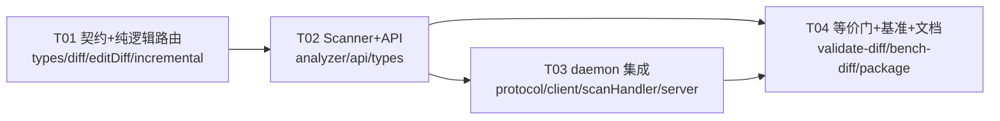

# Diff 系统接口接入规格（Diff Interface Integration Spec）

> 作者：架构师（高见远）｜日期：2026-08-14｜状态：**设计稿（只读调研 + 接口规格，不改 src/）**
> 前置：行级增量基础设施 T01–T05 已落地（`docs/system-design.md`）；warm-scan daemon + L1/L2 + `IncrementalFileState` 就绪。
> 用户已确认：diff 系统采用「**old+new 全文** 与 **new+editRanges** 的混合架构」，两种输入形式都必须支持（有 editRanges 则跳过 Myers）。
> 用户追加拍板（2026-08-14）：**① EditRange 的 byte 字段来自 diff 系统时是 UTF-8 字节偏移**（非 UTF-16 code-unit），需入口转换；**② 返回形态 = 全量 `scanDiff` + delta `scanDiffDelta` 两个 API 都要**。

---

## 0. TL;DR

1. 新增公开 API **`scanDiff(diffs, options)`**（全量 report，字节等价硬门）与 **`scanDiffDelta(diffs, options)`**（仅变更文件的子集，不承诺与全量字节等价），两者都不破坏 `scan()`/`scanWarm()`。输入是可辨识联合 `DiffInput`：`{ kind:'full', oldContent, newContent }` 或 `{ kind:'ranges', newContent, editRanges }`。
2. `kind:'full'` 内部走现有 Myers（`computeEditRanges`）；`kind:'ranges'` 直接用传入的 `editRanges` 跳过 Myers。**`editRanges` 的 byte 字段是 UTF-8 字节偏移，入口统一转成 UTF-16 code-unit（§1.6）。**
3. **字节等价硬门的实现前提**：`scanDiff` 的 report 必须覆盖**全部 discovered 文件**（不只 diff 文件）；变更文件的「规范 newContent」以**磁盘内容**为准（diff 系统给的 newContent 仅作路由 hint），否则 L2 哈希与下次冷扫描对不上 → 字节漂移。
4. **关键安全性质**：`editRanges` 是 **advisory（建议性）**，不承载正确性——复用决策由 `reuseSubtree` 的「起始行/列不变 + sourceText 字节一致」独立判定，与 editRanges 是否精确无关。editRanges 只影响 `changedLineCount` 门控（走行级还是全量）。
5. 回退链：`byteEqual → incremental → full`，任一异常 → full；主开关仍是 `AR_INCREMENTAL=1`（或 `cfg.incremental===true`），关闭时 `scanDiff` 退化为「L1/L2 加速的全量扫描」。

---

# Part A：接口规格

## 1. 公开 API 定义

### 1.1 `EditRange`（字段对齐 `src/core/editDiff.ts`；byte 口径见下）

```typescript
/**
 * 一个连续编辑块（相邻插入/删除行的 run，即一个 "replace" 块）。
 *
 * 行号（startLine/oldEndLine/newEndLine）：1-based，两种输入形式通用，**无需转换**。
 *
 * 字节偏移（startByte/oldEndByte/newEndByte）：外部（diff 系统）口径为 **UTF-8 字节偏移**
 * （对 UTF-8 编码的原始字节流计数）；进入引擎前必须转成 **UTF-16 code-unit**（JS 字符串
 * 下标，与 content.length / String.prototype.slice 对齐）——见 §1.6 入口转换。引擎内部
 * （editDiff.ts / LineMap）统一只使用 UTF-16 code-unit。
 */
export interface EditRange {
  /** 1-based 首受影响行（old/new 相同索引）。 */
  startLine: number;
  /** 1-based old 侧最后受影响行（含）。 */
  oldEndLine: number;
  /** 1-based new 侧最后产出行（含）。 */
  newEndLine: number;
  /** 编辑块起始偏移（old/new 相同）。 */
  startByte: number;
  /** old 被删区间的结束偏移（开区间）。 */
  oldEndByte: number;
  /** new 插入区间的结束偏移（开区间）。 */
  newEndByte: number;
}
```

> 与 `editDiff.ts` 的 `EditRange` **六字段名完全一致**。`computeEditRanges(old,new)` 内部已按 UTF-16 code-unit 生产，天然满足引擎口径；**只有外部 `kind:'ranges'` 输入的 byte 字段需要 UTF-8→UTF-16 转换**。

### 1.2 `DiffInput`（可辨识联合）

```typescript
export type DiffInput =
  | {
      kind: 'full';
      /** 相对 root 的 POSIX 路径（与 collectFiles 产出的 rel 一致，用 '/' 分隔）。 */
      filePath: string;
      oldContent: string;
      newContent: string;           // string 或 Buffer（Buffer 由入口 decode，§1.6）
      /** 可选：sha256Hex 十六进制。省略则内部重算。 */
      oldContentHash?: string;
      newContentHash?: string;
    }
  | {
      kind: 'ranges';
      filePath: string;
      newContent: string;           // string 或 Buffer；byte 字段按 UTF-8 偏移（§1.6）
      editRanges: EditRange[];      // startByte/oldEndByte/newEndByte 为 UTF-8 字节偏移
      /**
       * 可省略：daemon 有旧状态时从 `IncrementalFileState.content` 取。
       * 小文件（< minLines）无驻留旧 content；无状态且未给 oldContent → 回退全量重扫。
       */
      oldContent?: string;
      oldContentHash?: string;
      newContentHash?: string;
    };
```

> 为兼容「newContent 是 UTF-8 Buffer」的 diff 系统，入口统一把 `newContent` 归一为 UTF-16 string（`Buffer` 用 `buf.toString('utf8')`，与 `fs.readFileSync(path,'utf8')` 同语义）；`kind:'ranges'` 的 byte 字段若来自 UTF-8 偏移，需连同原始 UTF-8 字节一起转换（§1.6）。

### 1.3 `DiffStats`（sibling，**不进** `ScanReport`）

```typescript
export interface DiffStats extends WarmStats {
  /** 本次 diff 输入中实际参与的文件数（去重 + 过滤非法/未发现后）。 */
  diffFiles: number;
  /** 被丢弃的 diff 条目（路径非法 / 未 discover / 非源码扩展）。 */
  diffIgnored: number;
  /** old===new 或 editRanges 为空的变更文件（短路复用，0 parse）。 */
  byteEqual: number;
  /** 走行级增量的变更文件数。 */
  diffIncremental: number;
  /** 回退全量重扫的变更文件数。 */
  diffFull: number;
  /** kind:'ranges' 输入数（跳过 Myers）。 */
  rangesProvided: number;
  /** ranges 输入回退全量的数量（无旧状态/无 oldContent/超阈值/非法 ranges）。 */
  rangesFallback: number;
  /** ranges 且省略 oldContent、改从 daemon 状态取得的次数。 */
  oldContentFromDaemon: number;
}
```

### 1.4 `scanDiff` 签名（`src/api.ts` 新增）

```typescript
export interface ScanDiffOptions extends ScanOptions {
  /**
   * 变更文件是否与磁盘内容做 sha256 一致性校验（默认 true）。
   * true：读磁盘内容作为「规范 newContent」，diff 系统给的 newContent 仅作路由 hint，
   *       不一致则全量重扫（保证字节等价，代价每个变更文件一次读）。
   * false：信任 diff 系统的 newContent（省一次读，但字节等价由调用方自行保证，实验性）。
   */
  verifyDiskContent?: boolean;
}

export async function scanDiff(
  diffs: DiffInput[],
  options: ScanDiffOptions = {},
): Promise<{ report: ScanReport; stats: DiffStats }>;
```

- **向后兼容**：`scan()`/`scanWarm()`/`scanAndRender()` 签名与语义**不变**；`scanDiff`/`scanDiffDelta` 是全新方法。
- **包面导出**：`api.ts` 已 `export * from './core/types'`，故 `DiffInput`/`EditRange`/`DiffStats`/`DiffDeltaReport` 自动进入 `main`/`types` 导出面；`scanDiff`/`scanDiffDelta` 显式 `export`。
- 懒加载：diff 走 daemon 的客户端按 `lazyTryWarmScan` 同款模式**懒 require**，保证 `scan()` 冷启动不引入 daemon 模块图。

### 1.5 `scanDiffDelta` 签名（仅变更文件子集，独立 API）

```typescript
export interface DiffDeltaReport {
  tool: string;
  version: string;
  generatedAt: string;
  root: string;
  config: ScanConfig;
  /** 仅统计变更（diff）文件，不覆盖全部 discovered 文件。 */
  summary: {
    filesScanned: number;
    issuesTotal: number;
    bySeverity: Record<Severity, number>;
    byAnalyzer: Record<string, number>;
    durationMs: number;
  };
  /** 仅含变更文件的 issues（位置与排序见下方语义）。 */
  issues: Issue[];
  /** 仅含变更文件的 metrics。 */
  fileMetrics: FileMetric[];
}

export async function scanDiffDelta(
  diffs: DiffInput[],
  options: ScanDiffOptions = {},
): Promise<{ report: DiffDeltaReport; stats: DiffStats }>;
```

**语义（与 `scanDiff` 的共用 / 差异）**：

| 维度 | `scanDiff`（全量） | `scanDiffDelta`（子集） |
|---|---|---|
| report 范围 | 全部 discovered 文件 | 仅 diff 文件 |
| 字节等价 | ✅ 与冷扫描逐字节一致（硬门） | ❌ 不承诺（是子集，天然不等于全量） |
| 未变文件处理 | 走 L1/L2 | **完全不触碰**（跳过未变文件发现/缓存命中） |
| 变更文件处理 | diff 路由（byteEqual/incremental/full） | 同一路由，代码共用 |
| 输出排序 | 与冷扫描一致 | 与全量中「该子集」的相对顺序一致 |
| stats | `DiffStats` | 同一 `DiffStats` |

**子集一致性契约（关键）**：`scanDiffDelta` 产出的每一 `(file, issue)` 必须能逐字节等于 `scanDiff` 全量 report 中对应文件的那条 issue（位置、文本、detail、suggestion 全同）；`issues` 在 delta 内的相对顺序 = 全量 report 过滤到同一文件集后保留的顺序。即 `scanDiffDelta.report` ≡ `filter(scanDiff.report, 变更文件集)`。

- 用途：编辑器/CI 只想拿到「本次改动引入/移除的新结果」时，避免为全量字节等价付出未变文件扫描成本。
- **明确不承诺**：`scanDiffDelta` 的 `summary.filesScanned = diffFiles`（不是全量文件数）；`bySeverity/byAnalyzer` 只是子集聚合，不得与全量比对。

### 1.6 入口转换：UTF-8 字节偏移 → UTF-16 code-unit

> 落地位置：建议放 `src/core/editDiff.ts`（已有 ts-free 纯函数），或独立 `src/core/utf8.ts`；两者都保持 ts-free、可单测。

**两步转换**：

```typescript
// ① newContent 归一：Buffer → UTF-16 string（与 fs.readFileSync(path,'utf8') 同语义）
function decodeContent(input: string | Buffer): string;   // Buffer 走 buf.toString('utf8')

// ② 偏移映射：UTF-8 字节偏移 → UTF-16 code-unit 偏移
// 返回 map[byteIdx] = 该字节处（码点边界）对应的 UTF-16 code-unit 下标；
// 续字节（continuation byte）记为 -1；map[buf.length] = 总 UTF-16 长度。
function utf8ToUtf16Offsets(buf: Uint8Array): number[];

// ③ 查询：把单个 UTF-8 字节偏移转成 UTF-16 code-unit 下标（二分查最近边界）
function utf8ToUtf16Offset(map: number[], byteOffset: number): number;

// ④ 归一化：对整个 EditRange 做转换（line 字段原样透传，仅转三个 byte 字段）
function normalizeEditRanges(editRanges: EditRange[], buf: Uint8Array): EditRange[];
```

**转换正确性要点**：

1. **ASCII（< 0x80）**：1 字节 ↔ 1 code-unit，偏移不变（快速路径）。
2. **非 ASCII 多字节（U+0080–U+FFFF）**：UTF-8 2–3 字节 ↔ 1 code-unit；`map` 在每个码点边界累加 code-unit 数，续字节标 `-1`。
3. **代理对（surrogate pair，U+10000+）**：UTF-8 4 字节 ↔ **2** code-unit（surrogate pair）。`map` 累加 `cp > 0xffff ? 2 : 1`。
4. **BOM（U+FEFF，EF BB BF）**：3 字节 ↔ 1 code-unit（U+FEFF）。注意 `fs.readFileSync(path,'utf8')` **保留 BOM**（不剥离），所以 diff 系统的 `newContent` 若含 BOM 也必须保留，否则 `sha256` 与磁盘不一致 → 按 §3.3-2 走 full 重扫。
5. **非法/截断序列**：按 Node 解码器的 lossy 语义（坏字节 → U+FFFD，1 code-unit），保证与 `buf.toString('utf8')` 一致；偏移落在续字节上时**吸附到前一码点边界**（`≤ byteOffset` 的最近边界），并记入 stats 供诊断。

**权威来源（关键）**：转换用到的 UTF-8 字节流必须是**磁盘原始 Buffer**（`fs.readFileSync(abs)`），而非 diff 系统可能二次编码的字符串。因此入口转换与 `verifyDiskContent=true` 天然同源——`normalizeEditRanges` 的 `buf` 就取自「§3.3 规范 newContent 的同一磁盘 Buffer」。当 diff 系统提供 UTF-8 Buffer 时也可直接用，但默认仍以磁盘 Buffer 为准做 sha256 比对。

**不转换什么**：`startLine/oldEndLine/newEndLine`（1-based 行号）不参与字节换算，原样透传；`kind:'full'` 无 byte 字段（内部 Myers 直接按 UTF-16 生产），无需转换。

### 1.7 Scanner 核心方法（`src/core/analyzer.ts` 新增，additive）

```typescript
export interface ScanWithDiffOptions extends ScanWithCacheOptions {
  /** rel -> DiffInput（去重后）。仅含「被 discover 且校验通过」的变更文件。 */
  diffHints: Map<string, DiffInput>;
  verifyDiskContent: boolean;
  /**
   * true = scanDiffDelta 语义：只处理 diffHints 中的变更文件、跳过未变文件的发现/L1/L2，
   *        返回 DiffDeltaReport（子集）。false（默认）= scanDiff 全量语义。
   */
  deltaOnly?: boolean;
}

class Scanner {
  async scanWithDiff(opts: ScanWithDiffOptions & { deltaOnly: false }): Promise<{ report: ScanReport; stats: DiffStats }>;
  async scanWithDiff(opts: ScanWithDiffOptions & { deltaOnly: true }): Promise<{ report: DiffDeltaReport; stats: DiffStats }>;
}
```

> 实现方式二选一（推荐 A）：**A. 新增独立核心方法**（复制 `scanWithCache` 骨架，在 Step 2 的 L1/L2 判定前插入 diff-hint 前置路由；`deltaOnly=true` 时直接跳过 Step 1 的文件发现与未变文件分支）——改动最小、与工程师正在改的 `analyzer.ts` memo 工作冲突最小；**B. 抽取共享私有方法**（把 Step1–5 抽成 `runPipeline(routeHints, deltaOnly)`）——更 DRY 但重构面大，需在工程师 memo 改动合入后再做。`scanDiff` 与 `scanDiffDelta` 共享同一核心，仅 `deltaOnly` 与返回类型不同。

---

## 2. 选路 / 回退语义

### 2.1 统一路由 `routeDiff`（新，`src/core/diff.ts`，ts-free）

```
resolveDiff(input, state?) -> ResolvedDiff {
  mode: 'byteEqual' | 'incremental' | 'full',
  edits: EditRange[],
  oldContent?: string,
  newContent: string,      // 规范 newContent（磁盘校验后）
}
```

**edits 来源（核心差异）**：

| kind | edits 计算 | Myers |
|---|---|---|
| `full` | `computeEditRanges(oldContent, newContent)`（现有，`editDiff.ts`） | ✅ 内部算 |
| `ranges` | `normalizeEditRanges(input.editRanges, buf)`（UTF-8→UTF-16 转换 + 排序 + 去空 + 校验，§1.6） | ❌ 跳过 |

**oldContent 来源（kind:'ranges'）**：
1. 输入给了 `oldContent` → 用输入。
2. 省略 → `state?.content`（daemon 驻留旧 content）。命中则 `oldContentFromDaemon++`。
3. 无 state 且无输入 → 无法判定（`oldContent` 未知），**直接 full**（无需 Myers，因为 ranges 也没给能算 Myers 的 old 全文；若 state 存在则可用 state.content 兜底算 Myers，见 §5 前提问题 3）。

**门控（两种 kind 相同，顺序短路）**：
1. `!incrementalEnabled() && cfg.incremental !== true` → `full`
2. `edits.length === 0`（full 时等价 `old===new`）→ `byteEqual`
3. `countLines(newContent) < minLines` → `full`
4. `changedLineCount(edits) > maxChangedLines` → `full`
5. 无旧 `IncrementalFileState`（且 ranges 无法提供 oldContent）→ `full`
6. `normalizeEditRanges` 抛错（非数字 / 越界 / 首行 < 1 / end < start）→ `full`

### 2.2 与 `AR_INCREMENTAL` 的关系

- `AR_INCREMENTAL=1`（env，`incrementalEnabled()`）或 `cfg.incremental===true` 是**主开关**。
- `scanDiff` 尊重同一开关：**关 → 变更文件一律 full**（`kind:'ranges'` 也无意义跳过 Myers，因为门控已短路）。
- 字节等价 oracle **不变**：`AR_INCREMENTAL=0 + cache disabled` 的冷扫描。
- `scanDiff` 的价值在开关开启时才充分体现；开关关闭时它仍比冷扫描快（未变文件走 L1/L2），但变更文件与冷扫描同路径。

### 2.3 回退链

```
变更文件：
  resolveDiff
    → byteEqual      : 复用旧结果（0 parse），不写增量状态
    → incremental    : 全量重解析(newContent) + 子树复用（seed=旧 IncrementalFileState）
    → full           : 全量重扫（runAnalyzers 无 seed），重建/替换增量状态
  行级异常（diff/projection/复用 key 冲突）
    → catch → full 重扫（镜像现有 投影→物化、worker→in-process 兜底语义）
```

**复用安全性（关键）**：`routeDiff` 产出的 `edits` **当前不进入复用路径**——复用由 `reuseSubtree(span)` 的「`startLine:startColumn` 不变 **且** `sourceText` 字节一致」独立判定。因此：
- editRanges 不精确/不完整 → 只会「少复用或多复用」，**不影响输出字节**（少复用=perf 损失，多复用仅在 sourceText 严格相等时发生，天然安全）。
- 位置漂移风险被 `startLine` 一致性挡住：删了上方行 → startLine 变 → key 不命中 → 重建。

---

## 3. 集成契约

### 3.1 典型调用序列（含 daemon 生命周期）

见 `docs/diff-sequence-diagram.mermaid`。文字版：

1. **启动**：client `daemon start`（或 CLI `--daemon`）→ daemon listen + 写 registry；spawn 0 worker。
2. **基线**：client `scanWarm` → daemon `handleScan` → 冷扫描填充 L1(mtime+size)/L2(contentHash→结果) + 大文件 `IncrementalFileState`（驻留旧 content + 子树缓存）。
3. **变更**：diff 系统（编辑器 save / `git diff` / watch）产出 `DiffInput[]`。
4. **请求**：client `scanDiff(diffs)` → 懒连接 daemon → `scan_diff { config, diffs, options }`。
5. **服务端**：`handleScanDiff` 归一化 filePath + 过滤未 discover 文件 → `Scanner.scanWithDiff`：
   - 变更文件：磁盘内容校验 → `resolveDiff` → byteEqual/incremental/full。
   - 未变文件：L1/L2（复用现有 `scanWithCache` 逻辑，0 读/哈希命中）。
   - 聚合 + `issues.sort` + `buildReport`（与冷扫描逐字节一致）。
6. **返回**：`scan_done { report, stats: DiffStats }`；client 回传调用方。
7. **迭代**：下次变更重复 3–6；daemon 空闲 10min 优雅退出（增量状态内存态，退出即弃）。

### 3.2 返回结构与 stats

- `report`：与冷扫描**逐字节一致**（含 `root/config/summary/issues/fileMetrics`，覆盖全部 discovered 文件）。
- `stats`：sibling 字段（**永不进入 report**，保证输出字节不变）；新增 `diffFiles/diffIgnored/byteEqual/diffIncremental/diffFull/rangesProvided/rangesFallback/oldContentFromDaemon`，并继承 `WarmStats` 的 `l1Hit/l2Hit/incrementalHit/...`。

### 3.3 字节等价不变量（实现必须逐条满足）

1. `scanDiff` 的 report 覆盖**全部** discovered 文件（`collectFiles` 的 rel 集合），diff 只加速其子集。
2. 变更文件规范 `newContent` = 磁盘内容 `fs.readFileSync(abs, 'utf8')`；`sha256Hex(磁盘) !== sha256Hex(input.newContent)` → 丢弃 hint、按磁盘内容 full 重扫 + warn（`verifyDiskContent=false` 时此条不生效，属调用方自担）。
3. L2 写入的 `contentHash` = `sha256Hex(磁盘 newContent)`，保证下次冷扫描命中同键。
4. `filePath` 必须归一化为 `path.relative(root, abs)` + `/` 分隔；`collectFiles` 未发现的条目（gitignore/exclude/include/非源码扩展）**丢弃**并计入 `diffIgnored`，绝不向 report 注入冷扫描不存在的文件。
5. `issues.sort` / `buildReport` / 聚合复用冷扫描同一条路径，不做任何 diff 特化分支。

### 3.4 协议扩展（`src/daemon/protocol.ts`）

```typescript
export interface ScanDiffMessage {
  v: number; id: number; type: 'scan_diff';
  params: {
    requestId: string;
    config: Record<string, any>;
    diffs: Array<Record<string, any>>;   // DiffInput[]（JSON 序列化）
    options: { cache: boolean; cacheDir?: string; cacheCustom?: boolean;
               workers?: number; parser?: string; verifyDiskContent?: boolean;
               delta?: boolean };   // true = scanDiffDelta（仅变更文件子集）
  };
}
```

- `hello_ack.caps` 增加 `diff: true`，客户端据此探测能力：旧 daemon 无 `diff` cap → `scanDiff` 降级为进程内 `scan()`（cold）并置 `stats.daemonUsed=false`。
- `PROTOCOL_VERSION` 保持 `1`（纯增能力，向后兼容；严格语义若团队要求可升 `2`，此处建议不升以减少老 client/daemon 互斥）。

---

# Part B：任务分解

## 4. 文件清单（相对路径）

```
# 新增
src/core/diff.ts              # DiffInput 归一化/校验 + routeDiff/resolveDiff（ts-free）
src/core/utf8.ts              # utf8ToUtf16Offsets / utf8ToUtf16Offset（ts-free，入口转换）
scripts/validate-diff.js      # 字节等价门（oracle=冷扫描）+ delta⊆full 一致性校验
scripts/bench-diff.js         # ranges vs full vs 冷扫描 A/B 基准
docs/diff-interface-spec.md   # 本文档
docs/diff-class-diagram.mermaid
docs/diff-sequence-diagram.mermaid

# 修改（均 additive）
src/core/types.ts             # EditRange 再导出 + DiffInput + DiffStats + DiffDeltaReport
src/core/editDiff.ts          # 补 normalizeEditRanges / validateEditRanges（含 UTF-8 转换入口）
src/core/incremental.ts       # 补 routeDiff 薄封装/再导出（单入口）
src/core/analyzer.ts          # Scanner.scanWithDiff(deltaOnly) + Step2 diff-hint 前置路由
src/api.ts                    # scanDiff + scanDiffDelta + ScanDiffOptions + 懒加载 diff 客户端
src/daemon/protocol.ts        # scan_diff 消息 + caps.diff + options.delta
src/daemon/client.ts          # DaemonClient.scanDiff(Delta) + tryWarmScanDiff
src/daemon/scanHandler.ts     # handleScanDiff(delta)
src/daemon/server.ts          # handleMessage 分发 scan_diff
package.json                  # validate-diff / bench-diff scripts
```

> 不变文件：`src/core/{lineMap,incrementalState,multilang,traverse,worker,adapters,cacheKey}.ts`、`src/analyzers/*`、`src/utils/*`。**`traverse.ts` 保持 ts-free，分析器 file-local**——diff 逻辑只落在 ts-free 的 `diff.ts` + `analyzer.ts` 主进程侧，不进 worker。

## 5. 任务列表（按依赖排序，4 个）

| Task | 名称 | 源文件 | 依赖 | 优先级 |
|---|---|---|---|---|
| **T01** | diff 输入契约 + 纯逻辑路由 + UTF-8 转换（ts-free） | `src/core/types.ts`、`src/core/diff.ts`(新)、`src/core/utf8.ts`(新)、`src/core/editDiff.ts`、`src/core/incremental.ts` | —（复用已落地 T01–T05 基础） | P0 |
| **T02** | Scanner 集成 + 公开 API `scanDiff`/`scanDiffDelta` | `src/core/analyzer.ts`、`src/api.ts`、`src/core/types.ts` | T01 | P0 |
| **T03** | daemon 协议 + 客户端 + 服务端 | `src/daemon/protocol.ts`、`src/daemon/client.ts`、`src/daemon/scanHandler.ts`、`src/daemon/server.ts` | T02 | P1 |
| **T04** | 字节等价门 + delta⊆full + 基准 + 文档固化 | `scripts/validate-diff.js`、`scripts/bench-diff.js`、`package.json`、`docs/*` | T02、T03 | P0 |

> 说明：本特性为纯增量跟进，**零新运行时依赖**（无新增 `package.json` 依赖 / 无 tsconfig 变更），故「项目基础设施」对应为 T01 的「类型 + 纯函数契约」——它是本特性的地基（可独立编译、可独立单测）。

### 每步验收

- **T01**：`tsc -p tsconfig.json` 通过；`diff.ts`/`editDiff.ts`/`utf8.ts` 无 `import typescript`（`grep -n "typescript" src/core/{diff,utf8}.ts` 为空）；`normalizeEditRanges` 单测（排序、去空、拒非法：非数字/越界/start<1/end<start）；`utf8ToUtf16Offset` 单测（ASCII/多字节/代理对/BOM/坏字节吸附）；`resolveDiff` 对 full/ranges/byteEqual/超阈值/无状态 五分支全绿。
- **T02**：进程内（无 daemon）`scanDiff` 下：变更文件按 diff 路由（byteEqual/incremental/full 计数正确）、未变文件走 L2；与 `AR_INCREMENTAL=0 + cache disabled` 冷扫描逐字节一致（人工抽查 + 留待 T04 全量门）；`scanDiffDelta` 返回变更文件子集且 `delta ⊆ full`（每条 issue 逐字节同）；`scan()`/`scanWarm()` 行为不变（`npm run validate` 9/9、`validate-warm` W1–W9 全绿）。
- **T03**：daemon 二次 `scanDiff`/`scanDiffDelta` 生效，`stats.daemonUsed=true`、`diff*` 计数经 NDJSON 往返无损；`options.delta` 正确路由到子集模式；`caps.diff` 协商正确（旧 daemon → client 降级冷扫描不报错）。
- **T04**：`validate-diff` 全场景绿（full/ranges/多文件/未变文件/越界 ranges/磁盘内容不一致/老 daemon 降级）+ **delta⊆full 一致性校验**（delta 的 issues/metrics 是 full 对变更文件集的精确过滤）；`bench-diff` 给出 ranges 跳过 Myers 的实测收益、delta vs 全量的耗时差、full 兜底正确性；文档与实现一致。

## 6. 任务依赖图



---

## 7. 前提问题（发现，需产品/主理人确认）

1. **`computeEditRanges` 已覆盖 `kind:'full'`**：现有 `editDiff.ts` 的 `computeEditRanges(old,new)` 已是标准 Myers，`route()` 内部即调用它。`kind:'full'` 无需新 diff 逻辑，只需让 `resolveDiff` 复用；`kind:'ranges'` 才是新增（`normalizeEditRanges` + 跳过 Myers）。
2. **「Byte」口径已拍板 = UTF-8 字节偏移（外部）**：`EditRange` 字段名带 `Byte`；**外部（diff 系统）口径为 UTF-8 字节偏移，引擎内部统一为 UTF-16 code-unit**。入口必须转换归一（§1.6 `utf8ToUtf16Offset`），否则 `changedLineCount` 门控会误判。**已解决**：用户确认 UTF-8 字节偏移，转换函数落到 `editDiff.ts`/`utf8.ts`。
3. **`edits` 当前不驱动复用**：`scanWithCache` 里 `route()` 返回的 `edits` 被丢弃，复用靠 `reuseSubtree`（行/列 + sourceText 字节一致）。即 `LineMap`/`isUnchangedRange` 尚未接入 Mode-2。本接口**按现状设计**（editRanges 仅门控），若未来要 Mode-2 行号平移，editRanges 将升级为正确性输入，需重开等价门。
4. **daemon 旧 content 仅大文件驻留**：`IncrementalFileState` 只对「≥ minLines 且走行级候选」的文件创建；小文件只有 L2 的 contentHash、无 content。故 `kind:'ranges'` 省略 oldContent 仅对大文件生效；小文件必回退 full（正确且廉价，无 perf 损失）。且 `prepare()` 会把 `.content` 覆盖为新值 → **必须在 `routeDiff`/`prepare` 之前读取 `state.content`**。
5. **daemon 旧 content 与 diff 系统基线可能漂移**：若 `kind:'full'` 给的 `oldContent !== incBucket.get(rel).content`（diff 系统与 daemon 各自跟踪的基线不一致），旧子树缓存对应的不是同一基线。缓解：`resolveDiff` 校验 `oldContent === state.content`，不一致 → 弃旧状态、full 重扫重建。`kind:'ranges'` 省略 oldContent 时无法校验，但 editRanges 是 advisory，安全。
6. **磁盘内容才是规范 newContent**：diff 系统的 newContent 若与磁盘编码不一致（BOM/CRLF/UTF-8 差异），直接用它会破坏 L2 键与字节等价。规格默认 `verifyDiskContent=true`（读磁盘 + sha256 比对）。若产品认为「diff 系统保证与磁盘一致、要求零读」，可默认 false，但必须书面接受等价风险。
7. **全量 vs delta 已拍板 = 两个都要**：`scanDiff` 返回全量 report（字节等价硬门），`scanDiffDelta` 返回变更文件子集（§1.5，不承诺等价，是全量子集）。**已解决**：两 API 分立，不混用。

---

## 8. 风险与回滚

| 风险 | 等级 | 缓解 |
|---|---|---|
| diff 系统 newContent 与磁盘不一致 → 字节漂移 | 高 | `verifyDiskContent=true` 默认；不一致 warn + 按磁盘 full 重扫 |
| filePath 未归一化 → report 多出/少出文件 | 高 | 入口统一 `path.relative` + `/`；未 discover 丢弃（diffIgnored） |
| UTF-16 vs UTF-8 偏移口径错配 | 高（已确认口径） | 入口集中 `utf8ToUtf16Offset` 转换归一；单测覆盖 BOM/代理对/emoji/CJK/坏字节吸附 |
| `editRanges` 语义升级（Mode-2 后变正确性输入） | 中 | 本期明确 advisory；未来升级需重开等价门 + 版本化 |
| 与工程师并行改 `analyzer.ts`（memo + 状态驱逐）冲突 | 中 | T02 仅**新增方法** `scanWithDiff`，不改现有 `scanWithCache` 主路径；**T02 排在工程师 memo 改动合入之后** |
| daemon 旧 content 基线漂移 → 复用错子树 | 中 | full 输入校验 `oldContent===state.content`；不一致弃状态重建 |
| 小文件 ranges 省略 oldContent 无法行级 | 低 | 明确回退 full（正确且廉价）；文档写明「仅大文件受益」 |
| `scanDiffDelta` 子集与全量排序/位置不一致 | 中 | delta ≡ `filter(全量, 变更文件集)` 的一致性契约 + validate-diff 专项校验 delta⊆full |

**回滚开关**：`AR_INCREMENTAL=0`（默认，`scanDiff` 退化为 L1/L2 全量扫描）；`verifyDiskContent=false`（实验性，等价自担）；`scanDiff` 是纯新增 API，回滚 = 删除方法 + 不回退旧语义，零数据迁移。

---

## 附：共享知识（工程师实施注意）

- **字节等价是硬门**：`scanDiff` 结果 == `AR_INCREMENTAL=0 + cache disabled` 冷扫描，逐字节。
- **`diff.ts` / `utf8.ts` / `editDiff.ts` / `incremental.ts` 必须 ts-free**（不 `import typescript`），否则摧毁 oxc worker 懒加载。
- **editRanges 是 advisory**：只喂 `changedLineCount` 门控；复用决策永远由 `reuseSubtree` 的 sourceText 字节一致 + start line/col 一致独立判定。（工程师已实测 oxc `export function` 的 reuseSubtree key 会因 export 关键字偏移错位，改用「节点身份 Set 匹配」回退重算——印证 advisory 判断。）
- **入口只认 UTF-8 字节 → UTF-16 code-unit**：line 字段 1-based 不转；byte 字段必经 `utf8ToUtf16Offset`（用磁盘原始 Buffer 建映射）。
- **规范 newContent = 磁盘内容**：L2 键、分析输入、增量状态三者必须同源（`decodeContent` 用 `buf.toString('utf8')`，BOM 保留）。
- **delta ⊆ full**：`scanDiffDelta` 每条例必为 `scanDiff` 全量中对应文件的逐字节子集，相对顺序一致。
- **分析器 file-local**：复用单元 = 函数子树（Mode B 已物化），位置只来自 fresh raw 或「未漂移」复用子树。
- **stats 是 sibling**：`DiffStats` 不进 report；`scan_done.stats` 字段可扩展，report 字节永不因 stats 变化。
