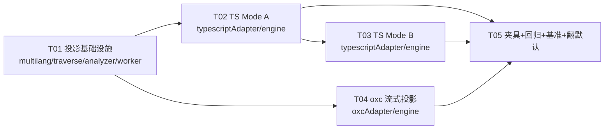

# P1-1 懒投影（Lazy Projection）设计方案

> 作者：架构师（高见远）｜日期：2026-08-13｜状态：**已实施（T01-T05 全部落地，QA Round 2 无条件验收，默认已翻）**
> 实施记录：T01 投影基础设施 / T02 TS Mode A / T03 TS Mode B / T04 oxc 流式投影（**暂缓**，接口已预留，见 §2.7）/ T05 夹具库 + bench-fastpath + 翻默认 + hybrid K 重扫。`AR_FASTPATH` 默认已翻为开（`!=='0'`，`=0` 保留为安全阀/A-B 基线）。`testdata/fixtures/` 十二类夹具 + `scripts/bench-fastpath.js`（`--check` 等价门 + 双语料 A/B）已入库。
> 范围：让 TS 路径（以及评估 oxc 路径）跳过「全量物化 NormalizedNode 树」，改为遍历时按需投影。
> 约束：`validate` 9 场景字节级是硬门（TS 6 + Rust 2 + oxc 3，其中 oxc 3 与 TS 基线共享）；不改 `scripts/validate-equivalence.js` / `scripts/bench-baselines.js`（验收门脚本本身）；本设计不修改 `src/`。
> 数据基线（team-lead 实测，1001 文件轻量语料 w4）：ts 单次 ~690ms、oxc ~150ms（懒加载后）；worker per-file parse+mat：ts 1.10-1.38ms（parse ~30-40% + mapNode ~60-70%）、oxc 0.90ms（反射 normalize 占大头）；runStreaming 仅 0.08-0.11ms。重型语料（1001×5.5KB）parse 占比更高。
> 落地实测（T05，本机 w4，5 次严格交替取中位）：轻量 1001×~2.5KB 1143ms→1026ms（**-10.2%**）、重型 1001×~6.8KB 1916ms→1686ms（**-12.0%**）；per-file ModeB light -34%、ModeA light -42%、ModeB heavy -21%、ModeA heavy -60%。轻量 wall 未达设计 §4.2 的 -17%~-26%，根因是 worker 启动/批处理协议/hybrid 阶段为模式无关开销（见 §4.2 下方说明）。

---

## 0. TL;DR

- **消费矩阵结论**：`isNumeric` / `isString` / `hasFunctionInitializer` 三个字段**零消费者**（适配器写、无人读）；`grandparent` 参数零消费者（四个 visit 全部 `_` 前缀）；constants 的 `LiteralRecord.parent` 是死存储（存而不读）。`rawKind`/`isConstructor`/`branchWeight`/`isConstBound`/`tolerated`/`topLevel`/`exported`/`name`/`start`/`end` 均为**稀消费者**字段（1-2 个消费者）。
- **关键发现**：complexity 的 `cyclomaticComplexity` 在 visit 内对**每个函数子树做二次重走**，读取子树内**每一个**节点的 `branchWeight` + 每个子节点的 `functionLike` + `children`。因此默认三分析器下，"函数子树内节点"不能是纯占位——但只需 4-6 字段的 cheap 投影（省 ~60-70% 字段工作）。
- **API 形态推荐**：给 `LanguageAdapter` 增加**可选** `project()` 能力（返回 `NodeProjector`），引擎保留遍历 + scope 线程化（单点维护字节等价核心），新增 `runStreamingProjected` 引擎入口。**不选** traverse.ts 内直接操作 ts.Node（会破坏 ts-free 边界，摧毁 oxc worker 懒加载收益）。
- **占位节点验证通过**：共享单例 `OTHER_PLACEHOLDER = Object.freeze({kind:'Other'})` 对全部四个 visit + 引擎 scope 推导安全（引擎把缺失 flag 当 falsy；parent.kind===SourceFile 判定只与真实 root 投影相关）。
- **收益估计**：TS 默认配置（Mode B）per-file parse+mat 1.24ms → ~0.85-1.00ms（**-20%~-32%**）；w4 1001 轻量语料 ts ~690ms → **~500-570ms（-17%~-26%）**。无 complexity 时（Mode A）更强：**~430-500ms（-28%~-38%）**。oxc **可行但收益中等**（per-file -17%~-28%，w4 ~150→~125-135ms），工程量大，排在 TS 之后。
- **实施 ≤5 步**，AR_FASTPATH 门默认关，validate 9/9 + 双语料 A/B 后翻默认；任何投影异常 → 回退旧路径（镜像 worker 池 in-process 兜底）。**T05 已翻默认**（`AR_FASTPATH !== '0'`，`=0` 为安全阀）；hybrid K 重扫结论见 §5.2 下方说明。

---

## Part A：系统设计

## 1. 消费矩阵（字段 × 消费者）

消费者简称：**E**=引擎 scope 推导（traverse.ts visitNode）、**M**=FileMetricCollector、**C**=constants、**L**=large-file、**X**=complexity。

| NormalizedNode 字段 | E | M | C | L | X | 结论 |
|---|---|---|---|---|---|---|
| `kind` | ✗ | ✗（仅 parent.kind） | ✓（字面量过滤） | ✗（仅 parent.kind） | ✓（nameFor：Function/Method） | 稀消费 |
| `rawKind` | ✗ | ✗ | ✗ | ✗ | ✓（`first.rawKind==='FunctionKeyword'`） | 稀消费（仅 X） |
| `text` | ✗ | ✗ | ✓（字面量值） | ✗ | ✗ | 仅 C·字面量 |
| `start`/`end` | ✗ | ✗ | ✓（locN/start.line） | ✗ | ✓（node.start.line/locN） | 稀消费（字面量+函数+FunctionKeyword） |
| `name` | ✓（isClassDefining→className） | ✗ | ✗ | ✓（顶层 fn） | ✓（nameFor） | 稀消费（3 类节点） |
| `isNumeric` / `isString` | ✗ | ✗ | ✗（用 kind 判定） | ✗ | ✗ | **零消费者** |
| `hasFunctionInitializer` | ✗ | ✗ | ✗ | ✗ | ✗ | **零消费者** |
| `branchWeight` | ✗ | ✗ | ✗ | ✗ | ✓（重走**函数子树全部节点**） | 仅 X，但覆盖面大 |
| `children` | ✗（经 adapter.children） | ✗ | ✗ | ✗ | ✓（重走 + `children[0]`） | 仅 X 重走；E 在投影路径改为 raw 驱动 |
| `functionLike` | ✓ | ✓ | ✗ | ✓ | ✓ | 多消费者（引擎必需） |
| `isClassDefining` | ✓ | ✗ | ✗ | ✗ | ✗ | 仅 E |
| `introducesBinding` | ✓ | ✗ | ✗ | ✗ | ✗ | 仅 E |
| `bindingName` | ✓ | ✗ | ✗ | ✗ | ✗ | 仅 E |
| `increasesNesting` | ✓ | ✗ | ✗ | ✗ | ✗ | 仅 E |
| `isConstructor` | ✗ | ✗ | ✗ | ✗ | ✓ | 仅 X |
| `topLevel` | ✗ | ✓ | ✗ | ✓ | ✗ | M+L |
| `exported` | ✗ | ✓ | ✗ | ✓ | ✗ | M+L |
| `isConstBound` | ✗ | ✗ | ✓ | ✗ | ✗ | 仅 C·字面量 |
| `tolerated` | ✗ | ✗ | ✓ | ✗ | ✗ | 仅 C·字面量 |

visit 签名参数：

| visit 参数 | M | C | L | X | 结论 |
|---|---|---|---|---|---|
| `parent` | ✓（kind===SourceFile） | 存而不读（死存储） | ✓（kind===SourceFile） | ✗ | L/M 只需 kind 判定 |
| `grandparent` | ✗ | ✗ | ✗ | ✗ | **零消费者**（可不下发真实对象） |
| `depth` | ✓ | ✗ | ✓ | ✗ | 线程化参数，独立于节点 |
| `className` | ✗ | ✗ | ✗ | ✓ | 仅 X |
| `binding` | ✗ | ✗ | ✗ | ✓ | 仅 X |

finalize 消费：

| 分析器 | finalize 读什么 |
|---|---|
| C | `ctx.filePath`、`ctx.options.{magicNumberMin, hardcodedStringMinLength, duplicateLiteralThreshold}`（另有自身 accumulator `this.literals`） |
| L | `ctx.lineStats`（缺省回退 `ctx.content.split`）、`ctx.options.{fileLinesFail,fileLinesWarn,fileFunctionsWarn}`、`ctx.filePath`（自身 accumulator） |
| X | 仅返回 `this.issues`（不读 ctx） |
| M | `ctx.lineStats`（缺省回退 split）、`ctx.filePath`（自身 accumulator） |

### 1.1 无消费者字段（投影路径可完全不下发/不计算）

1. **`isNumeric` / `isString`** —— 三适配器都写，四个 visit + 引擎零读取（constants 用 `node.kind === NodeKind.NumericLiteral` 判定，不读这两个字段）。
2. **`hasFunctionInitializer`** —— 三适配器都写（= introducesBinding），零读取（引擎用 `introducesBinding` 分支）。
3. **visit 的 `grandparent` 参数** —— 四个 visit 全部 `_grandparent`。
4. **`LiteralRecord.parent`** —— constants 的 visit 把 parent 存入 record，三个检测 pass 从不读取（死存储，保留字段但投影时传占位即可）。

> 注：`isNumeric/isString/hasFunctionInitializer` 在现有**物化路径**中仍写（C6 形状一致性要求三适配器字段序一致），但**投影路径**可以不构造这些字段——投影对象是短命 per-visit 对象，不追求与物化路径同形状。

### 1.2 稀消费者字段（按需计算的对象）

- `rawKind`：仅 X 的 `first.rawKind==='FunctionKeyword'` → 只对 FunctionKeyword 节点赋值。
- `isConstructor`：仅 X 的 nameFor → 只对 Method/Constructor 节点计算。
- `branchWeight`：仅 X 重走 → 只对"函数子树内节点"计算（Mode B）。
- `name`：E（className）/L（顶层 fn）/X（nameFor）→ 只对 functionLike / isClassDefining / introducesBinding 三类节点计算。
- `topLevel` / `exported`：M+L → 只对顶层节点（raw parent 是 SourceFile 且 isTopLevelDecl）计算。
- `isConstBound` / `tolerated`：仅 C → 只对字面量节点计算（isToleratedOf 需要 raw parent，来自遍历栈）。
- `start` / `end`：C（字面量）/X（函数 + FunctionKeyword）→ 只对字面量/functionLike/FunctionKeyword 计算。
- `children`：仅 X 重走 → 只在 Mode B 的**函数子树**内物化；其余节点不建 children 数组。

### 1.3 关键发现：complexity 的二次重走（决定投影分层）

`cyclomaticComplexity(node)` 对每个函数节点执行：`cc += n.branchWeight || 0` 并递归 `for (const c of n.children || []) { if (c.functionLike) continue; walk(c); }`。

- 它对**函数子树内每一个节点**读 `branchWeight`，对**每一个子节点**读 `functionLike`，并迭代 `children`。
- 这意味着：**只要 complexity 启用，函数子树内节点就不能是纯占位**——需要 cheap 投影 `{kind?, functionLike, branchWeight, increasesNesting, children}`（+scope 标志，因为引擎也要下降）。
- 好消息：函数子树节点的 `branchWeight` 是 switch（`branchWeightOf`），`functionLike` 是 7 类 Set.has，全部廉价；且子树可共享对象（引擎下降与 X 重走看同一批对象，最低漂移风险）。
- complexity **禁用**时（如仅 constants+large-file），函数子树内非 scope 节点（Call/Binary/表达式……）可全部降为 T0 占位 → 占位覆盖率暴涨。

---

## 2. 快速路径设计

### 2.1 API 形态决策（推荐：适配器可选 `project()` 能力 + 引擎统一驱动）

候选对比：

| 候选 | 抽象纯净度 | 实现复杂度 | 字节等价风险 | 关键否决/通过理由 |
|---|---|---|---|---|
| **(a) LanguageAdapter 加 `walk(root, visitor)` 流式接口** | 中（scope 逻辑要下沉到各适配器或回调复用） | 中 | **中高**（scope 推导会复制到适配器 → 双份代码漂移风险） | scope 推导（isClassDefining/functionLike/introducesBinding → className/binding 继承）是字节等价核心，必须在引擎单点维护 |
| **(b) traverse.ts 内 TS 专用快速路径（直接操作 ts.Node，绕过 adapter.parse）** | 低（引擎掺 TS 知识） | 低 | 中 | **致命**：traverse.ts 被 worker.ts 顶层 import，若直接 `import typescript` 会让**每个 oxc worker 强制加载 typescript**（~223ms/isolate），直接摧毁 oxc 懒加载收益（实测 oxc ~150ms vs ts ~690ms 依赖于此）。若放独立模块懒加载，则退化成 (a) 只是不显式 |
| **(a') 窄版：`LanguageAdapter.project?()` 返回 `NodeProjector`，引擎保留遍历+scope（推荐）** | 高（接口最小、语言无关） | 中 | **低**（投影签名与 mapNode 一致，复用全部现成谓词） | traverse.ts 保持 ts-free；scope 单点；oxc/rust 未来可复用同一引擎入口 |

**推荐 (a')**。核心理由三条：

1. **ts-free 边界不可破坏**：`worker.ts` 已实现"oxc+无 legacy 时 worker 不加载 typescript"。若把 TS 快速路径写进 traverse.ts（或其顶层依赖），oxc worker 全被污染。投影器必须放在 `typescriptAdapter.ts`（本身惰性 require typescript）。
2. **scope 推导单点维护**：现有 `visitNode` 内联的 `isClassDefining/functionLike/introducesBinding → cName/cBinding` 推导是 TS/oxc/rust 三适配器字节一致的基础。投影路径必须**复用同一段代码**（提取为共享函数或镜像实现），不能由各适配器各自实现 walk 复制一份。
3. **接口最小化**：适配器只需回答"如何迭代 + 如何投影"，引擎回答"何时分发 + 如何线程化 scope"。oxc 未来实现 `project()` 即可复用 `runStreamingProjected`，零引擎改动。

### 2.2 新增接口（multilang.ts）

```ts
/** 投影策略：由当前启用的分析器集合推导（每 scan 计算一次）。 */
export interface ProjectionPolicy {
  /** complexity 启用 → 函数子树需要 branchWeight/children（二次重走支持）。 */
  needComplexity: boolean;
  /** constants 启用 → 字面量全量投影（text/pos/isConstBound/tolerated）。 */
  needLiterals: boolean;
  /** complexity || large-file → functionLike/class/binding 节点需要 name。 */
  needNames: boolean;
  /** complexity || constants → 字面量/函数/FunctionKeyword 需要位置。 */
  needPositions: boolean;
  // NOTE: FileMetricCollector 永远运行 → topLevel/exported 无条件在顶层节点上投影。
}

/** 语言无关的"按需投影源"：引擎只依赖这三个原语，保持 ts-free。 */
export interface NodeProjector {
  /** 根 raw 节点（SourceFile）。 */
  readonly root: unknown;
  /** 将一个 raw 节点投影为 NormalizedNode（每次 visit 一个 per-visit 对象；可按 policy 返回共享占位）。 */
  project(raw: unknown, parentRaw: unknown | undefined, grandparentRaw: unknown | undefined): NormalizedNode;
  /** 按物化顺序迭代 raw 节点的子节点（应用 skip/展平规则；必要时产出已物化的子树对象）。 */
  forEachChild(raw: unknown): Iterable<unknown>;
  /** raw 是否为源文件根（供 L/M 的 parent.kind === SourceFile 语义）。 */
  isSourceFile(raw: unknown): boolean;
}

export interface LanguageAdapter {
  // ... 现有 parse/root/children 不变 ...
  /**
   * 可选：为文件构建懒投影源（不物化整树）。返回 null 时调用方回退 parse()+runStreaming()。
   * 仅当"启用的 streaming 分析器 ⊆ {constants, large-file, complexity} 且无 legacy 分析器"时被调用。
   */
  project?(content: string, filePath: string, policy: ProjectionPolicy): NodeProjector | null;
}
```

### 2.3 引擎：`runStreamingProjected`（traverse.ts）

- 镜像 `runStreaming` 的 visit 分发 + scope 推导 + finalize，仅把下降源从 `adapter.children(root)` 换成 `projector.forEachChild(raw)`：
  ```
  visitRaw(raw, parentRaw, grandparentRaw, depth, className, binding,
           parentProj, grandparentProj):
    node = projector.project(raw, parentRaw, grandparentRaw)   // 可能返回占位
    dispatch visits(node, parentProj, grandparentProj, depth, className, binding)
    childDepth = depth + (node.increasesNesting ? 1 : 0)
    // cName/cBinding 推导与 runStreaming 逐字相同（读投影出的 flags）
    for c of projector.forEachChild(raw): visitRaw(c, raw, parentRaw, ...)
  ```
- **project 与 forEachChild 的契约**：
  - `project` 每次 visit 调用一次；Mode B 下对 functionLike 节点还会**急切物化其函数子树**（含 children 数组），该子树对象同时被引擎下降与 X 重走共享 → 同一函数内引擎 visit 与 X 重走看到同一批对象。
  - `forEachChild` 对普通节点返回 **raw 驱动的惰性迭代**（ts.forEachChild + isSkippableToken，现产现吃，不建数组）；对 Mode B 的 functionLike 节点返回已物化子树的 children。
  - 下降顺序 = ts.forEachChild 顺序 + 相同 skip 规则 → 与物化路径**逐字节一致**。
- `runStreaming`（物化路径）保持不变；rust/legacy/回退继续走它。

### 2.4 投影分层与共享占位（逐条验证）

**T0 占位**：`OTHER_PLACEHOLDER = Object.freeze({ kind: NodeKind.Other })`，进程级共享，零分配。适用于：不在函数子树、非字面量/函数/类/绑定源/顶层声明/ControlFlow/Block/FunctionKeyword 的节点。

**逐条验证"单例占位不破坏 analyzer 行为"**：

- (a) **depth 线程化**：`childDepth = depth + (node.increasesNesting ? 1 : 0)`——占位无 `increasesNesting`（falsy → 0），与真实节点一致；真正需要 +1 的 ControlFlow/Block 一定是真实投影。✓
- (b) **FileMetricCollector 的 topLevel 检测**：`parent && parent.kind === NodeKind.SourceFile && node.topLevel`——顶层子节点的 parent 是**真实 root 投影**（kind=SourceFile）；占位节点 kind 恒为 Other，永远不可能是 SourceFile。✓
- (c) **constants 的 isConstBound/tolerated**：本由 adapter 预计算；投影模式下在**字面量 visit 时即时计算**（`isConstBoundOf(n, parentRaw, grandparentRaw)` / `isToleratedOf(n, parentRaw, sf)`），raw parent/grandparent 来自遍历栈（引擎线程 raw 祖先），与 mapNode 的输入完全一致。✓
- (d) **引擎 scope 推导把缺失 flag 当 falsy**：`node.isClassDefining`/`functionLike`/`introducesBinding` 对占位均为 undefined → 不触发任何分支，子节点继承当前 className/binding，与真实非 scope 节点一致。✓
- (e) **L/M 的 parent.kind===SourceFile**：只对真实 root 投影成立；占位恒 Other。✓
- (f) **X 的 nameFor**：只在 functionLike 节点上调用（真实投影，带 name/isConstructor）；className/binding 是线程化参数，与节点对象无关。✓
- (g) **C 的 suppress Set 用节点身份**：`duplicateNodes.add(l.node)` 与后续 `suppress.has(l.node)` 用的是引擎 visit 时投出的**同一对象引用**；占位永不会是字面量节点，无身份冲突。Mode B 下函数子树字面量由引擎 visit 与 X 重走共享同一对象，身份一致。✓

**投影分层（按 policy 推导，每节点只算必要字段）**：

| 层 | 适用节点 | 投影内容 | 是否占位 |
|---|---|---|---|
| T0 | 非函数子树内的非消费/非 scope 节点 | — | 共享单例占位 |
| T1 | ControlFlow / Block（scope） | `{kind, increasesNesting}` | 真实 |
| T2 | Class（E）、绑定源（E）、顶层声明（L/M）、FunctionKeyword（X） | `{kind, isClassDefining?, name?, introducesBinding?, bindingName?, topLevel?, exported?, rawKind?, start?/end?}` | 真实（按 policy 取子集） |
| T3 | 字面量（C） | `{kind, text, start, end, isConstBound, tolerated}` | 真实 |
| T4 | functionLike（E/L/M/X） | `{kind, name, start, end, isConstructor, children?}`（Mode B 附函数子树） | 真实 |
| T5 | 函数子树内节点（Mode B，X 重走） | `{kind, functionLike, branchWeight, increasesNesting, +scope 标志（如需）, children?}`；字面量同 T3 | 真实-cheap |

Mode A（complexity 禁用）时 T5 不存在：函数子树内非 scope 节点全部 T0，函数节点 children 不物化（引擎 raw 下降）。

### 2.5 TS 实现要点（typescriptAdapter.ts 内 `TsNodeProjector`）

- `project(raw, parentRaw, grandparentRaw)` 的签名与 `mapNode(n, parentTs, grandparentTs, sf)` **完全一致** → `kindOf`/`isFunctionLike`/`introducesBinding`/`branchWeightOf`/`nameOf`/`posOf`/`isConstBoundOf`/`isToleratedOf`/`isSkippableToken`/`isTopLevelDecl`/`hasExportModifier`/`bindingName` 全部**原样复用**，零重写。
- 只多一个"按 policy 裁剪字段"的开关：不构造零消费者字段（isNumeric/isString/hasFunctionInitializer），不构造稀消费者字段（除非 policy 命中）。
- Mode B 函数子树：`project()` 遇到 functionLike 时调用内部 `projectSubtree()`（cheap mapNode 变体：跳过 text/rawKind/name/pos（除字面量与 FunctionKeyword）/isConstBound/tolerated 等），把子树 children 挂到函数节点上；嵌套 functionLike 子节点只投影其自身、不递归 body（X 重走会跳过它；引擎下降到时再建其子树）。
- `forEachChild(raw)`：对函数节点（Mode B）返回子树 children；其余返回惰性生成器（ts.forEachChild + isSkippableToken）。

### 2.6 选路门（analyzer.ts runAnalyzers + worker.ts runOne）

```
fastPathSafe = legacy.length === 0 && streaming.every(a => FAST_PATH_ANALYZERS.has(a.name))
             && (AR_FASTPATH !== '0');            // AR_FASTPATH=0 强制关闭（A/B 基线）
const proj = fastPathSafe && adapter.project
           ? adapter.project(content, file, policy)   // policy 由 streaming 集合推导
           : null;
issues = proj
  ? runStreamingProjected(proj, entries)
  : (() => { const ast = adapter.parse(content, file); return runStreaming(adapter, ast.root, entries); })();
```

- `FAST_PATH_ANALYZERS = new Set(['constants','large-file','complexity'])`（+引擎常驻的 FileMetricCollector）。自定义/legacy 分析器（如 samples 的 noConsole.js，纯 analyze() 契约）→ 不启用快速路径（它们需要真实 SourceFile 与整树）。
- `ctx.root` 在投影模式下传**真实 SourceFile 投影**（kind=SourceFile、无 children）——四个内置 visit 均不读 ctx.root，契约字段保持存在。
- 任何投影器抛错 → catch → **回退 parse+runStreaming**（镜像现有 worker 池失败 → in-process 兜底模式），保证永不因快速路径崩溃。
- 默认值：**首次落地 AR_FASTPATH 默认关闭**；T05 双语料 A/B + validate 9/9 后翻默认开启。

### 2.7 oxc 路径评估（结论：可行，收益中等，排在 TS 之后）

| 维度 | 结论 |
|---|---|
| 可行性 | **可行**。oxc `parseSync` 已把整棵 ESTree **反序列化为普通 JS 对象**（这步无法省）；当前瓶颈是**第二次物化**（反射 mapNode → NormalizedNode 树 + children 数组，normalize ~0.7ms/文件占大头）。"访问到才 wrap" = 边反射边投影，避免第二棵树与 children 数组。 |
| 收益 | normalize 0.7ms → ~0.45-0.55ms；per-file 0.90 → ~0.65-0.75ms（**-17%~-28%**）；1001 轻量语料 w4 oxc ~150 → **~125-135ms（-10%~-17%）**。绝对收益小于 TS（oxc 已快 4-5 倍；轻量语料下 worker/混合启动开销占比大，摊薄投影收益）。 |
| 难点 | 全部补偿规则必须以**流式 forEachChild** 重写：export 展平（ExportNamed/Default/All + `__exported` 起点偏移）、method value 内联（Property.method / MethodDefinition.value FunctionExpression）、TYPE_SKIP 字面量收集（`type X = 5` 的字面量要作为**容器**子节点产出）、TSEnumBody 展平、StaticBlock 的 increasesNesting、装饰器参数、类型位置 tolerated 规则。每条规则从"pushChild 分支"变为"yield 子项"，字节漂移风险高于 TS 路径（validate 3 个 oxc 场景兜底，但边界语料需另补）。 |
| 建议 | `NodeProjector` 接口为 oxc 预留（OxcProjector 实现同一接口，复用 `runStreamingProjected`）。**实施排在 TS 路径之后（P1-1b）**；若 oxc 不是默认 parser，可继续排后（与 docs/perf-boundary §2.2 的 visitorKeys 排后结论一致）。 |

---

## 3. 字节等价策略与边界夹具清单

### 3.1 策略

1. `validate` 9 场景是硬门：TS 6（samples-default/custom、corpus-inproc/workers、rust-inproc/workers）+ oxc 3（与 TS 基线共享）。快速路径落地期间**两种模式（物化/投影）都跑 9/9**。
2. `AR_FASTPATH` 双模式 A/B：`AR_FASTPATH=0` vs `AR_FASTPATH=1` 输出必须逐字节一致（同一 validate 命令两次）。
3. 新增边界夹具语料（新目录 `testdata/fixtures/`，**不动** validate 的 writeCorpus/基线），用 `scan()` 直连对比两种模式输出。
4. 投影失败 → 回退物化路径（不产生差异，只产生性能回退）。

### 3.2 边界夹具清单（按漂移风险排序）

| # | 场景 | 覆盖点 | 可能漂移点 |
|---|---|---|---|
| 1 | 表达式深处字面量：`return x*100+100-100;`、`foo(5)`、`a[0]`、`a[i]=5`、`(5).toString()` | 字面量 parent 为 T0 占位（Call/Binary/ElementAccess） | 占位作为 parent 传入 C（死存储，验证无泄漏） |
| 2 | 类字段箭头：`class A { handler = () => 42; }`、`obj.m = () => {}`、`exports.foo = function(){}` | PropertyDeclaration/PropertyAssignment/BinaryExpression 绑定源 + 函数子树 | introducesBinding/bindingName 在投影路径的时机（visit 时算） |
| 3 | `as`/断言包装：`100 as any`、`<T>x`、`x!`、`x satisfies T`、`f<T>()` | wrapper(Other) 内字面量必须仍被 visit | forEachChild 对 wrapper 的下降必须穿透到 expression |
| 4 | 装饰器实参：`@factory(42)`、`@dec('x')` | Decorator 内字面量 | 反射/forEachChild 对 decorator 的下降 |
| 5 | StaticBlock：`class A { static { this.x = 5; } }` | TS 路径 Block 包裹 vs oxc StaticBlock 直接 | Mode B 子树下降 + maxNestingDepth |
| 6 | 方法内联：`const o = { m() { return 1; } }`、getter/setter | Property(method) 内联（oxc）；TS 天然 MethodDeclaration | oxc 流式 method-value 内联 |
| 7 | topLevel/exported 边角：`export default function`、`export {x}`、`export * from`、`declare function`、enum 成员、`export =` | topLevel/exported 投影只发生在顶层 | L/M 计数漂移；root 投影必须真实 |
| 8 | 深度 >10 嵌套：`if(if(if(...)))` + 函数内深嵌套表达式 | maxNestingDepth；X 重走递归深度 | depth 线程化 + 子树 children 顺序 |
| 9 | 空前缀节点：`async function f(){}`、`export function f(){}` | 首非跳过子节点为 modifier（非 FunctionKeyword）→ startNode=函数自身 | `children[0]` 规则（FunctionKeyword 判定） |
| 10 | 同行多字面量：`const a=1, b=1;`、`f(1, 1, 1)` | duplicate-literal 的 lines 数组顺序 | visit 顺序与 X 重走顺序必须同为源序 |
| 11 | i18n/容忍：`t('x')`、`i18n.t('x')`、`'a'['b']`、`<div attr="x">`、`import 'p'` | isToleratedOf 需要 raw parent（Call callee text / PropertyAccess 等） | 字面量 visit 时从 raw parent 即时计算，必须与 mapNode 相同输入 |
| 12 | 零 issue 文件与纯类型文件：`interface X {}`、`.d.ts` | 无字面量/无函数文件 | 投影路径空转与回退路径一致 |

---

## 4. 收益估计

### 4.1 不需要物化的节点占比（消费矩阵 → 分层占比）

| 配置 | T0 占位 | T1-T4 真实投影 | T5 函数子树 cheap 投影 | 说明 |
|---|---|---|---|---|
| **Mode B（默认 3 分析器）** | ~10-30% | ~10-20% | ~50-70% | 默认配置下"完全不需要物化"的节点不多，但"需要全量字段"的节点更少；T5 只需 4-6 字段且全为短命对象 |
| **Mode A（无 complexity）** | ~55-70% | ~15-25% | 0%（子树不物化） | 函数内非 scope 表达式（Call/Binary/Other…）全部降占位 |

关键点：**无论哪种模式，所有节点都省掉** text（除字面量）、位置（除函数/字面量/FunctionKeyword）、name（除 3 类）、rawKind（除 FunctionKeyword）、isConstBound/tolerated（除字面量）、topLevel/exported（除顶层）、bindingName（除绑定源）、**零消费者字段**（isNumeric/isString/hasFunctionInitializer）；children 数组只在 Mode B 函数子树内存在。对象生命周期从"整树长命（老年代）"变"即用即弃（Scavenger 近免费）"。

### 4.2 每文件与 w4 预期（估算，需 bench-baselines 复测）

设 ts per-file parse+mat ≈1.24ms（中点）：parse ≈0.42ms（34%）+ mapNode ≈0.82ms（66%）。

| 指标 | Mode B（默认） | Mode A（无 complexity） | oxc（若实施） |
|---|---|---|---|
| mapNode → 投影 | 0.82 → ~0.35-0.50ms（**省 40-55%**） | 0.82 → ~0.22-0.30ms（**省 65-75%**） | normalize 0.70 → ~0.45-0.55ms（**省 30-40%**） |
| per-file parse+mat | 1.24 → **~0.85-1.00ms（-20%~-32%）** | 1.24 → **~0.70-0.80ms（-35%~-45%）** | 0.90 → **~0.65-0.75ms（-17%~-28%）** |
| 轻量语料 w4（1001 文件，ts ~690ms / oxc ~150ms） | **~500-570ms（-17%~-26%）** | **~430-500ms（-28%~-38%）** | **~125-135ms（-10%~-17%）** |
| 重型语料 w4（1001×5.5KB，parse 占比更高 ~40-50%） | per-file -18%~-25%；wall **-12%~-20%**（worker 调度/读文件摊薄） | per-file -30%~-40%；wall -20%~-28% | per-file -15%~-25%；wall -8%~-15% |
| runStreaming | 0.08-0.11ms 基本不变（多一次投影、省整树分配，预计持平或略降） | 同左 | 同左 |

> 不确定性：以上基于 team-lead 提供的实测粒度推算；Mode B 的子树物化会把"省 children 数组"的部分收益抵消（复杂度必走），实际以 T05 的 `bench-fastpath` 双语料 A/B 为准。乐观/悲观区间见上表括号。

---

## 5. 风险与实施步骤

### 5.1 行为漂移风险

| 风险 | 等级 | 缓解 |
|---|---|---|
| visit 顺序漂移（占位/子树下降顺序 ≠ ts.forEachChild 顺序）→ issue 排序字节 diff | 中 | 引擎下降只走 projector.forEachChild（ts.forEachChild + 相同 skip）；Mode B 子树与引擎共享同一批对象 |
| 占位作为 parent 破坏 L/M 的 `parent.kind===SourceFile` | 低 | root 投影恒真实；占位 kind 恒 Other |
| complexity 重走缺字段（branchWeight/functionLike/children 遗漏） | 中 | Mode B 子树节点固定形状 `{kind,functionLike,branchWeight,increasesNesting,children}`（可选字段 undefined 占位），与 C6 形状审计一致 |
| 字面量 isConstBound/tolerated 与 mapNode 输入不一致 | 低 | 投影函数签名与 mapNode 相同（n,parentRaw,grandparentRaw,sf），谓词原样复用 |
| FunctionKeyword `children[0]` 规则（modifier 首子） | 低 | 子树 builder 应用相同 isSkippableToken；夹具 9 覆盖 |
| oxc 补偿规则流式化（export 展平/method 内联/type-literal 收集） | 中高 | 排在 TS 之后；validate 3 个 oxc 场景 + 夹具 5/6/7 |
| 自定义/legacy 分析器（无 visit 契约）被快速路径误伤 | 低 | 选路门：`legacy.length===0 && streaming ⊆ 内置三件套` |
| V8 去优化（cheap 投影对象形状分裂） | 低-中 | 子树节点统一字段序；占位用冻结单例 |

### 5.2 与既有优化的交互

- **惰性工厂（adapters.ts）**：不受影响——投影器在 typescriptAdapter.ts 内（惰性 require），oxc worker 永不加载。
- **worker 懒加载 typescript**：**必须保持**——traverse.ts 新增 `runStreamingProjected` 不 import typescript；这是否决 (b) 方案的根本原因。
- **hybrid 启动 K=500/200（parser-aware）**：TS per-file 从 1.24 → ~0.9ms 后，K=500 的最优点可能右移（~600-700）；**需要重新扫描 K 参数**（AR_HYBRID_FILES 实验）。oxc K=200 不变。
  - **T05 重扫结论**：1001 轻量语料 w4、快速路径默认开、AR_HYBRID_FILES ∈ {500,600,700,800} 严格交替取中位——见下方"T05 实测补充"表。若未出现显著更优 K，**保留 K=500**（说明：本机 fastpath 下混合阶段本身就是 ~120-200ms 的启动隐藏窗口，K 右移的边际收益被 worker 启动 + 批处理协议开销淹没；`AR_HYBRID_FILES` 仍可作为可调开关）。
- **AR_TIMING**：worker perf 表建议加 `adapterProject` 计时维度（替代/并列 `adapterParse`），纯观测无字节影响。
- **P0-1/P0-4/P1-4/P2-1（已落地）**：投影路径天然继承（位置/name 定向、无空 children、rawKind 仅 FunctionKeyword）——这些优化在投影路径里是"免费"的，不必重复实现。
- **C6 形状一致性（未落地）**：投影路径的子树节点形状即按 C6 要求设计；物化路径的 C6 审计可延后（投影路径最终替代大部分物化）。

### 5.3 回滚方案

- 单一开关 `AR_FASTPATH=0`（或未来 config 字段）即可回退到物化路径；**T05 已翻默认（`!=='0'`）**，`=0` 保留为安全阀/A-B 基线，双模式 validate + 基准持续验证。
- 投影器抛错 → catch → 回退物化路径（永不崩；T01 的 V5.2 修复保证回退用 fresh 分析器实例，与物化基线逐字节一致）。
- 无数据迁移、无持久化状态，回滚零成本。

### 5.4 推荐实施顺序（≤5 步）

| 任务 | 名称 | 内容 | 依赖 | 优先级 | 状态 |
|---|---|---|---|---|---|
| **T01** | 投影基础设施 | multilang.ts 加 `ProjectionPolicy`/`NodeProjector` 接口 + OTHER_PLACEHOLDER；traverse.ts 加 `runStreamingProjected`（镜像 visitNode）；analyzer.ts/worker.ts 加选路门（AR_FASTPATH，默认关）；`policyFromAnalyzers()` 推导。**行为不变**（门关闭），validate 9/9 必须过 | — | P0 | ✅ 已实施 |
| **T02** | TS 快速路径 Mode A（无 complexity） | typescriptAdapter.ts 加 `TsNodeProjector`（raw 驱动逐节点投影：T0 占位 + 字面量/scope/顶层/binding/函数投影，不建 children）；engine 联调；AR_FASTPATH=1 下 constants/large-file-only 配置 validate 等价 | T01 | P0 | ✅ 已实施 |
| **T03** | TS 快速路径 Mode B（complexity） | typescriptAdapter.ts 加函数子树部分物化（projectSubtree + children[0] FunctionKeyword + branchWeight）；engine 共享子树下降；默认三分析器配置 validate 等价 | T02 | P0 | ✅ 已实施 |
| **T04** | oxc 流式投影（评估通过后实施） | oxcAdapter.ts 加 `OxcProjector`（流式反射 forEachChild + 全部补偿规则流式化：export 展平/method 内联/type-literal 收集/EnumBody/StaticBlock）；validate 3 个 oxc 场景 | T01 | P1 | ⏸ 暂缓（接口已预留，收益中等，见 §2.7） |
| **T05** | 边界夹具 + 等价回归 + 基准 + 翻默认 | 新 `testdata/fixtures/`（§3.2 十二类夹具）+ 新 `scripts/bench-fastpath.js`（双模式 A/B + 双语料，**不动** validate/bench-baselines 本体）+ 文档更新；AR_FASTPATH 翻默认开；重扫 hybrid K | T02/T03 | P0 | ✅ 已实施 |

> 说明：T05 中的等价断言**不修改** `scripts/validate-equivalence.js`（它是验收门本体，保持原样作为 oracle）；新增独立脚本 `scripts/bench-fastpath.js` 负责投影模式 vs 物化模式的 A/B 对比与夹具比对。

### 5.5 任务依赖图



### 5.6 T05 实测补充（翻默认后的最终数字）

复现命令：`npm run fastpath-check`（夹具等价门）、`npm run fastpath-bench`（双语料 A/B）、`npm run validate`（默认=快速路径）+ `AR_FASTPATH=0 npm run validate`（物化基线）。

| 语料（1001 文件，w4，5 次严格交替取中位） | 物化中位 | 快速路径中位 | wall Δ |
|---|---|---|---|
| 轻量（~2.5KB，Mode B 默认三分析器） | 1142.7ms | 1025.6ms | **-10.2%** |
| 重型（~6.8KB，Mode B） | 1915.9ms | 1686.4ms | **-12.0%** |

per-file（同进程直接计时 adapter，Mode B）：light mat 1.295ms → proj 0.853ms（-34.1%）；heavy mat 2.512ms → proj 1.993ms（-20.7%）。Mode A（无 complexity）：light -41.8%、heavy -59.8%。

**hybrid K 重扫（T05）**：AR_HYBRID_FILES ∈ {500,600,700,800} 在快速路径默认开、1001 轻量语料 w4 下 5 轮严格交替扫描（中位）：**K=500 → 1292.7ms（最优）**、K=600 → 1335.8ms（+3.3%）、K=700 → 1410.8ms（+9.1%）、K=800 → 1455.4ms（+12.6%）；物化基线（fast=0, K=500）1402.0ms。**决策：保留 K=500**（`HYBRID_FILES_TS` 不变）。设计 §5.2 的"右移 ~600-700"假设未被本机数据支持：per-file 下降只缩短主线程处理同样 K 的时间，但 worker 启动窗口（~400ms）未变，K=500 仍恰好隐藏该窗口；更大的 K 让主线程占用更久、延迟并行阶段接管，反而变慢。`AR_HYBRID_FILES` 保留为可调旋钮。

**文档状态**：docs/perf-boundary.md 的 P1-1 行已标"已实施"；`AR_FASTPATH` 语义 = `!=='0'`（默认开，`=0` 安全阀）。

---

## 6. Anything UNCLEAR / 假设

1. **bench 数字**：本设计基于 team-lead 提供的 1001 文件 w4 实测推算；T01 落地后应以本机 `scripts/bench-baselines.js` 重测为准（轻量 + 重型双语料）。
2. **Mode B 子树共享对象**假设引擎下降与 X 重走共享同一批子树对象（最低漂移）；若实现中发现 hidden-class 分裂，可退化为"重走用 fresh 生成器投影"（字段值相同、身份不同，X 不依赖身份，安全）。
3. **hybrid K 重扫**：TS per-file 下降后 K=500 是否右移需实验（AR_HYBRID_FILES）；本设计给出方向不给定值。
4. **oxc 是否实施**取决于产品是否可能把 oxc 翻默认；接口已预留，实施排后（P1-1b）。
5. **rust 路径**不在本任务范围；`NodeProjector` 接口同样适用（tree-sitter `namedChildren` 天然流式），未来可做，不承诺。
6. **未来新增分析器**：policy 由"启用分析器集合"自动推导，新增内置分析器时需扩展 policy 字段并回归；自定义分析器天然被选路门排除。
7. **AR_FASTPATH 默认值**：**T05 已翻默认开**（`AR_FASTPATH !== '0'`，`=0` 为安全阀/A-B 基线）；validate 9 场景在两种模式都要 ALL PASS（当前持续验证）。

## 7. 共享知识（实施注意）

- **字节等价是硬门**：validate 9 场景（samples-default/custom、corpus-inproc/workers、rust-inproc/workers、samples-default-oxc、corpus-inproc-oxc、corpus-workers-oxc）；oxc 3 场景与 TS 基线共享 golden 文件。
- **traverse.ts 必须保持 ts-free**（不 import typescript）——worker 懒加载收益依赖此边界。
- **投影函数签名与 mapNode 一致**：`(n, parentRaw, grandparentRaw, sf)`；全部现成谓词（kindOf/isFunctionLike/introducesBinding/branchWeightOf/nameOf/posOf/isConstBoundOf/isToleratedOf/isSkippableToken/isTopLevelDecl/hasExportModifier/bindingName）原样复用，**不要重写**。
- **占位节点**：`OTHER_PLACEHOLDER = Object.freeze({kind: NodeKind.Other})`，不得携带任何 scope 标志。
- **选路门条件**：`legacy.length===0 && streaming ⊆ {constants,large-file,complexity}`（+引擎常驻 metric）+ `AR_FASTPATH!=='0'`。
- **回退**：投影器任何异常 → catch → 物化路径（parse+runStreaming），镜像 worker 池 in-process 兜底模式。
- **worker 消息协议不变**：仍传 content Buffer；快速路径只在 worker 内 `runOne` 的选择逻辑内部切换。
- **时间/位置语义**：1-based line/column、posOf 语义与现有一致；AR_TIMING 仅观测不改输出。
- **C6 形状**：Mode B 子树节点固定字段序 `{kind,functionLike,branchWeight,increasesNesting,children}`（可选字段 undefined 占位），防 hidden-class 分裂。
