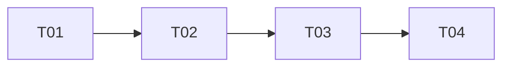

# P2-5 协议压平 — 数据先行 + ROI 裁决 + 设计（可选）

> 状态：只读分析 + 设计文档（未改任何 src/ 源码）
> 基线：`0dc3c07`（validate 9/9 + validate-warm W1–W9 全绿）
> 日期：2026-08-14

---

## 0. 结论摘要（TL;DR）

**「ROI 反转」假设被数据否定——根因是语料错配，不是收益反转。**

team-lead 的前提是「同样 ~48ms 的结果克隆，在 oxc w4 下可能已占 ~30%」。这个推理把两套不同语料的数字错误拼在一起：

| 数字 | 来自哪套语料 | 关键差异 |
|------|------------|---------|
| clone ~48ms | 密集语料（2.5KB × 1500，**issues=14835**） | issue 多 → 克隆体量大 |
| oxc w4 ~150ms | 轻量语料（126B × 1001，**issues=1600**） | issue 少 → 克隆体量小 |

**克隆成本与 issue 数近似成正比（~5–7μs/issue），不是固定的 48ms。** 当 oxc 基线降到 150ms 时，对应的语料只有 1600 issues，克隆仅 ~6ms（4%）；而 48ms 对应的密集语料上 oxc wall 是 ~470ms（不是 150ms），克隆占 ~17%。

**真实占比：oxc 密集 ~17%（主线程 deserialize ~12% 在关键路径）、ts 密集 ~7%、轻量 <5%。** 未达「oxc 20–30% / ts >8%」的「值得做」门槛，也非 <5% 的零收益——落在中间灰区。

**裁决：主攻 P3（adapter 侧直接遍历，ts 稳态真墙）；P2-5 降级为「可选、门控、窄边界」的低优先级项，仅在 oxc 翻默认或用户语料 issue 密集时重估。** 本文第三部分给出「若做」的最小设计，供决策后直接开工。

---

## 1. 重测数据（数据先行）

### 1.1 方法
- 临时脚本：`C:/tmp/ar-p25-prof/measure-result-clone.js`、`measure-warm-corpus.js`（未污染项目）。
- 克隆耗时用 `v8.serialize` / `v8.deserialize` 计时——这正是 `postMessage` 结构化克隆所用的算法，可干净分离序列化/反序列化两侧。
- 用 `AR_TIMING=1` 在真实管线交叉验证（worker 忙/闲、主线程合并、round-trip）。
- 两套语料：
  - **轻量** `C:/tmp/ar-warm-corpus`（126B × 1001，3 模板，**issues=1600**）→ 对应「oxc ~150ms」口径。
  - **密集** `C:/tmp/ar-p25-prof/corpus`（2.5KB × 1001，**issues=15015**）→ 对应「14835 issues」口径。

### 1.2 结果（w4）

| 语料 | issues | ts w4 wall | oxc w4 wall | 结果克隆（worker 子集，ser+des） | ts 占比 | oxc 占比 |
|------|--------|-----------|------------|--------------------------------|--------|---------|
| 轻量 126B | 1600 | ~357ms | ~153ms | ts ~4ms / oxc ~6.5ms | **~1.1%** | **~4.2%** |
| 密集 2.5KB | 15015 | ~670ms | ~470ms | ts 46ms / oxc 80ms | **~6.9%** | **~17.0%** |

注：worker 子集 = 剥离 hybrid 之后实际走 postMessage 的文件（ts K=500→501 文件，oxc K=200→801 文件）。克隆成本按子集折算。

### 1.3 AR_TIMING 交叉验证（密集语料）——揭示「非对称」机制

**ts 密集**：worker 是瓶颈（`perWorkerBusy` 467–496ms，`perWorkerWaitGaps` 仅 18–59ms）→ 主线程 deserialize（~29ms）被 worker 的慢解析**重叠隐藏**。

**oxc 密集**：主线程接近瓶颈（worker `idle` 32%、`perWorkerWaitGaps` 56–92ms）→ 主线程 deserialize（~51ms，26 batch × ~2ms）**落在关键路径**，直接拖慢下一批派发。

**这是 P1-1 / oxc / worker 懒加载落地后新暴露的结构性瓶颈**：oxc worker 快 3×，主线程「读文件 + 派发 + 收结果」成了新墙，而结果反序列化是其中一块（~12%）。

### 1.4 结论的量化表述
- 克隆成本 ≈ **5–7μs/issue**（全 ser+des）。
- P2-5 的真实上限：
  - oxc 密集：~50–55ms（主线程 deserialize 关键路径 ~51ms + worker 序列化尾部 ~5ms）→ **~12% wall**（470→~420ms）。
  - ts 密集：~5–10ms（被重叠）→ **~1–2%**。
  - 轻量（两 parser）：~4–6ms → **<4%**。

---

## 2. ROI 裁决

### 2.1 按 team-lead 判据
- 「oxc ~20–30%」：实测 **17%（上限）/ 12%（真实 wall 影响）** → 未达。
- 「ts >8%」：实测 **6.9%（上限）/ 1–2%（真实）** → 未达。
- 「<5% → 转 P3」：轻量语料 <5%，但密集语料 oxc 达 17% → 非纯 <5%。

**结论：落在中间灰区。假设的「30% 反转」不成立（语料错配），但收益也非零。**

### 2.2 建议
1. **主攻 P3（adapter 侧直接遍历）**：ts 稳态真墙（parse+物化占 worker busy ~90%），对所有 ts 语料生效，杠杆远大于 P2-5 的「oxc+dense 12%」。
2. **P2-5 降级为可选门控项**：收益集中在「oxc + issue 密集语料 + 主线程 deserialize」，而 oxc 当前是 opt-in（默认 typescript）。建议记录为「当 oxc 翻默认，或用户语料实测 issues ≥ ~1 万时重估」。
3. 若团队仍决定做 P2-5（例如 oxc 路线确定），第三部分提供最小设计，编码边界干净、AR_ 门控 + 字节等价硬门可零成本回滚。

---

## 3. （若做）二进制结果格式设计

### 3.1 编码边界（只动结果回传，不动读文件/派发方向）
- **改动方向**：worker→主线程的 `postMessage({ results })`。
- **不改方向**：主线程→worker 的任务派发（`postMessage({ tasks }, transfer)`，读文件 Buffer 零拷贝 transfer），已证明被 read-ahead 与 CPU 重叠隐藏。
- 只动 3 个文件：`src/core/worker.ts`（编码）、`src/core/analyzer.ts`（解码）、新增 `src/core/resultCodec.ts`（编解码器）。

### 3.2 结果对象形状（编解码目标）
```ts
{ results: { file: string; issues: Issue[]; metric: FileMetric | null }[] }
// Issue: id, analyzer, rule, severity('info'|'warning'|'error'), message,
//        location:{file,start:{line,column},end:{line,column}},
//        detail: Record<string,any>, suggestion?: string   // 可选字段!
// FileMetric: file, lines, nonBlankLines, functions, maxNestingDepth,
//             topLevelDeclarations, exportedSymbols
```

**字节等价的三处硬约束**（`validate-equivalence.js` 的 `normalize()` 把 `location`/`detail`/`fileMetrics` 按引用透传，key 顺序必须逐字节一致）：
1. `location` 字段序 `file, start, end`；`start/end` 字段序 `line, column`。
2. `detail` 是 `Record<string,any>`（内置分析器为扁平结构，含 `number[]`/`string[]`；custom analyzer 可任意）→ 需**保序的通用 JSON 值编码**。
3. `suggestion?` 是**可选字段**（undefined vs 存在）→ 需显式存在位。

### 3.3 格式（小端，紧凑）
每 batch 一个二进制 Buffer，零拷贝 transfer（`postMessage(buf, [buf.buffer])`）。

```
Header: u32 magic(0x50523530 "P250")  u32 fileCount
每文件:
  varint fileLen, file(UTF-8)
  u8 hasMetric; 若1: varint×6 (lines, nonBlankLines, functions,
                          maxNestingDepth, topLevelDeclarations, exportedSymbols)
  varint issueCount
  每 issue:
    varint idLen,id · analyzer · rule (UTF-8)
    u8 severity(0=info,1=warning,2=error)
    varint messageLen,message
    varint locFileLen,locFile  varint startLine,startCol,endLine,endCol
    <detail 通用值>            // 见下
    u8 hasSuggestion; 若1: varint suggLen,sugg
```

**detail 通用 JSON 值编码**（保 key 序、保类型、保数组序）：
```
0x00 null | 0x01 true | 0x02 false
0x03 varint(int, zigzag)     // 整数（当前内置 detail 全为整数）
0x04 f64(8B LE)              // 浮点（保任意 JS number 精度，custom analyzer 安全）
0x05 string(varint len + UTF-8)
0x06 array(varint count + values...)
0x07 object(varint count + [key:string, value]...)   // 插入序保 key 顺序
```

### 3.4 字符串编码安全论证
源文件经 `fs.readFileSync(p,'utf8')` 读取，孤立代理项（lone surrogate）在读入时即被替换为 U+FFFD，故 JS 字符串中不存在孤立代理项 → `Buffer.from(s,'utf8')` ↔ `buf.toString('utf8')` 往返无损。非 ASCII（中文注释/i18n 字面量）在 `detail.value` 中安全。若需绝对保险，可对 `detail` 内字符串改用 utf16le（2× 体积，绝对无损）。

### 3.5 门控与回滚
- `AR_BINARY_RESULT=1` 开启、`=0`/未设关闭（默认关）。默认关 ⇒ 主线程 `res` 仍是旧对象；开启后 `res` 为 `Uint8Array`/Buffer，主线程按类型分流，**保留旧路径做即时回滚**。
- 门控仅改回传编码，不改分析/解析逻辑，字节等价硬门（validate 9/9 + validate-warm W1–W9）兜底。

---

## 4. 任务分解（若做，4 任务）

> 这是既有项目的重构（无新依赖/无新入口），故 T01 以「编解码器 + 往返自检」作为地基（等价于新项目的「基础设施」任务）。

- **T01 — 二进制编解码器 + 往返等价自检（P0）**
  - 文件：`src/core/resultCodec.ts`（新）、`src/core/types.ts`（复用 Issue/FileMetric 类型导出）、`scripts/test-result-codec.js`（新，往返门）
  - 依赖：无
  - 验收：对两套语料真实 payload，`encode→decode` 后 `JSON.stringify` 与结构化克隆路径**逐字节相等**（含 suggestion 可选、detail 数组/对象、非 ASCII）。

- **T02 — worker 编码 + 主线程解码接入（AR_BINARY_RESULT 门控，默认关）（P0）**
  - 文件：`src/core/worker.ts`、`src/core/analyzer.ts`、`src/core/resultCodec.ts`
  - 依赖：T01
  - 验收：`AR_BINARY_RESULT=0`（关）输出字节不变；`=1`（开）时 `npm run validate` 9/9 仍全绿。

- **T03 — 门翻转默认 + 全量回归 + bench A/B（P0）**
  - 文件：`src/core/analyzer.ts`、`src/core/worker.ts`、`scripts/validate-equivalence.js`（新增二进制 A/B 场景或复用 baseline）、`scripts/validate-warm.js`（确认 warm 池路径走二进制）
  - 依赖：T02
  - 验收：validate 9/9 + validate-warm W1–W9 全绿；`bench-fastpath.js` 密集/轻量 A/B 量化（预期 oxc 密集 -10~-12%、ts <2%）。

- **T04 — 边界打磨 + 回滚安全（P1）**
  - 文件：`src/core/resultCodec.ts`、`testdata/fixtures`（新增边界夹具：空结果、read-fail 空 metric、detail 空对象、非 ASCII、超大 string）、`scripts/test-result-codec.js`
  - 依赖：T03
  - 验收：边界夹具全绿；`AR_BINARY_RESULT=0` 可即时回滚且字节不变。

### 任务依赖图


---

## 5. 风险与回滚
1. **字节等价（最大风险）**：`detail` 任意结构、`suggestion` 可选、key 顺序、数值精度、非 ASCII。→ 用 T01 往返等价门 + T04 边界夹具硬卡；`AR_BINARY_RESULT=0` 保留旧路径零成本回滚。
2. **反序列化本身也是 CPU**：二进制 decode 重建 Issue 对象仍需 CPU，净收益 = `(结构化克隆 ser+des) − (encode+decode)`。手写编解码器对固定 schema 通常快于 V8 ValueSerializer，但**不是零**——收益需用 T03 bench 实测，若 encode+decode 未显著低于克隆则止损。
3. **复杂度成本 vs 收益**：为「oxc+dense 12%」引入自定义二进制协议，相对 P3 杠杆偏小，故列为可选/门控，不作为默认路径主线。
4. **transfer 后 Buffer 失效**：`postMessage(buf,[buf.buffer])` 后 worker 侧 buf 被 detach，需注意不再复用（与读文件 transfer 同模式）。

---

## 6. 发现的前提错误与新线索（供 team-lead 决策）
1. **前提错误（核心）**：「~48ms 结果克隆在 oxc 下占 ~30%」把「密集语料 14835 issues 的克隆」与「轻量语料 1600 issues 的 150ms wall」错误拼合。克隆成本随 issue 数线性缩放，二者不可同框。
2. **新线索 A（oxc 结构性瓶颈）**：oxc 下主线程是新瓶颈（worker idle 32%），结果反序列化只是其中一块（~12%）。**更大的可能是「主线程喂 4 个快 worker 的串行 feed」**（读文件 sync 开销 + 逐 worker 串行派发）——若要优化 oxc 单次扫描，先测这条线比 P2-5 更值。
3. **新线索 B（hybrid K 副作用）**：oxc hybrid K=200 < ts 500，导致 oxc 有 80% 文件的结果过 postMessage（vs ts 50%），进一步放大了 oxc 的克隆占比。K 越小、边界流量越大。
4. **新线索 C**：轻量语料 ts w4 实测 ~357ms（非 memory 的 ~640ms），疑似负载/口径差异，建议后续统一基准口径（同一语料、同一迭代法、同一负载态）。

---

## 附：复现命令
```bash
# 克隆耗时 + w4 wall（两套语料）
node C:/tmp/ar-p25-prof/measure-result-clone.js      # 密集 2.5KB
node C:/tmp/ar-p25-prof/measure-warm-corpus.js        # 轻量 126B

# 真实管线逐阶段（交叉验证）
AR_TIMING=1 node -e "const {scan}=require('./dist/api');scan({root:'C:/tmp/ar-p25-prof/corpus',configFile:'C:/tmp/ar-p25-prof/corpus/auto-refactor.config.json',workers:4,format:'json',logLevel:'silent',parser:'oxc'})"
```
