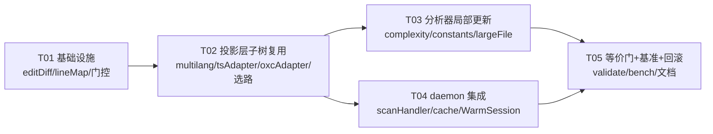

# 行级增量（Line-level Incremental）基础设施设计

> 作者：架构师（高见远）｜日期：2026-08-14｜状态：**设计稿（只读调研 + 量化 + 设计，不改 src/）**
> 前置里程碑：warm-scan 常驻 daemon + L1(mtime+size)/L2(contentHash→结果) 两级缓存（文件级增量已就绪）+ P1-1 懒投影（`AR_FASTPATH` 默认开）+ worker 池 + 字节级等价门（`validate` 9/9、`validate-warm` W1–W9）。
> 前提翻转：旧结论「增量解析不适用」基于 CLI 冷启动假设；daemon 常驻后「旧树 + 旧 content + 旧投影缓存」常驻，行级增量变为可行。本设计基于该新前提。

---

## 0. TL;DR（结论先行）

1. **行级收益是真实但高度条件化的**：本机实测「2000 行 / 122KB 文件」变更一次全量重扫 ≈ 26ms（ts）/ 25ms（oxc）；其中 **parse 仅占 ~29%，投影/物化 ~70%**。tree-sitter 增量解析只加速 parse 层（实测 rust 语法 10.9×），对 TS/JS 只省 ~7ms，且需引入 `tree-sitter-typescript` + 全套语义补偿（字节等价高风险）→ **不选解析器替换**。
2. **推荐路线 = 归一化层子树复用（不换解析器）**：变更文件仍全量重解析（ts/oxc 不变），但在投影/物化层复用「行区间未变」的函数子树缓存，分析器对未变函数/字面量做结果复用，duplicate 组与 large-file 全局聚合重走一次（重走便宜）。预估 26ms → ~10ms（**~2.4–2.6×**，仅大文件小改动场景划算）。
3. **止损线结论：行级「有条件划算」**——仅当文件 ≥ ~1000 行且改动 < ~200 行时启用；否则文件级重扫（当前 L2 路径）已够。门控 `AR_INCREMENTAL`（默认关）+ `AR_INCREMENTAL_MIN_LINES`。
4. **战略提示**：diff 工作负载的两类中，「多小文件变更」已被文件级 L2 完美覆盖（0ms）；行级只服务于「大文件小改动」。若要进一步压大文件成本，oxc 在大文件上**无优势**（实测 ts≈oxc≈25ms），行级是唯一杠杆。

---

# Part A：系统设计

## 1. 实现方案（难点 + 选型 + 架构）

### 1.1 核心难点

| 难点 | 说明 |
|---|---|
| **TS 默认解析器无增量 API** | `ts.createSourceFile` 无 oldTree/edit 语义（GitHub #31044 确认 parse+bind 可跨实例复用，但**单文件仍是全量重解析**）。行级 parse 只能靠 tree-sitter 或子树复用。 |
| **字节等价是硬门** | issue 顺序/位置/文本/metrics 逐字节一致。位置是 1-based line/col 且 issue id 内嵌 `line`，任何行号漂移即字节 diff。 |
| **三个分析器聚合粒度不一** | complexity=函数级（可局部化）；constants=字面量级（magic/hardcoded 可局部化，但 duplicate 组是**全文件多集**）；large-file=全文件聚合（lines/functions/maxNesting/topLevel/exported/modules）。 |
| **位置随行号漂移** | 复用旧归一化子树后，其字面量/函数 `start.line` 会因插入/删除行而陈旧。 |

### 1.2 框架选型与理由

| 候选 | 机制 | 前置条件 | 对本项目可迁移性 |
|---|---|---|---|
| **tree-sitter 增量解析**（`Parser.parse(newSrc, oldTree)` + `tree.edit({startByte,oldEndByte,newEndByte,startPoint,oldEndPoint,newEndPoint})` + `getChangedRanges`） | 复用未变子树、只重解析受影响区间，O(k·log n)；`tree.edit` 自动平移所有节点位置 | 需该语言的 tree-sitter 语法；CST 语义 ≠ TS AST | **标准设计，但仅加速 parse 层**；TS/JS 需 `tree-sitter-typescript` 新依赖 + 大量补偿规则才能对齐 ts.createSourceFile 输出（比 oxc 补偿更大，因 tree-sitter 是纯 CST，无 TS type 节点/修饰符语义）→ **不选为 TS/JS 默认**，仅作 Rust 侧未来快路径（rust 已用 tree-sitter，`tree.edit` 天然可用） |
| **LSP 增量同步**（`didChange` range + `rangeLength`） | 客户端只传变更区间，服务端局部应用 | 编辑器驱动；范围以 UTF-16 位置表示 | **可借鉴 edit 区间形态**：本设计采纳其「新旧字节区间」表示，但本工具 diff 系统通常只有 old/new 全文，需自行算 diff（见 §3.2） |
| **TS LanguageService / tsserver** | `oldProgram` 复用、dirty 文件标记、沿 import 图重算 checker、parse+bind 跨实例复用（#31044） | 需完整 Program + CompilerHost + 模块解析 | **增量是文件级，非节点级**；且本工具纯语法（不 type-check），checker 复用无价值；与现有 L2 内容哈希缓存重叠且更重 → **不选** |
| **oxc-parser** | `Parser::new(allocator, src, sourceType).parse()`，arena 分配 | — | **确认无增量 API**（docs.rs：三输入一返回，无 oldTree/edit）；arena 一次性释放，跨 parse 无节点复用 → parse 层不可增量，但投影层可复用 |
| **rust-analyzer salsa（红绿算法）** | 函数级 memoization + 依赖追踪 + 失效传播 + backdate（输出未变则停止传播） | 需重写计算为查询图 | **思想可迁移**：本设计的「函数级/字面量级结果 memoization + 失效传播」即 salsa 的轻量版；但 JS 无宏，用显式 cache + 失效 key 实现，不引入框架 |

### 1.3 架构模式（选定：混合 Hybrid，归一化层子树复用）

**解析器策略决策（关键）**：

> **推荐：不换解析器，在归一化层做「子树复用 + 分析器结果复用」。** 三条路取舍：
> - **LanguageService**：文件级增量 + checker 复用，与 L2 缓存重叠且更重，纯语法工具无收益 → ❌。
> - **tree-sitter 增量快路径**：真·行级 parse（10.9× parse），但 TS/JS 需新依赖 + 语义补偿（字节等价高风险），且只省 29% 的 parse → ⏸（仅 Rust 未来）。
> - **混合（未变文件走现有、变更文件走增量）**：✅ 推荐。变更文件「全量重解析 + 投影层子树复用」，未变文件仍走 L2。理由：① 零语义分歧（同一解析器，字节等价天然满足）；② 命中真正的成本大头（投影 ~70%）；③ 复用 P1-1 已建的 Mode B 子树物化（跨 parse 共享是它的自然延伸）。

### 1.4 增量三层模型（分层，逐层可独立开关）

```
L0 文件级（已上线）：L2 contentHash→结果；未变文件 0ms。
L1 投影层（本次核心）：变更文件重解析后，复用「行区间未变」函数的归一化子树缓存（跳过 predicate + 分配）。
L2 分析器层（本次核心）：complexity 函数级 memo、constants 字面量级 memo + duplicate 重组、large-file 全量聚合重走。
L3 解析层（可选，未来）：Rust 用 tree-sitter tree.edit 增量 parse；TS/JS 视需要评估 tree-sitter-typescript（默认不做）。
```

---

## 2. 文件清单（相对路径）

```
src/core/editDiff.ts             # 新增：行级 Myers diff + edit 区间计算（ts-free，纯函数）
src/core/lineMap.ts              # 新增：old↔new 行/字节映射（ts-free）
src/core/incrementalState.ts     # 新增：每文件增量状态（content/contentHash/子树缓存/分析器 memo）
src/core/incremental.ts          # 新增：选路门 + 编排（AR_INCREMENTAL / 阈值 / 回退）
src/core/multilang.ts            # 修改：NodeProjector 增加可选 `reusedSpan?()` 契约（ts-free）
src/core/typescriptAdapter.ts    # 修改：project() 支持从 IncrementalFileState 种子复用子树
src/core/oxcAdapter.ts           # 修改：同上（oxc 投影层复用）
src/core/traverse.ts             # 修改：新增 incrementalEnabled() 门控 + 复用感知（保持 ts-free）
src/core/analyzer.ts             # 修改：WarmSession 挂增量状态 + 选路接入
src/core/worker.ts               # 修改：worker 侧选路 + 增量状态透传
src/daemon/scanHandler.ts        # 修改：daemon 会话增量状态驻留 + 装配
src/core/cache.ts                # 修改：WarmSession 增 quantstate（可选内容驻留，仅 daemon 内存）
src/core/types.ts                # 修改：WarmStats 增 incremental 计数；ScanConfig 增增量开关字段
src/analyzers/complexity.ts      # 修改：函数级 cc/issue memo + 失效
src/analyzers/constants.ts       # 修改：字面量级 memo + duplicate 重组
src/analyzers/largeFile.ts       # 修改：复用 walk 聚合（基本不变，仅接 lineStats）
scripts/validate-diff.js         # 等价门：行级增量 vs 全量重扫字节比对（oracle 用冷扫描；已并入 diff 体系）
scripts/bench-diff.js            # 基准：大文件小改动 A/B（已并入 diff 体系）
config.schema.json               # 修改：增量开关 schema 字段
docs/system-design.md            # 本文档
docs/class-diagram.mermaid       # 类图
docs/sequence-diagram.mermaid    # 时序图
```

> 不变文件（`src/utils/{linestats,normalized}.ts`、`src/core/{cacheKey,config,adapters,rustAdapter}.ts`）均不受影响；rust 路径本设计不改（tree-sitter 增量解析列为 L3 未来项）。

---

## 3. 数据结构与接口（类图）

见 `docs/class-diagram.mermaid`。核心新增类型：

- `EditRange`：`{ startByte, oldEndByte, newEndByte, startLine, oldEndLine, newEndLine }` —— diff 输出（LSP didChange 风格 + 字节偏移）。
- `LineMap`：`mapLine(oldLine)→newLine` / `mapByte(oldByte)→newByte` / `lineDeltaAt(line)` —— 位置平移。
- `IncrementalFileState`：每文件常驻状态，承载复用缓存与 memo。
- `IncrementalProjector`：实现 `NodeProjector`，包一层 fresh projector + `IncrementalFileState`，按 edit 区间决定「复用旧子树」或「重投影」。

---

## 4. 程序调用流（时序图）

见 `docs/sequence-diagram.mermaid`。关键流：

1. daemon `handleScan` → `Scanner.scanWithCache`：L1/L2 判定，未变文件复用结果（不变）。
2. 变更文件（L2 miss）→ `incremental.ts` 选路：`AR_INCREMENTAL=1 && lines≥min && prevState 存在 && 改动行 < 阈值` → 走行级，否则回退全量重扫。
3. 行级：`computeEditRanges(old, new)`（Myers）→ 全量重解析（ts/oxc）→ `IncrementalProjector` 复用未变子树 → `runStreamingProjected` 重走（读复用子树）→ 分析器 memo（complexity/constants 复用、duplicate/large-file 重组）→ 组装结果。
4. 结果写入 L2 + 更新增量状态。

---

## 5. Anything UNCLEAR / 假设

1. **diff 系统接口未定**：假设其提供 `(oldContent, newContent)` 或 `(newContent + editRanges)`；本设计两者都支持（有 editRanges 则跳过 Myers）。若 diff 系统只给「哪些文件变了」，则 L2 已覆盖，行级需自行 diff（从 daemon 会话取旧 content）。
2. **行级仅 daemon 生效**：旧树/旧 content/旧投影缓存必须常驻 → 行级是 daemon-only 优化（CLI 冷启动无旧树，退化为全量）。已在 §7 明确。
3. **位置平移的边界**：INC-Mode-1（复用仅限「行区间完全未变」的子树）→ 零位置风险；INC-Mode-2（行号平移复用结构）列为可选，需 lineMap 逐字面量平移位置，风险高，单独门控。本设计 T02/T03 只落地 Mode-1。
4. **tree-sitter-typescript 语义补偿规模**：未做 POC，仅凭「CST vs AST」判断其补偿规则量 > oxc；若未来要 L3 parse 层，需先做 POC 量化补偿成本，默认不做。
5. **oxc 大文件无优势**：实测 oxc≈ts≈25ms（反射物化抵消了 parseSync 优势）；本结论只对「单一大文件」成立，与 docs/oxc-feasibility.md 的「多小文件 oxc 4-5×」不矛盾。

---

# Part B：任务分解

## 6. 所需第三方包

```
（无新增运行时依赖）
- typescript@^5.3.3        # 已有：TS 解析器（保持）
- oxc-parser@0.144.0       # 已有：oxc 解析器（保持）
- tree-sitter@^0.22.4      # 已有：Rust 路径（L3 未来用 tree.edit，本期不改）
- tree-sitter-rust@^0.24.0 # 已有：Rust 路径（保持）
```
> 结论：**零新依赖**。这是选「归一化层子树复用」而非「tree-sitter 增量解析」的直接收益之一（避免引入 `tree-sitter-typescript`）。

## 7. 任务列表（按依赖排序，≤5）

| Task | 名称 | 源文件 | 依赖 | 优先级 |
|---|---|---|---|---|
| **T01** | 行级基础设施：diff/edit 区间 + 门控（行为不变） | `src/core/editDiff.ts`、`src/core/lineMap.ts`、`src/core/incrementalState.ts`、`src/core/incremental.ts`、`src/core/traverse.ts`、`src/core/types.ts`、`config.schema.json` | — | P0 |
| **T02** | 投影层子树复用（INC-Mode-1） | `src/core/multilang.ts`、`src/core/typescriptAdapter.ts`、`src/core/oxcAdapter.ts`、`src/core/analyzer.ts`、`src/core/worker.ts` | T01 | P0 |
| **T03** | 分析器局部更新 + memo | `src/analyzers/complexity.ts`、`src/analyzers/constants.ts`、`src/analyzers/largeFile.ts` | T02 | P0 |
| **T04** | daemon 集成 + 状态驻留 | `src/daemon/scanHandler.ts`、`src/core/cache.ts`、`src/core/analyzer.ts`（WarmSession）、`src/core/types.ts`（WarmStats） | T02 | P1 |
| **T05** | 字节等价门 + 基准 + 回滚固化 | `scripts/validate-diff.js`、`scripts/bench-diff.js`、`docs/*`、默认值决策 | T03、T04 | P0 |

### 每步验收

- **T01**：`npm run validate` 9/9 + `npm run validate-warm` W1–W9 全绿（门默认关，行为不变）；`editDiff`/`lineMap` 单测（Myers 正确性、字节↔行映射往返）。
- **T02**：`AR_INCREMENTAL=1` 下变更文件输出与 `AR_INCREMENTAL=0` 全量重扫**逐字节一致**（`validate-diff` 最小比对）；未变文件仍 L2 命中。
- **T03**：分析器 memo 后仍字节一致（duplicate 组、maxNesting、functions 计数逐字节对齐）。
- **T04**：daemon 二次扫描增量路径生效；`WarmStats` 新增 `incrementalHit/incrementalFiles` 计数；RSS 不失控（增量状态有界）。
- **T05**：`validate-diff` 全场景（多 edit 模式：改 1 行/改 20 行/插 10 行/删 10 行/跨函数改动）全绿；`bench-diff` 给出「大文件小改动」≥2× 的实测门槛；`AR_INCREMENTAL` 默认值依据数据定（预测：先默认关，数据达标后翻开）。

## 8. 共享知识（实施注意）

- **字节等价是硬门**：行级结果必须与「禁用缓存的全量重扫」逐字节一致；`validate-diff` 的 oracle 是 `AR_INCREMENTAL=0 + cache=disabled` 的冷扫描。
- **`traverse.ts` 必须保持 ts-free**：新增门控/复用感知不得 `import typescript`（否则摧毁 oxc worker 懒加载）。
- **复用单元 = 函数子树（Mode B 已物化）**：复用条件 = 子树源文本字节一致 **且** 起始行一致（INC-Mode-1）；否则重投影。
- **位置只来自 fresh raw 节点或「未漂移」复用子树**：任何复用子树的位置必须证明其行区间未变；不得复用陈旧 line/col。
- **duplicate-literal 与 large-file 是全局聚合**：不可整块复用，必须用「复用字面量记录 + 新字面量记录」重组多集，maxNesting/functions 等由同一次重走产出。
- **回退**：任何增量异常（diff 失败/投影异常/复用 key 冲突）→ catch → 全量重扫（镜像现有投影→物化、worker→in-process 兜底）。
- **门控**：`AR_INCREMENTAL=0` 回退当前文件级路径；`AR_INCREMENTAL_MIN_LINES`（默认 ~1000）阈值以下不走行级（避免小文件 diff/缓存管理负收益）。

## 9. 任务依赖图



---

## 10. 风险与回滚

| 风险 | 等级 | 缓解 |
|---|---|---|
| 复用子树位置陈旧 → 字节 diff | 高 | INC-Mode-1 严格限制「行区间未变才复用」；validate-diff 全 edit 模式覆盖；位置断言（复用子树 start.line 必须 == 新 raw start.line） |
| duplicate 组/全局聚合重算错误 | 中 | 分析器 memo 仅作用于「局部可证」结果；全局聚合一律重组；T03 专测 |
| 增量状态内存膨胀（daemon 常驻大文件旧树） | 中 | 状态有界（LRU + 仅大文件 + 行阈值）；RSS guard 沿用 512/768MB |
| 小文件负收益（diff/缓存管理 > 重扫） | 中 | `AR_INCREMENTAL_MIN_LINES` 阈值；bench 校准阈值 |
| tree-sitter 语义分歧（若未来 L3） | 高 | 本期不做；POC 前置；默认关闭 |
| 与 L2 缓存键交互 | 低 | 行级不改分析输出 → 不污染 contentHash/fpHash；增量仅影响「调度」，不改结果字节 |

**回滚开关**：`AR_INCREMENTAL=0`（默认，回退当前文件级路径）；`AR_INCREMENTAL_MIN_LINES`（阈值）；增量状态无持久化（daemon 内存），回滚零成本、零数据迁移。

---

## 附：量化数据（本机实测，C:/tmp 临时脚本，未污染项目）

| 场景（2000 行文件） | ts | oxc | 说明 |
|---|---|---|---|
| createSourceFile（parse） | 7.64ms | —（parseSync 内含） | parse 仅 ~29% |
| adapter.parse（物化） | 28.03ms | 25.02ms | 物化是成本大头 |
| project + runStreamingProjected（**全量重扫**） | **26.11ms** | **25.44ms** | 变更文件当前成本 |
| tree-sitter-rust 增量 parse | — | — | full 12.13ms → 增量 1.11ms（**10.9×**，仅 parse 层） |

- **行级预估**（复用未变子树 + 分析器 memo）：26ms → ~10ms（~2.4–2.6×），仅大文件小改动划算。
- **止损结论**：行级 ≥2× 的条件只在「大文件 + 小改动」成立；「多小文件变更」已由文件级 L2 覆盖（0ms），行级无益。
