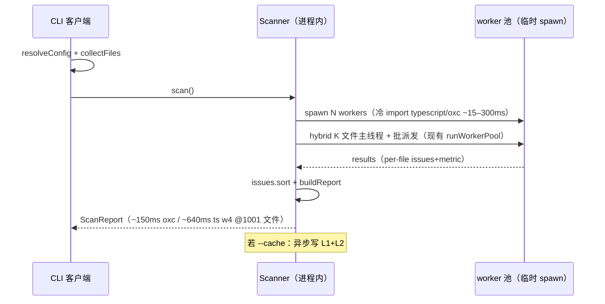
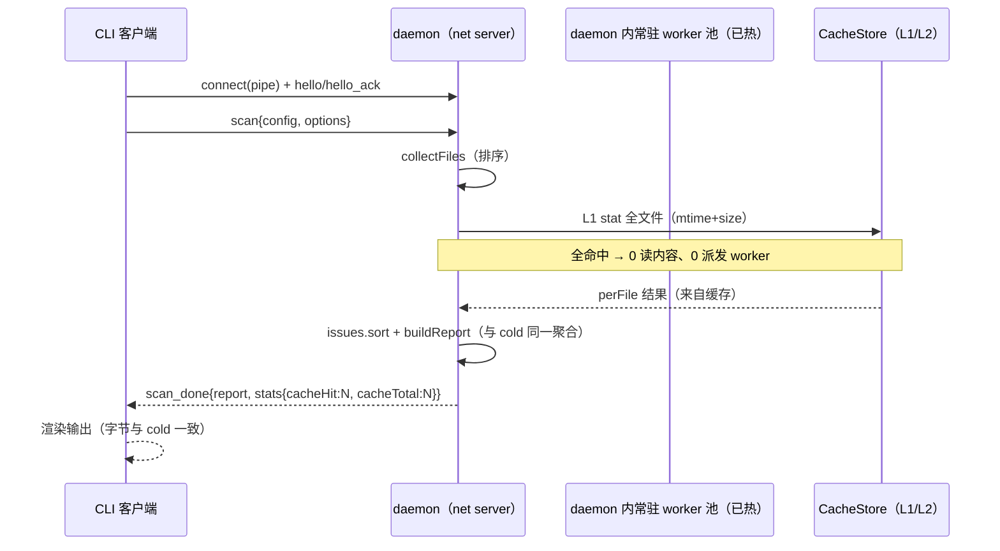
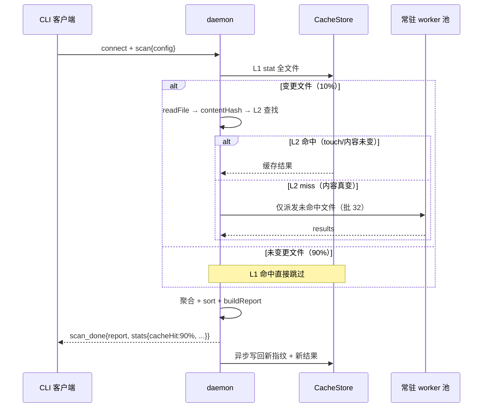

# WARM_SCAN_DESIGN —— warm-scan 基础设施设计（持久 worker 池 + 两级增量缓存）

> 作者：架构师（高见远）｜日期：2026-08-13｜状态：**已实施（T01–T06 落地，validate-warm W1–W9 全绿，默认关、CLI 显式 --cache/--daemon 开启）**
> 实施记录（2026-08-14 主理人补记）：T01 缓存核心（cacheKey.ts + cache.ts）→ T02 daemon 骨架（protocol/registry/server/client + cli/daemonCmd）→ T03 池复用 → T04 warm 集成（scanWarm + scanHandler）→ T05 等价回归 + 基准（validate-warm.js W1–W9 + bench-warm.js S1–S6）已全部落地；`npm run validate-warm` 9 场景全 PASS。已知待办：S6 跨进程冷启缓存命中（326–1472ms 超 <30ms 目标）与 T06 边界打磨正在收口。
> 范围：为 auto-refactor（TS/Node CLI 静态分析工具）设计 warm-scan 基础设施：**A. 持久 worker 池（daemon 模式）** + **B. 两级增量缓存**，一个里程碑交付。
> 硬约束：**不得改变现有单次扫描语义与字节等价**；validate-equivalence.js 9 场景基线必须继续 PASS。

---

## 0. TL;DR

| 主题 | 结论 |
|---|---|
| 进程模型 | **常驻 daemon 进程**（`net` server 监听命名管道/Unix socket，NDJSON 协议）+ 客户端**自动降级 cold scan**。不用"CLI 进程内自举常驻"。 |
| 关键理由 | 真实重复扫描场景（watch/CI/pre-commit/IDE）都是**多次独立 CLI 进程调用**，只有跨进程 daemon 能摊销 worker import/JIT；worker_threads 无法跨进程共享；Windows 上命名管道（`net`）完全可用。 |
| IPC | NDJSON over net socket（Windows 命名管道 `\\.\pipe\auto-refactor-warmscan-<hash>` / POSIX Unix socket），类型化消息：`hello/hello_ack/scan/scan_data/scan_done/error/ping/shutdown`。 |
| 缓存键 | L2 键 = `v1:<fpHash>:<contentHash>`；`fpHash = sha256(canonical(工具版本+parser/adapter版本+投影策略+分析器集合+options/thresholds+分析器版本+customAnalyzer哈希))`。**键变化即全量失效，无需显式 invalidate**。 |
| 缓存存储 | 项目内 `.auto-refactor-cache/`（可 `--cache-dir` 覆盖），`manifest.json` + `fingerprints.jsonl`（L1）+ `results.jsonl`（L2），临时文件 + rename 原子写，坏行跳过。 |
| 字节等价 | 分析器全部 **file-local**（per-file fresh 实例、无跨文件状态，已代码确认）→ 缓存安全。新增 `scripts/validate-warm.js`：同一语料 cold-fresh vs warm 多次，normalize 后字节比对。 |
| 收益 | CLI 单次新进程：**无收益、不恶化**（默认只探测已有 daemon，连接失败直接 cold，不自动启动）；重复调用：**5–50×**（1001 oxc：cold ~150ms → warm 全命中目标 **<30ms**）。 |

---

## 1. 现状盘点（设计输入，已读代码确认）

### 1.1 引擎与并行结构

| 模块 | 事实 | 对 warm-scan 的含义 |
|---|---|---|
| `src/core/traverse.ts` | `runStreaming`/`runStreamingProjected`，ts-free；`tryCreateProjector`（AR_FASTPATH 门控，默认开） | 投影策略（policy）由启用的分析器推导 → 缓存键必须含 policy |
| `src/core/adapters.ts` | 惰性工厂；`adapterFor(file, parser)` 按扩展名 + parser 选择，回退 typescript | 键按**文件实际 adapter id**（typescript/oxc/rust），非全局 parser 字符串 |
| `src/core/worker.ts` | workerData 携带 config+descs；每消息 fresh 实例 + fresh FileMetricCollector；零 typescript（oxc+无 legacy 时）；协议 `{tasks:[{file,absPath,buf}]}/{flush}` → `{results}/{flushed}` | **每文件 fresh = 扫描间无需清理**；常驻改造只需让 config/descs 可 per-scan 切换 |
| `src/core/analyzer.ts` | `runWorkerPool`：批 32、read-ahead、hybrid K=500(ts)/200(oxc)、失败→in-process 兜底；`Scanner.scan()` 流程：collectFiles(sorted) → perFile 数组（按 files 顺序）→ 全局 issues.sort(file,line,analyzer,rule) → buildReport | 缓存命中结果按 rel path 放回 perFile 对应下标，走**同一聚合逻辑** → 字节一致 |
| `src/core/config.ts` | `resolveConfig` 纯函数（默认→config 文件→overrides 三层合并） | 客户端 resolveConfig 后把**完整 config JSON** 传给 daemon，消除二次读取漂移 |
| `src/api.ts` / `src/index.ts` | `scan(options)` / `scanAndRender`；CLI 单次执行后 `process.exit` | API 加 `scanWarm`；CLI 默认只探测 daemon，探测失败静默走原路径 |
| 分析器 | constants/largeFile/complexity：纯函数 of (文件内容, options)，**无跨文件状态**；`dependsOn` 均为空；customAnalyzer 走 `analyze(sf,ctx)` 合同 | **file-local 性质成立** → L2 缓存安全（customAnalyzer 除外，见 §B7） |

### 1.2 关键实测（本机）

- worker import 窗口：typescript ~300ms / oxc ~15ms（isolate 冷加载）。
- w4（4 worker）1001 轻量文件：ts ~640ms / oxc ~150ms（AR_TIMING 实测：spawn 4×~60ms、firstMsg ~145ms、load ~4ms oxc）。
- 主进程 api.js 懒加载 typescript 后启动 ~13ms。
- 1001 文件、15015 issues 的 JSON 报告约数 MB，socket 传输 <10ms（无压力）。
- 中小文件 per-file parse+analyze ~0.15–0.4ms；大文件 ~30–40ms → 内容哈希（~50–400µs）成本远小于被省的分析成本。

### 1.3 缓存安全性结论（写入设计）

**分析器 file-local 性质 = 缓存安全**：三个内置分析器与 FileMetricCollector 均为「单文件内容 + 该文件 options」的纯函数；流式路径 per-file 实例化（`p.factory()` / `instantiateAnalyzer`），无跨文件、无 manifest/lockfile/网络/环境依赖，`dependsOn` 为空。因此 `contentHash → {issues, metric}` 的映射在**同一缓存键**下是确定且可复用的。唯一例外是外部 customAnalyzer（无法证明纯函数性）→ 见 §B7 保守处理。

---

## 2. 目标与边界

- **A. 持久 worker 池**：typescript/oxc import、JIT warmup、worker 初始化跨 scan 摊销为 0。
- **B. 两级增量缓存**：L1 mtime+size 快速跳过；L2 contentHash → 结果复用；键含全部影响因子。
- **边界**：单次 CLI 无收益但**不得恶化**；warm 输出与 fresh **逐字节一致**；默认行为不改变现有 `scan()` 语义。

---

# Part A：持久 worker 池（daemon 模式）

## A1. 进程模型（含 Windows 可行性）

### A1.1 候选对比

| 维度 | 模型 1：常驻 daemon 进程 | 模型 2：CLI 进程内自举常驻 |
|---|---|---|
| 覆盖场景 | watch / CI / pre-commit / IDE（**多次独立 CLI 调用**）✅ | 仅「同一进程内多次 scan」（watch/REPL）❌ 不覆盖 CI/pre-commit |
| worker 复用 | daemon 内 worker_threads 常驻，跨调用共享 ✅ | 同一进程内可复用 ✅ 但进程退出即失 |
| 用户行为改变 | 无（CLI 照常调用）✅ | 需用户不退出进程 / 改变调用方式 ❌ |
| 生命周期管理 | 需 daemon 发现/退出/自愈（中等成本） | 无（进程即生命周期） |
| Windows 可行性 | 命名管道（`net`）✅ | 无跨进程需求，天然可行 |
| 崩溃恢复 | 客户端自动降级 cold ✅ | 进程崩溃 = 整次调用失败 |
| 跨进程共享 worker | ✅（worker_threads 在 daemon 进程内，客户端通过 IPC 发任务） | ❌（worker_threads 无法跨进程共享，这是本模型的死穴） |

### A1.2 推荐：**模型 1（常驻 daemon + 客户端自动降级）**

理由：
1. **真实重复扫描场景全是多次独立 CLI 进程调用**（watch 触发子进程、CI 多次步骤、pre-commit 每次新进程、IDE 插件每次新进程）。只有独立 daemon 能把 typescript import / oxc import / JIT / worker 初始化摊到第 2 次调用免费。
2. worker_threads **不能跨进程共享**——「CLI 进程内自举」最多覆盖 REPL，覆盖不了 CI/pre-commit，收益场景缺失。
3. **Windows 平台约束**（关键事实）：
   - Node `child_process` IPC channel 在 Windows 上基于**命名管道**实现，可用；但它是 fork 父子关系，不适合「客户端连接已存在的 daemon」。
   - Node `net` 模块在 Windows 上**支持命名管道 server**（路径 `\\.\pipe\<name>`）；POSIX 上支持 Unix domain socket。两条路径同一套 `net` API。
   - Node `net` 的 **AF_UNIX 在 Windows 上不可用**（`net.createServer('/path')` 按文件系统路径处理）→ **不用 Unix socket 作为跨平台方案**，Windows 用命名管道、POSIX 用 Unix socket，由平台分支选择。
   - stdio 管道在 Windows 上完全可用（仅用于内嵌模式/测试，见 A2.1）。
4. daemon 崩溃 → 客户端连接失败 → **自动降级 cold scan**（现有 scan 路径原样），语义零影响。

### A1.3 daemon 生命周期

```
启动：auto-refactor daemon start
  → 解析 --root 或 cwd 得到 projectHash
  → net.createServer 监听 pipeName = platform 分支：
       win32:  \\.\pipe\auto-refactor-warmscan-<user>-<projectHash>
       posix:  $XDG_RUNTIME_DIR|os.tmpdir()/auto-refactor-warmscan-<projectHash>.sock
  → 写注册表 <userCacheDir>/auto-refactor/daemon-<projectHash>.json：
       { pid, pipe, startedAt, version:"0.1.0", protocol:1, logFile }
  → 懒启动 worker 池（首个 scan 请求到达时才 spawn，见 A3.1）
  → idleTimeout（默认 10 分钟无连接）→ 优雅退出并清理注册表
  → SIGTERM/SIGINT / shutdown 消息 → 优雅退出

发现：客户端读注册表 → net.connect(pipe) → hello 握手（超时 300–500ms）
退出：daemon stop（发 shutdown）｜status（读注册表 + ping）
自愈：RSS 超阈值 → 终止空闲池 → 再超 → 优雅自杀（客户端下次自动重启，见 A2.4）
```

`<userCacheDir>` = `%LOCALAPPDATA%\auto-refactor`（win32）或 `~/.cache/auto-refactor`（posix）；**只放 daemon 注册表/日志，不放业务缓存**（业务缓存放项目内，见 B3）。

## A2. IPC 协议

### A2.1 Transport 选择

| Transport | 用途 | 说明 |
|---|---|---|
| **`net` socket（命名管道 / Unix socket）** | 主通道（daemon ↔ CLI/IDE） | 跨平台（win32 命名管道 / posix Unix socket）、多客户端、可调试（`type \\.\pipe\...` / socat）、daemon 生命周期独立 |
| **stdio（NDJSON over stdin/stdout）** | 内嵌模式 / 自动化测试 / fallback | `auto-refactor daemon --stdio`（由客户端 fork，子进程 stdin/stdout 走协议）；**同一套 NDJSON 消息格式**，仅 transport 不同 |

不选 Node `child_process` IPC channel 作为主通道：它绑定 fork 父子关系，无法连接既有 daemon；消息序列化为 V8 serializer 不可跨语言调试。不选 JSON-RPC 2.0 规范：本项目消息是「请求/响应 + 服务端主动流式分块 + 双向控制」的混合流，自定 type 字段更直接（保留 `id` 关联）。

### A2.2 消息格式（NDJSON：每行一个 JSON 对象，UTF-8，`\n` 分隔）

```
客户端 → daemon：
{"v":1,"id":1,"type":"hello","version":"0.1.0","protocol":1,"projectHash":"<hash>"}
{"v":1,"id":2,"type":"scan","params":{
   "requestId":"r1",
   "config":{ ...resolveConfig() 后的完整 ScanConfig JSON... },   // 客户端负责解析，daemon 只执行
   "options":{"cache":true,"workers":4,"parser":"oxc"}
}}
{"v":1,"id":3,"type":"ping"}
{"v":1,"id":4,"type":"shutdown","reason":"client-request"}

daemon → 客户端：
{"v":1,"id":1,"type":"hello_ack","version":"0.1.0","protocol":1,"caps":{"cache":true,"stream":true,"maxWorkers":8}}
{"v":1,"id":2,"type":"scan_data","requestId":"r1","seq":0,"files":["src/a.ts"],"issues":[...],"metrics":[...]}
   // 可选流式分块：issues/metrics 超阈值（如 >100k 条或序列化 >8MB）时启用，每块 ≤5000 issues
{"v":1,"id":2,"type":"scan_done","requestId":"r1","report":{...ScanReport...},"stats":{"cacheHit":N,"cacheTotal":M,"poolWarm":true,"daemonMs":123}}
{"v":1,"id":2,"type":"error","requestId":"r1","code":"SCAN_FAILED","message":"...","detail":{...}}
{"v":1,"id":3,"type":"pong"}
```

要点：
- **`config` 由客户端 `resolveConfig` 后整体传入**（不是传 configFile 路径让 daemon 再读）→ 消除「daemon 读到与客户端不同配置」的漂移，字节等价性最强。
- **`report` 结构与 cold 完全一致**；`stats` 是响应的独立字段，**不进 ScanReport**（保证输出字节不变），由 `scanWarm` API / logger 暴露。
- 默认整包返回 `scan_done`（1001 文件 15015 issues ~数 MB，socket 传输 <10ms）；`scan_data` 为协议预留的流式增强。

### A2.3 大结果流式

1. daemon 完成 scan 后先 `scan_done`（若结果小）或先若干 `scan_data`（若结果大）再 `scan_done`（`scan_done` 只带 summary + 尾部）。
2. 客户端聚合 `scan_data` 的 issues/metrics 到 perFile 数组，收到 `scan_done` 后走与 cold 完全相同的 `issues.sort` + `buildReport` 聚合 → 字节一致。
3. 流式开关在 `hello_ack.caps.stream` 声明；客户端在 scan 请求中不带 `options.stream` 则 daemon 默认整包（简单优先）。

### A2.4 错误 / 超时 / daemon 崩溃恢复

| 故障 | 检测 | 客户端行为（**全部自动降级 cold，语义不变**） |
|---|---|---|
| daemon 未启动 | 注册表缺失 / connect 失败 | 直接 cold（不自动启动；见 A4.3） |
| 版本漂移 | `hello`↔`hello_ack` 版本/协议不匹配 | 记录 warn → cold；若 daemon 为旧版本，尝试 `shutdown` 旧 daemon（仅当用户显式 `--daemon` 时） |
| 连接超时 | connect 超时 500ms；scan 超时 120s（可配） | 断开 → cold |
| daemon 中途崩溃 | socket error/close 且未收到 scan_done | 重试一次连接（若注册表仍指向同一 pid 则跳过）→ 仍失败 → cold |
| 管道占用/权限（Windows） | connect EACCES/EPIPE | cold；日志提示可用 `--no-daemon` |
| scan 内部错误 | `error` 消息 | 若 `code` 属于「配置/扫描期错误」→ 客户端按现有错误处理（等价于 cold 的错误路径） |

## A3. worker 生命周期（daemon 内）

### A3.1 懒启动 + 池分片

- daemon 启动**不 spawn 任何 worker**（保持「零 typescript」原则 + 省内存）。首个 scan 请求到达时按需构建。
- **池分片键 `fp = 配置指纹`**（与缓存键的 `fpHash` 同源，见 B2）：`Map<fp, Worker[]>`。
  - 同一 fp 的后续 scan **复用池**（worker 已加载 typescript/oxc、JIT 已热）→ 二次扫描 import/warmup 成本 = 0。
  - 不同 fp（parser 切换 / 分析器集合变化 / thresholds 变化）→ 新建池；旧池 LRU 回收（最多保留 4 个 fp）。
  - worker 数量沿用现有决策（`workers<=0` → `min(availableParallelism,8)`；`=1` → 不走池）。
- **worker 内模块缓存**：`worker.ts` 维护 `Map<fp, LoadedAnalyzer[]>`。消息携带 `{tasks, fp, config, descs}`；fp 命中直接用已加载模块（Node `require.cache` 保证同一模块二次 require 便宜）；未命中则 require 一次并缓存。**实例化仍 per-file fresh**（现有行为不动）→ 跨 scan 零状态污染。

### A3.2 扫描间状态清理责任

**由现有设计天然承担，无需新机制**：
- 分析器实例：`runOne` 每次消息用 `instantiateAnalyzer` / `p.factory()` 新建 → 无跨文件/跨 scan 状态。
- `FileMetricCollector`：每次 `runOne` `new FileMetricCollector()` → 计数不累积。
- daemon 主线程：scan 结束释放 `perFile` 大数组引用（自然 GC）。
- 结论：**状态清理责任 = worker 每消息 fresh 实例（现状）+ daemon 每 scan 不持有结果引用**；不引入「重置/回收」协议。

### A3.3 与既有优化交互

| 既有优化 | 持久池下的处理 |
|---|---|
| **hybrid 启动（K=500/200）** | hybrid 存在的唯一理由是掩盖 worker 冷加载 typescript 的死时间（~300ms）。**池冷（首次 scan）时保留 hybrid**；**池热后关闭**（`poolWarm=true` → K=0）——否则主线程抢 K 个文件反而拖慢热路径。daemon 记录 `poolWarm` 标志。 |
| **懒加载 typescript** | **在 daemon 内依然成立**：daemon 主线程不 import typescript；只有 `parser=typescript` 的池 worker 首次处理 ts 文件时才 require。二次 scan 免费。无需改动。 |
| **worker 批处理 32 / read-ahead / Buffer 零拷贝** | 保留；批处理与 read-ahead 对热池同样有效。 |
| **失败→in-process 兜底** | 保留（daemon 内 worker 崩溃 → 该 scan 降级 daemon 主线程 in-process，再失败 → 客户端 cold）。 |

### A3.4 内存增长防护

1. worker 只缓存「已加载模块实例」（每 fp 一组，≤4 fp × ~3 分析器 + typescript/oxc 模块），**不缓存文件内容/结果**。
2. 池 LRU：fp > 4 → `terminate()` 最久未用池。
3. RSS 监控：每 scan 后 `process.memoryUsage().rss`；> 512MB → 终止空闲池；> 768MB → 记日志 + 优雅退出（客户端下次自动重启，见 A2.4）。
4. idle 退出：10 分钟无连接 → `exit(0)`（长时间挂着的旧 daemon 不占资源）。

## A4. CLI / API 面

### A4.1 API

- `scan(options)`：**语义不变**（默认不连 daemon、不开缓存；库调用方零隐式磁盘写）。
- 新增 `scanWarm(options): Promise<{ report: ScanReport; stats: WarmStats }>`：显式 warm 会话（尝试连 daemon，失败自动降级 cold 并返回 `{report, stats:{daemonUsed:false}}`）。
- `ScanOptions` 增加（可选，默认关）：`warm?: boolean`、`cache?: boolean`、`cacheDir?: string`、`daemon?: 'auto'|'on'|'off'`。

### A4.2 CLI

```
auto-refactor scan [options]                 # 默认行为见 A4.3
  --daemon          # 连接失败时自动启动 daemon 并重连（watch/CI 预热场景）
  --no-daemon       # 永不连接 daemon
  --cache / --no-cache      # 默认 --cache（CLI 场景）；validate/benchmark 用 --no-cache
  --cache-dir <dir> # 默认 <root>/.auto-refactor-cache
  --cache-clear     # 删除该项目缓存目录（兜底）

auto-refactor daemon start|stop|status [--root <dir>]
```

### A4.3 默认行为（关键：单次零成本）

- `scan()` API / CLI **默认只探测已有 daemon**（读注册表 + connect，超时 ~300ms）；**连接失败直接 cold，不自动启动** → 单次 CLI 新进程零额外成本（探测 <5ms），不恶化。
- 显式 `--daemon` 才自动启动（把启动成本显性化，留给 watch/CI 预热场景）。
- CLI 默认 `--cache`：开启磁盘缓存写回（~ms 级）；validate/benchmark 脚本显式 `--no-cache` 保持基准口径。

---

# Part B：两级增量缓存

## B1. L1 文件指纹

- **指纹字段**：`{ relPath, mtimeMs, size }` + 可选（POSIX）`{ ctimeMs, ino }`。默认 mtime+size 足够（Windows 上 ctime=创建时间不可靠，仅作可选项）。
- **存放**：daemon 常驻时**内存维护**（跨 scan 会话共享，零磁盘读）+ **落盘 `fingerprints.jsonl`**（保证 daemon 崩溃后、客户端降级 cold 的**下一次独立进程**仍能命中 L1）。
- 语义：L1 命中 = 文件未变（跳过 stat→不再读内容、不查 L2、不派发 worker）。L1 与配置无关 → 跨配置共享安全。

## B2. L2 内容哈希缓存 + 缓存键 schema（精确字段）

### B2.1 缓存键结构

```
L2 存储键 = "v1:" + fpHash + ":" + contentHash

其中：
  contentHash = sha256(文件原始字节)          // 注意：哈希原始字节，非 utf8 字符串
  fpHash      = sha256( canonicalJson(FingerprintPayload) )   // 见下
```

### B2.2 FingerprintPayload 精确字段列表

| 字段 | 类型 | 说明 |
|---|---|---|
| `formatVersion` | int = 1 | 缓存格式/序列化版本，缓存布局变更时递增 |
| `toolVersion` | string | auto-refactor 版本（package.json `0.1.0`） |
| `nodeMajor` | int | Node 大版本（V8 行为差异保险，可选但建议） |
| `adapterId` | string | **该文件实际使用的 adapter**：`typescript` / `oxc` / `rust`（由 `adapterFor` 决定，非全局 parser） |
| `adapterVersions` | object | 各 adapter 实现版本常量：`{ typescriptAdapter, oxcAdapter, rustAdapter, multilang }` |
| `projection` | object | `{ fastPath: bool, legacyCount: int, policyHash: sha256(canonical({needComplexity,needLiterals,needNames,needPositions})) }`；`policyHash` 由 `policyFromAnalyzers(启用分析器名)` 推导，`fastPath` = `fastPathEnabled()` |
| `analyzers` | array | 有序（resolveAnalyzers 拓扑序）启用分析器：`[{ name, version, modulePath, optionsHash }]`；`optionsHash = sha256(canonical(该分析器 merged options))`（merged 已含全局 thresholds） |
| `thresholds` | object | 全局 thresholds（与 analyzers[].optionsHash 冗余，但显式列出便于审计） |
| `customHash` | string \| null | 无 customAnalyzer 时为 `null`；有插件时：`sha256(有序拼接(模块绝对路径 + 模块文件内容哈希 + 插件 options))`（仅当 `--cache-custom` 开启才非 null，见 B7） |
| `fileExt` | string | 扩展名（`.ts/.d.ts/.rs/...`，防御性冗余） |

**设计要点**：
- **键变化即全量失效**：config 变化（thresholds/options/分析器集合）、parser 切换、adapter/分析器版本变化、工具升级 → `fpHash` 变 → 旧键不再被查询，**无需显式 invalidate 命令**。
- **contentHash 在键外**：同一 fpHash 下内容哈希是唯一查找维；`fpHash` 变化自动使整组失效。
- `canonicalJson` = 键排序 + 无空白 + 稳定序列化（实现为一个共享工具函数，缓存键与测试共用）。

## B3. 缓存存储

### B3.1 位置与布局

```
<root>/.auto-refactor-cache/            # 默认；--cache-dir 覆盖；不可写 → 自动禁用缓存
  manifest.json                         # { formatVersion, toolVersion, createdAt, maxEntries, maxAgeDays }
  fingerprints.jsonl                    # L1：{"t":"f","p":"src/a.ts","m":<mtimeMs>,"s":<size>,"i":<ino?>}
  results.jsonl                         # L2：{"t":"r","k":"v1:<fpHash>:<contentHash>","p":"src/a.ts",
                                        #      "issues":[...],"metric":{...},"ts":<lastHitMs>}
```

- **为什么项目内而非用户缓存目录**：多项目天然隔离、随项目走、CI 可挂载缓存目录、用户可直接查看/删除；代价是需 `.gitignore` 忽略（文档提示）与只读项目自动禁用。
- **为什么 JSONL 而非每文件一个 JSON / 单一大 JSON**：1001 文件 = 1001 个文件句柄 vs 2 个流；JSONL 顺序追加、坏行跳过、可增量写；单一 JSON 全量重写成本高且损坏即全毁。

### B3.2 原子写 / 损坏恢复 / TTL

- **原子写**：写 `.tmp-<pid>-<rand>` → `fs.renameSync` 覆盖（Windows `MoveFileEx(REPLACE_EXISTING)` 语义，Node 支持）；scan 结束一次性 flush，**不阻塞主流程**（写盘在聚合后异步）。
- **损坏恢复**：读时逐行 `JSON.parse`，失败行跳过并计数；`manifest.json` 校验失败 → 整体重建（缓存降级为空，不影响正确性）；文件头损坏 → 截断重建。
- **TTL/清理**：`results.jsonl` 行含 `ts`（最近命中）；scan 结束时惰性清理：超 `maxEntries`（默认 100k 行）或超 `maxAgeDays`（默认 30 天）→ 重写瘦身。清理失败不影响 scan。
- **多项目隔离**：目录在项目内天然隔离；`--cache-dir` 指向共享目录时，内部按 `<projectRootHash>/` 二级分目录。

## B4. 失效规则（汇总）

| 触发 | 机制 | 结果 |
|---|---|---|
| 文件内容变化 | mtime+size 变 → L1 miss → contentHash 变 → L2 miss | 重新分析该文件 |
| 文件内容未变 | L1 命中 → 跳过（0 读盘 0 分析） | 复用（L1 快路径） |
| 文件内容未变但 mtime 变（touch） | L1 miss → contentHash 相同 → **L2 命中** | 复用（内容哈希兜底 mtime 抖动） |
| config 变化 | fpHash 变 → 旧键不可达 | 全量失效（无显式清缓存） |
| parser/adapter/分析器/工具版本变化 | fpHash 变 | 同上 |
| customAnalyzer 存在 | customHash 非 null 或 L2 禁用 | 见 B7 |
| 用户手动 | `--cache-clear` | 删除目录 |

## B5. 与 worker 池交互

```
主线程（daemon 主线程，非 worker）：
  1. collectFiles（现有）
  2. L1 查找：stat 每个文件（并发，小批量）→ 命中 → 计入 cacheHit，跳过
  3. L1 miss：readFile → sha256(原始字节) → fpHash → L2 查找 → 命中 → 计入 cacheHit，结果入 perFile
  4. L2 miss：文件进入「待分析列表」
  5. 待分析列表 → 现有 runWorkerPool 派发（批 32 / read-ahead / hybrid 仅冷池）
  6. 聚合：缓存命中结果 + worker 结果按 rel path 放回 perFile 对应下标
  7. issues.sort（与 cold 完全相同）→ buildReport
  8. 异步写回 L1 + L2（新指纹 + 新结果）；统计 stats.cacheHit/cacheTotal 经 scan_done.stats 返回
```

**命中统计**：`cacheHit`（L1 命中数 + L2 命中数）/ `cacheTotal`（发现文件数）；CLI 经 logger 输出（stderr，不污染 stdout 机器可读输出）。

## B6. 字节等价保证

- **等价性来源**：
  1. per-file 结果（issues/metric）是「内容 + 键」的确定性函数（§1.3 file-local 证明）；
  2. 缓存命中时结果放回 perFile 数组的**同一下标**（rel path 定位，数组顺序 = collectFiles sorted 顺序）；
  3. 聚合阶段（issues.sort + buildReport）与 cold **共用同一代码路径**；
  4. `report.generatedAt` / `summary.durationMs` 是运行时值 → 等价回归 normalize 排除（与 validate-equivalence.js 同款 normalize）。
- **等价回归**：`scripts/validate-warm.js`（详见 Part D），CI gate。

## B7. 边界

| 边界 | 处理 |
|---|---|
| **customAnalyzers（外部 JS 插件）** | **默认：存在即禁用 L2**（L1 仍可用，L1 只跳过 stat/hash 不跳过语义）。理由：外部插件无法证明纯函数性（可能读文件/环境/时间）。可选 `--cache-custom`：键含 `customHash = sha256(模块绝对路径 + 模块文件内容哈希 + 插件 options)`（每次 scan 读插件文件哈希，代价 ~µs 级）。 |
| **legacy analyze() 契约** | legacy 分析器同样 file-local（`analyze(sf,ctx)`），随分析器集合/版本入键；`legacyCount>0` 会关闭投影（fastPath=false）→ 键已区分。 |
| **.d.ts** | 默认 include 含 `.ts` → `.d.ts` 被扫；L1/L2 对所有发现文件统一生效，`.d.ts` 的解析差异由 adapter 负责（与 Known Divergences 正交），缓存只做内容→结果映射。 |
| **.rs / rust** | `adapterId='rust'` 入键；rust 文件无投影（fastPath=false）→ 键自然区分；缓存机制一致。 |
| **AR_FASTPATH / AR_TIMING 等环境门控** | `fastPath` 入键；AR_TIMING 只加日志不改输出（可缓存）；AR_HYBRID 只影响调度不影响输出（不入键）。 |

---

# Part C：扫描流程时序（cold / warm / mixed 三条路径）

### C1. cold（首次、无 daemon、无缓存）——与现状一致，写缓存可选



### C2. warm（daemon 热 + 缓存热，0 文件变更）——目标 <30ms



### C3. mixed（部分文件变更，如 10%）



---

# Part D：等价回归方案（scripts/validate-warm.js）

**目标**：证明 warm 路径（daemon + 缓存）输出与 fresh 路径**逐字节一致**（normalize 后）。

**实现**（复用 validate-equivalence.js 的 corpus 生成与 normalize）：

1. 复用 `writeCorpus()` / `writeRustCorpus()`（9 场景同语料）。
2. normalize 同款：排除 `generatedAt`/`durationMs`/`config`，issues 按 id 排序、fileMetrics 按 file 排序，输出 JSON 字符串。
3. 场景矩阵（每个场景跑 fresh 与 warm 各一次，字节比对）：

| # | 场景 | fresh 侧 | warm 侧 | 断言 |
|---|---|---|---|---|
| W1 | 冷启空缓存 | `--no-daemon --no-cache` | daemon 冷池 + 空缓存（warm-1st） | 相等（全 miss，实际分析） |
| W2 | 立即重扫 | 同 W1（或 W1 的 fresh） | daemon 热池 + 热缓存（warm-2nd） | 相等（全命中） |
| W3 | 部分变更 | fresh（改 K 文件后） | warm（改 K 文件后） | 相等（L1/L2 混合） |
| W4 | touch 不改内容 | fresh | warm（touch 后） | 相等（L1 miss→L2 命中兜底） |
| W5 | config 变更 | fresh（新 thresholds） | warm（新 thresholds） | 相等（fpHash 变→全量失效） |
| W6 | parser 切换 | fresh（parser=oxc） | warm（parser=oxc） | 相等（键区分 parser） |
| W7 | customAnalyzer | fresh（含插件） | warm（含插件，L2 禁用） | 相等 |
| W8 | daemon 崩溃 | fresh | 杀 daemon 后 warm | 相等（自动降级 cold） |
| W9 | rust 语料 | fresh | warm | 相等（rust 键路径） |

4. 退出码：0 = PASS，1 = FAIL（CI gate）；`--update` 可选（刷新基准）。

---

# Part E：基准计划（scripts/bench-warm.js）

**语料**：1001 轻量文件（.corpus 扩展或专用 warm-corpus），复用 bench-baselines.js 口径。
**记录**：写入 `bench-history.json` 新分区 `bench-warm`。

| 场景 | 操作 | 期望（1001 oxc） | 期望（ts w4） |
|---|---|---|---|
| S1 cold | `--no-daemon --no-cache` 首次 | ~150ms（现状基线） | ~640ms |
| S2 warm-1st | daemon 冷池 + 空缓存 | ~160ms（≈ cold + 缓存写回） | ~650ms |
| S3 warm-2nd | 池热 + 缓存热，0 变更 | **<30ms（目标）** | **<50ms（目标）** |
| S4 warm-3rd | 同 S3 再跑 | 与 S3 同量级（稳定性） | 同 |
| S5 mixed-10% | 改 100 文件内容后 warm | ~20–60ms | ~80–150ms |
| S6 cold-2nd 新进程 | 新 CLI 进程 + 热缓存（L1 命中） | <30ms（磁盘指纹生效） | <50ms |

**验收门槛**：S3/S4 相对 S1 ≥ 5×；S6 证明跨进程缓存有效；validate-warm 9 场景 PASS。

---

# Part F：实施步骤（≤6 步，含依赖）

| 步骤 | 内容 | 源文件（新建/修改） | 依赖 | 优先级 |
|---|---|---|---|---|
| **T01 缓存核心** | `cacheKey.ts`（canonicalJson + FingerprintPayload + fpHash）、`cache.ts`（L1/L2 查找、JSONL 读写、原子写、损坏恢复、TTL 清理）、CLI `--cache/--no-cache/--cache-dir/--cache-clear`、`scan()` 挂缓存（默认关） | `src/core/cacheKey.ts`（新）、`src/core/cache.ts`（新）、`src/api.ts`、`src/index.ts`、`src/core/config.ts`、`config.schema.json` | 无 | P0 |
| **T02 daemon 骨架** | `protocol.ts`（NDJSON 类型/编解码）、`registry.ts`（daemon.json 读写/项目哈希）、`server.ts`（net 命名管道/Unix socket + stdio 内嵌）、`client.ts`（连接/握手/超时/降级）、`daemonCmd.ts`（start/stop/status） | `src/daemon/protocol.ts`、`src/daemon/registry.ts`、`src/daemon/server.ts`、`src/daemon/client.ts`、`src/cli/daemonCmd.ts`（均新）、`src/index.ts` | T01（协议传 config；缓存不强依赖，可并行） | P0 |
| **T03 池复用** | worker.ts per-scan `{tasks,fp,config,descs}` + `Map<fp,LoadedAnalyzer[]>`；analyzer.ts 池分片 `Map<fp,Worker[]>` + LRU(4) + `poolWarm`（hybrid 仅冷池）+ RSS 自愈 + idle 退出 | `src/core/worker.ts`、`src/core/analyzer.ts`、`src/daemon/server.ts` | T02 | P0 |
| **T04 warm 集成** | `scanWarm()` API、daemon 端 scanHandler（collectFiles→L1→L2→仅派发 miss→聚合→写回→stats）、CLI 默认探测 daemon（失败 cold）、`--daemon/--no-daemon` | `src/api.ts`、`src/daemon/scanHandler.ts`（新）、`src/index.ts`、`src/core/analyzer.ts` | T01 + T03 | P0 |
| **T05 等价回归 + 基准** | `validate-warm.js`（W1–W9）、`bench-warm.js`（S1–S6）、bench-history.json 新分区、npm scripts | `scripts/validate-warm.js`、`scripts/bench-warm.js`（均新）、`package.json` | T04 | P0 |
| **T06 边界打磨** | customAnalyzer 禁 L2 + `--cache-custom` 验证、.d.ts/.rs 覆盖测试、损坏恢复/版本漂移测试、`--cache-clear`、文档附录 | 测试文件、`src/core/cache.ts`（小改）、`docs/warm-scan-design.md` 附录 | T05 | P1 |

依赖链：`T01 → T02 → T03 → T04 → T05 → T06`（T02 与 T01 可并行）。每步验收门槛：T01 单测（键稳定性/坏行/原子写）；T02 握手/降级单测；T03 池复用计时（warm-2nd 无 import）；T04 validate 9 场景 PASS + scanWarm stats 正确；T05 全绿；T06 边界全绿。

---

# Part G：风险与回滚

| 风险 | 影响 | 缓解 | 回滚 |
|---|---|---|---|
| daemon 崩溃 | 客户端连不上 | 自动降级 cold（现有路径原样）；下次连接自动重启（仅 --daemon） | `--no-daemon` |
| 缓存损坏 | 缓存 miss / 重建 | JSONL 坏行跳过 + manifest 校验 + 原子写 | `--cache-clear` / 删 `.auto-refactor-cache/` |
| 版本漂移（daemon 旧版） | 结果不一致风险 | hello 握手版本检查 → 降级 cold + 提示；`--daemon` 时 terminate 旧 daemon | `daemon stop` |
| **陈旧缓存（最坏：错误结果）** | 输出与 fresh 不一致 | 键含**全部**影响因子（工具/parser/adapter/投影/分析器集合/options/版本/插件哈希）；customAnalyzer 默认禁 L2；W1–W9 等价回归 gate | `--no-cache` 立即回退；键 schema 变更时 `formatVersion` 递增 |
| Windows 管道占用/权限 | 连接失败 | 管道名含 user+projectHash；失败降级 cold + 日志 | `--no-daemon` |
| daemon 内存膨胀 | 资源占用 | 池 LRU(4) + RSS 阈值(512/768MB) + idle 10min 退出 + 自愈 | `daemon stop` |
| 缓存写回拖慢单次 | 单次恶化 | 写回异步（scan_done 后）、失败静默；CLI 单次默认只探测不启动 | `--no-cache` |

**整体回滚**：所有 warm 特性默认关闭或可开关（API `scan()` 默认不变；CLI `--no-daemon --no-cache` 完全等价于现状）；删除缓存目录 + `daemon stop` 即彻底还原。不修改现有 `scan()`/`validate-equivalence.js` 语义。

---

# Part H：收益预估

| 场景 | 现状 | warm 后 | 说明 |
|---|---|---|---|
| **CLI 单次（新进程、无 daemon）** | ~150ms（oxc）/ ~640ms（ts w4） | **无收益、不恶化**（+<5ms 探测） | 默认只探测不启动；无缓存读盘（空缓存）或首写（~ms 异步） |
| **重复调用（daemon 会话内第 2+ 次）** | 每次全量 ~150ms | 全命中 **<30ms**（目标） | worker import/JIT/初始化摊销为 0 + L1 全命中 |
| **重复调用（跨进程、热缓存）** | 每次全量 ~150ms | <30ms（磁盘指纹 L1 命中） | daemon 崩溃后降级 cold 的下一次仍享受磁盘缓存 |
| **部分变更（10%）** | 全量 ~150ms | ~20–60ms | 只分析变更文件 |
| **ts w4 大语料重复** | ~640ms | <50ms | 摊销 4×~60ms spawn + 300ms ts import |

量级结论：与 ESLint `--cache` 实测（省 92–96%）一致，本项目重复扫描预期 **5–50×** 提速；单次零收益零恶化。

---

# 附录 A：缓存键 canonical JSON 示例

```json
{
  "formatVersion": 1,
  "toolVersion": "0.1.0",
  "nodeMajor": 22,
  "adapterId": "oxc",
  "adapterVersions": { "typescriptAdapter": 1, "oxcAdapter": 1, "rustAdapter": 1, "multilang": 1 },
  "projection": {
    "fastPath": true,
    "legacyCount": 0,
    "policyHash": "sha256({\"needComplexity\":true,\"needLiterals\":true,\"needNames\":true,\"needPositions\":true})"
  },
  "analyzers": [
    { "name": "complexity", "version": 1, "modulePath": "../analyzers/complexity",
      "optionsHash": "sha256({\"complexityFail\":20,\"complexityWarn\":10})" },
    { "name": "constants", "version": 1, "modulePath": "../analyzers/constants",
      "optionsHash": "sha256({\"duplicateLiteralThreshold\":3,\"hardcodedStringMinLength\":3,\"magicNumberMin\":2})" },
    { "name": "large-file", "version": 1, "modulePath": "../analyzers/largeFile",
      "optionsHash": "sha256({\"fileFunctionsWarn\":15,\"fileLinesFail\":800,\"fileLinesWarn\":400})" }
  ],
  "thresholds": { "magicNumberMin": 2, "duplicateLiteralThreshold": 3, "hardcodedStringMinLength": 3,
                  "fileLinesWarn": 400, "fileLinesFail": 800, "fileFunctionsWarn": 15,
                  "complexityWarn": 10, "complexityFail": 20 },
  "customHash": null,
  "fileExt": ".ts"
}
// L2 键 = "v1:" + sha256(canonicalJson(上述对象)) + ":" + sha256(文件原始字节)
```

# 附录 B：核心模块关系（classDiagram）

```mermaid
classDiagram
  class CacheKey {
    +buildFingerprintPayload(config, adapterId, fileExt): object
    +fpHash(payload): string
    +l2Key(fpHash, contentHash): string
    +canonicalJson(obj): string
  }
  class CacheStore {
    +dir: string
    +lookupL1(relPath): Fingerprint|null
    +lookupL2(fpHash, contentHash): {issues, metric}|null
    +writeL1(fingerprints): void
    +writeL2(entries): void
    +flush(): void
    +recover(): void
    +cleanup(maxEntries, maxAgeDays): void
  }
  class DaemonServer {
    +listen(pipeName): void
    +onScan(config, options): ScanResult
    +pools: Map~fp, Worker[]~
    +warmPools: Set~fp~
    +rssGuard(): void
  }
  class DaemonClient {
    +connect(pipe): Promise~void~
    +handshake(): Promise~HelloAck~
    +scan(config, options): Promise~{report, stats}~
    +degradeToCold(): ScanReport
  }
  class WarmScanner {
    +cache: CacheStore
    +client: DaemonClient
    +scan(config): {report, stats}
  }
  class WorkerPool {
    +fp: string
    +workers: Worker[]
    +warm: boolean
    +dispatch(missFiles): Promise~results~
  }
  CacheStore --> CacheKey
  WarmScanner --> CacheStore
  WarmScanner --> DaemonClient
  DaemonServer --> WorkerPool
  DaemonServer --> CacheStore
```
