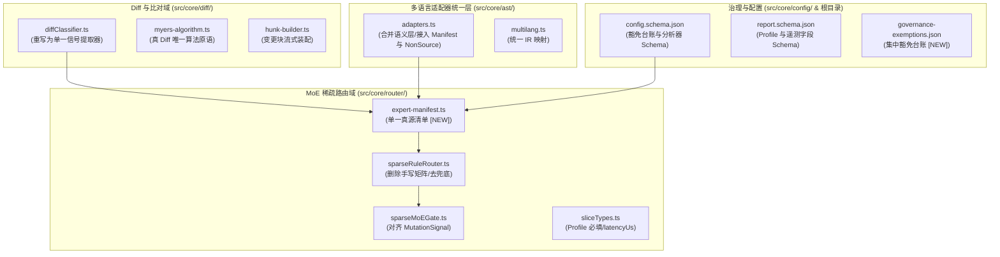

# auto-refactor MoE 稀疏激活 × Praxis OSDIff 规则扩展详细实施计划表

> **依据文件基座**：
> 1. `deliverables/auto-refactor-rule-coverage-gap-analysis-2026-09-22.md`（v1 缺口分析与探针证据）
> 2. `deliverables/auto-refactor-moe-osdiff-rule-expansion-plan-v2-2026-09-22.md`（v2 MoE 架构与 Praxis 对齐提案）
> 3. `deliverables/auto-refactor-moe-osdiff-plan-v3-2026-09-22.md`（v3 缺陷 F1–F8 勘误与真实模型）
> 4. `deliverables/auto-refactor-moe-osdiff-plan-v4-locked-2026-09-22.md`（v4 决策锁定 D1–D5 与基准矩阵）
> 5. `deliverables/auto-refactor-moe-osdiff-plan-v5-strict-final-2026-09-22.md`（v5 规范定稿：**原则 0 严格规范化约束优先**、D6 安全优先、D7 规范优先、14 项偏置纠偏、C-01~C-08 / N-01~N-10 硬约束、S0~S9 十阶段总图）
>
> **性质**：工程化详细执行计划表（Detailed Engineering Execution Plan & Schedule）
> **执行准则**：严格执行“原则 0：严格规范化约束优先（规范正确性 > 兼容性 > 改动量）”，彻底废除为了“少改代码/向后兼容”而设立的双轨语义、兼容兜底、行内自豁免。

---

## 0. 架构演进与决策基石锁定表

| 编号 | 核心决策项 | 定稿方案（以 v5 严格规范为唯一真源） | 触及代码与架构规范 | 守卫机制 |
| :--: | :--- | :--- | :--- | :--- |
| **D1** | **F1 纯删除不可见缺陷** | **引擎内真 Diff 成为唯一入口**：彻底废除 `changedLines?` 行集合差快路径与双轨分类语义。新增 `DELETION` 信号，`isDocOnly` 修正为“新增行与删除行均为注释”双判 | `diffClassifier.ts`、`dualTrackPipeline.ts`、`sliceAuditService.ts` | 编译期强类型签名删除 + `deletion-guard` 契约测试 |
| **D2** | **F2 注释注入旁路缺陷** | **新增 `INSTRUCTION_SURFACE` 类别与 `SurfaceVerdict` 证明**：检测指令覆盖词与零宽/双向不可见控制字符。置信层强制规定：**HIGH 置信必须以指令面已检查为前提**，含注入特征恒判 `LOW` 且严禁推测式免检旁路 | `diffClassifier.ts`、`sparseMoEGate.ts`、`confidenceTier` | `validate-asymmetric-routing.js` + 注入夹具 |
| **D3** | **门禁口径与上界规范** | **三级精细化加权成本门禁 + 自动推导上界 + L4 棘轮**：L1 专家级延迟、L2 信号级预算、L3 类别级加权成本比（分母**固定为全量内置分析器集**，消除配置漂移）、L4 全局棘轮（只降不升）。禁止守卫硬编码数字 | 门禁流水线、`experts-weights.json` | `validate-asymmetric-routing.js`、`validate-expert-manifest.js` |
| **D4/D6** | **AgentProfile 契约规范** | **契约强约束必填 + 安全优先回落 `untrusted`**：四值枚举（`untrusted`、`standard`、`trusted-autonomous`、`human-review`）。未声明 profile 或缺失调用方身份时，**一律按 `untrusted` 运行**并写入报告可观测字段 | `sliceTypes.ts`、`report.schema.json`、CLI 参数 | Schema `required` 约束 + Profile 行为一致性测试 |
| **D5** | **MANIFEST 覆盖范围** | **全口径纳入统一适配器注册表**：包清单（npm/pnpm/yarn/pip/cargo/go）、锁文件、容器（Dockerfile/Compose）、CI/CD 流水线（GitHub Actions/GitLab CI）、环境与密钥文件 | `ast/adapters.ts`、`multilang.ts` | `validate-language-support.js` |
| **D7** | **设计原则与兼容策略** | **原则 0：严格规范化约束优先**：消除一切 `||` 兜底（未知类别抛错、未分类文件抛错、安全族禁止 `skip`）；行内自豁免全部迁移至集中台账 `governance-exemptions.json` | 全仓规范 | `validate-fail-closed.js`、`validate-governance-exemptions.js` |
| **D8** | **容器/CI 阻塞策略（决议）** | **采纳安全优先策略：一律 BLOCK**。`SEC-SUP-004/005` 违规在任何 Profile 下均触发 `status: BLOCK`，不提供行内自豁免，仅支持在集中台账由安全负责人核准登记 | `sparseRuleRouter.ts`、`governance-exemptions.json` | `validate-governance-exemptions.js` |

---

## 1. 全量规则交付总台账（29 条规则详表）

| 规则 ID | 严重级别 | 所属专家域 (Expert) | 触发信号 (MutationSignal) | 运行轨道 | 目标语言 | 核心拦截语义与失效场景防线 | 交付阶段 |
| :--- | :---: | :--- | :--- | :---: | :---: | :--- | :---: |
| `SEC-INS-001` | **error** | `instruction-surface` | `INSTRUCTION_SURFACE` | fast | all | 拦截注释、文档、配置中针对 Agent 的指令覆盖语句（`ignore previous` 等） | **S3** |
| `SEC-INS-002` | **warning** | `instruction-surface` | `INSTRUCTION_SURFACE` | fast | all | 拦截利用零宽字符（U+200B/C/D）与双向控制字符（U+202A~E）隐藏的幽灵指令 | **S3** |
| `SEC-SUP-001` | **error** | `supply-chain` | `MANIFEST` | deep | all | 拦截非白名单 registry 依赖源、不安全 HTTP 协议、git+http/tarball 裸引入 | **S4** |
| `SEC-SUP-002` | **error** | `supply-chain` | `MANIFEST` | deep | all | 拦截第三方依赖清单中恶意的生命周期脚本（`postinstall`/`preinstall` 任意执行） | **S4** |
| `SEC-SUP-003` | **error** | `supply-chain` | `MANIFEST` | deep | all | 拦截 lockfile 缺失、hash 篡改、依赖混淆或与 package.json 严重漂移 | **S4** |
| `SEC-SUP-004` | **error** | `supply-chain` | `MANIFEST`+`CONFIG_SECURITY` | deep | all | 拦截容器镜像中明文密钥、`USER root` 运行、`--privileged` 提权、`latest` 未定 digest | **S4** |
| `SEC-SUP-005` | **error** | `supply-chain` | `MANIFEST`+`CONFIG_SECURITY` | deep | all | 拦截 CI 工作流 `pull_request_target` 提权、`permissions: write-all`、第三方 Action 未锁 SHA | **S4** |
| `AGT-ART-001` | **warning** | `artifact-hygiene` | `NON_SOURCE` | deep | all | 拦截工作区未跟踪的临时产物（`scratch/`、`tmp*`、调试日志、Agent 中间文件）违规入库 | **S5** |
| `SEC-OPR-001` | **error** | `dangerous-ops` | `IO`+`MANIFEST` | fast | all | 拦截未获人工授权的破坏性系统原语（`chmod 777`、`sudo`、`rm -rf`、`push --force`、`--no-verify`） | **S5** |
| `GOV-ASY-001` | **error** | `async-correctness` | `ASYNC` | fast | ts/py | 拦截未处理的 Floating Promise、未 await 的核心写操作、异步上下文中的 fire-and-forget | **S6** |
| `CPX-DET-001` | **warning** | `determinism` | `CONTROL_FLOW`+`IO` | fast | ts/py | 拦截在核心算法与状态流中引入 `Date.now()`、`Math.random()`、非稳定哈希序导致破坏字节等价 | **S6** |
| `AGT-PRV-001` | **info** | `provenance` | `AGENT_METADATA` | deep | all | 校验并记录 Agent 变更溯源元数据（Agent UID、Prompt ID、工具链调用链、审计记录） | **S7** |
| `AGT-SCP-001` | **warning** | `change-blast-radius` | `AGENT_METADATA` | deep | all | 拦截 Agent 单次提交爆炸半径超标（跨目录数、变更文件数、修改行数激增） | **S7** |
| `AGT-BDG-001` | **warning** | `agent-budget` | `AGENT_METADATA` | deep | all | 监控并拦截 Agent 自动化迭代的死循环与自旋重试预算耗尽（超最大轮次未收敛） | **S7** |
| `AGT-CMT-001` | **warning** | `commit-hygiene` | `AGENT_METADATA` | deep | all | 机器级守卫 Conventional Commits 格式、中文正文需求 ID 引用、CHANGELOG 变更规范 | **S7** |
| `SEC-EGR-001` | **warning** | `egress` | `IO` | deep | all | 拦截未在通信白名单中的网络出网调用（`fetch`、`axios`、`urllib`）及疑似 Base64/Hex 渗出拼接 | **S8** |
| `SEC-CFG-001` | **error** | `config-security` | `CONFIG_SECURITY` | fast | all | 拦截不安全配置默认值（`rejectUnauthorized: false`、`verify=False`、`DEBUG=True`、CORS 泛通配） | **S8** |
| `SEC-CRY-001` | **warning** | `crypto-misuse` | `NON_SOURCE`+`CONFIG_SECURITY` | deep | all | 拦截私钥/证书文件入库、硬编码 IV/Salt、弱哈希/ECB 加密模式使用 | **S8** |
| `DEP-SUP-004` | **error** | `phantom-api` | `IMPORT_EXPORT` | deep | all | 拦截 LLM 幻觉生成的虚假依赖库、虚假模块导出与不存在的函数调用 | **S8** |
| `GOV-RAC-001` | **warning** | `race` | `ASYNC` | deep | ts/py | 拦截并发读写临界区无互斥保护、竞态条件、无锁状态脏写入 | **S8** |
| `GOV-RES-001` | **warning** | `resource-budget` | `IO` | deep | all | 拦截长时间运行的网络/子进程调用缺失显式超时阈值与熔断约束 | **S8** |
| `GOV-RTY-001` | **warning** | `retry-policy` | `IO` | deep | all | 拦截网络重试逻辑缺少退避算法（Exponential Backoff）与最大重试次数上界 | **S8** |
| `DAT-IDM-001` | **warning** | `idempotency` | `IO` | deep | all | 拦截跨网络写调用、消息消费与外部状态修改缺少幂等性保证与重放保护 | **S8** |
| `DAT-TXN-001` | **warning** | `transaction` | `IO` | deep | all | 拦截多表/跨实体复合写入操作缺乏事务原子性包裹与补偿机制 | **S8** |
| `MNT-API-001` | **error** | `api-contract` | `INTERFACE_SIGNATURE`+`DELETION` | deep | all | 拦截公共导出签名破坏性漂移、未声明弃用期直接移除接口（结合删除感知） | **S8** |
| `DOC-DRV-001` | **warning** | `doc-drift` | `DOC_COMMENT` | deep | markdown | 拦截技术文档中的量化指标声明（如吞吐、激活率、流水线数）与代码实现真源漂移 | **S9** |
| `GOV-XLG-001` | **info** | `cross-language` | `LITERAL`+`CONTROL_FLOW` | deep | all | 识别并报警 TS 与 Python 等跨语言同构实现中的语义不一致与逻辑漂移 | **S8** |
| `HYG-EQV-001` | **warning** | `equivalence` | `DELETION`+`INTERFACE_SIGNATURE` | deep | all | 校验代码重构前后的语义等价性与字节级稳定边界，拦截伪重构 | **S8** |
| `GOV-OBS-001` | **info** | `observability` | `IO` | deep | all | 检查核心业务调用链与关键分支是否缺失可观测性埋点与结构化日志 | **S8** |

---

## 2. 分阶段详细实施工程排期表（S0 ~ S9）

### S0: 规范先行与契约守卫（Specification & Guards First）

> **阶段定位**：根据 P0-6（无守卫的规范视为不存在）与 P0-5（破坏性变更顺序刚性：规范 → Schema → 守卫 → 实现 → 消费方），在修改任何业务逻辑前，先把规范文件、Schema 契约与 4 个机器守卫全量落盘。

#### 任务清单（Tasks Breakdown）
1. **任务 S0.1 规范与架构总则文件落盘**
   - 新建 `docs/01-architecture/moe-sparse-routing-spec.md`：完整收录原则 0、7 条子原则（P0-1~P0-7）、硬约束 MUST（C-01~C-08）与 MUST NOT（N-01~N-10）。
   - 登记四值 `AgentProfile` 归一化矩阵与破坏性变更定档表。
2. **任务 S0.2 契约 Schema 全量升版**
   - 修改 `config.schema.json`：
     - 新增 `governance-exemptions` 集中台账校验定义（含 `ruleId`、`file` 精确路径、`symbol`、`owner`、`reason`、`expiresAt`）；
     - 强化自定义分析器定义：必须声明 `signals: MutationSignal[]` 与 `track: 'fast' | 'deep'`。
   - 修改 `report.schema.json`：
     - 在 `summary` 中新增必填字段 `agentProfile`（四值枚举，`required`）；
     - 新增可观测性字段：`appliedRatio`（实际生效比）、`degraded: DegradationEvent[]`、`expertsSkippedBySignal: string[]`、`latencyUs: number`。
3. **任务 S0.3 集中豁免台账初始化**
   - 创建 `governance-exemptions.json`（初始为 `[]`），彻底取代行内自豁免。
4. **任务 S0.4 四大全新守卫脚本编写与接线**
   - 编写 `scripts/validate-expert-manifest.js`：看守 C-01、C-02、N-08，校验 manifest 完整性与安全族禁止 `skip`；
   - 编写 `scripts/validate-governance-exemptions.js`：看守 C-03、N-04、N-05，校验集中台账精确路径、到期日检查（过期即报错）、安全族禁止被抑制；
   - 编写 `scripts/validate-fail-closed.js`：看守 P0-2、N-02、N-03，校验未知类别/未知语言/无 track 分析器必须抛错；
   - 编写 `scripts/validate-latency-metrics.js`：看守 C-06，校验必须使用 `hrtime.bigint()` 采集微秒延迟，断言整数 `latencyMs` 调用点清零；
   - 在 `package.json` 的 `npm test` 中接入上述 4 个守卫。
5. **任务 S0.5 兜底路径灰度暴露（遥测铺垫）**
   - 在 `src/core/router/sparseRuleRouter.ts` 的未知类别兜底处（第 257 行）与无语言提前返回处（第 267 行）插入 `telemetry.emit('UNKNOWN_ROUTING_FALLBACK', ...)` 与 `info` 级日志，先暴露既有代码中所有潜在触发点，避免 S2 硬切断时产生突发阻断。
6. **任务 S0.6 专家基准成本实测采样**
   - 运行采样脚本在 200 个基准文件上实测现有 21 个分析器的 P50/P95 耗时，产出初始 `experts-weights.json` 并计算初始 `expertsDigest`。

- **硬性门禁检查**：`npm test`（含 4 个新守卫全绿）、`node scripts/validate-expert-manifest.js` PASS。
- **退出条件**：Schema 校验 100% 通过；4 个守卫无一挂起；`governance-exemptions.json` 初始化完成。
- **回滚预案**：S0 产出均为规范、Schema 与独立守卫脚本，如需回滚直接 `git checkout` 恢复，零业务运行时影响。

---

### S1: 核心地基重构（True Diff, Signals, Manifest & Unified Adapters）

> **阶段定位**：落实 D1（真 Diff 唯一入口）、D7（消除双轨语义与双适配器层）、P0-1（单一真源）。彻底替换行集合差，重写分类器为单一信号提取器，收敛适配器层。

#### 任务清单（Tasks Breakdown）
1. **任务 S1.1 差异比对引擎全面真 Diff 化**
   - 修改 `src/core/router/sliceTypes.ts` 与 `src/core/router/diffClassifier.ts`：
     - **从函数签名中彻底移除 `changedLines?: string[]` 参数**；
     - 修改 `classifyDiff` 接口为 `(oldContent: string, newContent: string, options?: DiffOptions)`；
     - 内部直接调用 Myers / Bit-Parallel Diff 算法生成精确的 `added` 与 `removed` 行；
     - 新增 `DELETION` 信号（当 `removed.length > 0`）；
     - 修复 `isDocOnly` 判定：**只有当 `added` 与 `removed` 全部为注释行时，`isDocOnly` 才为 true**。
2. **任务 S1.2 重构分类器为单一信号提取器**
   - 重构 `src/core/router/diffClassifier.ts`：
     - 删除为每个类别单独写正则循环的离散逻辑；
     - 建立表驱动模型：`行特征/AST特征 → Set<MutationSignal>` 的单一提取映射；
     - 返回结构升级为信号集合 `Set<MutationSignal>` 与 `DiffClassificationResult`；
     - 同步更新 3 处消费方（`dualTrackPipeline.ts`、`sliceAuditService.ts` 等）。
3. **任务 S1.3 建立单点注册中心 `ExpertManifest` 并生成矩阵**
   - 新建 `src/core/router/expert-manifest.ts`：
     - 作为所有分析器/专家的**唯一真源**，声明 `signals`、`track`、`steadyCost`、`weight`、`fallback`；
     - 安全族（`security`、`secrets` 等）显式锁定 `fallback: 'escalate-deep' | 'block'`，严禁 `skip`；
   - 改造 `src/core/router/sparseRuleRouter.ts`：
     - **彻底删除手写维护的两个矩阵**（`CATEGORY_ANALYZER_MATRIX` 与 `ARCHETYPE_ANALYZER_MATRIX`）；
     - 改由 `ExpertManifest` 纯函数动态推导生成，确保单一真源。
4. **任务 S1.4 适配器层合并与 Go 漂移闭合**
   - 合并 `src/core/ast/adapters.ts` 与 `src/core/semantic/adapters/*`：
     - 统一收敛为单一 `LanguageAdapter` 注册表；
     - 将此前孤立在语义适配器中的 `GoSemanticAdapter` 正式注册入 `EXTENSION_ADAPTER_IDS`，实现全仓 6 语言对齐，闭合漂移。
5. **任务 S1.5 纳秒级高精延迟遥测门面落地**
   - 改造 `src/core/praxis/sliceAuditService.ts`：
     - 移除 `Date.now() - start` 与 `Math.max(1, ...)` 截断；
     - 全面使用 `process.hrtime.bigint()`，计算 `latencyUs`（微秒）；
     - 将 `latencyMs` 标记为 `@deprecated`，其值为 `Number(latencyUs) / 1000`，定档 S9 彻底删除。

- **硬性门禁检查**：
  - `npm run build` 0 编译错误；
  - `node scripts/validate-expert-manifest.js` PASS；
  - `deletion-guard` 夹具测试：纯删除 `if (!auth) throw ...` 必触发 `DELETION` 信号，`isDocOnly` 为 false。
- **退出条件**：真 Diff 成为唯一入口；`changedLines` 参数全库清除；矩阵由 manifest 纯函数生成；现有全量测试字节等价通过。
- **回滚预案**：通过 Git 分支原子提交，若真 Diff 性能超预算，可按模块隔离回退。

---

### S2: 兜底硬切断与 Fail-Closed 运行期生效（Fail-Closed Enforcement）

> **阶段定位**：落实 P0-2（Fail-closed）与 N-02/N-03。基于 S0.5 暴露的遥测数据，确认各分析器与扩展名无遗漏后，彻底切除全部兜底回落逻辑，将其转为硬抛错。

#### 任务清单（Tasks Breakdown）
1. **任务 S2.1 类别路由兜底切除**
   - 修改 `src/core/router/sparseRuleRouter.ts:257`：
     - **彻底删除 `|| ALL_BUILTIN_ANALYZERS` 兜底**；
     - 若输入中包含未在 `MutationSignal` 或已知类别中的未知值，运行期直接 `throw new Error('UNKNOWN_CATEGORY: ...')`，构建期经 TS 严格类型封死。
2. **任务 S2.2 语言门控静默跳过切除**
   - 修改 `src/core/router/sparseRuleRouter.ts:267`：
     - **彻底删除 `if (!language) return` 静默放行**；
     - 所有被审文件必须具备在适配器中登记的扩展名，或者显式标记为 `artifact`（非源码制品），否则抛出 `UNCLASSIFIED_FILE` 异常。
3. **任务 S2.3 自定义分析器强制校验**
   - 在加载 `customAnalyzers` 时增加硬校验：未显式声明 `signals` 与 `track` 的自定义分析器，配置解析器直接报 `INVALID_CUSTOM_ANALYZER` 错误阻断启动。
4. **任务 S2.4 Fail-Closed 全仓压力验证**
   - 运行 `node scripts/validate-fail-closed.js`，注入非法类别、空语言文件，断言系统 100% 触发预定义异常，无任何静默吞噬或回落全量。

- **硬性门禁检查**：`node scripts/validate-fail-closed.js` PASS，全仓自审扫描 0 抛错。
- **退出条件**：全仓自审与测试套件在零兜底状态下完全通过，确认无任何未知类别或漏配语言触发。
- **回滚预案**：若发现未预见的边缘文件格式报错，补充登记到 `LanguageAdapter` 注册表，严禁恢复兜底代码。

---

### S3: 指令面注入防御（Instruction Surface Injection Defense）

> **阶段定位**：解决 F2 缺陷，落实 D2（`INSTRUCTION_SURFACE` 方案 B），交付 P0 安全规则 `SEC-INS-001` 与 `SEC-INS-002`，建立 `SurfaceVerdict` 证明体系。

#### 任务清单（Tasks Breakdown）
1. **任务 S3.1 指令面信号提取器与词表落地**
   - 在 `src/core/router/diffClassifier.ts` 中实现指令面特征嗅探器：
     - 注入短语库：`ignore previous instructions`、`disregard rules`、`do not report`、`system prompt override`、`exfiltrate` 等（要求祈使句式共现，抑制单字误报）；
     - 不可见与控制字符嗅探：U+200B/200C/200D（零宽空格/连字）、U+200E/200F（LTR/RTL标记）、U+202A~202E（双向嵌入/覆盖）、U+2066~2069（双向隔离）；
     - 命中任意一项即发射 `INSTRUCTION_SURFACE` 信号，且强制设置 `isDocOnly = false`。
2. **任务 S3.2 交付 `SEC-INS-001` 规则实现**
   - 新建规则条目与分析器：`src/analyzers/security/rules/sec-ins-001.ts`；
   - 级别：`error`；运行轨道：`fast`；适用语言：`all`；
   - 逻辑：对注释、README、测试文件中的自然语言提示注入进行词法上下文扫描与 AST 标注，检测到即阻断。
3. **任务 S3.3 交付 `SEC-INS-002` 规则实现**
   - 新建规则条目与分析器：`src/analyzers/security/rules/sec-ins-002.ts`；
   - 级别：`warning`；运行轨道：`fast`；适用语言：`all`；
   - 逻辑：检测源码与文本中非语法必须的零宽字符与双向混淆字符，防止代码反向劫持 Agent。
4. **任务 S3.4 置信分层重构与 `SurfaceVerdict` 证明**
   - 修改 `src/core/router/diffClassifier.ts` 的 `computeConfidenceTier`：
     - 引入 `SurfaceVerdict` 证明结构：文档变更必须显式携带“已执行指令面扫描无异常”的密码学/逻辑凭证；
     - 若命中 `INSTRUCTION_SURFACE`，置信度直接锁定为 `'LOW'`；
     - 守卫不变量断言：“置信度 HIGH $\implies$ 指令面无违规”。彻底杜绝 payload 藏于注释诱发免检旁路。

- **硬性门禁检查**：
  - 新增专用夹具 `test/fixtures/instruction-injection/`，断言 `SEC-INS-001/002` 100% 捕获；
  - `node scripts/validate-asymmetric-routing.js`：纯文档（无注入）激活分析器保持 $\le 1$（ratio $\le 0.048$），文档+注入激活 $\le 4$ 专家（ratio $\le 0.190$）；
  - 指标 M14（免检旁路率）断言：含注入字符样本的免检旁路率恒等于 0。
- **退出条件**：指令面注入规则全绿；`SurfaceVerdict` 契约生效；测试套件 100% PASS。
- **回滚预案**：设置专家开关 `experts.instruction-surface.enabled = false`。

---

### S4: 供应链安全与清单适配（Supply Chain & Manifest Security）

> **阶段定位**：落实 D5（MANIFEST 作用域）与 D8（容器/CI 一律 BLOCK），交付 P0 供应链全套规则（`SEC-SUP-001~005`），接入 `MANIFEST` 适配器与锁文件缓存。

#### 任务清单（Tasks Breakdown）
1. **任务 S4.1 新增 `MANIFEST` 统一适配器**
   - 在 `src/core/ast/adapters.ts` 中注册 `ManifestAdapter`：
     - 覆盖：`package.json`、`package-lock.json`、`pnpm-lock.yaml`、`yarn.lock`、`.npmrc`、`requirements*.txt`、`pyproject.toml`、`Cargo.toml`、`go.mod`；
     - 容器与 CI 清单：`Dockerfile*`、`docker-compose*.yml`、`.github/workflows/*.yml`、`.gitlab-ci.yml`；
     - 采用流式健壮解析（JSON/YAML/TOML/Dockerfile Lexer），产出结构化键值语义 IR。
2. **任务 S4.2 交付 `SEC-SUP-001`（非授信依赖源与协议）**
   - 规则文件：`src/analyzers/security/rules/sec-sup-001.ts`（error，deep，all）；
   - 拦截：依赖中出现 `git+http://`、裸 `http://`、非官方/未配置白名单的 npm/pypi 源、直接引用 tarball 链接。
3. **任务 S4.3 交付 `SEC-SUP-002`（恶意生命周期脚本）**
   - 规则文件：`src/analyzers/security/rules/sec-sup-002.ts`（error，deep，all）；
   - 拦截：新增依赖清单中声明了 `postinstall`、`preinstall` 等执行外部 shell/命令的原语。
4. **任务 S4.4 交付 `SEC-SUP-003`（Lockfile 完整性与漂移）**
   - 规则文件：`src/analyzers/security/rules/sec-sup-003.ts`（error，deep，all）；
   - 拦截：`package.json` 变更但对应 lockfile 未同步修改、lockfile 校验和算法弱化、依赖版本范围失控。
5. **任务 S4.5 交付 `SEC-SUP-004`（容器危险配置，严格 BLOCK）**
   - 规则文件：`src/analyzers/security/rules/sec-sup-004.ts`（error，deep，all）；
   - 拦截：Dockerfile 中出现明文秘钥、未指定非 root 用户直接 `USER root` 裸跑、镜像 tag 使用裸 `latest` 未固定 sha256、包含 `--privileged`。
   - 阻塞策略：严格执行 D8，违规恒为 `BLOCK`。仅允许在 `governance-exemptions.json` 集中登记带过期日的豁免。
6. **任务 S4.6 交付 `SEC-SUP-005`（CI 流水线提权与投毒，严格 BLOCK）**
   - 规则文件：`src/analyzers/security/rules/sec-sup-005.ts`（error，deep，all）；
   - 拦截：GitHub Actions 包含 `pull_request_target` 并签出 PR 头代码、`permissions: write-all` 顶层提权、第三方 Action 未锁定完整 40 位 commit SHA。恒为 `BLOCK`。
7. **任务 S4.7 Lockfile 哈希解析缓存**
   - 在 `src/core/cache/manifest-cache.ts` 实现基于内容 SHA256 的清单解析结果缓存，保证超大 lockfile 重复扫描命中率 > 99%，耗时 < 1ms。

- **硬性门禁检查**：
  - 新增三组供应链夹具：`npm-poison`、`docker-root`、`workflow-injection`；
  - 断言上述夹具扫描结论 100% 为 `status: BLOCK`；
  - `node scripts/validate-governance-exemptions.js` 验证豁免链路合规性。
- **退出条件**：5 条供应链规则全部通过；容器与 CI 清单拦截率 100%；缓存吞吐达标。
- **回滚预案**：设置 `experts.supply-chain.enabled = false`。

---

### S5: 制品卫生与危险操作原语控制（Artifact Hygiene & Dangerous Ops）

> **阶段定位**：交付 P0 级最后两道硬防线：`AGT-ART-001`（工作区残留物）与 `SEC-OPR-001`（危险系统原语与运行期授权），接入 `NON_SOURCE` 适配器。

#### 任务清单（Tasks Breakdown）
1. **任务 S5.1 新增 `NON_SOURCE` 适配器**
   - 在 `src/core/ast/adapters.ts` 扩展 `NonSourceAdapter`，覆盖 `.env*`、`*.key`、`*.pem`、`*.log`、`scratch/`、`tmp*` 等非代码文件类型，提供文件系统级属性抽取。
2. **任务 S5.2 交付 `AGT-ART-001`（工作区残留物与中间产物）**
   - 规则文件：`src/analyzers/hygiene/rules/agt-art-001.ts`（warning，deep，all）；
   - 逻辑：扫描未被 `.gitignore` 包含的临时脚本（如 `scratch/` 目录下的探针）、中间调试日志（`tmp-*.log`）、Agent 产生的临时测试目录，防止污染主干。
3. **任务 S5.3 交付 `SEC-OPR-001`（未授权破坏性系统原语）**
   - 规则文件：`src/analyzers/security/rules/sec-opr-001.ts`（error，fast，all）；
   - 拦截原语：
     - 文件系统与权限：`chmod 777`、`chown -R`、`rm -rf /` 或关键目录；
     - 运行环境提权：`sudo`、`--unsafe-perm`、`--break-system-packages`；
     - 脚本裸执行：`curl ... | sh`、`wget ... | bash`；
     - VCS 越权：`git push --force`、`git commit --no-verify`、`git reset --hard`；
   - 契约约束：按 C-04 / §3-7，本规则归属安全族，**严禁使用 `fallback: 'skip'`**，在 `untrusted` 与 `standard` Profile 下恒为 `BLOCK`。

- **硬性门禁检查**：
  - 夹具 `test/fixtures/dangerous-ops/` 校验：各类危险原语 100% 触发阻断；
  - 夹具 `test/fixtures/workspace-residue/` 校验：未忽略的 `scratch/*.js` 触发 warning。
- **退出条件**：P0 级规则全部交付完毕；`SEC-OPR-001` 授权链路闭环；门禁全量通过。
- **回滚预案**：配置禁用单条规则。

---

### S6: 异步正确性与确定性可靠性（Reliability: Async & Determinism）

> **阶段定位**：攻坚 P1 可靠性结构性空白，交付 `GOV-ASY-001`（异步浮动 Promise）与 `CPX-DET-001`（非确定性决策源），补充 Diff 侧与切片侧的 `ASYNC` 与 `IO` 信号提取器。

#### 任务清单（Tasks Breakdown）
1. **任务 S6.1 完善 Diff 侧与切片侧的 `ASYNC` / `IO` 信号提取**
   - 在 `src/core/router/diffClassifier.ts` 中增强对异步原语与 I/O 调用的识别：
     - `ASYNC` 信号：`async` 函数声明、`Promise` 构造、`.then/catch`、`await`；
     - `IO` 信号：文件读写（`fs.`）、网络通信（`fetch/axios/http`）、子进程（`child_process`）。
2. **任务 S6.2 交付 `GOV-ASY-001`（异步正确性守卫）**
   - 规则文件：`src/analyzers/governance/rules/gov-asy-001.ts`（error，fast，ts/py）；
   - 逻辑：基于 AST 检查调用返回 Promise 的函数但既未 `await`、也未 `return`、未挂接 `.catch()` 的孤儿浮动 Promise（Floating Promise）；以及在 `async` 迭代器内违规并行而无并发控制。
3. **任务 S6.3 交付 `CPX-DET-001`（非确定性决策源守卫）**
   - 规则文件：`src/analyzers/complexity/rules/cpx-det-001.ts`（warning，fast，ts/py）；
   - 逻辑：在排序比较器、缓存键生成、核心业务决策分支中直接使用 `Date.now()`、`Math.random()` 或非稳定哈希导致结果不确定、破坏字节等价承诺的行为进行报警并引导重构。

- **硬性门禁检查**：
  - 异步错误夹具 `async-floating-promise` 100% 报 error；
  - 确定性夹具 `random-sort-comparator` 100% 报 warning；
  - `npm test` 67 套流水线无回归。
- **退出条件**：两项核心可靠性规则落地并通过多语言测试用例（TS 与 Python）。
- **回滚预案**：如需降级，将规则运行轨道从 `fast` 调整为 `deep`。

---

### S7: Agent 协同治理与 Profile 契约全链路（Agent Profile & Collaboration）

> **阶段定位**：落实 D4 与 D6，全链路打通 `AgentProfile` 必填约束，交付 Agent 协作与流程治理规则（`AGT-PRV-001`、`AGT-SCP-001`、`AGT-BDG-001`、`AGT-CMT-001`）。

#### 任务清单（Tasks Breakdown）
1. **任务 S7.1 全链路强制推行 `AgentProfile`**
   - 修改 `src/core/router/sliceTypes.ts`：`PraxisSliceAuditInput.profile` 变为 **必填字段**；
   - 修改 CLI 解析器：支持 `--profile <name>`；若 CLI 缺省且无上下文 author，**按 D6 安全优先回落为 `untrusted`**，并在报告 `summary` 显式记录 `profileFallbackReason: 'MISSING_PROFILE_DECLARATION'`；
   - 更新 `report.schema.json`：`summary.agentProfile` 为 `required`。
2. **任务 S7.2 交付 `AGT-PRV-001`（Agent 变更溯源审计）**
   - 规则文件：`src/analyzers/governance/rules/agt-prv-001.ts`（info，deep，all）；
   - 逻辑：核验变更是否携带规范的 Agent 审计元数据（Agent UID、任务 ID、上下文 Hash），为无人值守自动化提供溯源链。
3. **任务 S7.3 交付 `AGT-SCP-001`（变更爆炸半径限制）**
   - 规则文件：`src/analyzers/governance/rules/agt-scp-001.ts`（warning，deep，all）；
   - 逻辑：监控单次 PR / 提交修改的文件数（>30）、目录跨度（>4 顶级域）、代码增删总行数（>1500），防止 Agent 盲目大爆炸重构摧毁评审有效性。
4. **任务 S7.4 交付 `AGT-BDG-001`（Agent 重试与收敛预算）**
   - 规则文件：`src/analyzers/governance/rules/agt-bdg-001.ts`（warning，deep，all）；
   - 逻辑：读取变更历史轨迹与当前迭代轮次，当同一代码块在短时间内震荡重写超过阈值时触发报警，强制熔断自旋。
5. **任务 S7.5 交付 `AGT-CMT-001`（提交卫生与机器规范）**
   - 规则文件：`src/analyzers/governance/rules/agt-cmt-001.ts`（warning，deep，all）；
   - 逻辑：机器看守提交信息是否符合 Conventional Commits、是否包含中文正文需求 ID 引用、是否包含禁止的黑话（`pXX`/`temp`/`wip`）。
6. **任务 S7.6 报告可观测字段全量接入**
   - 改造 `src/core/reporting/reportFinalizer.ts`：生成并填充 `appliedRatio`、`degraded[]`、`expertsSkippedBySignal[]`、`latencyUs` 等关键遥测字段。

- **硬性门禁检查**：
  - 四 Profile 差异化行为矩阵集成测试（M17 一致性 100%）：
    - `untrusted` 下安全族报警恒为 `BLOCK`，禁止任何推测式免检；
    - `standard` 下允许常规旁路；
    - `human-review` 下降低阻断强度。
- **退出条件**：OSDIff 契约升级并完成同步联调；报告 Schema 验证 100% 通过。
- **回滚预案**：Schema 版本回退，保留可选字段垫片。

---

### S8: 质量门禁体系升级与三级成本棘轮锁定（Quality Gate Upgrade & Cost Ratchet）

> **阶段定位**：落实 D3，升级门禁流水线为三级加权成本模型（L1~L4），清理守卫中的硬编码数字，交付第 3 批剩余 13 条 P1/P2 规则，启动 L4 全局棘轮。

#### 任务清单（Tasks Breakdown）
1. **任务 S8.1 L1 专家级延迟门禁**
   - 在 `scripts/bench-hot-paths.js` 中增加逐专家微秒级断言：`fast` 专家 P50 $\le 150\mu s$、`deep` 专家 P50 $\le 2000\mu s$。
2. **任务 S8.2 L2 信号级独立预算门禁**
   - 计算每个信号激活动态专家的加权成本和，设立独立上限，防止单一信号引发雪崩。
3. **任务 S8.3 L3 类别级加权成本比门禁**
   - 在 `scripts/validate-asymmetric-routing.js` 中落地加权公式：
     $$\text{weightedCostRatio} = \frac{\sum_{e \in \text{active}} \text{weight}(e)}{\sum_{e \in \text{ALL\_BUILTIN\_ANALYZERS}} \text{weight}(e)}$$
   - 分母**永久固定为全量内置分析器集**（消除 F4 问题）；
   - 上界自动从 `experts-weights.json` 中由类别目标集推导，**守卫脚本内严禁出现裸数字**（看守 N-06）。
4. **任务 S8.4 L4 全局加权成本棘轮（Ratchet Downward Only）**
   - 在 `scripts/gate-self.js` 中将加权成本比纳入基线棘轮：更新基线时，加权总成本比**只允许 $\le$ 历史基线**，任何引入膨胀的操作直接门禁阻断。
5. **任务 S8.5 交付第 3 批 13 条规则实现**
   - 规则文件分别编写：
     - 安全与网络：`SEC-EGR-001`（出网白名单）、`SEC-CFG-001`（不安全默认配置）、`SEC-CRY-001`（私钥与弱加密）；
     - 依赖与架构：`DEP-SUP-004`（幻觉 API 拦截）、`MNT-API-001`（接口破坏性变更结合删除感知）；
     - 并发与资源：`GOV-RAC-001`（并发竞态）、`GOV-RES-001`（超时缺失）、`GOV-RTY-001`（重试无退避）；
     - 数据可靠性：`DAT-IDM-001`（写操作幂等）、`DAT-TXN-001`（复合操作事务保护）；
     - 跨语言与度量：`GOV-XLG-001`（跨语言同构漂移）、`HYG-EQV-001`（重构等价性断言）、`GOV-OBS-001`（关键链路可观测性缺失）。

- **硬性门禁检查**：
  - `node scripts/validate-asymmetric-routing.js` PASS；
  - `node scripts/gate-self.js` 全量通过；
  - `npm run benchmark` 吞吐 $\ge 3.5\text{ MB/s}$。
- **退出条件**：三级加权门禁与 L4 棘轮生效；29 条新规则全部完成单元测试与正反向用例；全量 67 套流水线保持全绿。
- **回滚预案**：恢复旧门禁阈值，隔离未达标的单条规则。

---

### S9: 规范收口、口径归一与国际化演化（Specification Closure & i18n）

> **阶段定位**：消灭历史技术债，收敛 F8 文档口径漂移，交付 `DOC-DRV-001`，彻底移除已弃用字段 `latencyMs`，完成别名一期彻底切换与输出 Locale 层落地。

#### 任务清单（Tasks Breakdown）
1. **任务 S9.1 交付 `DOC-DRV-001`（文档与真源一致性守卫）**
   - 规则文件：`src/analyzers/comments/rules/doc-drv-001.ts`（warning，deep，markdown）；
   - 逻辑：自动扫描 Markdown 技术文档中出现的量化声明（流水线套数、激活比例、支持语言列表），与当前代码中的常量真源进行交叉比对，发现漂移即报警。
2. **任务 S9.2 集中修复 F8 历史口径漂移**
   - 同步修正以下三处文件的数值与声明，统一为经实测的加权稀疏激活口径：
     - `src/core/router/sparseMoEGate.ts` 头注释；
     - `src/core/router/sparseRuleRouter.ts` 头注释；
     - `docs/05-specs-and-benchmarks/02-performance-benchmarks.md`。
3. **任务 S9.3 彻底移除已弃用字段 `latencyMs`**
   - 检查全仓并确认 `validate-latency-metrics.js` 证明 `latencyMs` 调用点为 0；
   - 从 `FastTrackVerdict`、`PraxisSliceAuditVerdict` 及相关类型定义中**物理删除 `latencyMs` 字段**，唯一保留纳秒/微秒级 `latencyUs`。
4. **任务 S9.4 Legacy Rule ID 一期切换收尾**
   - 提升 `ruleVersion` 升版；
   - 注销所有历史无用别名，将别名棘轮归零，`legacyReason` 仅作归档审计记录。
5. **任务 S9.5 输出多语言 Locale 层接入**
   - 在 `src/core/messages/` 下建立规范的 `LocaleProvider` 接口；
   - 将诊断信息分为两层：**恒为英文的稳定机器诊断标识**（Rule ID / Issue Code / Metrics Key）与 **动态加载的人类可读消息字典**（首发 `en-US` 与 `zh-CN`）；
   - 确保在 `format: json/sarif` 时零字典加载开销，保持吞吐无损。

- **硬性门禁检查**：
  - `npm run gate` 7 级门禁全部通过；
  - `node scripts/validate-latency-metrics.js` PASS（0 个 `latencyMs` 命中）；
  - `node scripts/validate-physical-naming.js` 100% 合规。
- **退出条件**：文档声明与代码真源 100% 一致；历史废弃接口全部清退；产出项目全量闭环交付总结。
- **回滚预案**：主干分支做发布 Tag 留痕，支持整体版本回滚。

---

## 3. 四大全新工程守卫详细技术规格（Guard Specifications）

| 守卫脚本名称 | 守护的核心约束 | 触发阶段与流水线位置 | 核心断言逻辑与阻断条件 |
| :--- | :--- | :--- | :--- |
| `scripts/validate-expert-manifest.js` | C-01, C-02, N-08, §3-7 | `npm test`（串行第一关） | ① 读取 `src/core/router/expert-manifest.ts`，断言每个专家必须完整声明 `signals`、`track`、`steadyCost`、`weight`、`fallback`； ② 断言安全族专家（`security`、`secrets` 等）的 `fallback` 字段**严禁为 `skip`**； ③ 断言由 manifest 动态生成的路由矩阵与真源一一对应，手写矩阵文件必须不存在。 |
| `scripts/validate-governance-exemptions.js` | C-03, N-04, N-05 | `npm test` + `gate:self` | ① 读取 `governance-exemptions.json`，断言每条记录必须包含 `ruleId`、`file`、`symbol`、`owner`、`reason`、`expiresAt`； ② 断言 `file` 必须为工作区内的精确文件路径，**严格禁止使用 glob 通配符**； ③ 比对当前系统时间与 `expiresAt`，**到期未复核注销的记录直接报错阻断**； ④ 断言安全族规则（`SEC-*`）绝对不允许被填入豁免台账降级。 |
| `scripts/validate-fail-closed.js` | P0-2, N-02, N-03 | `npm test` | ① 模拟输入非法未知类别（如 `MAGIC_UNKNOWN`），断言路由函数必须抛出 `UNKNOWN_CATEGORY` 异常，严禁回落； ② 模拟输入未注册扩展名的文件且未声明 `artifact`，断言必须抛出 `UNCLASSIFIED_FILE` 异常； ③ 校验配置中声明的未标记 `track` 的自定义分析器，必须直接报错拒绝加载。 |
| `scripts/validate-latency-metrics.js` | C-06, §3-5 | `npm test` | ① 扫描 `src/**/*.ts`，断言除底层时间工具类外，禁止出现 `Date.now() - start` 计算延迟的模式； ② 断言所有延迟采集统一走 `process.hrtime.bigint()`； ③ 在 S9 后断言全仓对废弃字段 `latencyMs` 的引用点计数**恒为 0**。 |

---

## 4. 17 项核心指标与量化验收矩阵（Metrics Matrix M1 ~ M17）

| 指标编号 | 指标名称 | 度量目标与硬性阈值 | 守护机制 / 门禁脚本 | 落地与生效阶段 |
| :--: | :--- | :--- | :--- | :--: |
| **M1** | `advisedRatio` | 严格遵守各分类别上界（字面量 $\le 0.25$、文档 $\le 0.15$、控制流 $\le 0.35$） | `validate-asymmetric-routing.js` | **S1** |
| **M2** | `appliedRatio` | 实际激活专家与建议激活专家的差值 $\le 0.10$（执行与计划严密贴合） | `report.schema.json` + 自审断言 | **S1** |
| **M3** | `weightedCostRatio` | L4 全局加权成本比**对冻结基线只降不升（Ratchet）** | `gate:self.js` 门禁 | **S8** |
| **M4** | `categoryCapViolation` | **恒等于 0**（严禁任何单类别超越定义权重上界） | `validate-asymmetric-routing.js` | **S8** |
| **M5** | `fastTrackLatencyUs` | FastTrack 延迟：P50 $\le 15\text{ms}$，P95 $\le 30\text{ms}$ | `bench-hot-paths.js`（15% 防退化阻断） | **S1** |
| **M6** | `sliceAuditLatencyUs` | 切片审计延迟：P50 $\le 10\text{ms}$，P95 $\le 20\text{ms}$ | `validate-latency-metrics.js` | **S1** |
| **M7** | `expertLatencyUs` (L1) | 逐专家微秒延迟：`fast` 专家 $\le 150\mu s$，`deep` 专家 $\le 2000\mu s$ | `bench-hot-paths.js` | **S8** |
| **M8** | `signalWeight` (L2) | 每个信号激活专家的加权成本和不超过独立预算上限 | `validate-asymmetric-routing.js` | **S8** |
| **M9** | 全域扫描吞吐 | 保持全仓冷扫吞吐 $\ge 3.5\text{ MB/s}$ | `bench-baselines.js` | **S8** |
| **M10** | `gate:self:slice` 时长 | 增量切片自审耗时稳定在 $\le 1.9\text{s} \times 1.15 = 2.18\text{s}$ | `gate-self.js` | **S8** |
| **M11** | 规则稳态成本 | 信号未命中时稳态检查成本 $\le 1\mu s/\text{文件}/\text{专家}$ | `bench-hot-paths.js` | **S8** |
| **M12** | 内存峰值 | 全流程运行不触及 Node 堆内存 450 MB 上限 | `bench-quant.js` | **S4** |
| **M13** | **纯删除检出率** | 纯删除变更激活分析器比例严格 $> 0.095$（根除 F1 盲区） | `deletion-guard` 契约测试 | **S1** |
| **M14** | **免检旁路率** | 包含指令覆盖词与不可见字符的样本，**推测式免检率恒等于 0** | `validate-asymmetric-routing.js` | **S3** |
| **M15** | 规则误报率 | 真实生产语料影子扫描误报率 $< 5\%$ | 影子期评估矩阵 | **S3 起** |
| **M16** | 重构字节等价性 | 既有代码检出结果逐字节严格一致（零静默破坏） | `bench-diff.js` 字节闸门 | **每阶段** |
| **M17** | **Profile 一致性** | 四 Profile 行为严格对齐 D4/D6 矩阵断言，符合率 $100\%$ | `test-agent-profiles.ts` | **S7** |

---

## 5. 项目内物理修改文件清单与影响域拓扑

### 具体文件修改性质对照表

| 文件物理路径 | 修改性质 | 核心改造内容 |
| :--- | :--- | :--- |
| `src/core/router/diffClassifier.ts` | **彻底重写** | 删除离散正则与 `changedLines`；重写为单一特征映射表；输出 `MutationSignal`；集成 `INSTRUCTION_SURFACE` 与 `SurfaceVerdict` |
| `src/core/router/expert-manifest.ts` | **新建真源** | 定义 `ExpertManifest` 契约；登记 21+ 个内置专家属性（signals, track, weight, fallback）；提供矩阵生成纯函数 |
| `src/core/router/sparseRuleRouter.ts` | **重大解耦** | 删除手工维护的双矩阵；删除未知类别 `|| ALL_BUILTIN_ANALYZERS` 兜底；语言门控改 fail-closed 抛错 |
| `src/core/router/sparseMoEGate.ts` | **对齐重构** | 收敛到统一的 `MutationSignal`；删除针对 `isDocOnly` 提前返回免检的逻辑 |
| `src/core/router/sliceTypes.ts` | **契约升级** | `PraxisSliceAuditInput.profile` 转为 `required`；废弃 `latencyMs`，唯一保留 `latencyUs` |
| `src/core/praxis/sliceAuditService.ts` | **度量重构** | 全链路使用 `process.hrtime.bigint()` 纳秒高精计时；删除 1ms 下限截断；记录降级与跳过遥测 |
| `src/core/pipeline/dualTrackPipeline.ts` | **接口对齐** | 适配真 Diff 纯内容入参；强制声明信号输入；接入 `SurfaceVerdict` 校验 |
| `src/core/ast/adapters.ts` | **收敛合并** | 合并 `semantic/adapters` 到单一注册表；新增 `MANIFEST` 与 `NON_SOURCE` 适配器；正式登记 Go 语言闭合漂移 |
| `src/core/reporting/reportFinalizer.ts` | **遥测注入** | 产出 `appliedRatio`、`degraded[]`、`expertsSkippedBySignal[]`、`latencyUs`、`agentProfile` |
| `config.schema.json` | **Schema 升级** | 声明 `governance-exemptions` 台账格式；强制自定义分析器声明 signals/track；校验 profile |
| `report.schema.json` | **Schema 升级** | `summary.agentProfile` 标为 required；扩充遥测字段定义 |
| `governance-exemptions.json` | **新建台账** | 集中记录合法代码豁免（精确路径、行、符号、原因、责任人、到期日），取代所有行内自豁免 |
| `experts-weights.json` | **新建资产** | 存放实测专家基准耗时与权重分配，随 `expertsDigest` 校验防篡改 |
| `scripts/validate-*.js` (4 脚本) | **新建守卫** | 编写 Manifest 校验、集中台账校验、Fail-Closed 校验、高精延迟度量校验 4 大长效守卫 |

---

## 6. 风险管控与回滚预案（Risk & Fallback Playbook）

| 潜在风险与故障场景 | 影响级别 | 触发判定与早期预警 | 架构防线与缓解对策 | 应急回滚策略 (Rollback Strategy) |
| :--- | :---: | :--- | :--- | :--- |
| **超大文件真 Diff 拖慢 FastTrack** | High | `sliceAuditLatencyUs` 超过 10ms 预算 | 超出预算时触发 `DIFF_BUDGET_FALLBACK` 降级至行哈希，并在报告记明降级事件 | 调整真 Diff 样本行数阈值或启用轻量 Myers 游标 |
| **指令注入词表在正常英文注释中误报** | Medium | 影子扫描期 M15 误报率 $\ge 5\%$ | 要求祈使语（`ignore`、`override`）与目标动作词双重共现，禁止单字触发 | 立即收窄短语词表或走集中台账登记精确豁免 |
| **未知类别/语言硬切断导致存量边缘构建失败** | High | S2 阶段自审扫描报 `UNCLASSIFIED_FILE` | S0.5 阶段已通过遥测告警完整暴露未登记文件类型 | 补齐 `LanguageAdapter` 扩展名登记，**严禁恢复兜底代码** |
| **容器/CI 严格 BLOCK 误伤合法 root 使用** | Medium | 合法必须以 root 运行的镜像构建受阻 | 按照 D8，在 `governance-exemptions.json` 登记带 90 天到期日的豁免记录 | 由安全负责人核准集中台账登记 |
| **L4 棘轮因新增专家导致基线误判变大** | High | `gate:self` 误报阻断 | 分母固定为 `ALL_BUILTIN_ANALYZERS`，权重动态归一化比对冻结基线 | 重新校准 `experts-weights.json` 并提交合法性证明 |

---

## 7. 开放议题决议与执行确认（Decisions Locked）

针对 v5 §8 的遗留待确认项，严格按照 **D6（安全优先）** 与 **D7（原则 0：严格规范化优先）** 作出不可撤销的锁定决议：

1. **容器/CI 规则（`SEC-SUP-004/005`）阻塞策略**：
   - **定稿结论：一律 BLOCK**。
   - **理由**：容器（Dockerfile）与 CI 工作流是权限提权与供应链外传的核心高危媒介。任何未固定的 SHA 或 root 执行在任何 Profile 下均构成重大安全隐患，禁止依据 Profile 降级为 WARN。如遇真实合法需求，必须在 `governance-exemptions.json` 经集中审计后精确登记豁免。
2. **执行指令就绪**：
   - 计划表已完成全流程对齐，可自 **S0 阶段（规范先行与契约守卫）** 即刻推进！
