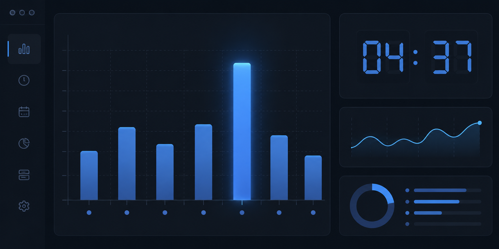

# Workspace Timing  ⏱

> 🪶 轻量化 · 高可扩展 — 环形缓冲区 + Journal 双写入架构；跨工作区聚合对比、多维报表、中英双语与崩溃保护。  
> Lightweight & extensible — RingBuffer + Journal dual-write architecture; multi-workspace comparison, rich analytics, bilingual UI, and crash safety.

---

## ✨ 功能亮点 | Features

- ⏱ **自动计时** · Auto-timing — 打开工作区即自动开始计时，无缝记录编码时间
- 🎯 **周工作上限与健康提醒** · Weekly limit & rest reminders — 自定义周工时阈值，动态渐变进度条与阈值分割线，超限贴心提醒休息
- 📊 **周报图表** · Weekly chart — 最近 7 天柱状图与实时活跃曲线一键切换
- 🔥 **活动热力图** · Activity heatmap — 近 12 周 GitHub 风格每日活跃时间线，5 档着色一目了然
- ⏰ **按小时分布** · Hourly breakdown — 今日 24 小时活跃分布与 X 轴刻度，峰值小时高亮
- 🌐 **跨工作区聚合与对比** · Cross-workspace — 聚合所有工作区时长，内置占比对比柱状图
- 🛡️ **三级存储与崩溃保护** · Crash-safe — RingBuffer → Journal(NDJSON) → FullSave(JSON) 零丢失
- 🎨 **配置面板与仪表板** · Dashboard — 实时统计、配置热更新、明细钻取、报表导出
- 🌐 **双语支持** · Bilingual i18n — 简体中文 / English 运行期热切换，词条覆盖率 100%
- 📤 **多格式导出** · Multi-format export — 支持会话明细 CSV、全历史聚合日报 CSV、Markdown 日报/周报
- 💾 **安全快照与还原** · Snapshots & restore — 破坏性操作前自动快照，支持从 JSON 文件验证还原

---

## 💻 命令清单 | Commands

| Command | 说明 | Description |
|---------|------|-------------|
| `Workspace Timing: Open Dashboard` | 打开统计与设置面板 | Open the stats & settings dashboard |
| `Workspace Timing: Enable Timing` | 启用当前工作区计时 | Enable timing for current workspace |
| `Workspace Timing: Disable Timing` | 禁用当前工作区计时 | Disable timing for current workspace |
| `Workspace Timing: Toggle Global Timing` | 全局启用/禁用开关 | Global on/off toggle for all workspaces |
| `Workspace Timing: Toggle Status Bar Display Mode` | 循环切换状态栏显示模式 | Cycle status bar modes (today/total/compact) |
| `Workspace Timing: Export CSV` | 导出当前工作区会话明细 CSV | Export workspace session records as CSV |
| `Workspace Timing: Export Aggregated Daily CSV` | 导出全历史聚合日报序列 CSV | Export all-history daily totals as CSV |
| `Workspace Timing: New Counting Period` | 新建周期（重置累计，保留历史） | Reset total counter, keep session history |
| `Workspace Timing: Clear History Details` | 清除历史明细（保留累计总时长） | Clear history sessions, keep total duration |
| `Workspace Timing: Clear Cross-Workspace Totals` | 清除跨工作区累计数据 | Clear aggregated multi-workspace totals |
| `Workspace Timing: Restore from Backup File` | 从 JSON 备份文件还原 | Restore timing data from a JSON backup file |
| `Workspace Timing: Reset Timing Data` | 重置本工作区全部数据 | Reset workspace timing data completely |
| `Workspace Timing: Force Save Now (Debug)` | 立即强制存盘（调试用） | Force immediate flush & checkpoint |

> 💡 **状态栏快捷切换**：直接点击状态栏右侧的时钟图标，可在三种模式间无缝切换：  
> `今日 30m · 累计 2h` → `累计 2h · 今日 30m` → `30m`（仅今日）

---

## 🗄️ 存储架构 | Storage Architecture

计时数据采用四级分层存储保障性能与安全：
1. **内存缓存**：`RingBuffer<TimeSlice>` 收集秒级时间片增量，O(1) 读写，避免频繁 I/O。
2. **崩溃保护**：`.vscode/workspace-timing.journal`（NDJSON 格式增量日志，定期追加，崩溃即时回放）。
3. **主持久化**：VS Code `workspaceState`（扩展主机主存）+ `.vscode/workspace-timing.json`（可版本控制的格式化备份）。
4. **跨工作区聚合**：`ExtensionContext.globalState`（自动回收 30 天未同步失联工作区）。

---

## ⚙️ 扩展设置 | Extension Settings

| 配置项 | 默认值 | 说明 |
|--------|:------:|------|
| `workspaceTiming.locale` | `auto` | 界面语言 (`auto` 跟随 VS Code / `zh-CN` / `en`) |
| `workspaceTiming.enabled` | `true` | 是否启用当前工作区的时长追踪 |
| `workspaceTiming.globalDisabled` | `false` | 全局禁用所有工作区的时长追踪 |
| `workspaceTiming.statusBar.enabled` | `true` | 是否在状态栏右侧显示计时器 |
| `workspaceTiming.statusBar.format` | `compact` | 状态栏显示格式 |
| `workspaceTiming.weeklyLimit.enabled` | `false` | 是否启用周工作上限监控与休息提醒 |
| `workspaceTiming.weeklyLimit.hours` | `40` | 周工作上限时长（小时，范围 1~168） |
| `workspaceTiming.storage.backupToFile` | `true` | 启用 `.vscode/workspace-timing.json` 文件备份 |
| `workspaceTiming.storage.journalEnabled` | `true` | 启用 journal 崩溃保护日志 |
| `workspaceTiming.storage.ringBufferCapacity` | `1024` | 环形缓冲区时间片容量上限 |
| `workspaceTiming.storage.journalFlushInterval` | `10000` | Journal 批量落盘间隔 (ms) |
| `workspaceTiming.storage.fullSaveInterval` | `60000` | 全量检查点存盘与全局同步间隔 (ms) |
| `workspaceTiming.storage.maxSessions` | `5000` | 历史会话保留条数上限 (0 = 不限) |
| `workspaceTiming.storage.historyRawRetentionDays` | `45` | 原始会话保留天数（超出自动折叠为日汇总桶） |
| `workspaceTiming.storage.safetySnapshot` | `true` | 重置/清除/还原等破坏性操作前自动写入安全快照 |
| `workspaceTiming.cloudSync.enabled` | `false` | 云端同步开关（占位，即将推出） |

---

## 🗺️ 路线图 | Roadmap

| 版本 / 阶段 | 核心目标 | 状态 |
|-------------|----------|:--:|
| **v0.4.0** | 架构精简重构、五层解耦、崩溃恢复加固、历史按日折叠引擎 | ✅ 已完成 |
| **v0.4.1** | 会话口径对齐、跨工作区陈旧数据回收、时钟回拨防御、夏令时安全 | ✅ 已完成 |
| **v0.4.2** | 12 周活动热力图、今日 24 小时明细、实时平滑曲线、多工作区对比图表 | ✅ 已完成 |
| **v0.4.3** | 界面语言运行期热切换（zh-CN / en）、Catmull-Rom 贝塞尔曲线平滑 | ✅ 已完成 |
| **v0.4.4** | 24 格 X 轴刻度逐格对齐、命令体系统一、RingBuffer 全面单测 | ✅ 已完成 |
| **v0.4.5** | 跨午夜与休眠防漂移、周工作上限模块、动态渐变分割线与健康提醒 | ✅ 已完成 |
| **v0.5.0** | ☁️ 云端同步与多端聚合支持（WebDAV / GitHub Gist） | 🚧 规划中 |

---

## 📄 许可证 | License

MIT License © 2026 OriginalTC
