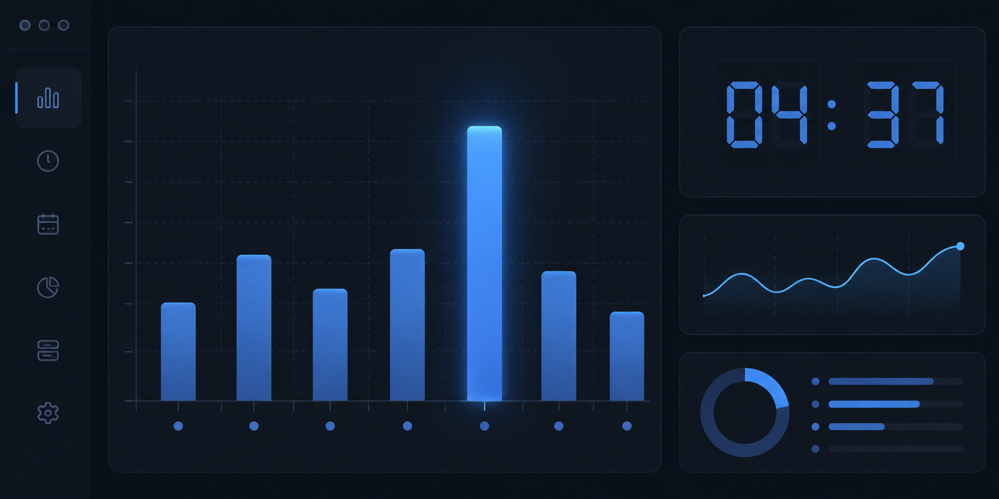

# Workspace Timing  ⏱

> 🪶 轻量无感 · 崩溃无忧 — 精准记录项目编码时长；多维可视化统计、周工时健康提醒、中英双语与数据安全保护。
> Lightweight & crash-safe — Track coding time effortlessly; rich analytics, weekly health reminders, bilingual UI, and multi-tier data protection.

---

## ✨ 功能亮点 | Features

- ⏱ **自动无感计时** · Auto-timing — 打开项目即自动开始计时，实时统计编码时长
- 🎯 **周工作上限与健康提醒** · Weekly limit & rest reminders — 自定义周工时目标，动态渐变进度条与阈值分割线，达标超限贴心提醒休息
- 📊 **多维图表分析** · Rich charts — 最近 7 天柱状图与平滑活跃曲线一键切换，直观呈现编码节奏
- 🔥 **12 周活动热力图** · Activity heatmap — GitHub 风格每日活跃时间线，5 档浓度直观展示工作投入度
- ⏰ **24 小时活跃分布** · Hourly breakdown — 今日 24 小时时间槽分布与物理刻度标尺，峰值时段高亮一览无余
- 🌐 **多工作区聚合对比** · Cross-workspace — 聚合管理多个项目工时，内置多项目占比对比柱状图
- 🛡️ **多级存储与崩溃防丢** · Crash protection — 毫秒级内存缓冲 + 实时增量日志 + 定时完整快照，意外退出零丢失
- 🎨 **现代化仪表板** · Modern dashboard — 实时统计概览、配置热更新、明细钻取、报表一键导出
- 🌐 **无缝双语支持** · Bilingual i18n — 简体中文 / English 随系统自适应或手动热切换，界面文案 100% 覆盖
- 📤 **多格式报表导出** · Multi-format export — 支持会话明细 CSV、全历史聚合日报 CSV、Markdown 日报与周报
- 💾 **安全快照与数据还原** · Snapshot & restore — 危险重置或清除前自动生成快照，支持从备份文件安全还原

---

## 💻 命令清单 | Commands

| Command | 说明 | Description |
|---------|------|-------------|
| `Workspace Timing: Open Dashboard` | 打开统计与设置面板 | Open the stats & settings dashboard |
| `Workspace Timing: Enable Timing` | 启用当前工作区计时 | Enable timing for current workspace |
| `Workspace Timing: Disable Timing` | 禁用当前工作区计时 | Disable timing for current workspace |
| `Workspace Timing: Toggle Global Timing` | 全局启用/禁用开关 | Global on/off toggle for all workspaces |
| `Workspace Timing: Toggle Status Bar Display Mode` | 循环切换状态栏显示模式 | Cycle status bar modes (today/total/compact) |
| `Workspace Timing: Export CSV` | 导出当前工作区会话明细 CSV | Export workspace session records as CSV |
| `Workspace Timing: Export Aggregated Daily CSV` | 导出全历史聚合日报序列 CSV | Export all-history daily totals as CSV |
| `Workspace Timing: New Counting Period` | 新建周期（重置累计，保留历史） | Reset total counter, keep session history |
| `Workspace Timing: Clear History Details` | 清除历史明细（保留累计总时长） | Clear history sessions, keep total duration |
| `Workspace Timing: Clear Cross-Workspace Totals` | 清除跨工作区累计数据 | Clear aggregated multi-workspace totals |
| `Workspace Timing: Restore from Backup File` | 从 JSON 备份文件还原 | Restore timing data from a JSON backup file |
| `Workspace Timing: Reset Timing Data` | 重置本工作区全部数据 | Reset workspace timing data completely |
| `Workspace Timing: Force Save Now (Debug)` | 立即强制存盘（调试用） | Force immediate flush & checkpoint |

> 💡 **状态栏快捷切换**：直接点击状态栏右侧的时钟图标，可在三种模式间无缝切换：
> `今日 30m · 累计 2h` → `累计 2h · 今日 30m` → `30m`（仅今日）

---

## 🗄️ 存储架构 | Storage Architecture

扩展采用四级分层存储体系，兼顾极低系统开销与极致数据可靠性：
1. **内存零延迟缓存**：高频收集秒级时间片增量，内存中完成计算，杜绝磁盘频繁 I/O 与卡顿。
2. **实时增量日志**：定期追加写入轻量增量日志，遇系统休眠、崩溃或断电可在下次启动时即时无损回放。
3. **主数据持久化**：结合 VS Code 原生存储与工作区本地文件双重校验，提供可版本控制的格式化备份。
4. **跨工作区聚合中枢**：全局维护所有工作区时长索引，自动回收长期未同步的陈旧项目数据。

---

## ⚙️ 扩展设置 | Extension Settings

| 配置项 | 默认值 | 说明 |
|--------|:------:|------|
| `workspaceTiming.locale` | `auto` | 界面语言 (`auto` 跟随 VS Code / `zh-CN` / `en`) |
| `workspaceTiming.enabled` | `true` | 是否启用当前工作区的时长追踪 |
| `workspaceTiming.globalDisabled` | `false` | 全局禁用所有工作区的时长追踪 |
| `workspaceTiming.statusBar.enabled` | `true` | 是否在状态栏右侧显示计时器 |
| `workspaceTiming.statusBar.mode` | `today-total` | 状态栏初始显示模式（点击状态栏循环切换并自动保存） |
| `workspaceTiming.weeklyLimit.enabled` | `false` | 是否启用周工作上限监控与休息提醒 |
| `workspaceTiming.weeklyLimit.hours` | `40` | 周工作上限时长（小时，范围 1~168） |
| `workspaceTiming.storage.backupToFile` | `true` | 启用工作区本地文件备份 |
| `workspaceTiming.storage.journalEnabled` | `true` | 启用实时数据防丢保护 |
| `workspaceTiming.storage.ringBufferCapacity` | `1024` | 实时记录缓存上限 |
| `workspaceTiming.storage.journalFlushInterval` | `10000` | 实时数据自动保存间隔 (ms) |
| `workspaceTiming.storage.fullSaveInterval` | `60000` | 全量检查点保存间隔 (ms) |
| `workspaceTiming.storage.maxSessions` | `5000` | 详细会话保留条数上限 (0 = 不限) |
| `workspaceTiming.storage.historyRawRetentionDays` | `45` | 详细会话保留天数（超出自动归档为日汇总） |
| `workspaceTiming.storage.safetySnapshot` | `true` | 重置/清除/还原等操作前自动写入安全快照 |
| `workspaceTiming.cloudSync.enabled` | `false` | 云端同步开关（即将推出） |

---

## 🗺️ 路线图 | Roadmap

| 版本 / 阶段 | 核心目标与产品交付价值 | 状态 |
|-------------|-----------------------|:--:|
| **v0.4.0** | 架构精简解耦、崩溃恢复加固、历史会话按日折叠归档 | ✅ 已完成 |
| **v0.4.1** | 会话统计口径对齐、跨工作区陈旧数据自动回收、时钟回拨与夏令时防御 | ✅ 已完成 |
| **v0.4.2** | 12 周活动热力图、今日 24 小时活跃分布、平滑活跃曲线、多工作区对比图表 | ✅ 已完成 |
| **v0.4.3** | 界面语言运行期即时切换（zh-CN / en）、高精度曲线平滑算法渲染 | ✅ 已完成 |
| **v0.4.4** | 24 格物理标尺对齐、命令体系统一、核心计时引擎高覆盖率质量保障 | ✅ 已完成 |
| **v0.4.5** | 跨午夜与休眠防漂移、周工作上限健康监控、动态渐变分割线与休息提醒 | ✅ 已完成 |
| **v0.4.6** | 崩溃恢复防重计机制加固、跨午夜与休眠时序安全保障、存储回放准确性提升 | ✅ 已完成 |
| **v0.4.7** | 统计计算性能优化：多周趋势轻量聚合、历史归档零分配快路径、超低 CPU/内存占用 | ✅ 已完成 |
| **v0.4.9** | 质量体系与配置体验升级：全量自动化质量门禁加固、双向配置持久化、敏感数据安全看守 | ✅ 已完成 |
| **v0.4.10** | 数据持久化边界收敛、统计图表平滑度与面板异步刷新优化、崩溃恢复鲁棒性提升 | ✅ 已完成 |
| **v0.4.12** | 用户体验全面升级：直观易懂的双语交互提示、活跃曲线全宽自适应与高对比度暗色显示、秒级热同步与扩展自愈能力 | ✅ 已完成 |
| **v0.5.0** | ☁️ 云端同步与多端聚合支持（WebDAV / GitHub Gist） | 🚧 规划中 |

---

## 📄 许可证 | License

MIT License © 2026 OriginalTC
