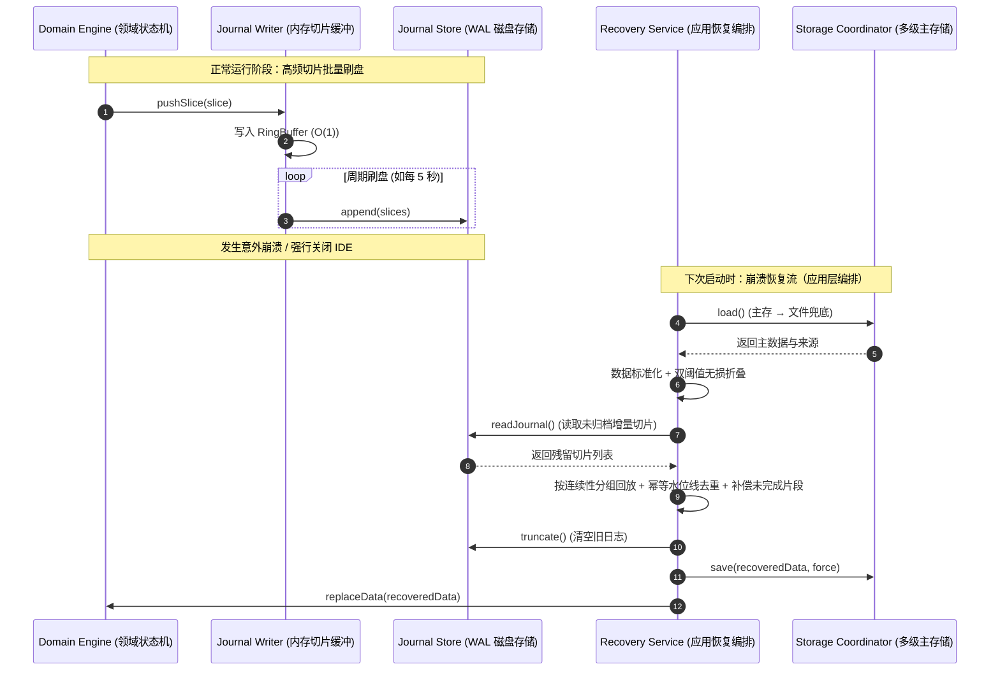
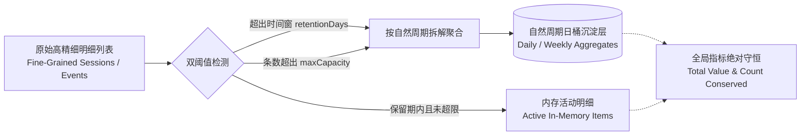

# 现代 IDE 扩展通用分层架构与高可靠工程设计指南
> **Universal Layered Architecture & High-Reliability Engineering Guide for Modern IDE Extensions**

---

## 1. 架构愿景与设计哲学

在构建复杂的 VS Code / Theia / JetBrains 等现代化 IDE 扩展系统时，开发者往往面临以下核心工程挑战：
1. **宿主 API 强耦合**：业务逻辑与宿主环境（如 `vscode` 命名空间）深度绑定，导致无法在纯脱机环境（如纯 Node.js 或轻量运行时）下编写毫秒级单元测试。
2. **IO 阻塞与数据丢失**：高频业务状态频繁写入磁盘会导致界面掉帧与卡顿；而纯内存延迟写入又可能在 IDE 异常关闭、崩溃或断电时丢失关键数据。
3. **Webview 与宿主状态撕裂**：前端 Webview 视图与宿主进程通信职责不清，缺乏严格的类型契约、安全隔离与防抖机制。
4. **历史数据膨胀与内存泄漏**：长久运行累积的海量细粒度数据无约束常驻内存，或采用粗暴的截断丢弃导致历史统计失真。
5. **宿主生命周期突变**：操作系统跨自然日、笔记本盒盖休眠/挂起、进程被任务管理器强杀等时钟与生命周期突变缺乏自愈机制。

为了彻底解决上述痛点，本指南提出了一套**通用的现代 IDE 扩展五层解耦与高可靠工程架构体系**。本架构融合了 **洋葱圈架构（Onion Architecture）**、**依赖反转原则（DIP）**、**预写日志（WAL）** 与 **双阈值无损数据治理（Dual-Threshold Compaction）**，适用于**代码分析、性能监控、协作看板、版本控制辅助、AI 编程助手**等各类复杂 IDE 扩展。

---

## 2. 通用五层分层架构拓扑模型

```mermaid
graph TD
    subgraph Presentation ["1. 展现层 (Presentation Layer)"]
        UI_CMD[Command Registrar<br/>统一命令注册与调度中心]
        UI_STATUS[Host UI Controller<br/>状态栏/侧边栏控制器]
        UI_WV[Webview Container<br/>面板生命周期与单例容器]
        UI_MSG[Message Dispatcher<br/>双向类型安全消息契约分发]
        UI_TPL[Stateless Template<br/>无状态 HTML/CSS/JS 纯渲染模板]
    end

    subgraph Application ["2. 应用服务层 (Application Layer - 业务流程编排)"]
        APP_FACADE[Orchestrator / Facade<br/>核心门面协调器]
        APP_MGR[Lifecycle Manager<br/>业务生命周期与状态机管理]
        APP_SCHED[Scheduler<br/>异步定时调度与心跳编排]
        APP_REC[Recovery Service<br/>崩溃检测与前向恢复编排]
        APP_EXP[Data Exporters<br/>多格式报告生成与数据导出]
        APP_GLOBAL[Cross-Context Aggregator<br/>跨工作区/跨项目上下文聚合]
    end

    subgraph Cache ["3. 缓存与预写日志层 (Cache & WAL Layer)"]
        CACHE_RB[RingBuffer &lt;T&gt;<br/>泛型定长环形内存缓冲]
        CACHE_JW[Journal Writer<br/>预写日志切片与刷盘调度器]
        CACHE_STRAT[Flushing Strategy<br/>容量与时间窗口批量刷盘策略]
        CACHE_PORT[IJournalStore<br/>预写日志存储端口契约 (SPI)]
    end

    subgraph Persistence ["4. 持久化层 (Persistence Layer - 存储原语与防御校验)"]
        PERS_COORD[Storage Coordinator<br/>多级存储协同调度器]
        PERS_VAL[Data Validator<br/>数据防御校验与脏数据自愈清洗]
        PERS_L1[L1/L2 Host State<br/>运行时内存与宿主环境本地存储]
        PERS_L3[L3 Project File<br/>项目级持久化文件 (.vscode / .idea)]
        PERS_L4[L4 Journal Storage<br/>WAL 崩溃前向恢复日志存储]
    end

    subgraph Domain ["5. 领域层 (Domain Layer - 100% 纯业务规则与算法)"]
        DOM_ENGINE[State Machine Engine<br/>纯内存状态机引擎]
        DOM_AGG[Data Aggregator<br/>纯统计、区间切分与指标聚合算法]
        DOM_FOLD[Compaction Folder<br/>双阈值无损数据折叠与沉淀引擎]
        DOM_MODELS[Domain Models<br/>实体、值对象、上下界约束与纯校验]
    end

    subgraph Infra ["横切基础设施与支撑服务 (Cross-Cutting & Infra)"]
        INF_I18N[i18n Kernel<br/>类型安全双向国际化内核]
        INF_LOG[Unified Logger<br/>分级诊断与追踪日志]
        INF_CFG[Config Watcher<br/>宿主配置响应与参数清洗]
    end

    %% 依赖约束：严格单向由外向内
    Presentation --> Application
    Application --> Domain
    Application --> Cache
    Application --> Persistence
    Cache --> Domain
    Persistence --> Domain
    Persistence -.-> CACHE_PORT
    Cache --> CACHE_PORT
```

---

## 3. 各层职责与通用设计规范

### 3.1 领域层（Domain Layer）—— 100% 纯业务核心
- **核心定位**：系统的业务规则核心。定义所有实体（Entities）、值对象（Value Objects）及领域算法。
- **约束准则**：
  - **严禁引入外部框架**：绝不能出现 `import * as vscode from 'vscode'` 或 Node.js 文件系统模块 `fs`。
  - **无副作用与纯函数优先**：所有数据聚合、时间切分、滑动窗口折叠计算均设计为纯函数。
  - **严格物理/业务边界防御**：在领域层常量中定义业务的严格上下界（如 `MIN_VALUE`, `MAX_VALUE`），并提供纯校验函数对所有入参进行防脏防空纠偏。

---

### 3.2 缓存与预写日志层（Cache & WAL Layer）—— 高吞吐与崩溃兜底
- **核心定位**：解决高频业务更新与低频磁盘 IO 之间的性能矛盾，并提供进程崩溃保护。
- **关键通用组件**：
  - **泛型环形缓冲区（`RingBuffer<T>`）**：定长数组实现，提供 $O(1)$ 时间复杂度的入队与窥探，容量满时自动覆盖最旧条目或触发无损 `flush()`。
  - **预写日志写入器（`JournalWriter`）**：采用增量分片（Time Slice / Operation Slice）追加机制，将秒级产生的数据切片暂存，定时批量刷盘。
  - **端口契约解耦（`IJournalStore`）**：缓存层只依赖存储接口契约（SPI），不感知实际物理写入介质（无论是文件、IndexedDB 还是宿主存储）。

```typescript
/** 通用预写日志存储端口契约 */
export interface IJournalStore<T> {
    append(slices: T[]): Promise<void>;
    readJournal(): Promise<T[]>;
    truncate(): Promise<void>;
    exists(): Promise<boolean>;
}
```

---

### 3.3 持久化层（Persistence Layer）—— 多级协同与防御自愈
- **核心定位**：数据的可靠落地、读取、迁移与防御校验。
- **约束准则**：持久化层**只提供原始读写原语**（load / save / restore / snapshot / deleteAll），不持有业务流程——崩溃恢复的编排算法属于应用层职责。
- **四级协同存储模型（Tiered Fallback Architecture）**：
  1. **L1（运行时内存）**：极速读取，瞬时响应。
  2. **L2（宿主环境 Storage / WorkspaceState）**：IDE 本地快速持久化。
  3. **L3（项目配置文件）**：如 `.vscode/data.json`，便于 Git 跟踪或跨设备同步。
  4. **L4（WAL Journal 增量预写日志）**：追加式写入，作为 IDE 异常退出或断电时的前向恢复数据源。
- **防御性清洗（Data Sanitization）**：
  - 数据在从磁盘读入领域层之前，必须经过 `DataValidator`。对非法类型、脏区间、负数累加值进行自动清洗与补齐，防止坏数据破坏系统逻辑。

---

### 3.4 应用服务层（Application Layer）—— 业务流程编排与门面
- **核心定位**：连接展现层与底层领域的协调枢纽。负责事务编排、定时调度与多服务聚合。
- **关键特征**：
  - **脱离宿主环境**：应用层依然不依赖 `vscode` API，使其完全可以在纯 Node.js 测试环境中完整运行业务流。
  - **门面模式（Facade Pattern）**：`Orchestrator` 作为对外单一门面，聚合生命周期管理、调度器、数据导出等服务。
  - **全生命周期无损数据治理**：在生命周期事件中统一调用双阈值折叠算法，杜绝暴力截断。
  - **依赖反转事件通知**：业务超限或关键事件通过统一回调向展现层派发，由展现层调用宿主 UI API 弹窗，应用层保持纯粹。

---

### 3.5 展现层（Presentation Layer）—— 现代化交互与安全隔离
- **核心定位**：负责 IDE 原生界面（StatusBar、Treeview、Commands）与 Webview Dashboard 的渲染及事件监听。
- **设计规范**：
  - **单一职责命令中心（CommandRegistrar）**：所有命令在此集中注册并统一管理 `Disposable`，避免入口文件（`extension.ts`）膨胀。
  - **无状态模板（Stateless Template）**：Webview 的 HTML/CSS/JS 保持为纯数据渲染模板，由宿主注入动态参数（CSP Nonce、i18n 词条、初始状态）。
  - **CSP（内容安全策略）防护**：禁止内联未经签名的危险脚本，动态脚本全部通过 `nonce-${args.nonce}` 校验。
  - **前端防抖与双向契约**：Webview 内部交互采用防抖处理，并通过类型安全的消息契约与宿主扩展进程通信。

---

## 4. 关键可靠性与工程化机制

### 4.1 WAL 崩溃补偿与幂等前向回放模型



---

### 4.2 双阈值无损自动回收与全历史守恒机制 (Dual-Threshold Compaction)

传统的会话/日志列表裁剪常使用 `.slice(-maxLimit)` 暴力抛弃最旧记录，导致历史数据与计数永久丢失。通用架构提出**双阈值多层沉淀模型**：



1. **时间窗阈值（Retention Threshold）**：超出保留天数的明细记录判定为过期。
2. **条数容量阈值（Capacity Threshold）**：未过期明细条数超出容量上限时，按先进先出（FIFO）自动溢出。
3. **原子化沉淀**：过期与溢出记录按自然周期拆解，累加至持久化聚合日桶（Bucket）。
4. **守恒保证**：
   $$\text{TotalValue}_{\text{after}} \equiv \text{TotalValue}_{\text{before}}$$
   $$\text{TotalCount}_{\text{after}} \equiv \sum \text{Bucket.Count} + \text{Kept.Count}$$
   实现内存常驻严格有界（$O(1)$ 或严格受限），同时全历史统计数据 100% 绝对守恒。

---

### 4.3 跨自然周期轮转与宿主休眠防时钟漂移体系

- **跨周期原子轮转（Cycle Rollover）**：在自然日/周切换临界点（如 00:00:00），系统自动原子化封存上一周期数据段，并将当前周期起点归零重置，确保统计与 OS 本地自然时钟绝对对齐。
- **系统休眠/挂起防漂移（Sleep Resume Guard）**：检测心跳时钟突变（如心跳间隔异常增大），自动判定为宿主系统休眠/盒盖挂起，封存休眠前有效数据，休眠跨度不计入有效工作量，消除夜间休眠导致数据虚高的问题。

---

### 4.4 类型安全且零遗漏的双向 i18n 架构

1. **编译期强契约校验**：
   在 `types.ts` 中定义全量 Key 接口 `I18nStrings`。任何语言字典缺失 Key 或类型不匹配，TypeScript 编译期立即报错。
2. **模板静态扫描门禁（Static Template Scan Test）**：
   在脱机单元测试中利用正则静态扫描所有前端模板中的词条引用，自动化比对字典完整性，防止任何运行时 `undefined` 渲染或遗漏。

---

## 5. 多领域扩展落地映射范例 (Domain Mapping Table)

本架构可无缝泛化至不同类型的 IDE 扩展中：

| 架构层级 | 时间工时分析扩展（本项目范例） | 静态代码分析器 / Linter | AI 辅助编码 Agent | 团队任务看板 / Git 协同 |
|---|---|---|---|---|
| **展现层** | 状态栏、Webview 图表仪表盘 | 诊断面板 (Problems)、代码高亮装饰 | 侧边栏 Chat、代码生成 Diff 视图 | 看板 Webview、任务树状图 (Treeview) |
| **应用层** | 计时调度、周上限告警、报表导出 | 批量扫描调度、增量 Lint 编排 | 对话上下文构建、工具调用调度 | 任务同步、冲突检测、Webhook 通知 |
| **缓存/WAL** | 秒级时间切片 RingBuffer + WAL | 变更文件 AST 增量缓存 + 日志 | Token 流式切片缓冲 + 会话 WAL | 远程事件拉取缓冲 + 离线操作 WAL |
| **持久化层** | L1 内存 + L2 宿主 + L3 JSON + L4 日志 | 诊断缓存 + 规则配置 + 忽略清单 | 会话历史 + 向量索引 + 鉴权令牌 | 任务缓存 + 本地修改 + 离线队列 |
| **领域层** | 纯状态机、自然日切割、双阈值折叠 | AST 节点遍历规则、复杂度算法 | Prompt 模板引擎、上下文折叠算法 | 状态流转机、优先级排期算法 |

---

## 6. 架构效益与工程对照表

| 架构维度 | 传统耦合式扩展做法 | 本指南推荐的解耦架构 | 典型工程落地效果 |
|---|---|---|---|
| **单元测试** | 强依赖 `@vscode/test-electron`，耗时数秒且需启动完整窗口 | 领域层与应用层 100% 纯 TS，脱机极速运行 | **90+ 项全量单测 100% 通过，耗时仅 ~100ms** |
| **数据安全** | 仅在关闭时保存，容易导致 IDE 崩溃时全量丢失 | 环形缓冲 + WAL 增量预写日志 + 崩溃补偿 | **即使进程被强杀，最多仅丢失数秒增量切片** |
| **历史治理** | 暴力丢弃旧记录导致统计失真，或无界内存暴涨 | 双阈值无损回收（时间窗 + 条数容量） | **内存常驻严格有界，全历史指标与计数绝对守恒** |
| **跨日与休眠** | 跨自然日数据漂移，休眠整夜数据虚高 | 00:00 自动轮转 + 时钟跳变断点切分 | **业务指标与 Windows/macOS/Linux 本地时钟绝对对齐** |
| **UI 扩展性** | 界面逻辑、CSS 与宿主通信混在一起，难以维护 | 展现层无状态模板 + 独立渲染与类型安全通信 | **全套现代 UI 改造升级时，业务逻辑 0 回退** |
| **国际化管理** | 硬编码字符串散布各处，缺乏静态检查 | 统一契约接口 + 编译期与单测双重门禁 | **100% 词条覆盖，支持运行时热切换** |
| **代码组织** | `extension.ts` 超过千行，充斥各类底层逻辑 | `extension.ts` 仅作依赖装配，严格单向依赖 | **入口文件精简纯粹，各模块高度可复用** |

---

## 7. 结语

通过将**业务领域、存储策略、缓冲日志与界面展现**进行严格解耦，IDE 扩展开发能够达到与现代企业级微服务/高可靠系统同等的工程严谨度。无论是面对简单的工具类扩展还是高复杂度的协作/AI 插件，遵循本架构准则均可实现极高的开发效率、卓越的系统可靠性与极佳的脱机测试体验。
