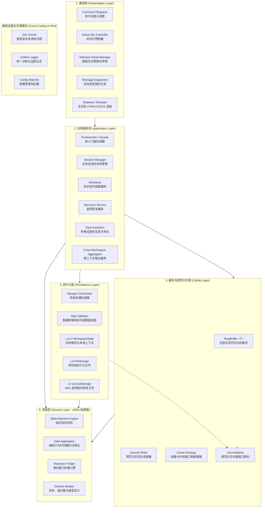
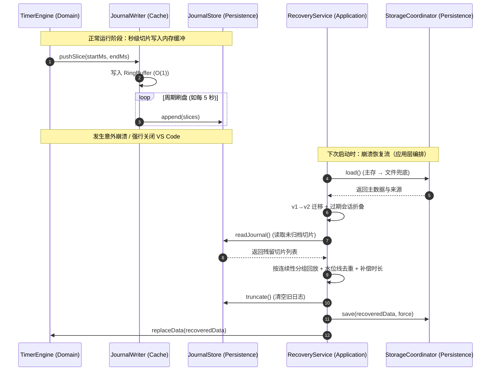

# VS Code 现代化扩展分层架构与高可靠设计实践指南
> **Modern VS Code Extension Layered Architecture & High-Reliability Design Guide**

---

## 1. 架构愿景与设计哲学

在构建复杂的 VS Code 插件或现代化 IDE 扩展系统时，开发者往往面临以下核心挑战：
1. **宿主 API 高度耦合**：业务逻辑与 `vscode` 命名空间强绑定，导致无法编写快速脱机单元测试。
2. **IO 阻塞与数据丢失**：频繁写入磁盘导致界面卡顿，而延迟写入又可能在 IDE 异常关闭时丢失数据。
3. **Webview 状态混乱**：前端 Webview 与宿主扩展进程通信职责不清，缺乏严格的契约与安全隔离。
4. **国际化碎片化**：界面硬编码字符串散落各处，缺乏编译期与测试期的防遗漏保障。

为了解决上述问题，本架构体系融合了 **洋葱圈架构（Onion Architecture）**、**依赖反转原则（DIP）** 与 **预写日志（WAL）机制**，建立了一套适用于各类型 IDE 插件的通用五层解耦架构模型。

---

## 2. 通用五层分层架构模型



---

## 3. 各层职责与解耦规范

### 3.1 领域层（Domain Layer）—— 100% 纯逻辑核心
- **核心定位**：系统的业务规则核心。定义所有实体（Entities）、值对象（Value Objects）及领域算法。
- **约束准则**：
  - **严禁引入外部框架**：绝不能出现 `import * as vscode from 'vscode'` 或 Node.js 文件系统模块 `fs`。
  - **无副作用与纯函数优先**：所有数据聚合、时间切分、滑动窗口计算均设计为纯函数。
- **示例落地（`workspace-timing`）**：
  - `TimerEngine`：只维护内存中的累加时长与起止时间戳状态机。
  - `TimeAggregator`：纯算法计算（跨午夜区间切割、自然日归桶、24 小时分布、12 周热力图网格）。
  - `HistoryFolder`：会话数据按保留天数（Retention Days）折叠入桶，保持总时长严格守恒。

---

### 3.2 缓存与预写日志层（Cache & WAL Layer）—— 高吞吐防崩溃
- **核心定位**：解决高频业务更新与低频磁盘 IO 之间的性能矛盾，并提供进程崩溃保护。
- **关键设计**：
  - **泛型环形缓冲区（`RingBuffer<T>`）**：定长数组实现，提供 $O(1)$ 时间复杂度的入队与窥探，容量满时自动覆盖最旧条目或触发无损 `flush()`。
  - **端口契约解耦（`IJournalStore`）**：缓存层只依赖存储接口契约，不感知实际物理写入逻辑。
  - **预写日志写入器（`JournalWriter`）**：采用增量分片（Time Slice）追加机制，将秒级产生的数据切片暂存，定时批量刷盘。

```typescript
// 典型的预写日志端口抽象
export interface IJournalStore {
    append(slices: TimeSlice[]): Promise<void>;
    truncate(): Promise<void>;
}
```

---

### 3.3 持久化层（Persistence Layer）—— 多级存储与防御自愈
- **核心定位**：数据的可靠落地、读取、迁移与防御校验。
- **约束准则**：持久化层**只提供原始读写原语**（load / save / restore / snapshot / deleteAll），不持有业务编排——崩溃恢复的编排算法（journal 分组回放、水位线去重、未完成会话补偿）属于应用层职责，由 `RecoveryService`（Application）经 `IRecoveryStore` / `IJournalStore` 端口注入驱动。
- **四级协同存储模型（Tiered Fallback Architecture）**：
  1. **L1（运行时内存）**：极速读取，瞬时响应。
  2. **L2（WorkspaceState / GlobalState）**：IDE 本地快速持久化。
  3. **L3（项目配置文件）**：如 `.vscode/settings.json` 或 `.vscode/plugin-data.json`，便于 Git 跟踪或跨设备同步。
  4. **L4（WAL Journal 预写日志）**：追加式写入，作为 IDE 异常退出或断电时的前向恢复数据源。
- **防御性清洗（Data Sanitization）**：
  - 数据在从磁盘读入领域层之前，必须经过 `DataValidator`。对非法类型、脏区间、负数累加值进行自动清洗与补齐，防止坏数据破坏系统逻辑。

---

### 3.4 应用服务层（Application Layer）—— 业务流程门面
- **核心定位**：连接展现层与底层领域的协调枢纽。负责事务编排、定时调度与多服务聚合。
- **关键特征**：
  - **脱离宿主环境**：应用层依然不依赖 `vscode` API，使其完全可以在纯 Node.js 测试环境中完整运行业务流。
  - **门面模式（Facade Pattern）**：`TimerOrchestrator` 作为对外单一门面，聚合 `SessionManager`（会话）、`Scheduler`（调度器）、`GlobalAggregator`（全局聚合）与 `ReportExporter`（报表生成）。

---

### 3.5 展现层（Presentation Layer）—— 现代化交互与安全隔离
- **核心定位**：负责 VS Code 原生界面（StatusBar、Command Palette）与 Webview Dashboard 的渲染及事件监听。
- **设计规范**：
  - **单一职责命令中心（CommandRegistrar）**：所有命令在此集中注册并统一管理 `Disposable`，避免入口文件（`extension.ts`）膨胀。
  - **无状态模板（Stateless Template）**：Webview 的 HTML/CSS/JS 保持为纯数据渲染模板，由宿主注入动态参数（CSP Nonce、i18n 词条、初始状态）。
  - **CSP（内容安全策略）防护**：禁止内联未经签名的危险脚本，动态脚本全部通过 `nonce-${args.nonce}` 校验。

---

## 4. 关键可靠性与工程化机制

### 4.1 崩溃补偿与预写日志恢复时序



---

### 4.2 类型安全且零遗漏的 i18n 架构

1. **类型定义接口（`I18nStrings`）**：
   在 `types.ts` 中定义全量 Key。新增词条若在 `zh-CN.ts` 或 `en.ts` 中缺失，TypeScript 编译期立即报错。
2. **模板静态扫描测试（Static Template Scan Test）**：
   在单元测试中利用正则静态扫描所有 Webview 模板中的 `L[...]` 与 `labels[...]`，自动化比对字典完整性，防止任何运行时 `undefined` 弹窗。

---

## 5. 架构效益与工程对照表

| 架构维度 | 传统耦合式扩展做法 | 本指南推荐的解耦架构 | 本项目（`workspace-timing`）落地效果 |
|---------|-------------------|-------------------|-----------------------------------|
| **单元测试** | 强依赖 `@vscode/test-electron`，耗时数秒且需启动完整窗口 | 领域层与应用层 100% 纯 TS，脱机极速运行 | **68 项单测全部通过，耗时仅 ~100ms** |
| **数据安全** | 仅在关闭时保存，容易导致崩盘时全量数据丢失 | 环形缓冲 + WAL 增量预写日志 + 崩溃补偿 | **即使任务管理器强杀进程，最多仅丢失 5 秒增量** |
| **UI 扩展性** | 界面逻辑、CSS 与宿主通信混在一起，难以重构 | 展现层无状态模板 + 毛玻璃/呼吸灯独立渲染 | **全套现代 UI 升级时，0 业务功能回退** |
| **国际化管理** | 硬编码字符串散布在各处，缺乏静态检查 | 统一命名空间契约 + 编译与单测双重门禁 | **100% 中英词条覆盖，支持运行期热切换** |
| **代码组织** | `extension.ts` 超过千行，充斥命令与存储逻辑 | `extension.ts` 仅作依赖组装，各层严格单向依赖 | **`extension.ts` 精简纯粹，职责明确** |

---

## 6. 结语

通过将业务领域、存储策略、缓冲日志与界面展现进行严格解耦，VS Code 扩展开发能够达到与现代企业级后端/前端同等的架构严谨度。该通用架构不仅适用于时间统计类工具，更可直接泛化到**代码分析器、协作插件、版本控制辅助、任务流看板**等各类复杂 IDE 扩展中。
