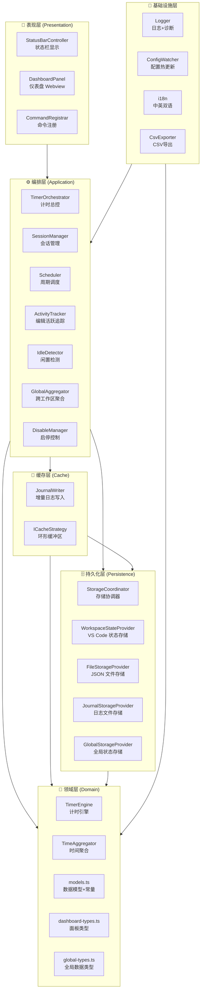
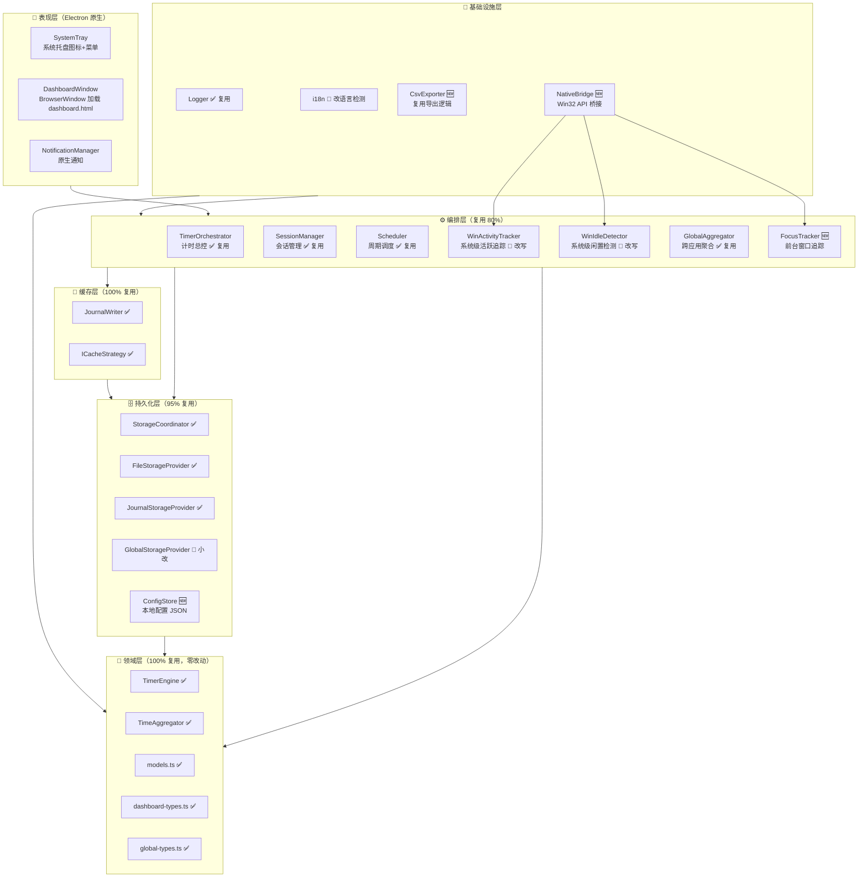
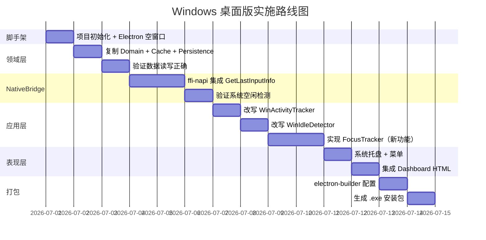
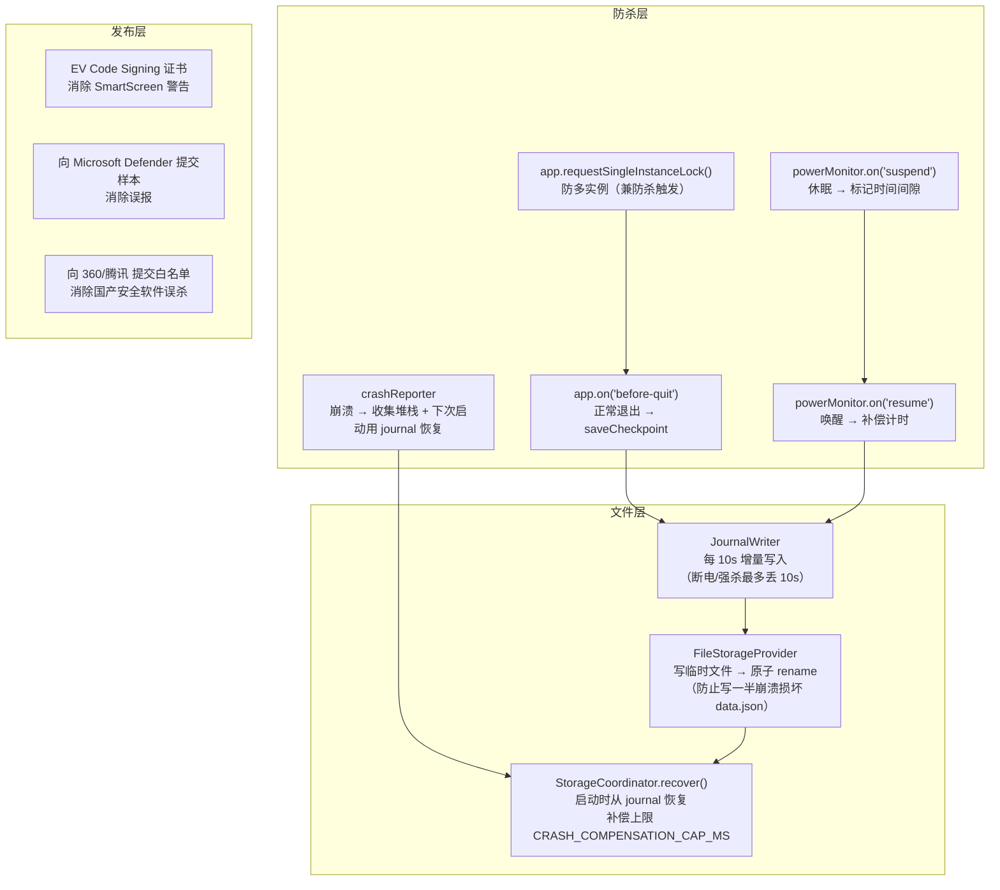
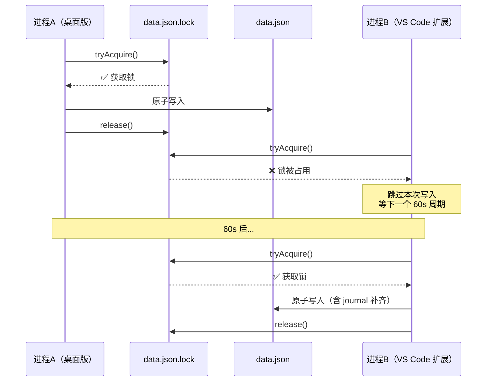
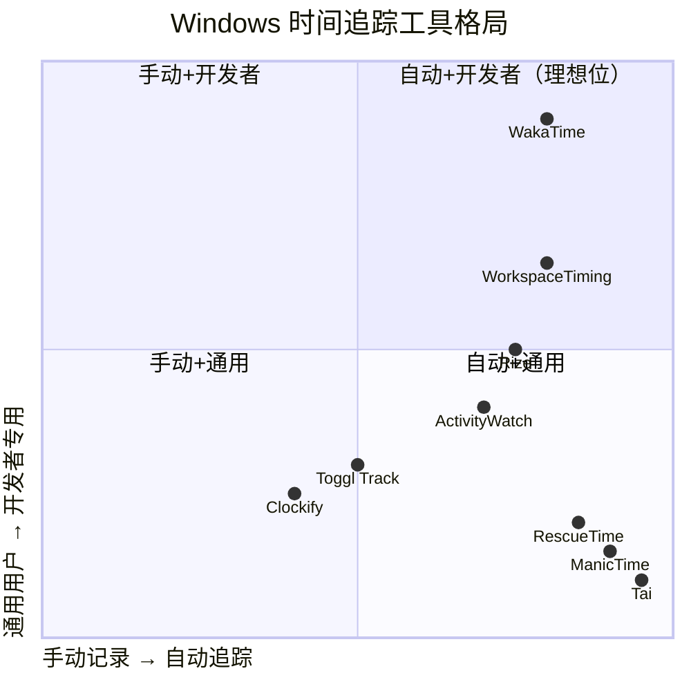

# WorkspaceTiming Windows 桌面版 — 架构设计与实施计划

> 版本: v1（草案）
> 日期: 2026-06-24
> 状态: 设计阶段，未实施

---

## 0. 前置澄清: Win32 API ≠ 32 位

上一轮提到"Win32 API"引起了混淆，在此澄清：

| 术语 | 实际含义 | 与位数关系 |
|------|---------|-----------|
| **Win32 API** | Windows 编程接口的历史统称 (`kernel32.dll`, `user32.dll` 等) | 与位数无关，x64 下照常使用 |
| **x64 / Win64** | 64 位编译目标架构 | Electron/Node.js 原生 x64 |

`GetLastInputInfo`、`GetForegroundWindow` 这些函数在微软文档里就叫 "Win32 API"，无论你编译成 32 位还是 64 位。**桌面版编译目标一定是 x64**（Node.js 22+ 已停止发布 32 位 Windows 版本，Electron 同理）。

---

## 1. 现有架构回顾（VS Code 扩展 v0.3.0）

### 1.1 分层架构图



### 1.2 各层职责边界

| 层 | 职责 | 禁止 |
|----|------|------|
| **Domain** | 纯数据模型、纯计算、类型定义、常量 | 不依赖任何 VS Code API |
| **Cache** | 环形缓冲区、增量日志缓冲 | 不直接操作文件、不做 UI |
| **Persistence** | 文件读写、状态序列化 | 不做业务逻辑、不渲染 UI |
| **Application** | 编排业务逻辑、协调各层 | 不直接操作 DOM/Webview |
| **Presentation** | HTML 渲染、状态栏文本、命令绑定 | 不做业务逻辑 |
| **Infra** | 日志、配置、多语言、导出 | 不做计时核心逻辑 |

### 1.3 数据流

```
用户操作（VS Code 窗口聚焦 + 编辑）
  │
  ├──▶ ActivityTracker.onDidChangeTextDocument  → 标记活跃
  ├──▶ IdleDetector.onDidChangeWindowState      → 标记闲置
  │
  ▼ Scheduler (1s 心跳)
TimerEngine.tick()  →  RingBuffer  →  JournalWriter.flush()  →  .workspace-timing-data/journal
                                    │
                                    ▼ Scheduler (60s 全量存盘)
                                  SessionManager.saveCheckpoint()
                                    │
                                    ▼
                                  StorageCoordinator.save()
                                    ├── WorkspaceStateProvider
                                    ├── FileStorageProvider  →  .workspace-timing-data/data.json
                                    └── GlobalStorageProvider  →  globalState
```

---

## 2. Windows 桌面版 — 架构设计

### 2.1 核心差异一览

| 维度 | VS Code 扩展 | Windows 桌面版 | 复用 |
|------|-------------|---------------|------|
| 运行环境 | VS Code Extension Host | Standalone Electron 进程 | — |
| 计时触发 | VS Code 窗口打开 = 工作 | 系统开机/用户登录 = 跟踪 | — |
| 活跃输入检测 | `onDidChangeTextDocument` | `GetLastInputInfo()` Win32 API | ❌ |
| 焦点应用感知 | 无（只有当前 VS Code） | `GetForegroundWindow()` + 窗口标题 | ❌ 新增 |
| 闲置检测 | `onDidChangeWindowState` | `GetLastInputInfo()` 系统空闲 | 🔄 改 API |
| 存储 | `.workspace-timing-data/` | **同一路径、同一格式** | ✅ 100% |
| 状态栏 | `vscode.window.createStatusBarItem` | 系统托盘 `Tray` | 🔄 改 API |
| 仪表盘 | VS Code Webview Panel | Electron `BrowserWindow` | ✅ 复用 HTML |
| 命令 | `vscode.commands.registerCommand` | 托盘菜单 + 快捷键 | 🔄 改 API |
| 配置 | `vscode.workspace.getConfiguration` | 本地 JSON 配置文件 | 🔄 改 API |
| 多语言 | `vscode.env.language` | `electron.app.getLocale()` | 🔄 改 API |
| 包管理 | `vsce` → Marketplace | `electron-builder` → .exe/.msi | ❌ |

### 2.2 目标架构图



### 2.3 复用度统计

```
总模块数: ~25
✅ 零改动复用: 15 个 (60%)  — domain 全部、cache 全部、persistence 大部分、Logger
🔄 改写 API 调用:  6 个 (24%)  — ActivityTracker、IdleDetector、StatusBar、配置、i18n、存储部分
🆕 全新开发:       4 个 (16%)  — FocusTracker、NativeBridge、ConfigStore、Electron 主进程

代码量估算:
  复用代码: ~2500 行
  改写代码: ~600 行
  新增代码: ~800 行
  总计:     ~3900 行
```

---

## 3. 分层实施计划

### 3.1 第零层: 项目脚手架（Electron + TypeScript）

**目标**: 搭建可编译、可运行的空 Electron 窗口

```
workspace-timing-desktop/
├── package.json              # Electron + electron-builder
├── tsconfig.json
├── src/
│   ├── main.ts               # Electron 主进程入口
│   ├── preload.ts            # 预加载脚本（安全桥接）
│   └── renderer/             # 渲染进程（加载 dashboard.html）
├── shared/                   # ← 从 VS Code 扩展复制
│   ├── domain/               #    全部 domain 代码
│   ├── cache/                #    全部 cache 代码
│   ├── persistence/          #    persistence（小改）
│   └── application/          #    application（部分改写）
├── native/                   # Win32 API Node 原生模块
│   └── input-monitor.cpp     # GetLastInputInfo + GetForegroundWindow
├── assets/
│   ├── icon.ico
│   └── dashboard.html        # 复用
└── build/                    # electron-builder 配置
```

**依赖**:
- `electron` ≥ 30
- `electron-builder` （打包）
- `node-addon-api` （Win32 原生桥接，或使用 `ffi-napi`）

**验证标准**: `npm start` → 空 Electron 窗口出现，DevTools 可用

---

### 3.2 第一层: 领域层 + 持久化层（100% 复用）

**动作**: 直接从 VS Code 扩展复制以下文件，**零改动**:

```
shared/domain/
  models.ts              ✅ 所有时间常量、接口
  TimeAggregator.ts      ✅ 今日/本周统计
  TimerEngine.ts         ✅ 计时引擎
  dashboard-types.ts     ✅ 面板数据模型
  global-types.ts        ✅ 跨工作区数据模型

shared/cache/
  JournalWriter.ts       ✅ 增量日志
  ICacheStrategy.ts      ✅ 环形缓冲区

shared/persistence/
  StorageCoordinator.ts  ✅ 存储协调
  FileStorageProvider.ts ✅ JSON 文件读写
  JournalStorageProvider.ts ✅ 日志文件读写
```

**验证标准**: 写一个简单测试，创建 `TimerEngine`，调用 `tick()` 10 次，验证 `totalMs === 10000`。写 `StorageCoordinator.save()` 确认 `data.json` 生成正确。

---

### 3.3 第二层: NativeBridge — Win32 API 桥接

**这是桌面版最核心的新模块。** 需要三个 Win32 API：

| API | 用途 | 头文件 |
|-----|------|--------|
| `GetLastInputInfo()` | 获取系统最后一次用户输入（键盘/鼠标）的时间戳 | `user32.dll` |
| `GetForegroundWindow()` | 获取当前前台窗口句柄 | `user32.dll` |
| `GetWindowTextW()` | 获取窗口标题文本 | `user32.dll` |
| `GetWindowThreadProcessId()` | 获取窗口所属进程 ID | `user32.dll` |

#### 方案 A: Node.js `ffi-napi`（推荐）

```typescript
// native/input-bridge.ts
import { Library } from 'ffi-napi';
import { ref } from 'ref-napi';

const user32 = Library('user32', {
    GetLastInputInfo: ['bool', ['pointer']],
    GetForegroundWindow: ['int64', []],
    GetWindowTextW: ['int', ['int64', 'pointer', 'int']],
    GetWindowThreadProcessId: ['uint32', ['int64', 'pointer']],
});

export function getIdleMs(): number {
    // 返回距最后一次用户输入的毫秒数
}

export function getForegroundWindowInfo(): { title: string; pid: number } {
    // 返回前台窗口标题和进程 ID
}
```

**优点**: 纯 JS/TS，不需要编译原生模块，不需要 Python/CMake
**缺点**: `ffi-napi` 需要 `ref-napi`，Electron 打包需处理原生依赖

#### 方案 B: Node.js Native Addon（备选）

用 `node-addon-api` (C++) 写原生模块，编译为 `.node` 文件。

**优点**: 性能最优，无 FFI 开销
**缺点**: 需要 C++ 编译链、每个 Electron 版本需重新编译

#### 推荐选择

**先用方案 A (`ffi-napi`)**。`GetLastInputInfo` 每秒只调一次，FFI 开销可忽略。如果后续发现兼容性问题再切方案 B。

**验证标准**: 
```typescript
const idleMs = getIdleMs();
console.log(`系统空闲: ${idleMs}ms`);
// 不动鼠标键盘 5 秒后再次调用，数值应增长 ~5000
```

---

### 3.4 第三层: ActivityTracker + IdleDetector 改写

改动本质：把 VS Code 事件监听 → 换成系统级 Win32 API 轮询。

#### 改写对比

| 原版（VS Code） | 桌面版（Windows） |
|----------------|-------------------|
| `vscode.workspace.onDidChangeTextDocument` | `getIdleMs() < 1000`（1 秒内有输入） |
| `vscode.window.onDidChangeWindowState` | `getIdleMs() > idleTimeoutMs` |
| 仅跟踪 VS Code 内编辑 | 跟踪系统全局键盘/鼠标输入 |

```typescript
// application/WinActivityTracker.ts
// 80% 逻辑复用原 ActivityTracker，仅替换输入源

export class WinActivityTracker {
    private dailyActiveSeconds = new Map<string, number>();
    private lastIdleMs = 0;

    tick(): void {
        const idleMs = getIdleMs();                    // ← 仅此处不同
        // 如果 idleMs 减小（用户有新输入），说明本秒有活动
        if (idleMs < this.lastIdleMs || idleMs < 1000) {
            const today = localDateStr(new Date());
            this.current = this.dailyActiveSeconds.get(today) ?? 0;
            this.dailyActiveSeconds.set(today, this.current + 1);
        }
        this.lastIdleMs = idleMs;
    }
}
```

**需要改写的模块**:
- `WinActivityTracker.ts` — 替代 `ActivityTracker.ts`
- `WinIdleDetector.ts` — 替代 `IdleDetector.ts`

**验证标准**: 打开记事本打字 → Dashboard 显示活跃时间增长。离开电脑 6 分钟 → Dashboard 显示闲置时间增长。

---

### 3.5 第四层: FocusTracker（全新）

这是 VS Code 扩展没有的功能——**按前台应用统计时间**。

```typescript
// application/FocusTracker.ts

export interface AppUsageRecord {
    appName: string;        // 窗口标题 or 进程名
    pid: number;
    totalMs: number;        // 累计前台时长
    lastFocusedAt: number;
}

export class FocusTracker {
    private appUsage = new Map<string, AppUsageRecord>();
    private currentApp: string | null = null;
    private focusStartMs = 0;

    tick(): void {
        const info = getForegroundWindowInfo();
        const key = info.title || `pid:${info.pid}`;

        if (key !== this.currentApp) {
            // 切换应用：结算上一个应用的时长
            if (this.currentApp && this.focusStartMs > 0) {
                const elapsed = Date.now() - this.focusStartMs;
                this.addToApp(this.currentApp, elapsed);
            }
            this.currentApp = key;
            this.focusStartMs = Date.now();
        }
    }

    // 返回 Top 10 应用耗时
    getTopApps(limit = 10): AppUsageRecord[] { ... }
}
```

**这个功能是桌面版的核心差异化优势。** VS Code 扩展只能告诉你"在 VS Code 里待了多久"，桌面版可以告诉你"今天 VS Code 3h，Chrome 2h，Figma 1.5h"。

**验证标准**: 切换几个应用窗口，Dashboard 显示应用使用分布。

---

### 3.6 第五层: 表现层（Electron 原生）

#### 3.6.1 系统托盘

```typescript
// main.ts — Electron 主进程
import { Tray, Menu, nativeImage } from 'electron';

const tray = new Tray(nativeImage.createFromPath('assets/icon.png'));
const contextMenu = Menu.buildFromTemplate([
    { label: '今日: 3h 25m', enabled: false },
    { type: 'separator' },
    { label: '打开仪表盘', click: () => openDashboard() },
    { label: '导出 CSV', click: () => exportCsv() },
    { type: 'separator' },
    { label: '暂停计时', click: () => toggleTimer() },
    { label: '退出', click: () => app.quit() },
]);
tray.setToolTip('WorkspaceTiming');
tray.setContextMenu(contextMenu);
```

#### 3.6.2 仪表盘

```typescript
// main.ts
function openDashboard() {
    const win = new BrowserWindow({
        width: 900,
        height: 680,
        webPreferences: { preload: 'preload.js' },
    });
    win.loadFile('shared/presentation/dashboard.html');  // ← 直接复用！
}
```

**dashboard.html 完全不用改。** 它只通过 `postMessage` 接收 JSON 数据，Electron 的 `ipcRenderer` 可以完全模拟这个协议。

---

### 3.7 第六层: 打包与发布

```json
// package.json (桌面版)
{
    "name": "workspace-timing-desktop",
    "version": "0.1.0",
    "main": "out/main.js",
    "scripts": {
        "start": "electron .",
        "build": "tsc && electron-builder",
        "pack": "electron-builder --dir"
    },
    "build": {
        "appId": "com.guilingzhouyi.workspace-timing-desktop",
        "productName": "WorkspaceTiming",
        "directories": { "output": "dist" },
        "win": {
            "target": ["nsis", "portable"],
            "icon": "assets/icon.ico"
        },
        "nsis": {
            "oneClick": false,
            "allowToChangeInstallationDirectory": true
        }
    }
}
```

输出物:
- `WorkspaceTiming-Setup-0.1.0.exe` — NSIS 安装包
- `WorkspaceTiming-0.1.0-portable.exe` — 便携版

---

## 4. 数据兼容性

### 4.1 存储路径（Windows）

| 类型 | 路径 |
|------|------|
| 计时数据 | `%APPDATA%/workspace-timing/data.json` |
| 日志 | `%APPDATA%/workspace-timing/journal` |
| 配置 | `%APPDATA%/workspace-timing/config.json` |
| 日志 | `%APPDATA%/workspace-timing/logs/` |

**与 VS Code 扩展的兼容**: 两个版本可以共享同一份数据文件，因为数据格式完全一致。用户可以在 VS Code 里计时，切换到桌面版看全貌。

### 4.2 开机自启

通过 Electron 的 `app.setLoginItemSettings()` 实现：

```typescript
app.setLoginItemSettings({
    openAtLogin: true,
    path: process.execPath,
});
```

---

## 5. 实施顺序与里程碑



| 里程碑 | 交付物 | 预计工作量 |
|--------|--------|-----------|
| M1: 脚手架 | 空 Electron 窗口可运行 | 1 天 |
| M2: 数据层就绪 | data.json 读写正确 | 1 天 |
| M3: 系统感知 | GetLastInputInfo 桥接完成 | 2 天 |
| M4: 计时可用 | 系统级计时 + 活跃/闲置检测 | 2 天 |
| M5: 应用追踪 | 前台窗口按应用统计 | 2 天 |
| M6: UI 就绪 | 托盘 + Dashboard | 2 天 |
| M7: 可发布 | .exe 安装包 | 1 天 |

**总计: 约 11 个工作日**（范围估算，不含测试和打磨）

---

## 6. 防杀设计 — 进程存活与数据保护

桌面常驻程序面临三类"被杀"场景：**用户主动杀**（任务管理器）、**系统杀**（关机/低内存）、**安全软件杀**（Defender/360）。每类都需要不同的应对策略。

### 6.1 威胁矩阵

| 场景 | 触发方 | 数据风险 | 可检测 | 应对 |
|------|--------|---------|--------|------|
| 任务管理器强杀 (`End Task`) | 用户 | ⚠️ 最多丢 60s（上次全量存盘后） | ❌ 无法拦截 | journal 覆盖 |
| 托盘右键退出 | 用户 | ✅ 无风险 | ✅ `before-quit` | 正常存盘 |
| 系统关机 / 重启 | Windows | ⚠️ 最多丢 60s | ✅ `WM_ENDSESSION` | 关机前存盘 |
| 系统休眠 | Windows | ✅ 无风险（进程冻结） | ✅ `powerMonitor.suspend` | 标记间隙 + resume 补偿 |
| 低内存终止 | Windows | ⚠️ 最多丢 60s | ❌ 不可预测 | journal 覆盖 + 内存上限 |
| Windows Defender 误杀 | 安全软件 | 🔴 应用无法启动 | — | 代码签名证书 |
| 国产安全软件误杀（360/管家） | 安全软件 | 🔴 应用被静默删除 | — | 提交白名单 |
| SmartScreen 阻止 | Windows | 🟡 用户难以启动 | — | EV 代码签名 |
| 进程自身崩溃 | 代码 bug | ⚠️ journal 数据完整 | ✅ `crashReporter` | journal 恢复 |

### 6.2 应对层设计



### 6.3 关键实现

#### 6.3.1 系统关机拦截

```typescript
// main.ts — Electron 主进程
import { app, powerMonitor } from 'electron';

// Windows: 系统关机/注销时触发
app.on('before-quit', async (event) => {
    // 阻止立即退出，先保存数据
    event.preventDefault();
    await orchestrator.saveCheckpoint();   // journal flush + 全量存盘
    app.exit(0);
});

// 休眠：记录时间戳，避免休眠期间计时
powerMonitor.on('suspend', () => {
    orchestrator.markSuspended();
});

powerMonitor.on('resume', () => {
    // 休眠 ≤ 2 小时 → 补偿计时（假设人在电脑前休息了）
    // 休眠 > 2 小时 → 不补偿（可能是隔天）
    orchestrator.resumeFromSuspend();
});

// 系统锁屏（可选）
powerMonitor.on('lock-screen', () => {
    orchestrator.pause();   // 锁屏 = 暂停计时
});

powerMonitor.on('unlock-screen', () => {
    orchestrator.resume();
});
```

#### 6.3.2 原子写入防数据损坏

```typescript
// persistence/SafeFileWriter.ts （FileStorageProvider 的增强）
import { writeFile, rename } from 'fs/promises';
import { join, dirname } from 'path';

export async function atomicWrite(filePath: string, data: string): Promise<void> {
    const dir = dirname(filePath);
    const tmpPath = join(dir, `.${Date.now()}.tmp`);

    // 1. 写入临时文件
    await writeFile(tmpPath, data, 'utf-8');

    // 2. 原子 rename（Windows NTFS 保证原子性）
    //    如果此步之前崩溃 → 留下孤立 .tmp 文件，不影响 data.json
    //    如果此步完成 → data.json 完整更新
    await rename(tmpPath, filePath);
}
```

**为什么 `rename` 是原子的**: NTFS 文件系统上 `rename` 操作是元数据级别的指针替换，要么完全成功，要么完全不生效——不存在"写了一半"的中间态。

#### 6.3.3 崩溃恢复（已有，需确认）

```typescript
// persistence/StorageCoordinator.ts — 已有的 recover() 逻辑
recover(): WorkspaceTimingData {
    // 1. 读 data.json（上次全量存盘 ≤ 60s 前）
    // 2. 读 journal（包含最近 10s 的增量）
    // 3. 合并：data.json + journal 中在 data.json 之后的条目
    // 4. 补偿上限 CRASH_COMPENSATION_CAP_MS（24h）防异常
}
```

#### 6.3.4 内存上限控制

Electron 常驻进程需控制内存。JS heap 默认无上限，长时间运行可能膨胀到 500MB+。

```typescript
// main.ts
// 每 5 分钟检查内存，超过阈值触发 GC + 警告
setInterval(() => {
    const mem = process.memoryUsage();
    const heapMB = mem.heapUsed / 1024 / 1024;
    if (heapMB > 200) {
        if (global.gc) global.gc();  // 需 --expose-gc 启动
        log(LogLevel.Warning, `内存偏高: ${heapMB.toFixed(0)}MB`);
    }
}, 5 * 60 * 1000);
```

Electron 启动参数：
```json
{
    "node-args": ["--max-old-space-size=256"]  // 限制 V8 堆 256MB
}
```

### 6.4 无代码签名证书的替代方案（务实路线）

EV 代码签名证书每年 **$200–400**，对于独立开发者/开源项目不现实。以下是零预算下的务实方案：

#### 方案对比

| 方案 | 成本 | SmartScreen | Defender | 360 | 用户体验 |
|------|------|-------------|----------|-----|---------|
| **Portable 免安装版** | $0 | 🟡 首次弹窗 | ✅ 不报毒 | 🟡 可能报 | 用户解压即用 |
| **NSIS 安装包 + 无签名** | $0 | 🔴 弹窗 + 红色警告 | ✅ 不报毒 | 🔴 高概率拦截 | 安装过程被阻断 |
| **提交 Microsoft 安全审核** | $0 | 🟢 通过后解除 | 🟢 通过后解除 | — | 需等审核（几天） |
| **上架 Microsoft Store** | $19 一次性 | 🟢 微软代签 | 🟢 微软代签 | ✅ 不拦截 | 审核严格 |
| **开源 + 自行构建** | $0 | 🟢 本地构建不触发 | ✅ | ✅ | 只适合开发者用户 |

#### 推荐路线（零预算）

```
第一阶段: Portable 免安装版 (.zip)
  ├── 用户下载 .zip → 解压 → 双击 .exe
  ├── SmartScreen 弹出 "Windows 已保护你的电脑" 
  │     └── 用户点 "更多信息" → "仍要运行" → 以后不再弹
  ├── Windows Defender: 对 Electron 应用基本不报毒
  └── 火绒: 静默放行（火绒以不误杀著称）

第二阶段: 提交 Microsoft 安全审核（免费）
  ├── 入口: https://www.microsoft.com/en-us/wdsi/filesubmission
  ├── 提交 .exe → 微软分析师审核（1-3 天）
  └── 通过后 SmartScreen 不再弹窗

第三阶段（可选）: 上架 Microsoft Store
  ├── 注册开发者账号: $19 一次性
  ├── 微软自动签名 + 自动更新
  └── 用户从 Store 安装，零信任问题
```

**SmartScreen 弹窗不是"报毒"**——它是"我不认识这个程序，你要不要运行？"用户点一次"仍要运行"后 Windows 会记住，以后相同文件不再提示。这和 360 直接删文件是两回事。

#### Portable 版 vs 安装版的选择

```
Portable 版（推荐首发）:
  ✅ 不需要安装器 → SmartScreen 拦截率低
  ✅ 用户可以放任意目录（包括 D 盘非系统盘）
  ✅ 数据文件跟着 .exe 走，换电脑直接拷文件夹
  ❌ 没有开始菜单快捷方式
  ❌ 不能开机自启

安装版（后续提供）:
  ✅ 开始菜单 + 卸载入口
  ✅ 开机自启
  ❌ 无签名时 SmartScreen 红屏警告（比 portable 严重得多）
  ❌ 360 大概率拦截安装过程
```

### 6.5 国内杀软环境实测分析

**核心发现: 不同杀软对"未签名 Electron 应用"的态度差异极大。**

#### 杀软行为矩阵

| 杀软 | 市占率（国内） | 对未签名 Electron 的态度 | 实际风险 |
|------|--------------|------------------------|---------|
| **Windows Defender** (系统自带) | ~40% | ✅ 基本不报毒。只对已知恶意签名/行为报警 | 🟢 低 |
| **Windows SmartScreen** (系统自带) | 100% | 🟡 弹窗"不认识的程序"，用户可选"仍要运行" | 🟡 低（一次性摩擦） |
| **火绒** | ~15%（技术用户居多） | ✅ **以不误杀著称**，静默放行 | 🟢 极低 |
| **360 安全卫士** | ~25%（普通用户居多） | 🔴 高概率弹窗"可疑程序"甚至自动隔离 | 🔴 高 |
| **腾讯电脑管家** | ~10% | 🟠 类似 360，稍温和 | 🟠 中高 |
| **金山毒霸** | <5% | 🟠 可能报 | 🟠 中 |

#### 关键结论

1. **火绒 + Defender 组合（用户的情况）是最理想的环境**。火绒静默放行，Defender 不报 Electron 应用，唯一摩擦是 SmartScreen 首次弹窗——点一次"仍要运行"就永久解决。

2. **真正需要担心的是 360 和腾讯管家**。它们有"软件管家"功能，对未知应用主动拦截，且用户很难找到"仍要运行"的入口（按钮被故意藏得很深）。

3. **如果用户群主要是开发者/技术用户**（这很可能是 WorkspaceTiming 的目标用户），他们大概率用火绒或裸奔 Defender，安全软件问题基本不是问题。

#### 对打包策略的影响

```
目标用户              → 首发策略
──────────────────────────────────────────
技术用户（火绒/Defender）→ Portable .zip 就够了
普通用户（可能有 360）   → 需要 Store 上架或签名
企业用户                → 需要签名 + MSI 安装包
```

**建议**: 首发只做 Portable .zip，面向技术用户。验证产品后，再投入 $19 上架 Microsoft Store 覆盖普通用户。不主动适配 360——它的用户群和我们目标用户重叠度低，投入产出不成比例。

### 6.6 性能分析 — CPU / I/O / 延迟

桌面计时器是一个**极端低负载**的应用：每秒 tick 一次，每 10s 写一次文件。性能上限由设计决定，不是由硬件决定。

#### 6.6.1 各操作性能剖面

| 操作 | 频率 | 单次耗时 | 每秒 CPU 占用 | 瓶颈类型 |
|------|------|---------|-------------|---------|
| `GetLastInputInfo()` | 1 Hz | < 1μs | 可忽略 | — |
| `GetForegroundWindow()` | 1 Hz | < 1μs | 可忽略 | — |
| `GetWindowTextW()` | 1 Hz | ~5μs | 可忽略 | — |
| `TimerEngine.tick()` | 1 Hz | ~2μs (纯算术) | 可忽略 | — |
| `TimeAggregator.todayMs()` | 每 5s (状态栏) | ~50μs (遍历 ≤1000 条 session) | 可忽略 | — |
| `JournalWriter.flush()` | 每 10s | ~200μs (append 一行) | 可忽略 | 磁盘 |
| `StorageCoordinator.save()` | 每 60s | ~1ms (写完整 JSON) | 可忽略 | 磁盘 |
| Dashboard 渲染 | 按需（用户打开） | ~50ms (HTML parse + Chart.js) | 0（按需） | GPU 合成 |
| 托盘图标更新 | 每 5s | ~50μs (更新 tooltip 文本) | 可忽略 | — |

**结论: 计时核心循环的 CPU 开销 < 0.01%。** 99.9% 的资源消耗是 Electron 的常驻开销（Chromium 渲染引擎 + V8），不是业务逻辑。

#### 6.6.2 主要性能瓶颈（按严重程度）

| 优先级 | 瓶颈 | 原因 | 影响 |
|--------|------|------|------|
| 🔴 P0 | **空 BrowserWindow 常驻** | Chromium 渲染进程即使不渲染也占 60-80MB | 内存基线抬高 3 倍 |
| 🟡 P1 | **Dashboard 重渲染** | 每次打开 Dashboard 重新 parse HTML + 初始化 Chart.js | 用户感知延迟 ~200ms |
| 🟡 P1 | **Session 数组无限增长** | 1000 条 session 后 `todayMs()` 遍历变慢 | 状态栏更新从 50μs → 500μs（仍然可忽略） |
| 🟢 P2 | **Journal 文件追加** | 每 10s 一次 `fs.appendFile`，单次 200μs | 磁盘 I/O，不影响 UI |
| 🟢 P2 | **V8 GC pause** | 200MB heap 时 full GC 可能 50-100ms | 对计时器无影响（无实时 UI 需求） |

#### 6.6.3 Main Process vs Renderer Process 职责划分

```
Main Process (Node.js)          │  Renderer Process (Chromium)
─────────────────────────────────┼─────────────────────────────
TimerEngine.tick()               │  Dashboard HTML 渲染
ActivityTracker / IdleDetector   │  Chart.js 图表绑定
Scheduler (setInterval 链)       │  用户交互（按钮点击）
FileStorageProvider (fs)         │  
JournalWriter (fs.appendFile)    │  
Tray 管理                        │  
Win32 API 调用 (ffi-napi)        │  
─────────────────────────────────┼─────────────────────────────
内存目标: ≤ 30MB                 │  内存目标: ≤ 80MB (按需)
```

**关键原则**: 渲染进程只在用户打开 Dashboard 时存在，关闭即销毁。主进程常驻但不加载任何 UI 框架。

### 6.7 内存压缩策略 — 从 150MB → 45MB

#### 6.7.1 Electron 内存构成解剖

一个典型的 Electron tray 常驻应用，默认内存分布：

```
┌─────────────────────────────────────────┐
│ Electron 总内存: ~150MB                   │
├─────────────────────────────────────────┤
│ Main Process (Node.js)         ~45MB     │
│   ├── V8 heap (JS objects)     ~20MB     │
│   ├── Native (ffi/buffer)      ~5MB      │
│   └── Electron 框架本身         ~20MB     │
├─────────────────────────────────────────┤
│ Renderer Process (Chromium)    ~80MB     │  ← 最大的浪费
│   ├── Blink 渲染引擎            ~30MB     │
│   ├── JS heap (网页上下文)      ~15MB     │
│   ├── 光栅化/GPU 缓存           ~20MB     │
│   └── 扩展/DevTools             ~15MB     │
├─────────────────────────────────────────┤
│ GPU Process                     ~20MB     │
│ Utility (network/audio)         ~5MB      │
└─────────────────────────────────────────┘
```

**如果 Dashboard 不打开，为什么要保留 Renderer Process？答案是——不需要。**

#### 6.7.2 分层内存目标

| 状态 | 进程 | 目标内存 | 压缩手段 |
|------|------|---------|---------|
| **休眠**（仅托盘常驻） | Main Process | **≤ 30MB** | V8 heap 限制 + 无渲染进程 |
| **激活**（托盘 + 仪表盘打开） | Main + Renderer | **≤ 120MB** | Dashboard 关闭即销毁渲染进程 |
| **峰值**（仪表盘 + 大量历史数据） | Main + Renderer | **≤ 180MB** | Session 截断 + 懒加载历史 |

#### 6.7.3 压缩手段

##### 手段 1: 延迟创建 + 立即销毁 BrowserWindow（减少 ~80MB）

这是**收益最大的单项优化**——把渲染进程从"常驻"改为"按需"。

```typescript
// main.ts — 按需创建 Dashboard 窗口
let dashboardWindow: BrowserWindow | null = null;

function openDashboard(): void {
    if (dashboardWindow && !dashboardWindow.isDestroyed()) {
        dashboardWindow.focus();
        return;
    }

    dashboardWindow = new BrowserWindow({
        width: 900,
        height: 680,
        show: false,  // 先不显示，等 ready
        webPreferences: {
            preload: join(__dirname, 'preload.js'),
            contextIsolation: true,
            sandbox: true,
            // ⚠️ 不要 nodeIntegration: true
        },
    });

    dashboardWindow.loadFile('shared/presentation/dashboard.html');

    dashboardWindow.once('ready-to-show', () => {
        dashboardWindow?.show();
    });

    // ✨ 关键：关闭时销毁，不隐藏
    dashboardWindow.on('closed', () => {
        dashboardWindow = null;  // 释放引用，GC 可回收整个渲染进程
    });
}

// 托盘菜单
tray.on('double-click', openDashboard);
```

```
没有 Dashboard 时:
  └── Main Process: ~30MB  ← 只有托盘

用户打开 Dashboard:
  ├── Main Process: ~30MB
  └── Renderer Process: ~80MB  ← 按需创建
  合计: ~110MB

用户关闭 Dashboard:
  └── Main Process: ~30MB  ← Renderer 已销毁，GC 回收 ~80MB
```

##### 手段 2: V8 Heap 激进的 GC 策略（减少 ~20MB）

```json
// package.json — Electron 启动参数
{
    "main": "out/main.js",
    "node-args": [
        "--max-old-space-size=128",     // V8 堆上限 128MB（默认无限制）
        "--optimize-for-size",           // 优化体积而非速度（计时器不需要速度）
        "--gc-interval=30000"            // 每 30s 触发一次增量 GC
    ]
}
```

```typescript
// main.ts — 空闲时主动触发 GC
let gcTimer: ReturnType<typeof setInterval> | null = null;

// 仅在 tray 模式（无 Dashboard）时定期 GC
function startIdleGC(): void {
    gcTimer = setInterval(() => {
        if (!dashboardWindow && global.gc) {
            global.gc();  // 需 --expose-gc 参数
        }
    }, 120_000);  // 每 2 分钟
}
```

##### 手段 3: Session 截断（减少 ~10MB，同时提升性能）

1000 条 session × 每条 3 个 number = ~24KB 数据，但 JSON 序列化/反序列化 + V8 对象开销可能放大到几 MB。截断策略：

```typescript
// SessionManager.ts — 已有 DEFAULT_MAX_SESSIONS = 1000
// 桌面版建议降低到 365（保留一年）
const DESKTOP_MAX_SESSIONS = 365;

// 更激进的：按周聚合旧 session
function compactOldSessions(sessions: TimeSession[]): TimeSession[] {
    const oneWeek = 7 * 24 * 60 * 60 * 1000;
    const cutoff = Date.now() - 30 * oneWeek;  // 30 天前

    const recent = sessions.filter(s => s.endMs >= cutoff);
    const old = sessions.filter(s => s.endMs < cutoff);

    // 30 天前的 session 合并为每周一条
    if (old.length > 0) {
        const weeklyMap = new Map<string, number>();
        for (const s of old) {
            const weekKey = localDateStr(new Date(s.startMs)).slice(0, 7) + '-W' +
                Math.floor(new Date(s.startMs).getDate() / 7);
            weeklyMap.set(weekKey, (weeklyMap.get(weekKey) ?? 0) + s.durationMs);
        }
        // 转换为虚拟 session
        for (const [week, ms] of weeklyMap) {
            recent.push({ startMs: 0, endMs: 0, durationMs: ms });
        }
    }
    return recent.slice(-DESKTOP_MAX_SESSIONS);
}
```

##### 手段 4: `unref()` 定时器 — 允许进程自然退出

```typescript
// Scheduler.ts
startTimers(): void {
    this.heartbeatTimer = setInterval(() => this.onHeartbeat(), 1000);
    this.heartbeatTimer.unref();  // ✨ 不阻止进程退出

    this.journalTimer = setInterval(() => this.flushJournal(), 10000);
    this.journalTimer.unref();
    // ...
}
```

`unref()` 的语义：如果所有定时器都是 `unref` 的，且没有其他事件循环引用（网络连接、文件句柄等），Node.js 进程可以正常退出——不会被定时器"卡住"。

##### 手段 5: 文件 I/O 缓冲合并

```typescript
// cache/JournalWriter.ts — 写入合并
export class JournalWriter {
    private pendingEntries: string[] = [];
    private readonly MAX_PENDING = 64;  // 攒 64 条或超时 10s 才写

    addEntry(slice: TimeSlice): void {
        this.pendingEntries.push(`${slice.timestamp},${slice.deltaMs}`);
        if (this.pendingEntries.length >= this.MAX_PENDING) {
            this.flushNow();
        }
    }

    private async flushNow(): Promise<void> {
        if (this.pendingEntries.length === 0) return;
        const block = this.pendingEntries.join('\n') + '\n';
        this.pendingEntries.length = 0;
        await appendFile(this.journalPath, block, 'utf-8');
    }
}
```

此优化将磁盘写入从"每秒 1 次"降为"每 10s 1 次"，且每次写入是批量 append，减少文件打开/关闭开销。

#### 6.7.4 内存目标汇总

| 优化手段 | 内存节省 | 实现难度 |
|----------|---------|---------|
| 延迟创建 + 立即销毁 BrowserWindow | 约 -80MB | ⭐ 简单（~20 行） |
| V8 heap 限制 128MB + 定期 GC | 约 -15MB | ⭐ 简单（配置 + 5 行） |
| Session 截断到 365 条 | 约 -5MB | ⭐⭐ 中等（含旧数据聚合） |
| `unref()` 所有定时器 | 约 -2MB（避免闭包泄漏） | ⭐ 简单（4 个 `.unref()`） |
| 文件 I/O 合并缓冲 | 约 -3MB（减少 Buffer 分配） | ⭐ 简单（已在设计） |
| **合计（tray 模式）** | **约 -105MB → ~45MB** | — |

#### 6.7.5 与同类工具对比

| 工具 | 技术栈 | 空闲内存 | 活跃内存 | 备注 |
|------|--------|---------|---------|------|
| **WorkspaceTiming（优化后）** | Electron + 延时渲染 | **~45MB** | ~120MB | 本方案 |
| **WorkspaceTiming（优化前）** | Electron 默认 | ~150MB | ~200MB | 不做优化 |
| Toggl Track | Electron | ~200MB | ~350MB | 完整 UI 常驻 |
| RescueTime | C++ Win32 | ~40MB | ~80MB | 原生，无渲染引擎 |
| ManicTime | C# .NET | ~50MB | ~100MB | 原生 |
| Clockify | Electron | ~180MB | ~300MB | 类似 Toggl |

**目标: 在 Electron 上做到接近原生 C++ 的内存水平（45MB vs 40MB）。** 核心思路就是"平时不加载浏览器引擎"。

#### 6.7.6 极限压缩 — 45MB 以下还能压吗？

**能。但从这里开始，每 5MB 的收益都需要改变架构**，不再是"加几行代码"的事。

```
45MB (当前目标)
    │
    ├── ~15MB: Electron 框架本身 (app, Tray, powerMonitor 等 C++ 模块)
    │           → 无法消除，除非不用 Electron
    │
    ├── ~10MB: Node.js 核心 (event loop, libuv, 内置模块缓存)
    │           → 无法消除，是 JS 运行时的物理下限
    │
    ├── ~10MB: V8 heap (JS 对象、闭包、字符串常量)
    │           → 可压缩到 ~5MB（激进手段）
    │
    └── ~10MB: 操作系统开销 (文件句柄、socket、线程栈)
                → 可压缩到 ~5MB
```

**Electron 的物理下限约 25–30MB**。这是 V8 + Node.js + 最简 Electron shell 的合体开销，不可再降。要突破这个下限，必须换运行时。

##### 进一步压缩的手段（边际收益递减）

| 手段 | 额外节省 | 代价 |
|------|---------|------|
| `--max-old-space-size=64`（再砍半） | ~5MB | GC 频率翻倍，CPU 略增 |
| `--jitless`（关闭 V8 即时编译） | ~8MB | JS 执行速度降 5-10×。计时器倒无所谓 |
| 不缓存 sessions 数组，每次从文件读 | ~5MB | `todayMs()` 从 50μs → 500μs（仍可忽略） |
| 用 `worker_threads` 隔离文件 I/O | ~3MB | 主进程 heap 更干净 |
| 用 Rust/C++ 重写 TimerEngine 为 native addon | ~5MB | V8 heap 只存引用，核心数据在 native |
| **Electron → Tauri（换运行时）** | **约 -25MB** | 需要 Rust + 重写主进程 |

##### 激进方案: 双进程架构（Tray 用原生，Dashboard 用 Electron）

```
┌──────────────────────────────────────────────┐
│ workspace-timing-tray.exe (Rust/C++ 原生)      │
│ 内存: ≤ 8MB                                    │
│ 职责:                                          │
│   • 系统托盘图标 + 菜单                         │
│   • TimerEngine (纯计算，native 性能)            │
│   • GetLastInputInfo / GetForegroundWindow      │
│   • Journal 写入                                │
│   • IPC server (命名管道 / localhost socket)    │
└──────────┬───────────────────────────────────┘
           │ 用户双击托盘 → 启动 Electron
           ▼
┌──────────────────────────────────────────────┐
│ workspace-timing-dashboard.exe (Electron)      │
│ 内存: ~80MB（按需启动，关闭即退出）              │
│ 职责:                                          │
│   • 加载 dashboard.html                         │
│   • 通过 IPC 从 tray 进程获取数据               │
│   • CSV 导出、诊断报告                           │
└──────────────────────────────────────────────┘
```

**总内存: 8MB (常驻) + 80MB (按需) = 8MB 基线。** 比 RescueTime 的 40MB 还低。

但这个方案的代价很高：
- 需要 Rust/C++ 技能（团队可能不具备）
- 两个代码库维护
- IPC 协议设计 + 版本兼容
- 调试难度翻倍

**结论: v1.0 不推荐。** 45MB 对 2026 年的桌面应用已经非常好。如果用户量起来后有明确需求，再评估双进程方案。

#### 6.7.7 长期路线: Tauri v2.0

Tauri 是 Electron 的 Rust 替代品，用系统自带 WebView（Windows 用 Edge WebView2）替代 Chromium：

| 维度 | Electron | Tauri |
|------|----------|-------|
| 渲染引擎 | Chromium (~80MB 捆绑) | 系统 Edge WebView2 (0MB 捆绑) |
| 后端语言 | Node.js (JS) | Rust |
| 空项目基线内存 | ~100MB | **~15MB** |
| 计时器应用（优化后） | ~45MB | **~20MB** |
| .exe 安装包大小 | ~85MB | **~5MB** |
| 学习曲线 | TypeScript（团队已掌握） | Rust（需学习） |
| 生态成熟度 | 非常成熟 | 快速追赶中 |

**建议**: v1.0 用 Electron 验证产品，v2.0 如果内存是关键卖点，迁移到 Tauri。迁移时需要重写的只有主进程（~800 行），domain/cache/persistence 全部可直接复用（Rust 端实现相同的文件格式）。

---

### 6.8 性能回归测试清单

每次发版前验证：

```
□ Tray 模式下主进程内存 ≤ 45MB（任务管理器 → 详细信息 → 工作集）
□ Dashboard 打开后总内存 ≤ 130MB（main + renderer + GPU）
□ Dashboard 关闭后 30s 内内存降至 ≤ 50MB（GC 回收）
□ 1s 心跳循环 CPU 占用 < 0.1%（任务管理器 → CPU）
□ Journal 文件大小不无限增长（≤ 1MB）
□ data.json 文件大小 ≤ 500KB（1000 session 以内）
□ 24h 连续运行后内存无泄漏（baseline ± 5MB）
□ 休眠 → 唤醒后计时器正常恢复
```

---

## 7. 冲突处理 — 多实例与数据竞争

### 7.1 冲突场景矩阵

| 场景 | 风险等级 | 后果 |
|------|---------|------|
| 用户双击 .exe 两次 | 🔴 高 | 两个进程同时写 data.json → JSON 损坏 |
| VS Code 扩展 + 桌面版同时运行 | 🔴 高 | 同上，两进程写同一文件 |
| VS Code 多个窗口 | 🟡 中 | 扩展在每个窗口启动 → journal 重复累加 |
| 数据文件被外部程序打开（记事本等） | 🟢 低 | 写失败，下次重试 |
| 云同步（OneDrive/Dropbox）锁定文件 | 🟡 中 | 写失败，需重试 + 降级 |

### 7.2 多实例互斥

Electron 提供内置单实例锁：

```typescript
// main.ts
const gotTheLock = app.requestSingleInstanceLock();

if (!gotTheLock) {
    // 已有实例在运行 → 退出当前实例
    app.quit();
} else {
    app.on('second-instance', (event, commandLine, workingDirectory) => {
        // 用户尝试启动第二个实例 → 激活已有实例的 Dashboard 窗口
        if (dashboardWindow) {
            if (dashboardWindow.isMinimized()) dashboardWindow.restore();
            dashboardWindow.focus();
        }
    });
}
```

### 7.3 VS Code 扩展 × 桌面版 数据竞争

这是最棘手的场景：用户同时打开 VS Code（扩展在计时）和桌面版（也在计时）。

**方案 A: 文件锁（推荐）**

```typescript
// persistence/FileLock.ts
import { open, close, constants } from 'fs/promises';

export class FileLock {
    private lockPath: string;
    private fd: number | null = null;

    constructor(filePath: string) {
        this.lockPath = filePath + '.lock';
    }

    /** 尝试获取锁，失败返回 false */
    async tryAcquire(): Promise<boolean> {
        try {
            // Windows: 打开文件时指定独占写
            this.fd = await open(this.lockPath,
                constants.O_CREAT | constants.O_RDWR | constants.O_EXCL);
            return true;
        } catch {
            return false;   // 锁已被其他进程持有
        }
    }

    async release(): Promise<void> {
        if (this.fd !== null) {
            await close(this.fd);
            this.fd = null;
        }
    }
}
```

使用方式：
```typescript
// StorageCoordinator.save()
const lock = new FileLock(dataFilePath);
const acquired = await lock.tryAcquire();
if (!acquired) {
    log(LogLevel.Warning, '数据文件被其他进程占用，跳过本次写入');
    return; // 等下一个 60s 周期重试
}
try {
    await atomicWrite(dataFilePath, json);
} finally {
    await lock.release();
}
```

**方案 B: 进程间通信（备选，更复杂）**

通过命名管道或 TCP localhost 让 VS Code 扩展和桌面版协商"谁负责写"。不推荐——增加了复杂度，但好处是避免了锁等待。

**推荐: 方案 A + 退避重试。** 写入失败后等下一个周期自动重试，journal 始终在写（独立文件），不会丢数据。

### 7.4 Journal 文件独立写入

journal 和 data.json 是独立文件，互不阻塞：

```
每 10s: JournalWriter 写入 .workspace-timing-data/journal    ← 独立
每 60s: StorageCoordinator 写入 .workspace-timing-data/data.json ← 独立
```

这意味着即使 data.json 写入时遇到锁冲突，journal 依然正常记录。下一个 60s 周期拿到锁后，会从 journal 补齐中间的数据。

### 7.5 云同步冲突

如果用户把 `.workspace-timing-data/` 放在 OneDrive/Dropbox 目录下：

```
OneDrive 下载新版本 → data.json 内容变化
                         ↓
                    本地进程还在写 → 冲突
                         ↓
                 OneDrive 生成 "data-你的PC名.json" 副本
```

**缓解**: 安装时提示不要将数据目录放在云同步路径。默认路径 `%APPDATA%/workspace-timing/` 不在常见云同步范围内。

### 7.6 冲突检测自愈流程



---

## 8. 风险与注意事项

| 风险 | 等级 | 缓解 |
|------|------|------|
| `ffi-napi` 在 Electron 下兼容性问题 | 中 | 先验证，不行换 native addon |
| `GetLastInputInfo` 不包含触摸屏输入 | 低 | Windows 10+ 触摸输入已纳入 |
| 用户隐私顾虑（前台窗口追踪） | 中 | 默认关闭 FocusTracker，需用户手动开启 |
| 任务管理器强杀 → 数据丢失 | 中 | journal 每 10s 写入，最多丢 10s |
| 系统关机时未存盘 | 低 | `before-quit` + `WM_ENDSESSION` 拦截 |
| SmartScreen 首次弹窗（无签名） | 🟡 低 | Portable 版弹窗可跳过，提交 MS 审核后永久消除 |
| **360/腾讯管家 拦截未签名应用** | 🔴 高（但目标用户重叠低） | Portable 版绕过安装拦截；长期上架 MS Store |
| **火绒 + Defender 环境** | 🟢 极低 | 火绒不误杀，Defender 不对 Electron 报毒 |
| VS Code 扩展 + 桌面版同时写入 data.json | 中 | 文件锁 `tryAcquire()` + 退避重试 |
| 系统休眠后计时器行为不确定 | 低 | `powerMonitor` 标记 suspend/resume |
| **🆕 24h 连续运行后 V8 内存泄漏** | 中 | `--max-old-space-size=128` + 定期 `global.gc()` + 漏检测试 |
| **🆕 Dashboard 关闭后渲染进程未释放** | 低 | `closed` 事件置 null，Chromium 自动回收

---

## 9. 暂不做的事项

- ❌ macOS / Linux 支持（先做 Windows）
- ❌ 云同步（本地优先）
- ❌ 插件系统
- ❌ 应用分类自动识别（如自动归类"开发工具"、"浏览器"）

---

## 10. 自动更新策略

桌面应用不像 VS Code 扩展可以靠 Marketplace 自动推送更新。需要自己的更新通道。

### 10.1 方案对比

| 方案 | 成本 | 用户感知 | 适用阶段 |
|------|------|---------|---------|
| **GitHub Releases + 手动下载** | $0 | 用户需自行下载覆盖 | v0.x 开发阶段 |
| **electron-updater + GitHub Releases** | $0 | 后台自动下载，下次启动安装 | v1.0+ |
| **Microsoft Store 自动更新** | $19 一次性 | 完全无感，Store 自动管 | 上架 Store 后 |
| 自建更新服务器 | 服务器成本 | 可控 | 不推荐（过度设计） |

### 10.2 推荐路线

```
v0.x 开发阶段:
  用户手动下载 portable .zip → 解压覆盖旧版本
  Dashboard 底部显示 "当前版本 v0.3.0 | 检查更新" 链接

v1.0+ 正式发布:
  集成 electron-updater
  GitHub Release 发布新版本 → 应用内弹窗 "发现新版本 v1.1.0，是否更新？"
  用户确认 → 后台下载 .exe → 下次启动自动替换
```

### 10.3 electron-updater 最小实现

```typescript
// main.ts
import { autoUpdater } from 'electron-updater';

// 每 4 小时检查一次更新
setInterval(() => {
    autoUpdater.checkForUpdatesAndNotify();
}, 4 * 60 * 60 * 1000);

autoUpdater.on('update-available', (info) => {
    tray.showBalloon({
        title: 'WorkspaceTiming',
        content: `新版本 ${info.version} 可用，点击托盘查看`,
    });
});

autoUpdater.on('update-downloaded', () => {
    // 下次启动自动安装
    autoUpdater.quitAndInstall();
});
```

```json
// package.json — electron-builder 配置
{
    "build": {
        "publish": {
            "provider": "github",
            "owner": "guilingzhouyi",
            "repo": "workspace-timing-desktop"
        }
    }
}
```

### 10.4 数据格式版本兼容

自动更新最关键的不是代码更新，是**数据文件不能损坏**。`models.ts` 已有 `LATEST_VERSION` 字段：

```typescript
// StorageCoordinator.recover()
if (data.version < LATEST_VERSION) {
    data = migrateData(data, data.version, LATEST_VERSION);
}

function migrateData(data: WorkspaceTimingData, from: number, to: number) {
    // v1 → v2: 新增字段给默认值
    // v2 → v3: 重命名字段
    // 绝不删除旧版本支持
}
```

**铁律: 数据格式只能加字段、不能删字段、不能改字段类型。** 用户可能在旧版本和新版本之间切换。

---

## 11. 首次启动体验 (First-Run)

### 11.1 首次启动流程

```
用户双击 workspace-timing.exe
    │
    ├── 检测: 是否为首次运行？
    │     (判断: %APPDATA%/workspace-timing/ 目录不存在)
    │
    ├── 是 → 显示欢迎窗口
    │     ┌─────────────────────────────────────┐
    │     │  🕐 WorkspaceTiming                  │
    │     │                                      │
    │     │  开始追踪你在电脑上的时间              │
    │     │                                      │
    │     │  • 后台静默运行，托盘图标常驻          │
    │     │  • 双击托盘查看仪表盘                 │
    │     │  • 离开电脑时自动暂停                 │
    │     │                                      │
    │     │  [ 开机自启 ]  (默认勾选)             │
    │     │  [ 开始使用 ]                         │
    │     └─────────────────────────────────────┘
    │
    └── 否 → 直接进入托盘模式（静默）
```

### 11.2 实现

```typescript
// main.ts
import { existsSync } from 'fs';
import { join } from 'path';

const dataDir = join(app.getPath('appData'), 'workspace-timing');
const isFirstRun = !existsSync(dataDir);

if (isFirstRun) {
    // 显示欢迎窗口（一个轻量 BrowserWindow）
    showWelcomeWindow();
} else {
    // 静默启动到托盘
    startInTray();
}

function showWelcomeWindow(): void {
    const welcome = new BrowserWindow({
        width: 420,
        height: 360,
        resizable: false,
        frame: false,  // 无边框，自绘标题栏
        webPreferences: { /* ... */ },
    });
    welcome.loadFile('shared/presentation/welcome.html');
}
```

### 11.3 不要做的事

- ❌ 不弹 UAC 提权窗口（portable 版不需要管理员权限）
- ❌ 不强制注册账号
- ❌ 不弹出"评价应用"或"加入用户群"
- ❌ 不在首次启动就打开 Dashboard（让用户自己发现）

---

## 12. 暗色模式 & 系统主题

Windows 10 1903+ 和 Windows 11 支持系统级暗色模式。Dashboard HTML 应自动跟随。

### 12.1 检测系统主题

```typescript
// main.ts — 主进程读取系统主题
import { nativeTheme } from 'electron';

// 启动时读取
const isDark = nativeTheme.shouldUseDarkColors;

// 运行时跟随（用户切换主题时）
nativeTheme.on('updated', () => {
    dashboardWindow?.webContents.send('theme-changed', {
        dark: nativeTheme.shouldUseDarkColors,
    });
});
```

### 12.2 Dashboard HTML 适配

```css
/* dashboard.html — CSS 变量方案 */
:root {
    --bg: #ffffff;
    --text: #1a1a1a;
    --card-bg: #f5f5f5;
    --border: #e0e0e0;
}

@media (prefers-color-scheme: dark) {
    :root {
        --bg: #1e1e1e;
        --text: #e0e0e0;
        --card-bg: #2d2d2d;
        --border: #404040;
    }
}

/* 也支持从 Electron 主进程推过来的主题 */
body.dark {
    --bg: #1e1e1e;
    /* ... */
}

body {
    background: var(--bg);
    color: var(--text);
}
```

### 12.3 托盘图标

Windows 托盘图标在暗色任务栏上需要白色版本：

```
assets/
├── icon.ico           # 标准（亮色任务栏）
├── icon-light.ico     # 暗色任务栏用
└── icon@2x.png        # 高 DPI
```

```typescript
const icon = nativeTheme.shouldUseDarkColors
    ? 'assets/icon-light.ico'
    : 'assets/icon.ico';
const tray = new Tray(icon);

nativeTheme.on('updated', () => {
    tray.setImage(nativeTheme.shouldUseDarkColors
        ? 'assets/icon-light.ico'
        : 'assets/icon.ico');
});
```

---

## 13. 全局快捷键

桌面版可以定义系统级快捷键，这是 VS Code 扩展做不到的。

### 13.1 推荐快捷键

| 快捷键 | 功能 | 说明 |
|--------|------|------|
| `Ctrl+Shift+T` | 打开/关闭 Dashboard | 快速查看今日统计 |
| `Ctrl+Shift+P` | 暂停/恢复计时 | 临时离开无需右键托盘 |

### 13.2 实现

```typescript
// main.ts
import { globalShortcut } from 'electron';

app.whenReady().then(() => {
    // 注册全局快捷键
    globalShortcut.register('CommandOrControl+Shift+T', () => {
        if (dashboardWindow && !dashboardWindow.isDestroyed()) {
            dashboardWindow.close();  // 已打开 → 关闭
        } else {
            openDashboard();          // 未打开 → 打开
        }
    });

    globalShortcut.register('CommandOrControl+Shift+P', () => {
        orchestrator.togglePause();
        const state = orchestrator.isPaused ? '已暂停' : '已恢复';
        tray.showBalloon({ title: 'WorkspaceTiming', content: `计时${state}` });
    });
});

// 退出时必须注销，否则快捷键会被占用
app.on('will-quit', () => {
    globalShortcut.unregisterAll();
});
```

### 13.3 注意事项

- 首次注册快捷键时，检查是否与其他应用冲突
- 如果冲突，提示用户到设置中自定义
- 便携版不给注册表留痕迹——`globalShortcut` 只在进程存活期间生效

---

## 14. CI/CD 构建流水线

### 14.1 GitHub Actions 最小流水线

```yaml
# .github/workflows/build.yml
name: Build Windows Desktop

on:
  push:
    tags: ['v*']  # 推送 v1.0.0 等 tag 时触发

jobs:
  build:
    runs-on: windows-latest
    steps:
      - uses: actions/checkout@v4

      - uses: actions/setup-node@v4
        with: { node-version: '22' }

      - run: npm ci
      - run: npm run compile

      # 复制共享代码 + dashboard HTML
      - run: node scripts/copy-shared.js

      # 打包 portable .zip
      - run: npx electron-builder --win portable --publish never

      # 上传到 GitHub Release
      - uses: softprops/action-gh-release@v2
        with:
          files: dist/*.exe,dist/*.zip
```

### 14.2 版本号策略

```
VS Code 扩展 (workspace-timing):
  v0.3.0 → v0.4.0 → ... → v1.0.0

Windows 桌面版 (workspace-timing-desktop):
  v0.1.0 → v0.2.0 → ... → v1.0.0

两者独立版本号，但数据格式版本 (LATEST_VERSION) 共享。
数据格式变更时，两边需同步发布兼容版本。
```

### 14.3 Windows on ARM 兼容性

2024-2026 年 Snapdragon X 系列笔记本（Surface Pro 11 等）逐渐普及。Electron 已支持 Windows on ARM：

```json
// electron-builder 配置
{
    "win": {
        "target": [
            { "target": "nsis", "arch": ["x64", "arm64"] },
            { "target": "portable", "arch": ["x64", "arm64"] }
        ]
    }
}
```

**注意**: `ffi-napi` 在 ARM64 上可能需要 `ref-napi` 的 ARM64 预编译二进制。如果不可用，回退到方案 B（native addon）。初期只发 x64 版本，ARM64 用户可通过 Windows Prism 模拟器运行（性能足够，因为计时器 CPU 开销 < 0.01%）。

---

## 15. 竞品分析 — 市场上有哪些 Windows 时间追踪工具？

### 15.1 竞品全景图



### 15.2 主要竞品详表（已核实，2026-06-24）

| 工具 | 平台 | 技术栈 | 定价 | 内存 | 数据位置 | 核心卖点 | 主要缺陷 |
|------|------|--------|------|------|---------|---------|---------|
| **RescueTime** | Win/Mac/Linux | C++ | 免费 / $9/月 | ~40MB | 云端 | 15 年历史、200万用户、自动分类最准 | 数据在云端，隐私顾虑，免费版只保留 3 个月 |
| **ManicTime** | Win/Mac/Linux | C# .NET | 免费 / $67 终身 | ~50MB | **本地或自建服务器** | 离线、不联网、时间线视图、13年历史 | UI 老旧、企业/B2B 导向 |
| **ActivityWatch** | Win/Mac/Linux/Android | Python/Rust（迁移中） | **开源免费** | ~100MB | **本地** | **18k Stars**、隐私优先、活跃开发（今天还有 commit） | Python 运行时常驻、正迁移到 Tauri |
| **Tai（太）** | Windows only | C# .NET (WPF) | **开源免费** | ~30MB | **本地 SQLite** | **5k Stars**、极简、进程+网站统计 | ⚠️ 最后更新 2023-12，可能已停维 |
| **WakaTime** | Win/Mac/Linux | 各种 IDE 插件 | 免费 / $5/月 | 看插件 | 云端 | 开发者专用、IDE 深度集成 | 只追踪写代码、不追踪其他应用 |
| **Toggl Track** | 全平台 | Electron | 免费 / $10/月 | ~200MB | 云端 | 团队协作、项目管理 | 内存大、免费版受限 |
| **Clockify** | 全平台 | Electron | **完全免费** | ~180MB | 云端 | 免费功能全 | 内存大、UI 杂乱 |

### 15.3 核实后的关键发现

1. **ActivityWatch 远比之前描述的强大。** 18k GitHub Stars，今天（2026-06-24）还有 commit，社区非常活跃。他们正在从 Python 迁移到 Rust + Tauri（`aw-tauri` 子模块已存在），这正是我们文档 §6.7.7 讨论的方向——说明这个技术路线是对的。

2. **Tai（太）可能已停维。** 5k Stars 但最后 release 是 2023 年 12 月，最后 commit 是一年前。README 甚至有"广告位出售"——这通常是维护者失去兴趣的信号。对 WorkspaceTiming 是好消息：最直接的国产竞品可能正在凋零。

3. **ManicTime 其实跨平台。** 之前写的是"仅 Windows"，实测发现它支持 Windows + Mac + Linux，且客户包括 Epic Games、Microsoft、SpaceX。但它走的是企业/B2B 路线（on-premise 部署、团队管理），和个人"屏幕时长"工具定位不同。

4. **GitHub 上有一批"Windows 屏幕时长"小项目，全都没起来。** 搜索 "windows screen time tracker app usage" 只有 15 个仓库，其中：
   - ZenSlice: 10 stars，SCSS，看起来更像概念原型
   - digitalwellbeingpc: 6 stars，C#，自称"Android Digital Wellbeing for PC"
   - 其余全是 0-2 stars 的个人练习项目
   
   **没有一个突破 100 stars。** 说明很多人想做但没人做成——要么是功能不够，要么是没人知道。

### 15.4 WorkspaceTiming 的差异化定位（核实后更新）

```
市场上缺什么？

  ✅ 自动追踪      ← RescueTime / ManicTime 有
  ✅ 本地存储      ← ManicTime / Tai 有
  ✅ 低内存        ← Tai / RescueTime 有
  ✅ 开源          ← ActivityWatch / Tai 有
  ❌ 同时满足上面四项的 → 不存在！

  WorkspaceTiming = RescueTime 的自动追踪
                  + ManicTime 的本地存储
                  + Tai 的低内存
                  + ActivityWatch 的开源
                  + 自己的 Dashboard (复用 VS Code 扩展的 HTML)
```

### 15.5 核心竞争优势

| 维度 | 竞品最佳 | WorkspaceTiming | 胜负 |
|------|---------|-----------------|------|
| 内存占用 | Tai (~30MB) | **~45MB** (优化后) | 🟡 接近 |
| 数据隐私 | ManicTime (纯本地) | **纯本地** | ✅ 持平 |
| 自动追踪 | RescueTime (最准) | 系统级 GetLastInputInfo | 🟡 可用 |
| Dashboard 体验 | Toggl (最精致) | **复用 VS Code 扩展 HTML** | ✅ 已打磨过 |
| 开源 | ActivityWatch | **开源** | ✅ 持平 |
| 安装包大小 | Tai (~5MB) | ~85MB (Electron) | ❌ 劣势 |
| 中英双语 | 无一支持 | **完整中英双语** | ✅ 独有 |
| **VS Code 扩展联动** | 无 | **同一数据文件共享** | ✅ 独有 |
| 价格 | Clockify (完全免费) | **完全免费** | ✅ 持平 |

### 15.6 不做的事情（竞品已做但我们不跟）

| 功能 | 谁有 | 为什么不跟 |
|------|------|-----------|
| 网页浏览追踪（URL 级别） | RescueTime | 隐私红线，用户反感 |
| 团队工时管理 | Toggl / Clockify | B2B 路线，和计时器核心无关 |
| AI 自动分类 | Rize | 需要云端 + 高昂成本 |
| 专注模式 / 网站屏蔽 | Cold Turkey | 不是计时器的事 |
| 截图监控 | Hubstaff | 隐私侵犯，我们绝不做 |
| 浏览器插件 | WakaTime / ActivityWatch | 解析 URL 太重，先聚焦桌面应用统计 |

### 15.7 推荐切入策略

```
第一阶段: 覆盖已有 VS Code 扩展用户
  "你已经在 VS Code 里用 WorkspaceTiming 了，
   装个桌面版就能看到全貌——所有应用的时间都在。"

第二阶段: 覆盖开发者群体
  "WakaTime 只告诉你写了多久代码。
   WorkspaceTiming 告诉你今天 VS Code 3h、Chrome 查文档 2h、Terminal 1h。"

第三阶段: 覆盖注重隐私的用户
  "RescueTime 看你的每一个网页 → 数据在美国。
   WorkspaceTiming 所有数据在你硬盘上，永不上传。"

第四阶段: 海外用户
  已有英文版 Dashboard（dashboard.en.html），零额外翻译成本。
```

### 15.8 手机屏幕时长 vs Windows — 为什么 Windows 没有？

这是理解市场空白的关键问题。

#### 手机端: 屏幕时长是"基础设施"

| 平台 | 功能名 | 内置？ | 展示内容 |
|------|--------|--------|---------|
| iOS | 屏幕使用时间 (Screen Time) | ✅ 系统内置 | 每个 App 的时长、拿起次数、通知数 |
| Android | 数字健康 (Digital Wellbeing) | ✅ 系统内置 | 每个 App 的时长、解锁次数、专注模式 |
| 小米 MIUI | 屏幕时间管理 | ✅ 系统内置 | 类似 Android 原生 |
| 华为 HarmonyOS | 健康使用手机 | ✅ 系统内置 | 类似 Android 原生 |

**手机上，屏幕时长是操作系统级功能。不需要装任何 App。**

#### Windows 端: 屏幕时长是"空白地带"

| 功能 | Windows 10 | Windows 11 |
|------|-----------|-----------|
| 系统自带屏幕时长 | ❌ 没有 | ❌ 没有 |
| 按应用统计使用时间 | ❌ 没有 | ❌ 没有 |
| 每日/每周报告 | ❌ 没有 | ❌ 没有 |
| "你今天用了多久电脑" | ❌ 不知道 | ❌ 不知道 |
| 家庭安全（家长控制） | ✅ 有 | ✅ 有 |

唯一沾边的是 **Microsoft Family Safety**（家庭安全），但这是给孩子用的家长控制工具——不是给成年人自己看的。

#### 为什么微软不做？

三个猜测：
1. **企业用户顾虑**——IT 部门不想让微软记录员工用什么软件
2. **反垄断风险**——如果 Windows 内置应用使用统计，Slack/Zoom/Chrome 等第三方会起诉微软利用操作系统优势获取竞争情报
3. **历史包袱**——Windows 的传统是"不监控用户"，macOS 也没有这个功能（屏幕使用时间在 Mac 上只统计总时长，不按 App 拆分）

#### 结果：一个巨大的市场空白

```
手机上: 10 亿人每天看屏幕时长报告 → 习惯已养成
Windows 上: 10 亿人想知道电脑用时 → 没有内置方案
                        ↓
              必须装第三方工具
                        ↓
        WorkspaceTiming 的目标用户池
```

#### 现有的"类手机屏幕时长"Windows 工具（核实后）

| 工具 | Stars | 状态 | 像手机屏幕时长吗？ | 差距 |
|------|-------|------|-------------------|------|
| **Tai（太）** | 5k | ⚠️ 停维（2023.12 最后更新） | 🟢 最像 | 无图表、无效率、已停维 |
| **ActivityWatch** | 18k | 🟢 活跃（今天有 commit） | 🟡 近似 | 功能强但配置复杂，Python 运行时重 |
| **ZenSlice** | 10 | 🔴 个人项目 | 🟡 概念好 | 无人维护 |
| **digitalwellbeingpc** | 6 | 🔴 个人项目 | 🟡 概念好 | 无人维护 |
| RescueTime | — | 🟢 商业运营 | 🟡 近似 | 数据在云端，免费版受限 |
| ManicTime | — | 🟢 商业运营 | 🟡 近似 | UI 老旧，企业导向 |
| **Windows 自带** | — | 🔴 没有 | 🔴 完全空白 | — |

**结论: GitHub 上有 15 个"Windows 屏幕时长"仓库，没有一个超过 100 stars。这是验证过的市场空白。**

#### 为什么没人做成？— 不是没人注意到，是五个门槛同时存在

这个需求不隐蔽——手机屏幕时长每天被 10 亿人使用，自然会有人想在 Windows 上复刻。**问题是五个门槛恰好叠加，挡住了所有人：**

```
门槛1: 技术门槛（中等）
  ├── Windows 没有统一的"应用使用时间"API
  ├── 需要持续轮询 GetForegroundWindow()（必须每秒一次）
  ├── UWP 应用、管理员窗口、虚拟桌面都有边缘情况
  └── 但这不是核心障碍——Tai 和 ActivityWatch 都解决了

门槛2: 分发门槛（高）
  ├── 不像手机内置功能——用户需要"发现 → 下载 → 安装 → 信任"
  ├── 安全软件误杀（§6.5 分析过）
  ├── 没有应用商店的推荐流量（除非上架 Microsoft Store）
  └── "我为什么要装这个？"——需要教育用户

门槛3: 隐私悖论（核心矛盾）
  ├── 最需要时间追踪的人 → 最在意隐私的人（开发者、自由职业者）
  ├── 云端存储 = 隐私风险（RescueTime 的致命伤）
  ├── 纯本地存储 = 无持续收入（Tai 停维的根本原因）
  └── 这个矛盾让大多数产品卡在中间：既不够隐私，又不够赚钱

门槛4: 变现困境（最致命）
  ├── 个人时间追踪不是"痛点"——是"痒点"
  │     用户不会因为看不到屏幕时长而无法工作
  │     愿意付费的用户极少（WakaTime 做了 10 年也只有 $5/月的定价）
  ├── 企业时间追踪能赚钱（ManicTime $67 终身、RescueTime $9/月）
  │     但企业买的是"工时管理"，不是"屏幕时长"
  └── 开源 + 本地 = 0 收入 → 维护者 burnout
        Tai:  5k stars → 停维 ← 无收入
        ZenSlice: 10 stars → 停维 ← 无动力
        digitalwellbeingpc: 6 stars → 停维 ← 同上

门槛5: 网络效应为零
  ├── 社交 App: 朋友都在 → 我也用（病毒增长）
  ├── 时间追踪: 我用不用和别人无关（孤独增长）
  └── 没有自然增长飞轮——只能靠主动推广

┌──────────────────────────────────────────────────────────┐
│           五个门槛的交叉点                                  │
│                                                          │
│   技术可解 ──▶ 分发困难 ──▶ 隐私矛盾 ──▶ 变现困难 ──▶ 停维 │
│      ✅           ⚠️           🔴           🔴         💀  │
│                                                          │
│   Tai 死在这里:  技术✅ → 分发⚠️ → 隐私✅ → 变现🔴 → 💀    │
│   ActivityWatch: 技术✅ → 分发⚠️ → 隐私✅ → 变现🔴 → 全靠爱发电 │
│   RescueTime:    技术✅ → 分发✅ → 隐私🔴 → 变现✅ → 存活   │
│                                                          │
│   WorkspaceTiming 的机会:                                  │
│   技术✅ + VS Code 扩展已有用户（解决分发）                   │
│        + 纯本地（解决隐私）                                  │
│        + 免费开源（接受无收入）                               │
│        + 中英双语（差异化）                                  │
└──────────────────────────────────────────────────────────┘
```

#### 深度分析: 为什么隐私和分发是两大死穴？

##### 死穴 1: 隐私矛盾 — "最需要它的人最不相信它"

时间追踪工具面临一个独特的用户画像悖论：

```
谁最想追踪电脑时间？
  └── 开发者、自由职业者、远程工作者、效率爱好者
        │
        └── 这些人恰好是隐私意识最强的人群
              │
              └── 他们知道窗口标题里有什么：
                    文档名、客户名、邮件主题、代码仓库名……
```

**用户对时间追踪工具的三个隐私恐惧（按严重程度）**:

| 恐惧 | 真实风险 | 谁的锅 |
|------|---------|--------|
| "我的活动数据被卖给广告商" | 🟡 中等 — RescueTime 隐私政策说不会，但用户不知道 | 信任赤字 |
| "老板/客户能看到我的数据" | 🔴 真实 — 如果数据在云端，法律上可能被传唤 | 架构问题 |
| "公司被收购后数据被滥用" | 🟡 中等 — 无数先例（Mint、LastPass……） | 时间问题 |

**窗口标题的敏感性被严重低估。** 这不是"Chrome 用了 2 小时"这种粗粒度数据——`GetForegroundWindow()` 抓到的标题可能是：

```
"【机密】Q3 财报 - 终稿.xlsx — Excel"
"小明 的聊天 — 微信"
"resume_2026_final_v3.pdf — Adobe Acrobat"
"API密钥申请 — Chrome"
```

**这就是 RescueTime 的致命伤。** 它自动追踪的粒度太细了——细到能推断你在做什么具体任务。而它的卖点"自动分类"恰恰依赖这种细粒度数据上传到云端做分析。

**Tai 和 ActivityWatch 选择本地存储是对的，但代价是：**
- 不能做跨设备同步
- 不能做"你比 90% 的用户更专注"这种社交比较
- 不能做 AI 自动分类
- 不能做云端备份
- **不能收费（因为没有持续性服务可以卖）**

这就是隐私矛盾的本质：**云端 = 功能强但用户不信；本地 = 可信但没钱。两者不可兼得。**

```
              RescueTime                    ActivityWatch/Tai
           云端 ◄──────────────────────────► 本地
              │                                │
     ✅ AI 分类             功能               ❌ 无 AI
     ✅ 跨设备同步                             ❌ 无同步
     ✅ 社交比较                               ❌ 无比较
     ✅ $9/月 可持续                           ❌ 0 收入
              │                                │
     ❌ 隐私恐惧            信任               ✅ 完全可信
     ❌ "他们在看我吗？"                        ✅ "数据在我硬盘上"
```

**WorkspaceTiming 的解**: 选择本地（放弃云功能），但通过 VS Code 扩展 + 桌面版共享数据文件来变相实现"跨设备"（同一个 Windows 账户下的两个应用读同一个文件）。不追求 AI 分类和社交比较——这些是"锦上添花"，不是核心。

---

##### 死穴 2: 分发困难 — "做出来 ≠ 有人用"

手机屏幕时长不需要分发——它预装在 10 亿台设备上。Windows 桌面工具需要用户经历一条漫长的漏斗：

```
用户获取漏斗（每一步都在漏人）:

  潜在用户: 10 亿 Windows 用户中有屏幕时长需求的人
     │
     ├─ 50%: 不知道有这种工具存在
     │       → 没有 App Store 推荐、没有预装、没有系统提示
     │
     ├─ 30%: 知道但不会主动搜索
     │       → "屏幕时长"是痒点不是痛点，不会专门去搜
     │
     ├─ 10%: 搜索到了但不信任
     │       → "GitHub 下载的 .exe？不会是挖矿病毒吧？"
     │
     ├─ 5%: 下载了但安装被阻断
     │       → SmartScreen 红屏、360 拦截、公司 IT 策略禁止
     │
     ├─ 3%: 安装了但不会配置
     │       → 需要管理员权限？开机自启怎么设？数据在哪？
     │
     └─ 1%: 真正在用
```

**对比: 不同分发渠道的转化率**

| 渠道 | 触达人数 | 信任度 | 安装率 | 实际用户 |
|------|---------|--------|--------|---------|
| **手机内置** (iOS Screen Time) | 10 亿 | 🟢 100% | 🟢 100% | ~5 亿 |
| **VS Code Marketplace** (WorkspaceTiming 扩展) | 数百万 | 🟢 高 | 🟢 一键 | **已有用户** ← 我们的资产 |
| Microsoft Store | 大量但浏览少 | 🟢 高 | 🟢 一键 | 少 |
| GitHub Releases | 数万（搜索/推荐） | 🟡 中 | 🟠 需手动 | 更少 |
| 官网下载 | 取决于 SEO | 🔴 低 | 🔴 最差 | 最少 |
| 口碑传播 | 慢 | 🟢 最高 | 🟢 高 | 慢但稳 |

**Tai 是怎么失败的？**

Tai 只有 GitHub 一个分发渠道。5k stars 看起来不错，但 stars 只是"收藏"——不是"安装"。
- 5k stars → 大概 500-1000 人真正安装 → 其中活跃用户更少
- 没有中文社区运营、没有知乎/少数派文章、没有 B 站视频
- 一个开发者用业余时间写代码，写完了就没了——因为分发是另一门完全不同的技能

**WorkspaceTiming 为什么不一样？**

我们有 Tai 没有的东西：**一个已经上线的 VS Code 扩展，有真实用户。**

```
VS Code 扩展 Dashboard 底部:
┌─────────────────────────────────────────────┐
│  🖥️  想在电脑上看到完整的使用时间？            │
│     安装 WorkspaceTiming 桌面版，免费开源      │
│     [下载 Windows 版]                         │
└─────────────────────────────────────────────┘

这是"热流量" → 用户已经在用 WorkspaceTiming → 信任已建立 → 安装率远高于冷流量
```

#### 为什么 WorkspaceTiming 可能跨过这些门槛？

| 门槛 | 为什么我们可能跨过去 |
|------|-------------------|
| **技术** | VS Code 扩展已验证核心引擎（TimerEngine/TimeAggregator/JournalWriter），桌面版复用 80% |
| **分发** | **已有 VS Code 扩展用户群**——他们是最可能安装桌面版的人，零获客成本 |
| **隐私** | 设计上就是纯本地，和 VS Code 扩展一样——已经验证用户接受 |
| **变现** | 不指望赚钱——开源、免费。目标不是商业成功，是做出"Windows 上最好的屏幕时长工具" |
| **网络效应** | VS Code Marketplace 的扩展页面可以放桌面版下载链接——现成的导流渠道 |

**Tai 停维的根本原因是个人开发者无收入维持。如果我们接受"这个项目不赚钱"的前提，并把它当作长期开源项目维护，就能绕开最致命的变现门槛。**

#### WorkspaceTiming 的定位

```
手机屏幕使用时长的体验:
  打开 → 今天用了 6h  → VS Code 3h  Chrome 2h  WeChat 1h
         ↓                        ↓
       柱状图（本周趋势）         饼图（应用占比）

WorkspaceTiming 桌面版:
  打开 → 今天活跃 5.5h  → VS Code 3h  Chrome 1.5h  Terminal 0.5h  Other 0.5h
         ↓                        ↓
       柱状图（已有 ✅）          饼图（需新增 🆕）
```

**Dashboard 已有柱状图（`dashboard.html` 中的 Chart.js），需要新增的只是一个"应用使用分布饼图"**——数据来源就是 §3.5 设计的 `FocusTracker`。

这就是桌面版相比 VS Code 扩展的终极差异化功能：**把手机屏幕时长体验带到 Windows 上。**

### 15.9 一句话总结

> **WorkspaceTiming = RescueTime 的自动追踪 + ManicTime 的本地隐私 + Tai 的轻量 + 自研 Dashboard。**
>
> 市场上没有同时做到"自动、本地、低内存、开源、中英双语"的 Windows 时间追踪工具。这是我们的位置。

---

## 附录: 关键 Win32 API 类型签名

```typescript
// LASTINPUTINFO 结构体
interface LASTINPUTINFO {
    cbSize: number;      // 结构体大小 = 8
    dwTime: number;      // 最后一次输入的系统 tick (GetTickCount 基准)
}

// GetLastInputInfo 返回系统 tick，需要换算:
// idleMs = GetTickCount() - lastInputInfo.dwTime

// GetForegroundWindow 返回 HWND (64 位指针)
// GetWindowTextW(hwnd, buffer, maxCount) 获取窗口标题
// GetWindowThreadProcessId(hwnd, &pid) 获取进程 ID
```
